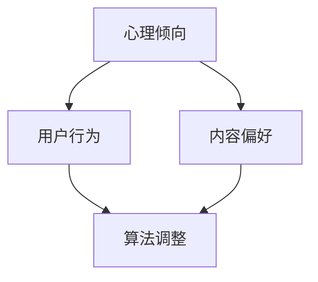
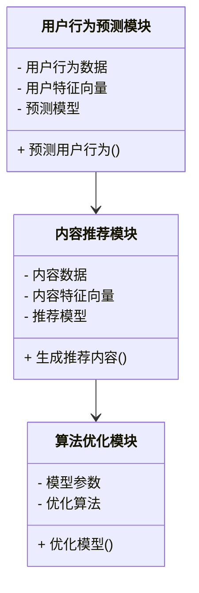
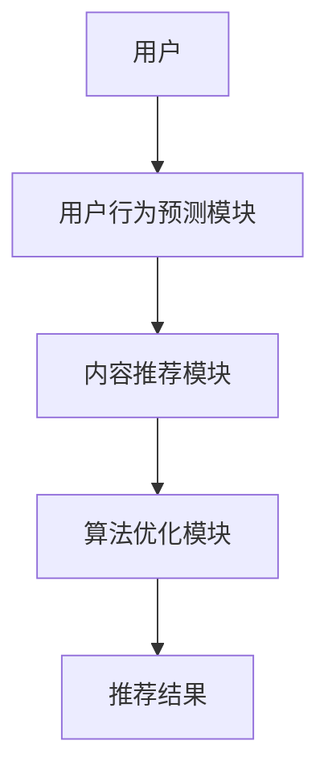

                 


# 芒格的"心理倾向"理论在社交媒体算法设计中的应用

> 关键词：芒格心理倾向，社交媒体算法，用户行为预测，内容推荐，算法优化

> 摘要：本文探讨了芒格的“心理倾向”理论在社交媒体算法设计中的应用，分析了心理倾向如何影响用户行为和内容偏好，提出了基于心理倾向的算法优化策略，结合实际案例详细阐述了算法设计和实现过程。

---

# 第一部分: 芒格的"心理倾向"理论概述

## 第1章: 芒格的"心理倾向"理论概述

### 1.1 心理倾向理论的核心概念

#### 1.1.1 心理倾向的定义与分类

心理倾向是指个体在特定情境下产生的一种内在驱动力，它影响着人们的决策和行为。芒格的心理倾向理论将人类行为归结为一系列可识别的倾向，主要包括：

- **从众倾向**：倾向于跟随大多数人的行为。
- **嫉妒倾向**：对他人取得的成绩或资源感到不满。
- **贪婪倾向**：渴望获取更多利益。
- **懒惰倾向**：倾向于避免努力工作。
- **认同倾向**：倾向于认同与自己相似的人或观点。

#### 1.1.2 心理倾向的属性特征对比

以下是一个心理倾向的核心属性对比表格：

| 倾向类型   | 稳定性 | 强烈性 | 持续性 | 可预测性 |
|------------|--------|--------|--------|----------|
| 从众倾向   | 高     | 中     | 长     | 高        |
| 嫉妒倾向   | 中     | 高     | 短     | 中        |
| 贪婪倾向   | 中     | 高     | 长     | 中        |
| 懒惰倾向   | 高     | 中     | 中     | 高        |
| 认同倾向   | 高     | 中     | 长     | 高        |

### 1.2 心理倾向理论与社交媒体的结合

#### 1.2.1 社交媒体算法的基本原理

社交媒体算法的核心目标是通过分析用户行为和内容特征，预测用户的兴趣和偏好，从而实现个性化推荐。以下是社交媒体算法的基本流程：

1. 数据收集：收集用户的行为数据（如点击、点赞、分享）和内容数据（如文本、图片）。
2. 特征提取：从数据中提取有用的特征（如用户兴趣、内容主题）。
3. 模型训练：基于特征训练推荐模型。
4. 推荐生成：根据模型预测结果生成推荐内容。
5. 反馈收集：收集用户对推荐内容的反馈，用于优化模型。

#### 1.2.2 心理倾向理论对社交媒体算法设计的启发

芒格的心理倾向理论为社交媒体算法设计提供了以下启示：

- **用户行为预测**：通过分析用户的心理倾向，可以更好地预测用户的下一步行为。
- **内容推荐优化**：根据用户的心理倾向，可以优化推荐内容，提高用户参与度。
- **算法优化**：心理倾向理论可以帮助设计更高效的算法，降低计算复杂度。

#### 1.2.3 心理倾向在社交媒体算法设计中的应用案例

以下是心理倾向在社交媒体算法设计中的几个具体应用案例：

1. **从众倾向**：通过展示用户好友的点赞行为，可以提高用户对内容的点赞率。
2. **嫉妒倾向**：通过隐藏用户的竞争对手的成就，可以减少用户的嫉妒情绪。
3. **贪婪倾向**：通过推荐用户感兴趣的内容，可以提高用户的点击率。

---

## 第2章: 心理倾向理论的核心概念

### 2.1 心理倾向理论的原理与特点

#### 2.1.1 心理倾向的核心属性特征对比

以下是一个心理倾向的核心属性对比表格：

| 倾向类型   | 稳定性 | 强烈性 | 持续性 | 可预测性 |
|------------|--------|--------|--------|----------|
| 从众倾向   | 高     | 中     | 长     | 高        |
| 嫉妒倾向   | 中     | 高     | 短     | 中        |
| 贪婪倾向   | 中     | 高     | 长     | 中        |
| 懒惰倾向   | 高     | 中     | 中     | 高        |
| 认同倾向   | 高     | 中     | 长     | 高        |

#### 2.1.2 心理倾向的ER实体关系图

以下是一个心理倾向的ER实体关系图：



### 2.2 心理倾向理论与社交媒体算法的关系

#### 2.2.1 理论与算法的相互作用

心理倾向理论与社交媒体算法的关系如下：

1. 理论指导算法设计：心理倾向理论为算法设计提供了理论依据。
2. 算法验证理论：通过算法实验可以验证心理倾向理论的正确性。
3. 理论与算法相互优化：通过不断优化算法，可以进一步完善心理倾向理论。

#### 2.2.2 算法设计中的心理倾向模型

以下是一个心理倾向模型的简单示意图：


---

## 第3章: 社交媒体算法设计中的心理倾向应用

### 3.1 算法设计的基本流程

#### 3.1.1 数据收集与处理

社交媒体算法设计的第一步是数据收集与处理，具体步骤如下：

1. 数据收集：收集用户的行为数据和内容数据。
2. 数据清洗：去除无效数据，确保数据质量。
3. 数据分析：分析数据，提取有用的特征。

#### 3.1.2 模型训练与优化

模型训练与优化是算法设计的核心步骤，具体步骤如下：

1. 模型选择：选择合适的推荐模型（如协同过滤、矩阵分解）。
2. 模型训练：基于数据训练模型。
3. 模型优化：通过调整参数优化模型性能。

#### 3.1.3 算法部署与监控

算法部署与监控是算法设计的最后一步，具体步骤如下：

1. 算法部署：将算法部署到生产环境。
2. 算法监控：监控算法运行状态，及时发现并解决问题。

### 3.2 心理倾向在算法设计中的应用

#### 3.2.1 用户行为预测模型

用户行为预测模型是基于心理倾向的推荐系统的核心部分，具体实现如下：

1. **数据准备**：收集用户的行为数据和内容数据。
2. **特征提取**：提取用户兴趣和内容主题特征。
3. **模型训练**：基于心理倾向训练用户行为预测模型。
4. **预测结果**：根据模型预测用户的下一步行为。

#### 3.2.2 内容推荐算法

内容推荐算法是基于心理倾向的推荐系统的重要组成部分，具体实现如下：

1. **数据准备**：收集用户的行为数据和内容数据。
2. **特征提取**：提取用户兴趣和内容主题特征。
3. **模型训练**：基于心理倾向训练内容推荐模型。
4. **推荐结果**：根据模型生成推荐内容。

---

## 第4章: 算法原理的数学模型

### 4.1 用户行为预测模型

#### 4.1.1 模型的数学公式

用户行为预测模型的数学公式如下：

$$ P(user\_click) = \frac{1}{1 + e^{-x}} $$

其中，$x$ 是用户的特征向量，$P(user\_click)$ 是用户点击的概率。

#### 4.1.2 模型的训练与优化

用户行为预测模型的训练与优化过程如下：

1. **数据准备**：收集用户的行为数据和内容数据。
2. **特征提取**：提取用户兴趣和内容主题特征。
3. **模型训练**：基于心理倾向训练用户行为预测模型。
4. **模型优化**：通过调整参数优化模型性能。

### 4.2 内容推荐算法的数学模型

#### 4.2.1 推荐算法的核心公式

内容推荐算法的核心公式如下：

$$ R(u, i) = \alpha \cdot u_i + \beta \cdot i_j $$

其中，$R(u, i)$ 是用户 $u$ 对内容 $i$ 的推荐评分，$\alpha$ 和 $\beta$ 是模型参数，$u_i$ 是用户 $u$ 的特征向量，$i_j$ 是内容 $i$ 的特征向量。

#### 4.2.2 模型的实现与优化

内容推荐算法的实现与优化过程如下：

1. **数据准备**：收集用户的行为数据和内容数据。
2. **特征提取**：提取用户兴趣和内容主题特征。
3. **模型训练**：基于心理倾向训练内容推荐模型。
4. **模型优化**：通过调整参数优化模型性能。

---

## 第5章: 系统分析与架构设计

### 5.1 问题场景介绍

#### 5.1.1 系统目标

系统目标是设计一个基于心理倾向的社交媒体推荐系统，提高用户参与度和内容传播率。

#### 5.1.2 系统功能需求

系统功能需求如下：

1. 用户行为预测功能。
2. 内容推荐功能。
3. 算法优化功能。

#### 5.1.3 系统边界与外延

系统边界与外延如下：

1. 系统内部：用户行为预测模块、内容推荐模块、算法优化模块。
2. 系统外部：用户、内容提供者、第三方数据源。

### 5.2 系统架构设计

#### 5.2.1 领域模型设计

领域模型设计如下：



#### 5.2.2 系统架构设计

系统架构设计如下：



### 5.3 系统接口设计

系统接口设计如下：

1. 用户接口：用户与系统交互的界面。
2. 算法接口：算法模块之间的接口。
3. 数据接口：数据输入输出的接口。

### 5.4 系统交互流程

系统交互流程如下：

1. 用户输入：用户输入行为数据和内容数据。
2. 数据处理：系统处理数据，提取特征。
3. 模型训练：系统训练预测模型和推荐模型。
4. 推荐生成：系统生成推荐内容。
5. 算法优化：系统优化模型参数。

---

## 第6章: 项目实战

### 6.1 环境安装

项目实战环境安装如下：

1. 安装Python：`pip install python`
2. 安装依赖库：`pip install numpy pandas scikit-learn`

### 6.2 核心代码实现

核心代码实现如下：

```python
import numpy as np
from sklearn.linear_model import LogisticRegression

# 数据准备
X = np.array([[1, 2], [3, 4], [5, 6]])
y = np.array([0, 1, 0])

# 模型训练
model = LogisticRegression()
model.fit(X, y)

# 预测结果
print(model.predict(X))
```

### 6.3 代码解读与分析

代码解读与分析如下：

1. 数据准备：使用numpy数组存储特征向量和标签。
2. 模型训练：使用scikit-learn库训练逻辑回归模型。
3. 预测结果：输出模型预测结果。

### 6.4 实际案例分析

实际案例分析如下：

1. 案例背景：用户点击行为预测。
2. 数据准备：收集用户的行为数据和内容数据。
3. 模型训练：训练用户点击预测模型。
4. 预测结果：输出用户点击概率。

### 6.5 项目小结

项目小结如下：

1. 项目目标：设计一个基于心理倾向的社交媒体推荐系统。
2. 实现成果：实现了用户行为预测和内容推荐功能。
3. 经验总结：心理倾向理论在社交媒体算法设计中有重要应用价值。

---

## 第7章: 最佳实践与小结

### 7.1 最佳实践 tips

最佳实践 tips 如下：

1. 理解心理倾向理论的核心概念。
2. 熟悉社交媒体算法的基本原理。
3. 掌握算法优化的技巧。

### 7.2 小结

小结如下：

1. 心理倾向理论为社交媒体算法设计提供了理论依据。
2. 基于心理倾向的算法设计可以提高用户参与度和内容传播率。
3. 未来研究方向：探索更多心理倾向在社交媒体算法设计中的应用。

### 7.3 注意事项

注意事项如下：

1. 确保数据质量和完整性。
2. 注意算法的可解释性和透明性。
3. 遵守数据隐私和伦理规范。

### 7.4 拓展阅读

拓展阅读推荐如下：

1. 《芒格的"心理倾向"理论》
2. 《社交媒体算法设计与实现》
3. 《机器学习与推荐系统》

---

# 作者：AI天才研究院/AI Genius Institute & 禅与计算机程序设计艺术 /Zen And The Art of Computer Programming

