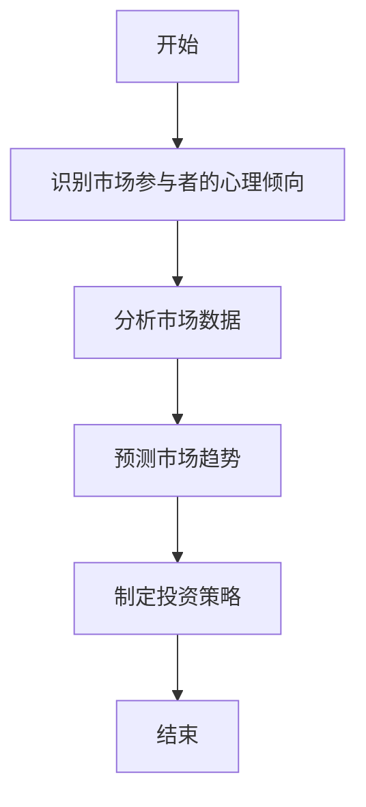
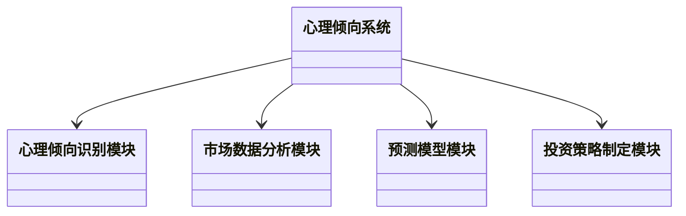

                 


# 芒格的"心理倾向"理论：理解并利用市场心理

## 关键词：心理倾向，市场心理，投资决策，芒格理论，行为金融学

## 摘要：本文详细探讨了芒格的“心理倾向”理论，分析其在理解市场心理中的应用，结合实际案例和数学模型，解释如何利用心理倾向进行投资决策和市场分析。

---

## 第一部分：芒格心理倾向理论的背景与基础

### 第1章：心理倾向理论的定义与核心概念

#### 1.1 心理倾向的定义与核心要素

- **心理倾向**是指个体在决策过程中受到的各种内在心理因素的影响，这些因素可能导致非理性决策。
- **从众心理**：个体倾向于跟随大多数人的选择，而非基于个人判断。
- **确认偏差**：人们倾向于寻找和记住与自己原有观点一致的信息，忽略或曲解相反的证据。
- **过度自信**：个体对自己判断的准确性过于自信，导致过高估计自己的能力。
- **情绪影响**：市场参与者的情绪波动（如贪婪和恐惧）会影响决策，导致市场波动。

#### 1.2 心理倾向的历史发展与现状

- **心理学与行为金融学的关联**：心理学研究人类行为，行为金融学则将心理学应用于金融市场，揭示投资者的非理性行为。
- **芒格心理倾向理论的提出与发展**：芒格在其著作中提出，投资者的决策往往受到心理倾向的影响，这些倾向可能导致错误的投资决策。
- **当前市场心理研究的最新进展**：现代研究进一步验证了心理倾向对市场的影响，并提出了更多相关的理论和模型。

#### 1.3 心理倾向的分类与应用场景

- **主要心理倾向的分类**：从众、确认偏差、过度自信、损失厌恶、情绪影响等。
- **不同心理倾向在市场中的具体表现**：
  - 从众：投资者跟随市场的趋势，可能导致泡沫和崩盘。
  - 确认偏差：投资者倾向于寻找支持自己决策的信息，可能导致误判市场趋势。
  - 过度自信：投资者高估自己的判断能力，可能导致冒险性投资。
- **心理倾向在投资决策中的影响**：心理倾向可能导致投资者做出非理性决策，进而影响市场的整体表现。

---

## 第二部分：芒格心理倾向理论的核心概念与联系

### 第2章：心理倾向的核心概念与联系

#### 2.1 心理倾向的核心概念

- **心理倾向的定义与特征**：心理倾向是内在的心理因素，影响个体的决策过程。
- **心理倾向的相互作用**：不同的心理倾向可能同时影响个体的决策，导致复杂的市场行为。

#### 2.2 心理倾向的属性特征对比表格

| 心理倾向       | 定义与特征                                                                 |
|----------------|---------------------------------------------------------------------------|
| 从众心理       | 个体倾向于跟随大多数人的选择，而非基于个人判断。                           |
| 确认偏差       | 人们倾向于寻找和记住与自己原有观点一致的信息，忽略或曲解相反的证据。         |
| 过度自信       | 个体对自己判断的准确性过于自信，导致过高估计自己的能力。                     |
| 损失厌恶       | 个体更倾向于避免损失，而非追求收益，导致在决策中过于保守。                   |
| 情绪影响       | 市场参与者的情绪波动（如贪婪和恐惧）会影响决策，导致市场波动。                 |

#### 2.3 心理倾向的ER实体关系图

```mermaid
er
  actor 心理倾向
  actor 从众心理
  actor 确认偏差
  actor 过度自信
  actor 损失厌恶
  actor 情绪影响
  relation ---> 关系：相互作用
```

---

## 第三部分：心理倾向理论的算法原理与数学模型

### 第3章：心理倾向的算法原理与数学模型

#### 3.1 心理倾向的算法原理



#### 3.2 心理倾向的数学模型与公式

- **市场情绪指数模型**：
  $$ S = \sum_{i=1}^{n} w_i \cdot P_i $$
  其中，\( S \) 是市场情绪指数，\( w_i \) 是第 \( i \) 个心理倾向的权重，\( P_i \) 是第 \( i \) 个心理倾向的强度。
- **投资者情绪对价格的影响**：
  $$ P = P_0 + \alpha \cdot S $$
  其中，\( P_0 \) 是基础价格，\( \alpha \) 是情绪影响系数，\( S \) 是市场情绪指数。

#### 3.3 心理倾向的案例分析

- **案例分析**：2008年金融危机期间，投资者的恐慌情绪导致市场崩盘。
- **数据解读**：分析市场数据中的情绪指数，发现恐慌情绪的指数急剧上升，导致股价大幅下跌。

---

## 第四部分：心理倾向理论的系统分析与架构设计

### 第4章：心理倾向的系统分析与架构设计

#### 4.1 系统功能设计

- **领域模型类图**：


#### 4.2 系统架构设计

```mermaid
container 心理倾向分析系统
    component 心理倾向识别模块
    component 数据分析模块
    component 预测模型模块
    component 投资策略制定模块
end
```

---

## 第五部分：心理倾向理论的项目实战与案例分析

### 第5章：心理倾向的项目实战与案例分析

#### 5.1 项目实战：环境安装与系统实现

- **环境安装**：安装Python、数据处理库（Pandas、NumPy）、可视化库（Matplotlib）。
- **核心实现**：编写心理倾向识别算法，数据处理模块，预测模型模块。

#### 5.2 项目小结

- **案例分析**：通过分析某次市场崩盘的数据，识别出从众心理和恐慌情绪是主要因素。
- **数据解读**：市场情绪指数急剧上升，导致股价大幅下跌。

---

## 第六部分：心理倾向理论的最佳实践与总结

### 第6章：心理倾向的最佳实践与总结

#### 6.1 小结

- 本文详细介绍了芒格的“心理倾向”理论，分析了其在市场心理中的应用，并结合实际案例和数学模型，解释了如何利用心理倾向进行投资决策和市场分析。

#### 6.2 注意事项

- 投资者应警惕心理倾向的影响，尽量保持理性决策。
- 结合心理倾向理论，制定科学的投资策略。

#### 6.3 拓展阅读

- 推荐阅读芒格的《Poor Charlie's Almanack》，深入理解心理倾向理论。
- 推荐学习行为金融学，进一步了解心理倾向对市场的具体影响。

---

## 作者：AI天才研究院 & 禅与计算机程序设计艺术

--- 

本文通过系统的分析和详细的案例，展示了芒格心理倾向理论在理解市场心理中的重要性，并提供了实用的投资策略和数学模型，帮助读者更好地理解和应用这一理论。

