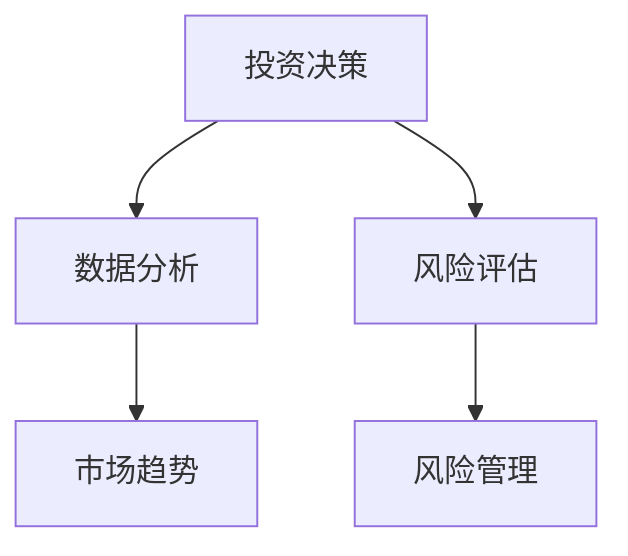
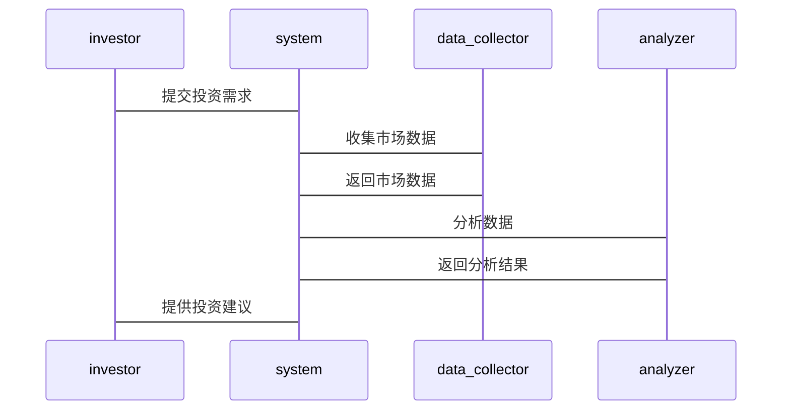

                 


# 芒格的心理学应用：在投资中利用人性弱点

---

## 关键词：芒格、心理学、投资决策、认知偏差、行为金融学、思维模型、风险管理

---

## 摘要

本文深入探讨了芒格的投资理念及其在心理学领域的应用，分析了人性中的弱点如何影响投资决策，并提供了基于心理学的策略和工具来优化投资行为。通过结合芒格的思维模型、行为金融学理论和数学建模，本文为投资者提供了一套系统的框架，以帮助他们在复杂的市场环境中做出更理性的决策。

---

# 第1章：芒格投资理念与心理学概述

## 1.1 芒格的生平与投资理念

### 1.1.1 芝加格大学派与芒格的成长

芒格（Charlie Munger）出生于1924年，是美国著名的投资者、作家和心理学家。他与巴菲特（Warren Buffett）共同创立了伯克希尔哈撒韦公司，并以价值投资和长期思维闻名。芒格的投资理念深受心理学和行为金融学的影响，他将心理学原理融入投资决策中，提出了著名的“思维模型”框架。

### 1.1.2 芒格的投资哲学与思维模型

芒格认为，投资不仅仅是对市场的分析，更是对人性的深刻理解。他强调投资者应避免认知偏差，建立多元思维模型，并通过长期观察和学习来提升决策能力。

### 1.1.3 芒格与巴菲特的黄金搭档关系

芒格与巴菲特的合作堪称典范。芒格负责分析企业基本面，而巴菲特则负责制定投资策略。两人共同的理念是：投资应基于安全边际和长期价值。

---

## 1.2 投资中的心理学基础

### 1.2.1 心理学与投资的关系

心理学研究人类行为和认知，而投资行为则深受心理学的影响。投资者的决策往往受到情绪、认知偏差和外部环境的影响。

### 1.2.2 行为金融学的核心理论

行为金融学指出，市场参与者并非总是理性的。投资者的行为受到心理偏差（如贪婪、恐惧、从众心理）的影响，这些偏差会导致市场波动和非理性决策。

### 1.2.3 人性的弱点与投资决策

人性的弱点，如贪婪和恐惧，常常导致投资者在市场高点买入、在低点卖出。芒格通过分析这些弱点，提出了如何利用它们来优化投资策略。

---

## 1.3 芒格思维模型的核心要素

### 1.3.1 决策框架的构建

芒格的思维模型是一个多学科交叉的框架，包括心理学、经济学、数学等多个领域。他强调投资者应从多个角度分析问题，避免单一维度的决策。

### 1.3.2 认知偏差与决策错误

芒格指出，认知偏差（如锚定效应、确认偏见）是导致错误决策的主要原因。他通过案例分析，展示了这些偏差如何影响投资行为。

### 1.3.3 人性弱点的系统分析

芒格将人性弱点分为几类：贪婪、恐惧、从众心理等。他通过系统分析这些弱点，提出了如何利用它们来制定投资策略。

---

# 第2章：心理学与投资决策的数学模型

## 2.1 心理学与投资的数学基础

### 2.1.1 概率论在投资中的应用

概率论是投资决策的重要工具。芒格通过概率分析，评估投资的潜在回报和风险。例如，他可能会计算某只股票的长期回报概率，并据此做出决策。

### 2.1.2 预期效用理论与投资决策

预期效用理论是行为金融学的核心理论之一。芒格通过分析投资者的效用函数，提出了如何利用概率和效用来优化投资决策。

### 2.1.3 心理账户与投资行为

心理账户是指投资者将资金分配到不同的“账户”中，例如短期投资和长期投资。芒格通过分析心理账户，提出了如何优化资金分配的策略。

---

## 2.2 芒格思维模型的数学公式

### 2.2.1 投资决策的期望值计算

芒格通过期望值计算，评估投资的潜在回报。公式如下：

$$ E = \sum p_i x_i $$

其中，\( p_i \) 是第 \( i \) 种结果的概率，\( x_i \) 是第 \( i \) 种结果的回报。

### 2.2.2 认知偏差的数学建模

认知偏差可以通过概率分布来建模。例如，确认偏见可以通过贝叶斯概率来分析。

### 2.2.3 风险偏好的数学表达

芒格通过风险偏好模型，评估投资者的风险承受能力。例如，他可能会使用风险溢价模型来评估市场的风险。

---

## 2.3 投资中的概率与风险

### 2.3.1 投资回报的概率分布

芒格通过概率分布分析，评估投资的潜在回报。例如，他可能会使用正态分布来分析股票的回报。

### 2.3.2 风险厌恶的数学模型

风险厌恶模型是行为金融学的重要工具。芒格通过分析投资者的风险厌恶程度，提出了如何优化投资组合的策略。

### 2.3.3 芒格决策框架的数学优化

芒格通过数学优化，提出了一种多目标优化模型，以最大化投资回报并最小化风险。

---

# 第3章：人性弱点与投资行为分析

## 3.1 人性的弱点与投资偏差

### 3.1.1 贪婪与恐惧的双重影响

贪婪和恐惧是投资中的主要人性弱点。芒格通过分析这些弱点，提出了如何利用它们来制定投资策略。

### 3.1.2 羊群效应与从众心理

羊群效应是指投资者跟随市场趋势，而非独立思考。芒格通过分析羊群效应，提出了如何避免从众心理的策略。

### 3.1.3 过度自信与能力误判

过度自信是导致错误决策的主要原因。芒格通过分析过度自信，提出了如何避免能力误判的策略。

---

## 3.2 认知偏差对投资决策的影响

### 3.2.1 锚定效应与决策偏差

锚定效应是指投资者过度依赖初始信息，导致决策偏差。芒格通过分析锚定效应，提出了如何避免决策偏差的策略。

### 3.2.2 可得性偏差与投资判断

可得性偏差是指投资者过度依赖易得的信息，导致判断错误。芒格通过分析可得性偏差，提出了如何优化投资判断的策略。

### 3.2.3 确认偏见与投资策略

确认偏见是指投资者倾向于寻找支持自己观点的信息，导致决策失误。芒格通过分析确认偏见，提出了如何优化投资策略的策略。

---

## 3.3 投资中的心理陷阱与应对策略

### 3.3.1 避免情绪化决策的方法

芒格强调，投资者应避免情绪化决策，而是应基于理性和逻辑做出决策。

### 3.3.2 建立理性决策的思维框架

芒格通过构建多学科交叉的思维模型，提出了如何建立理性决策的思维框架。

### 3.3.3 芒格的决策 checklist

芒格提出了一个决策 checklist，用于帮助投资者避免认知偏差和情绪化决策。

---

# 第4章：芒格思维模型的系统分析

## 4.1 芒格思维模型的系统架构

### 4.1.1 多学科交叉的系统架构

芒格的思维模型是一个多学科交叉的系统，包括心理学、经济学、数学等多个领域。

### 4.1.2 投资决策的模块化设计

芒格将投资决策分解为多个模块，每个模块负责不同的功能，例如数据分析、风险评估等。

### 4.1.3 系统的动态调整机制

芒格的思维模型具有动态调整机制，能够根据市场变化和投资者行为调整决策策略。

---

## 4.2 投资系统的核心功能

### 4.2.1 数据收集与分析模块

数据收集与分析模块负责收集市场数据，并进行分析，以支持投资决策。

### 4.2.2 风险评估与管理模块

风险评估与管理模块负责评估投资风险，并制定风险管理策略。

### 4.2.3 投资决策与优化模块

投资决策与优化模块负责基于数据分析和风险评估，制定投资策略，并进行优化。

---

## 4.3 系统的动态调整机制

### 4.3.1 系统的自我更新机制

芒格的思维模型具有自我更新机制，能够根据市场变化和投资者行为调整决策策略。

### 4.3.2 系统的反馈机制

系统具有反馈机制，能够根据投资结果和市场反馈，优化决策策略。

---

# 第5章：芒格思维模型的实战应用

## 5.1 项目背景与目标

本项目旨在利用芒格思维模型，分析实际投资案例，并提出优化投资策略。

---

## 5.2 系统功能设计

### 5.2.1 系统功能概述

系统功能包括数据收集与分析、风险评估与管理、投资决策与优化等模块。

---

## 5.3 系统架构设计

### 5.3.1 系统架构图



---

## 5.4 系统接口设计

### 5.4.1 系统接口描述

系统接口包括数据输入接口、数据处理接口和结果输出接口。

---

## 5.5 系统交互设计

### 5.5.1 系统交互流程



---

## 5.6 项目实现与优化

### 5.6.1 环境安装

投资者需要安装数据分析工具（如Python）和相关库（如Pandas、NumPy）。

---

## 5.7 代码实现

### 5.7.1 核心代码实现

```python
import pandas as pd
import numpy as np

def calculate_probability_returns(returns):
    probabilities = {}
    total = len(returns)
    for r in returns:
        probabilities[r] = probabilities.get(r, 0) + 1 / total
    return probabilities

# 示例数据
returns = [10%, 20%, 15%, 25%, 30%]
probabilities = calculate_probability_returns(returns)
print(probabilities)
```

---

## 5.8 实际案例分析

### 5.8.1 案例分析

以某股票为例，分析其历史回报和风险，并制定投资策略。

---

## 5.9 项目小结

本项目展示了如何利用芒格思维模型优化投资决策，并提出了实际的投资策略。

---

# 第6章：总结与小结

## 6.1 总结

芒格通过分析人性弱点和心理学原理，提出了优化投资决策的策略。本文详细探讨了芒格的思维模型及其在投资中的应用，并提出了实际的投资策略。

---

## 6.2 注意事项

投资者应避免情绪化决策，并建立理性的思维框架。同时，应结合实际市场情况，动态调整投资策略。

---

## 6.3 拓展阅读

推荐阅读芒格的《穷查理宝典》和巴菲特的《巴菲特致股东的信》，以深入理解芒格的投资理念。

---

## 作者

作者：AI天才研究院/AI Genius Institute & 禅与计算机程序设计艺术 /Zen And The Art of Computer Programming

