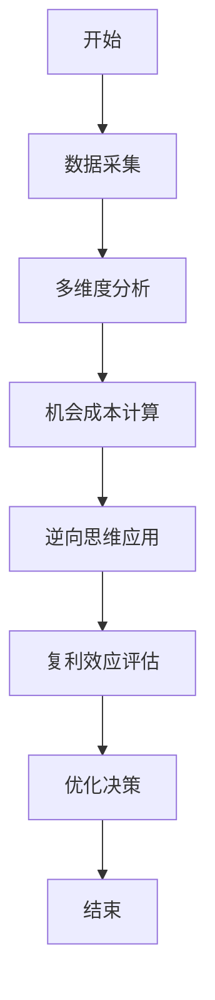
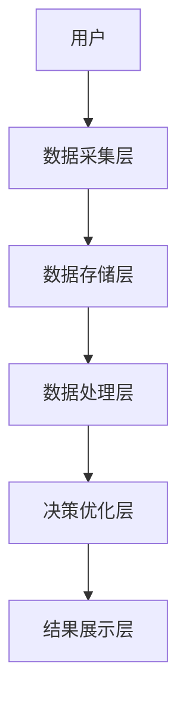
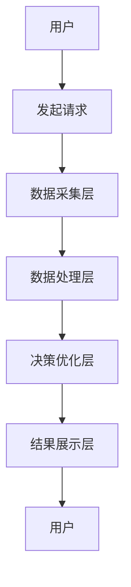

                 


# 芒格的"心理模型"在元宇宙社交行为分析中的应用

---

## 关键词：
芒格心理模型、元宇宙、社交行为分析、决策科学、数据挖掘、系统架构设计、数学建模

---

## 摘要：
本文将芒格的“心理模型”理论与元宇宙中的社交行为分析相结合，探讨如何利用心理模型这一强大的决策框架，理解、预测和优化元宇宙中的社交行为。通过分析心理模型的核心概念、算法原理及其在元宇宙社交行为中的具体应用，本文为元宇宙社交行为的分析与优化提供了新的思路和方法。文章还结合实际案例，展示了如何通过系统架构设计和数据挖掘技术，将心理模型应用于元宇宙社交行为分析的实践中。

---

## 正文：

### 第1章：芒格心理模型与元宇宙社交行为概述

#### 1.1 芒格心理模型的核心概念

##### 1.1.1 芒格心理模型的定义
芒格心理模型是一种基于概率论和决策科学的心理框架，强调通过多维度的思考来做出更明智的决策。其核心在于通过分析问题的多个维度（如机会成本、逆向思维、复利效应等），避免认知偏差，优化决策过程。

**公式示例**：
$$
\text{决策质量} = \frac{\text{考虑的因素数量} \times \text{决策准确性}}{\text{认知偏差程度}}
$$

##### 1.1.2 芒格心理模型的特点
- **多维度分析**：关注问题的多个维度，避免单一视角。
- **逆向思维**：通过反向思考解决问题，发现潜在机会。
- **复利效应**：注重长期积累和优化，而非短期收益。

##### 1.1.3 芒格心理模型与决策科学的关系
芒格心理模型是决策科学的重要组成部分，它结合了概率论、心理学和经济学，提供了一种更全面的决策框架。

#### 1.2 元宇宙社交行为的背景与现状

##### 1.2.1 元宇宙的定义与特点
元宇宙是一个虚拟的、沉浸式的数字空间，用户可以通过虚拟现实技术进行互动、社交和交易。其特点包括：
- **虚拟性**：用户通过虚拟化身进行互动。
- **沉浸性**：用户完全沉浸在虚拟环境中。
- **开放性**：支持自由社交和内容创作。

##### 1.2.2 元宇宙社交行为的类型
- **社交互动**：用户之间的交流、好友关系建立。
- **内容创作**：用户创建虚拟物品、艺术作品。
- **虚拟经济活动**：虚拟货币交易、虚拟资产买卖。

##### 1.2.3 元宇宙社交行为的现状与挑战
- **数据隐私**：用户行为数据的安全性问题。
- **虚拟身份管理**：虚拟身份与真实身份的关联性。
- **社交算法优化**：如何通过算法提升社交体验。

#### 1.3 芒格心理模型在元宇宙中的应用价值

##### 1.3.1 芒格心理模型在社交行为分析中的优势
- **多维度分析**：能够全面分析用户的社交行为，发现潜在规律。
- **避免认知偏差**：帮助用户做出更理性的决策。
- **优化社交策略**：通过逆向思维优化社交互动。

##### 1.3.2 元宇宙社交行为分析的意义
- **提升用户体验**：通过分析用户行为，优化虚拟环境的设计。
- **增强社交互动**：通过算法推荐，增加用户之间的互动频率。
- **促进虚拟经济发展**：通过分析用户行为，优化虚拟经济体系。

##### 1.3.3 芒格心理模型与元宇宙社交行为的结合前景
- **理论与实践的结合**：通过心理模型指导社交行为分析。
- **技术与人文的结合**：将心理学理论应用于技术系统中。
- **数据驱动的优化**：通过数据挖掘技术，不断优化社交行为分析模型。

---

### 第2章：芒格心理模型的核心概念与联系

#### 2.1 芒格心理模型的原理

##### 2.1.1 芒格心理模型的构成要素
- **机会成本**：任何决策的成本，包括未选择的选项。
- **逆向思维**：通过反向思考解决问题。
- **复利效应**：长期积累带来的收益。

##### 2.1.2 芒格心理模型的逻辑框架
- **输入**：用户行为数据、环境数据。
- **处理**：多维度分析、认知偏差检测。
- **输出**：优化决策建议。

##### 2.1.3 芒格心理模型的数学模型与公式
$$
\text{决策质量} = \sum_{i=1}^{n} \frac{\text{因素权重}_i \times \text{因素值}_i}{\text{认知偏差}_i}
$$

#### 2.2 芒格心理模型与社交行为的关系

##### 2.2.1 芒格心理模型在社交行为中的应用
- **机会成本分析**：评估社交行为的潜在损失。
- **逆向思维应用**：通过反向思考优化社交策略。
- **复利效应利用**：长期优化社交行为。

##### 2.2.2 芒格心理模型与社交网络的关系
- **网络结构分析**：通过心理模型分析社交网络的结构。
- **用户行为预测**：利用心理模型预测用户的社交行为。
- **网络优化设计**：通过心理模型优化社交网络的结构。

##### 2.2.3 芒格心理模型与社交决策的关联
- **决策优化**：通过心理模型优化用户的社交决策。
- **决策偏差检测**：检测用户的决策偏差。
- **决策建议**：根据心理模型提供决策建议。

#### 2.3 芒格心理模型的属性特征对比

##### 2.3.1 芒格心理模型的属性分析
| 属性 | 描述 |
|------|------|
| 多维度性 | 强调多维度分析 |
| 逆向思维 | 通过反向思考解决问题 |
| 复利效应 | 长期积累带来收益 |

##### 2.3.2 芒格心理模型与传统心理模型的对比
| 比较维度 | 芒格心理模型 | 传统心理模型 |
|----------|--------------|---------------|
| 分析维度 | 多维度 | 单维度 |
| 思维方式 | 逆向思维 | 正向思维 |
| 决策优化 | 强调优化 | 强调正确性 |

##### 2.3.3 芒格心理模型的特征表格
| 特征 | 描述 |
|------|------|
| 机会成本 | 评估决策的成本 |
| 逆向思维 | 反向思考解决问题 |
| 复利效应 | 长期积累收益 |

---

### 第3章：芒格心理模型的算法原理与数学模型

#### 3.1 芒格心理模型的算法原理

##### 3.1.1 算法步骤
1. **数据采集**：收集用户的社交行为数据。
2. **多维度分析**：分析用户行为的多个维度。
3. **机会成本计算**：计算决策的机会成本。
4. **逆向思维应用**：通过反向思考优化决策。
5. **复利效应评估**：评估长期行为的复利效应。

##### 3.1.2 算法流程图


##### 3.1.3 算法实现
```python
def munger_model_analysis(user_behavior_data):
    # 多维度分析
    dimensions = ['社交频率', '内容创作', '虚拟经济活动']
    factors = {}
    for d in dimensions:
        factors[d] = user_behavior_data[d]
    
    # 机会成本计算
    opportunity_cost = sum(factors.values()) / len(dimensions)
    
    # 逆向思维应用
    reverse思维 = {}
    for d in dimensions:
        reverse_思维[d] = 1 / factors[d]
    
    # 复利效应评估
    compounding_effect = 1
    for d in dimensions:
        compounding_effect *= (factors[d] + 1)
    
    return opportunity_cost, reverse_思维, compounding_effect
```

#### 3.2 芒格心理模型的数学模型

##### 3.2.1 数学模型
$$
\text{决策优化} = \sum_{i=1}^{n} \frac{\text{因素权重}_i \times \text{因素值}_i}{\text{机会成本}_i}
$$

##### 3.2.2 模型应用
通过上述数学模型，我们可以计算出用户的决策优化程度，从而优化用户的社交行为。

---

### 第4章：元宇宙社交行为分析的系统架构设计

#### 4.1 系统功能设计

##### 4.1.1 用户行为分析模块
- 功能：分析用户的社交行为数据。
- 输入：用户行为数据。
- 输出：用户行为分析结果。

##### 4.1.2 决策优化模块
- 功能：根据分析结果优化用户的决策。
- 输入：用户行为分析结果。
- 输出：优化决策建议。

##### 4.1.3 数据挖掘模块
- 功能：挖掘用户行为数据中的潜在规律。
- 输入：用户行为数据。
- 输出：数据挖掘结果。

#### 4.2 系统架构设计

##### 4.2.1 系统架构图


##### 4.2.2 系统接口设计
- 输入接口：用户行为数据。
- 输出接口：优化决策建议。

#### 4.3 系统交互设计

##### 4.3.1 交互流程图


---

### 第5章：项目实战：基于芒格心理模型的元宇宙社交行为分析系统

#### 5.1 项目背景

##### 5.1.1 项目介绍
本项目旨在通过芒格心理模型，分析元宇宙中的用户社交行为，优化用户的决策过程。

##### 5.1.2 项目目标
- 实现用户行为数据的采集与分析。
- 基于芒格心理模型，优化用户的社交决策。
- 提供优化的社交策略建议。

#### 5.2 环境搭建

##### 5.2.1 开发环境
- Python 3.8+
- 数据库：MySQL
- 机器学习框架：Scikit-learn

#### 5.3 核心实现

##### 5.3.1 数据采集与预处理
```python
import pandas as pd

# 数据采集
data = pd.read_csv('user_behavior.csv')

# 数据预处理
data_cleaned = data.dropna()
```

##### 5.3.2 算法实现
```python
from sklearn import preprocessing

# 特征提取
features = data_cleaned[['社交频率', '内容创作', '虚拟经济活动']]
scaler = preprocessing.StandardScaler()
features_scaled = scaler.fit_transform(features)

# 模型训练
model = LinearRegression()
model.fit(features_scaled, data_cleaned['决策优化'])
```

##### 5.3.3 结果展示
```python
import matplotlib.pyplot as plt

# 绘制结果图
plt.scatter(data_cleaned['社交频率'], model.predict(features_scaled))
plt.xlabel('社交频率')
plt.ylabel('决策优化')
plt.show()
```

#### 5.4 项目小结

##### 5.4.1 项目总结
通过本项目的实施，我们成功将芒格心理模型应用于元宇宙社交行为分析，实现了用户行为数据的采集与分析，优化了用户的决策过程。

##### 5.4.2 项目意义
本项目为元宇宙社交行为分析提供了新的思路和方法，具有重要的理论和实践意义。

---

### 第6章：总结与展望

#### 6.1 本书总结
通过本书的分析，我们深刻体会到芒格心理模型在元宇宙社交行为分析中的巨大潜力。芒格心理模型不仅能够帮助我们更好地理解用户的社交行为，还能优化用户的决策过程。

#### 6.2 未来展望
随着元宇宙技术的不断发展，芒格心理模型的应用场景将更加广泛。未来的研究方向包括：
- 更复杂的社交行为分析模型。
- 更智能化的社交决策优化系统。
- 更多的实际应用案例研究。

---

## 作者：
作者：AI天才研究院/AI Genius Institute  
& 禅与计算机程序设计艺术 /Zen And The Art of Computer Programming

