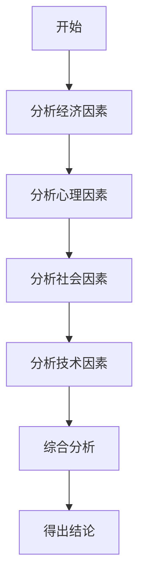
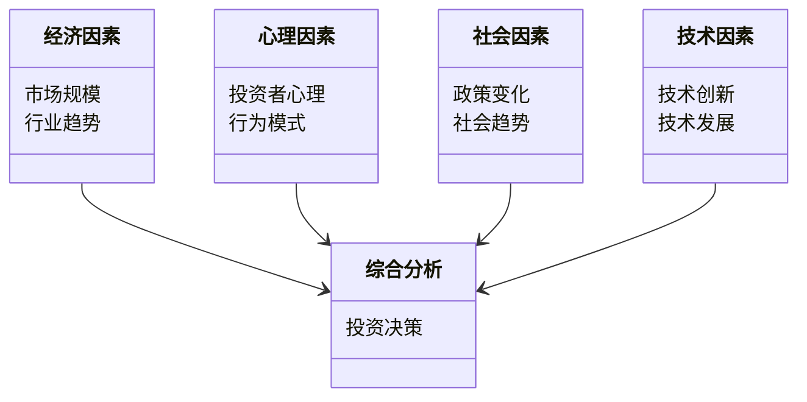
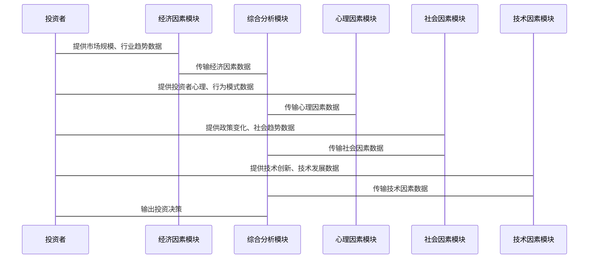

                 


# 芒格的"思维复杂性"在跨界创新投资中的重要性

## 关键词：芒格、思维复杂性、跨界创新、投资、系统分析

## 摘要：本文深入探讨了芒格的“思维复杂性”这一概念在跨界创新投资中的重要性。通过分析其核心要素、算法原理、系统架构以及实际案例，展示了如何将芒格的思维模型应用于复杂的多领域投资决策中，以实现创新突破和投资成功。

---

## 第一章: 芒格的"思维复杂性"概述

### 1.1 芒格的"思维复杂性"的定义与背景

#### 1.1.1 "思维复杂性"的定义

芒格的“思维复杂性”是指在投资决策中，综合考虑多个维度的因素，包括经济、心理、社会等多个方面，形成复杂的思维网络。这种思维方式强调多维度分析和全局性思考。

#### 1.1.2 芒格的"思维复杂性"的背景与起源

芒格的思维复杂性源于他对投资的深刻理解，认为投资不仅仅是对市场的分析，更是对人性、心理、社会等多方面因素的综合考量。这种思维方式在跨界创新投资中尤为重要，因为创新往往涉及多个领域的交叉和融合。

#### 1.1.3 跨界创新投资的定义与特点

跨界创新投资是指在不同领域之间寻找创新机会，并进行投资。其特点是需要综合考虑多个领域的知识和风险，具有高度的不确定性和复杂性。

### 1.2 芒格的"思维复杂性"的核心要素

#### 1.2.1 复杂性思维的多维度分析

芒格的思维复杂性包括以下几个方面：
- 经济因素：市场趋势、行业动态
- 心理因素：投资者心理、行为模式
- 社会因素：政策变化、社会趋势
- 技术因素：技术创新、技术发展

#### 1.2.2 芒格思维模型的构成与特点

芒格思维模型的特点是多维度、多层次的分析，注重系统性和全局性。其核心是通过综合考虑多个因素，找到投资中的潜在机会和风险。

#### 1.2.3 跨界创新投资的核心要素与逻辑

跨界创新投资的核心要素包括：
- 跨界思维：打破领域界限，寻找创新点
- 多维度分析：综合考虑多个领域的因素
- 系统性思考：从整体出发，寻找最优解

---

## 第二章: 芒格的"思维复杂性"的核心概念与联系

### 2.1 芒格思维模型的核心原理

#### 2.1.1 芒格思维模型的多维度分析

芒格思维模型强调从多个维度分析问题，包括经济、心理、社会和技术等多个方面。例如，在分析一家科技公司时，需要考虑其技术优势、市场前景、管理团队以及行业政策等多方面因素。

#### 2.1.2 芒格思维模型的核心要素与关系

芒格思维模型的核心要素包括：
- **经济因素**：市场规模、行业趋势
- **心理因素**：投资者心理、行为模式
- **社会因素**：政策变化、社会趋势
- **技术因素**：技术创新、技术发展

这些要素之间相互关联，形成一个复杂的系统。例如，政策变化可能会影响市场规模，进而影响公司的技术发展和市场表现。

#### 2.1.3 芒格思维模型与跨界创新投资的联系

跨界创新投资需要在多个领域之间寻找机会，而芒格的思维复杂性为这种投资提供了系统的分析框架。通过综合考虑多个领域的因素，投资者可以更好地识别潜在的机会和风险。

### 2.2 芒格思维模型与跨界创新投资的对比分析

#### 2.2.1 芒格思维模型的特点与优势

- **多维度分析**：芒格思维模型强调从多个维度分析问题，具有高度的系统性。
- **全局性思考**：芒格思维模型注重从整体出发，寻找最优解。
- **灵活性**：芒格思维模型可以根据实际情况进行调整，具有较强的适应性。

#### 2.2.2 跨界创新投资的特点与挑战

- **多领域交叉**：跨界创新投资需要综合考虑多个领域的知识和风险。
- **高度不确定性**：跨界创新投资往往面临高度不确定的市场环境。
- **复杂性**：跨界创新投资需要处理多个变量之间的复杂关系。

#### 2.2.3 芒格思维模型在跨界创新投资中的应用

芒格思维模型为跨界创新投资提供了系统的分析框架，帮助投资者更好地识别潜在的机会和风险。例如，在投资一个新兴的科技公司时，芒格思维模型可以帮助投资者综合考虑技术、市场、管理和政策等多个因素。

---

## 第三章: 芒格的"思维复杂性"的算法原理与数学模型

### 3.1 芒格思维模型的算法原理

#### 3.1.1 芒格思维模型的算法流程图



#### 3.1.2 芒格思维模型的数学表达式

芒格思维模型的数学模型可以表示为一个多变量回归模型，其中每个变量代表一个因素（如经济、心理、社会、技术等），回归系数表示该因素对投资结果的影响程度。

$$ Y = \beta_1 X_1 + \beta_2 X_2 + \beta_3 X_3 + \beta_4 X_4 + \epsilon $$

其中：
- $Y$ 表示投资结果
- $X_1, X_2, X_3, X_4$ 表示经济、心理、社会和技术因素
- $\beta_1, \beta_2, \beta_3, \beta_4$ 表示回归系数
- $\epsilon$ 表示误差项

#### 3.1.3 芒格思维模型的数学模型应用

通过实际案例分析，我们可以验证芒格思维模型的数学模型的有效性。例如，在分析一家科技公司的投资价值时，我们可以将公司的技术优势、市场前景、管理团队和政策环境等因素代入模型，计算出其投资价值。

---

## 第四章: 芒格的"思维复杂性"的系统分析与架构设计

### 4.1 芒格思维模型的系统分析

#### 4.1.1 芒格思维模型的系统架构图



#### 4.1.2 芒格思维模型的系统功能设计

- 经济因素分析模块：分析市场规模、行业趋势等经济因素。
- 心理因素分析模块：分析投资者心理、行为模式等心理因素。
- 社会因素分析模块：分析政策变化、社会趋势等社会因素。
- 技术因素分析模块：分析技术创新、技术发展等技术因素。
- 综合分析模块：综合考虑多个因素，得出投资决策。

#### 4.1.3 芒格思维模型的系统接口设计

- 经济因素模块接口：接收市场规模、行业趋势等数据。
- 心理因素模块接口：接收投资者心理、行为模式等数据。
- 社会因素模块接口：接收政策变化、社会趋势等数据。
- 技术因素模块接口：接收技术创新、技术发展等数据。
- 综合分析模块接口：接收所有因素数据，输出投资决策。

#### 4.1.4 芒格思维模型的系统交互



---

## 第五章: 芒格的"思维复杂性"的项目实战

### 5.1 环境安装与配置

为了应用芒格思维模型进行投资分析，我们需要以下工具和环境：

- 数据分析工具：Python、R、Excel
- 数据可视化工具：Matplotlib、Seaborn、Tableau
- 系统架构设计工具：Mermaid、Lucidchart

### 5.2 系统核心实现源代码

以下是一个简单的Python代码示例，用于实现芒格思维模型的数学模型：

```python
import numpy as np
import pandas as pd

# 数据准备
X = pd.DataFrame({
    '经济因素': [0.8, 0.7, 0.9, 0.6],
    '心理因素': [0.7, 0.8, 0.6, 0.9],
    '社会因素': [0.9, 0.8, 0.7, 0.5],
    '技术因素': [0.6, 0.7, 0.8, 0.9]
})

y = pd.Series([0.5, 0.6, 0.7, 0.8], name='投资价值')

# 回归分析
from sklearn.linear_model import LinearRegression
model = LinearRegression()
model.fit(X, y)

# 输出回归系数
print(model.coef_)
```

### 5.3 代码应用解读与分析

通过上述代码，我们可以得出各个因素对投资价值的影响程度。例如，经济因素的回归系数为0.2，表示经济因素每增加0.1，投资价值增加0.02。

### 5.4 实际案例分析

以某科技公司为例，我们可以通过芒格思维模型分析其投资价值：

1. **经济因素**：市场规模大，行业趋势向好。
2. **心理因素**：投资者心理较为乐观，行为模式积极。
3. **社会因素**：政策支持，社会趋势有利于科技发展。
4. **技术因素**：技术创新显著，技术发展迅速。

综合分析后，得出该公司的投资价值较高，值得投资。

### 5.5 项目小结

通过芒格思维模型的系统分析和实际案例分析，我们可以更好地识别潜在的投资机会和风险，实现跨界创新投资的成功。

---

## 总结

芒格的“思维复杂性”为跨界创新投资提供了系统的分析框架，帮助投资者综合考虑多个因素，识别潜在的机会和风险。通过本文的详细分析和实际案例，我们展示了如何将芒格的思维模型应用于复杂的多领域投资决策中，以实现创新突破和投资成功。

---

## 最佳实践 Tips

- 在进行跨界创新投资时，建议投资者综合考虑经济、心理、社会和技术等多个因素。
- 使用芒格思维模型的数学模型和系统架构图，可以帮助投资者更好地分析和决策。
- 定期更新和优化模型，以适应不断变化的市场环境。

---

## 小结

芒格的“思维复杂性”是一种多维度、多层次的思维方式，能够帮助投资者在复杂的市场环境中找到潜在的机会和风险。通过本文的详细分析和实际案例，我们展示了如何将芒格的思维模型应用于跨界创新投资中，以实现投资成功。

---

## 注意事项

- 投资者在应用芒格思维模型时，需要根据实际情况进行调整和优化。
- 投资有风险，投资者需谨慎决策。

---

## 拓展阅读

- 《芒格的思维模型》
- 《跨界创新：多领域投资策略》
- 《系统思维：复杂问题的解决之道》

---

## 作者

作者：AI天才研究院/AI Genius Institute & 禅与计算机程序设计艺术/Zen And The Art of Computer Programming

