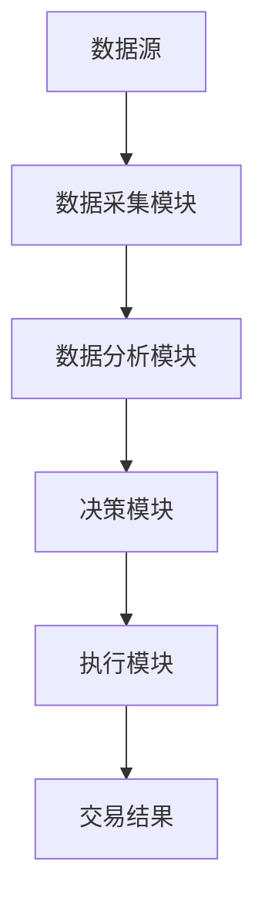
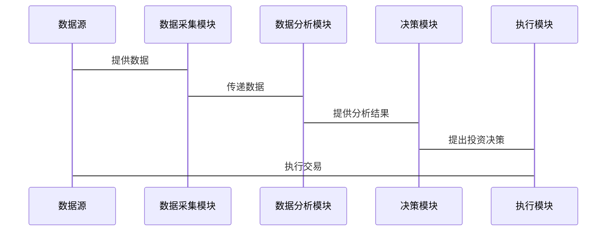

                 


# 芒格的"思维复杂性"在跨维度技术融合投资中的重要性

---

## 关键词：
- 芒格思维复杂性
- 跨维度技术融合
- 投资决策
- 系统思维
- 反向思维
- 大数据
- 人工智能

---

## 摘要：
芒格的"思维复杂性"是指在决策过程中，综合考虑多个维度和复杂因素的能力。在现代投资领域，单纯的单一维度分析已经无法应对市场的复杂性。跨维度技术融合投资，即结合大数据、人工智能、区块链等技术手段，能够帮助投资者更全面地分析市场，做出更明智的投资决策。芒格的思维复杂性在跨维度技术融合投资中具有至关重要的作用，它不仅是投资决策的核心，也是技术与投资深度结合的关键。

---

## 正文：

---

## 第一部分：引言

---

## 第1章：投资的现状与挑战

### 1.1 投资领域的复杂性

#### 1.1.1 当前投资环境的复杂性

投资领域正变得越来越复杂。传统的单一维度分析方法（如只看财务报表或市场趋势）已经无法应对当前市场的复杂性。现代投资者需要考虑的因素包括宏观经济、行业动态、公司基本面、技术指标、市场情绪、政策变化等。此外，随着技术的进步，投资者还可以利用大数据、人工智能、区块链等技术手段来优化投资决策。

#### 1.1.2 投资者面临的挑战

投资者在面对复杂市场时，常常面临以下挑战：
- **信息过载**：海量的数据和信息使得投资者难以快速找到关键信息。
- **决策疲劳**：复杂的市场环境和过多的信息可能导致投资者决策疲劳，影响判断力。
- **黑天鹅事件**：突发事件（如疫情、地缘政治冲突等）对市场的影响难以预测。
- **技术融合的不确定性**：新技术的应用可能会带来新的投资机会，但也可能带来新的风险。

#### 1.1.3 跨维度技术融合的必要性

为了应对上述挑战，投资者需要采用跨维度技术融合的方法。这种方法结合了多种技术手段，如大数据分析、人工智能、区块链等，能够帮助投资者更全面地分析市场，捕捉投资机会，并降低风险。

---

### 1.2 芒格思维复杂性的重要性

#### 1.2.1 芒格思维复杂性的定义

芒格思维复杂性是指在决策过程中，综合考虑多个维度和复杂因素的能力。它不仅仅是简单的多因素分析，而是对复杂系统的深刻理解和综合判断。

#### 1.2.2 芒格思维复杂性在投资中的作用

芒格思维复杂性在投资中具有以下作用：
- **全面分析**：能够从多个维度（如财务、市场、技术、政策等）全面分析投资标的，避免单一维度分析的局限性。
- **风险控制**：通过综合考虑多种因素，能够更好地识别和规避风险。
- **捕捉机会**：在复杂市场中，能够发现传统方法难以察觉的投资机会。

#### 1.2.3 跨维度技术融合与芒格思维复杂性的结合

跨维度技术融合投资与芒格思维复杂性是天然契合的。前者提供了技术手段，后者提供了思维方式，两者结合能够帮助投资者在复杂市场中做出更明智的决策。

---

## 第二部分：芒格思维复杂性的理论基础

---

## 第2章：芒格思维复杂性的核心概念

### 2.1 芒格思维复杂性的定义与特点

#### 2.1.1 芒格思维复杂性的定义

芒格思维复杂性是指在决策过程中，综合考虑多个维度和复杂因素的能力。它不仅仅是简单的多因素分析，而是对复杂系统的深刻理解和综合判断。

#### 2.1.2 芒格思维复杂性的核心特点

- **系统性**：芒格思维复杂性强调对系统的整体理解，而不是单独分析各个部分。
- **动态性**：芒格思维复杂性关注系统的动态变化，而不是静态分析。
- **综合性**：芒格思维复杂性综合考虑多个维度的因素，而不是单一维度分析。

#### 2.1.3 芒格思维复杂性与传统投资思维的对比

| 特性            | 芒格思维复杂性       | 传统投资思维       |
|-----------------|---------------------|---------------------|
| 分析维度         | 多维度               | 单一维度             |
| 分析方法         | 综合分析             | 单一分析             |
| 风险控制         | 全面风险控制         | 事后补救             |
| 投资机会         | 捕捉复杂机会         | 捕捉简单机会         |

---

## 第三部分：跨维度技术融合投资的理论框架

---

## 第3章：跨维度技术融合投资的定义与特点

### 3.1 跨维度技术融合投资的定义

跨维度技术融合投资是指利用多种技术手段（如大数据、人工智能、区块链等），从多个维度（如市场数据、行业动态、政策变化等）综合分析投资标的，做出更明智的投资决策。

### 3.2 跨维度技术融合投资的特点

- **多维度数据整合**：跨维度技术融合投资能够整合多种数据源，包括市场数据、社交媒体数据、新闻数据等。
- **技术与投资的深度融合**：通过技术手段，投资者能够更深入地分析数据，发现投资机会。
- **跨领域知识的综合运用**：跨维度技术融合投资需要综合运用多个领域的知识，如技术、金融、经济等。

---

## 第四部分：芒格思维复杂性在跨维度技术融合投资中的应用

---

## 第4章：芒格思维复杂性在跨维度技术融合投资中的核心作用

### 4.1 芒格思维复杂性在跨维度技术融合投资中的应用

#### 4.1.1 系统思维在跨维度技术融合投资中的应用

系统思维是指从整体的角度看待问题，而不是单独分析各个部分。在跨维度技术融合投资中，系统思维可以帮助投资者更好地理解市场的整体动态，从而做出更明智的决策。

#### 4.1.2 反向思维在跨维度技术融合投资中的应用

反向思维是指从相反的角度思考问题。在跨维度技术融合投资中，反向思维可以帮助投资者发现市场中的潜在机会，尤其是在市场出现极端情况时。

#### 4.1.3 边际思维在跨维度技术融合投资中的应用

边际思维是指关注变量的边际变化对整体的影响。在跨维度技术融合投资中，边际思维可以帮助投资者更好地理解市场的变化趋势，从而做出更精确的判断。

### 4.2 芒格思维复杂性与跨维度技术融合投资的结合

#### 4.2.1 芒格思维复杂性与跨维度技术融合投资的结合

芒格思维复杂性与跨维度技术融合投资的结合，使得投资者能够从多个维度分析市场，综合考虑各种因素，做出更全面的投资决策。例如，投资者可以通过大数据分析市场趋势，利用人工智能技术预测市场波动，结合芒格的系统思维和反向思维，做出更明智的投资决策。

---

## 第五部分：跨维度技术融合投资的系统架构设计

---

## 第5章：跨维度技术融合投资的系统架构设计

### 5.1 系统功能设计

#### 5.1.1 数据采集模块

数据采集模块负责从多个数据源（如市场数据、社交媒体数据、新闻数据等）采集数据。

#### 5.1.2 数据分析模块

数据分析模块利用大数据和人工智能技术对采集到的数据进行分析，生成投资建议。

#### 5.1.3 决策模块

决策模块根据分析结果，结合芒格思维复杂性，做出最终的投资决策。

#### 5.1.4 执行模块

执行模块负责将决策模块的决策转化为具体的交易指令。

### 5.2 系统架构设计



### 5.3 系统接口设计

系统接口设计需要考虑以下几点：
- 数据采集模块需要与多个数据源对接。
- 数据分析模块需要与人工智能算法对接。
- 决策模块需要与交易系统对接。

### 5.4 系统交互设计



---

## 第六部分：项目实战

---

## 第6章：跨维度技术融合投资的项目实战

### 6.1 项目环境安装

为了进行跨维度技术融合投资，需要安装以下工具和库：
- Python编程语言
- 数据分析库（如Pandas、NumPy）
- 机器学习库（如Scikit-learn、XGBoost）
- 可视化库（如Matplotlib、Seaborn）
- 数据采集库（如BeautifulSoup、requests）

### 6.2 系统核心实现源代码

以下是跨维度技术融合投资系统的核心实现代码：

```python
import pandas as pd
import numpy as np
from sklearn import linear_model
import matplotlib.pyplot as plt

# 数据采集模块
def collect_data():
    # 这里可以使用各种数据源，例如从API获取市场数据
    # 这里只是一个简单的示例，假设我们从本地文件读取数据
    data = pd.read_csv('market_data.csv')
    return data

# 数据分析模块
def analyze_data(data):
    # 这里可以使用各种数据分析方法，例如回归分析
    X = data[['price', 'volume']]
    y = data['return']
    
    # 使用线性回归模型进行预测
    model = linear_model.LinearRegression()
    model.fit(X, y)
    predictions = model.predict(X)
    
    # 绘制散点图和回归线
    plt.scatter(X, y, color='blue')
    plt.plot(X, predictions, color='red')
    plt.title('Market Data Analysis')
    plt.xlabel('Price and Volume')
    plt.ylabel('Return')
    plt.show()
    
    return model.coef_

# 决策模块
def make_decision(model_coefficients):
    # 根据模型系数和市场数据做出投资决策
    # 这里只是一个简单的示例，实际应用中需要考虑更多因素
    if model_coefficients[0] > 0 and model_coefficients[1] > 0:
        return '买入'
    else:
        return '卖出'

# 执行模块
def execute_decision(decision):
    # 这里可以将决策传递给交易系统
    # 这里只是一个简单的示例，实际应用中需要考虑更多因素
    print(f'根据分析结果，决策是：{decision}')

# 主程序
if __name__ == '__main__':
    data = collect_data()
    coefficients = analyze_data(data)
    decision = make_decision(coefficients)
    execute_decision(decision)
```

### 6.3 项目小结

通过上述代码，我们可以看到跨维度技术融合投资系统的核心实现过程。数据采集模块负责从多个数据源采集数据，数据分析模块利用机器学习算法对数据进行分析，决策模块结合芒格思维复杂性做出最终决策，执行模块将决策转化为具体的交易指令。

---

## 第七部分：结论

---

## 第7章：总结与展望

### 7.1 总结

芒格的思维复杂性在跨维度技术融合投资中具有至关重要的作用。通过结合大数据、人工智能等技术手段，投资者可以更全面地分析市场，做出更明智的投资决策。

### 7.2 展望

未来，随着技术的进步和市场的变化，跨维度技术融合投资将会变得更加重要。投资者需要不断学习新的技术手段，提升自己的芒格思维复杂性，以应对更加复杂的投资环境。

---

## 作者：AI天才研究院/AI Genius Institute & 禅与计算机程序设计艺术 /Zen And The Art of Computer Programming

---

通过以上目录和内容设计，我们可以看到芒格的思维复杂性在跨维度技术融合投资中的重要性。芒格的思维复杂性不仅是投资决策的核心，也是技术与投资深度结合的关键。

