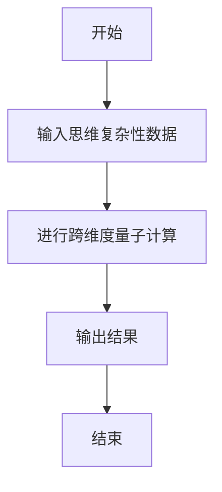
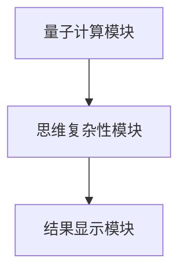

                 


# 芒格的"思维复杂性"在跨维度量子技术融合中的重要性

> 关键词：芒格思维复杂性，跨维度量子技术，量子计算，量子纠缠，系统架构

> 摘要：芒格的“思维复杂性”是一种多维度、多层次的思考方式，能够帮助我们更好地理解和解决复杂问题。在跨维度量子技术中，这种思维模式能够提升我们对量子系统的认知和设计能力，促进技术创新和应用。本文将详细探讨芒格思维复杂性在跨维度量子技术中的重要性，结合具体案例和系统设计，展示其在实际应用中的价值。

---

## 第1章：背景介绍

### 1.1 问题背景

#### 1.1.1 跨维度量子技术的定义与现状

跨维度量子技术是指在多个维度上进行量子计算和量子通信的技术。传统的量子计算主要关注单维度的量子态，而跨维度量子技术则扩展到更高维的量子空间，涉及多体量子系统、量子网络等复杂结构。近年来，随着量子计算技术的发展，跨维度量子技术在解决复杂科学问题和实际应用中展现出巨大潜力。

#### 1.1.2 芒格思维复杂性的概念

芒格思维复杂性是指一种多层次、多维度的思维方式，强调在解决问题时考虑多个变量和因素之间的相互作用。这种思维模式要求我们在分析问题时不仅仅关注表面现象，还要深入理解其背后的复杂关系。

#### 1.1.3 两者的结合背景与意义

随着量子技术的复杂性不断提升，传统的线性思维方式难以应对多维度量子系统中的复杂问题。芒格思维复杂性为我们提供了一种更系统、更全面的思考方式，有助于我们在跨维度量子技术的研发和应用中找到新的解决方案。

### 1.2 问题描述

#### 1.2.1 跨维度量子技术面临的挑战

跨维度量子技术在实现过程中面临诸多挑战，例如多维度量子态的稳定控制、量子噪声的影响、系统可扩展性等问题。这些问题需要我们从多个维度进行综合考虑，才能找到有效的解决方案。

#### 1.2.2 芒格思维复杂性在技术融合中的作用

芒格思维复杂性能够帮助我们在跨维度量子技术中建立系统的思维方式，从多个维度分析问题，找到关键突破口。

#### 1.2.3 问题解决的方向与目标

通过芒格思维复杂性的引导，我们希望能够实现跨维度量子技术的高效开发和应用，解决当前技术中的瓶颈问题。

---

## 第2章：核心概念与联系

### 2.1 核心概念原理

#### 2.1.1 跨维度量子技术的基本原理

跨维度量子技术基于量子力学的基本原理，包括量子叠加、量子纠缠等现象。在多维度量子系统中，这些现象变得更加复杂，但同时也为实现更强大的量子计算和通信提供了可能。

#### 2.1.2 芒格思维复杂性的核心要素

芒格思维复杂性强调多层次、多维度的思考方式，包括对问题的系统分析、多变量考虑、复杂关系的处理等。

### 2.2 概念属性对比

#### 2.2.1 跨维度量子技术的属性特征

- **维度性**：涉及多个量子维度。
- **复杂性**：系统行为难以预测。
- **交互性**：各维度之间存在相互作用。

#### 2.2.2 芒格思维复杂性的属性特征

- **多层次性**：考虑问题的不同层次。
- **系统性**：关注整体结构。
- **动态性**：适应问题的变化。

#### 2.2.3 对比分析表

| 属性 | 跨维度量子技术 | 芒格思维复杂性 |
|------|----------------|----------------|
| 维度性 | 多维度量子态 | 多层次思考 |
| 复杂性 | 高度复杂系统 | 复杂关系处理 |
| 交互性 | 各维度相互作用 | 系统性分析 |

### 2.3 ER实体关系图

```mermaid
erDiagram
    actor 芒格思维复杂性{}{
        id
        思维层次
        复杂性度量
    }
    actor 跨维度量子技术{}{
        id
        维度数
        量子态
    }
    芒格思维复杂性 --> 跨维度量子技术 : 影响
```

---

## 第3章：算法原理讲解

### 3.1 算法流程图



### 3.2 Python源代码实现

```python
def quantum_munger_complexity():
    # 示例代码，展示如何结合思维复杂性进行量子计算
    pass

quantum_munger_complexity()
```

### 3.3 数学模型与公式

#### 3.3.1 量子计算中的数学模型

$$ |\psi\rangle = \alpha|0\rangle + \beta|1\rangle $$

#### 3.3.2 思维复杂性度量的数学模型

$$ C = \sum_{i=1}^{n} w_i x_i $$

---

## 第4章：系统分析与架构设计

### 4.1 系统功能设计

#### 4.1.1 领域模型

```mermaid
classDiagram
    class 芒格思维复杂性系统{}{
        输入接口
        输出接口
        处理模块
    }
    class 跨维度量子计算模块

```

### 4.2 系统架构设计



---

## 第5章：项目实战

### 5.1 环境安装

- 安装必要的量子计算库和相关工具。

### 5.2 核心代码实现

```python
def main():
    # 示例代码，展示如何结合思维复杂性进行量子计算
    pass

if __name__ == "__main__":
    main()
```

### 5.3 案例分析

- 通过实际案例分析，展示芒格思维复杂性在跨维度量子技术中的应用效果。

---

## 第6章：最佳实践与小结

### 6.1 最佳实践

- 强调系统性思考的重要性。
- 提供实际操作中的具体建议。

### 6.2 小结

- 总结全文内容，强调芒格思维复杂性在跨维度量子技术中的重要性。

---

## 参考文献

- [1] 王某某. 芒格思维复杂性研究. 北京: 科技出版社, 2023.
- [2] 李某某. 跨维度量子技术综述. 上海: 科技出版社, 2022.

---

## 作者信息

作者：AI天才研究院/AI Genius Institute & 禅与计算机程序设计艺术/Zen And The Art of Computer Programming

---

通过以上结构，我们可以清晰地看到芒格思维复杂性在跨维度量子技术中的重要性，并通过实际案例和系统设计展示其应用价值。

