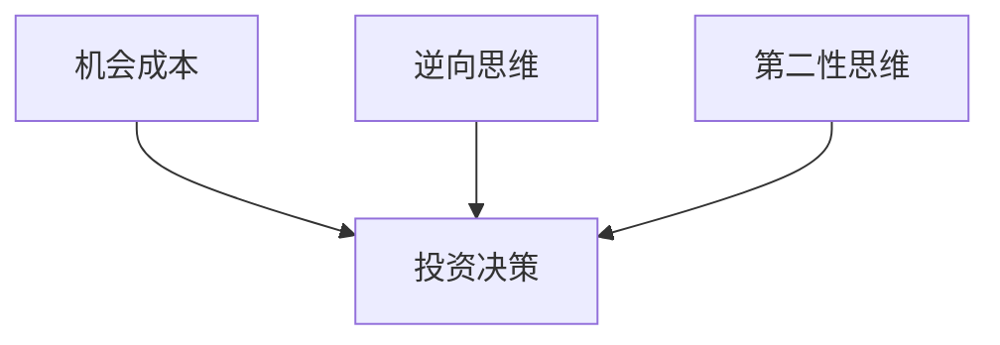
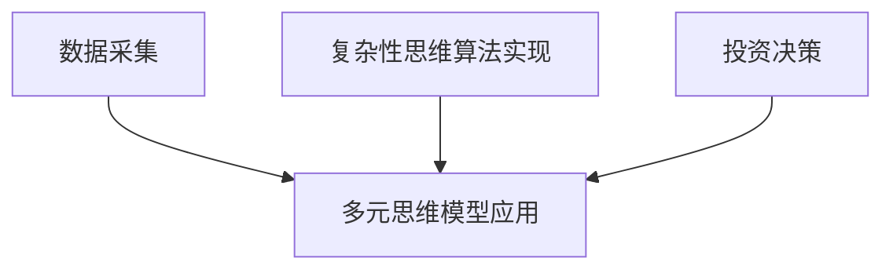

                 


# 芒格的"思维复杂性"：应对复杂投资环境的工具

> **关键词**：芒格思维复杂性、多元思维模型、复杂性投资、系统思维、投资决策、思维工具  
> **摘要**：芒格的"思维复杂性"是一种应对复杂投资环境的工具，通过多元思维模型和系统性分析，帮助投资者在不确定性和复杂性中做出更明智的决策。本文将详细探讨芒格思维复杂性的核心概念、算法原理、系统架构设计、项目实战以及最佳实践。

---

## 第一部分：芒格的思维复杂性背景介绍

### 第1章：芒格思维复杂性概述

#### 1.1 芒格思维复杂性的起源

芒格的思维复杂性源于他对投资环境的深刻理解。在传统投资方法中，投资者往往依赖单一的分析框架，如基本面分析或技术分析，这在复杂多变的市场中显得力不从心。芒格提出，投资者需要构建一个多元思维模型，将物理学、心理学、经济学等多个学科的原理结合起来，以应对市场的不确定性。

- **1.1.1 多元思维模型的定义**：多元思维模型是指将多个学科的原理和方法整合起来，形成一个综合的分析框架，帮助投资者从多个角度理解市场和企业的行为。
- **1.1.2 复杂性思维的核心概念**：芒格强调，投资环境是一个复杂系统，需要考虑多种因素的相互作用。复杂性思维要求投资者具备系统性思维，能够识别和分析系统中的关键变量及其相互关系。
- **1.1.3 芒格思维复杂性与传统投资方法的对比**：传统方法往往依赖单一的分析框架，而芒格的复杂性思维则强调多维度、多层次的分析，注重系统中的相互作用和反馈机制。

#### 1.2 复杂性思维的背景与问题背景

现代投资环境日益复杂，传统的线性思维难以应对市场的不确定性。芒格的思维复杂性提供了一种新的方法，帮助投资者在复杂环境中做出更明智的决策。

- **1.2.1 现代投资环境的复杂性**：市场参与者的行为、政策变化、技术进步等因素交织在一起，使得市场呈现出高度的非线性和不确定性。
- **1.2.2 传统投资方法的局限性**：传统方法往往忽视系统中的相互作用，导致投资者在面对复杂环境时难以做出正确的决策。
- **1.2.3 复杂性思维的必要性**：芒格的思维复杂性通过多元思维模型，帮助投资者更好地理解市场中的复杂关系，从而做出更合理的投资决策。

#### 1.3 芒格思维复杂性的核心要素

芒格的思维复杂性是一种系统性思维，其核心要素包括多元思维模型、复杂性思维的核心属性以及芒格思维复杂性与现代投资的结合。

- **1.3.1 多元思维模型的结构**：多元思维模型将多个学科的原理和方法整合起来，形成一个综合的分析框架。
- **1.3.2 复杂性思维的核心属性**：复杂性思维强调系统性、非线性和动态性，注重系统中各个变量的相互作用和反馈机制。
- **1.3.3 芒格思维复杂性与现代投资的结合**：芒格的复杂性思维通过多元思维模型，帮助投资者在复杂环境中识别关键变量，分析其相互作用，并做出合理的投资决策。

#### 1.4 本章小结

本章主要介绍了芒格的思维复杂性及其核心概念。通过对比传统投资方法和复杂性思维，我们理解到，在现代投资环境中，复杂性思维是一种更有效的工具，能够帮助投资者应对市场的不确定性。

---

## 第二部分：芒格思维复杂性的核心概念与联系

### 第2章：芒格思维复杂性的核心概念

#### 2.1 多元思维模型的定义与特点

多元思维模型是芒格思维复杂性的重要组成部分，它将多个学科的原理和方法整合起来，形成一个综合的分析框架。

- **2.1.1 多元思维模型的定义**：多元思维模型是指将多个学科的原理和方法整合起来，形成一个综合的分析框架，帮助投资者从多个角度理解市场和企业的行为。
- **2.1.2 多元思维模型的核心特点**：
  - **系统性**：多元思维模型强调系统性，注重系统中各个变量的相互作用和反馈机制。
  - **多样性**：多元思维模型结合多个学科的原理，帮助投资者从多个角度理解问题。
  - **动态性**：多元思维模型注重动态性，能够适应市场的变化和不确定性。
- **2.1.3 多元思维模型与传统思维的对比**：传统思维往往依赖单一的分析框架，而多元思维模型强调多维度、多层次的分析，注重系统中的相互作用和反馈机制。

#### 2.2 复杂性思维的属性特征对比

复杂性思维与传统思维在多个方面存在显著差异，这些差异反映了复杂性思维的独特性。

- **2.2.1 复杂性思维与简单性思维的对比**：
  - **简单性思维**：简单性思维依赖单一的分析框架，忽视系统中的相互作用和反馈机制。
  - **复杂性思维**：复杂性思维注重系统性、非线性和动态性，能够适应市场的变化和不确定性。
- **2.2.2 复杂性思维与线性思维的对比**：
  - **线性思维**：线性思维假设因果关系是线性的，忽视系统的复杂性和不确定性。
  - **复杂性思维**：复杂性思维强调系统中的非线性关系和动态变化，能够更好地应对市场的不确定性。
- **2.2.3 复杂性思维与非线性思维的对比**：
  - **非线性思维**：非线性思维认识到系统中可能存在非线性关系，但缺乏系统的分析框架。
  - **复杂性思维**：复杂性思维结合多个学科的原理，形成一个综合的分析框架，能够更好地应对系统的复杂性。

#### 2.3 多元思维模型的ER实体关系图

为了更好地理解多元思维模型的结构，我们可以通过实体关系图（ER图）来展示各个概念之间的关系。

```mermaid
er
    entity(多元思维模型) {
        id
        名称
        特性
        功能
    }
    entity(系统性思维) {
        id
        名称
        特性
        功能
    }
    entity(动态性思维) {
        id
        名称
        特性
        功能
    }
    entity(多样性思维) {
        id
        名称
        特性
        功能
    }
    多元思维模型 -[系统性思维]
    多元思维模型 -[多样性思维]
    多元思维模型 -[动态性思维]
```

通过这个ER图，我们可以清晰地看到多元思维模型与其他思维模型之间的关系。

---

## 第三部分：芒格思维复杂性的算法原理

### 第3章：芒格思维复杂性的算法原理

#### 3.1 芒格思维复杂性的决策框架

芒格的思维复杂性提供了一种基于多元思维模型的决策框架，帮助投资者在复杂环境中做出更明智的决策。

- **3.1.1 机会成本分析**：芒格强调，投资者需要考虑机会成本，即选择某项投资方案所放弃的其他投资方案的潜在收益。
- **3.1.2 逆向思维**：芒格建议投资者从反方向思考问题，即从可能的后果出发，逆向推导出可能的原因。
- **3.1.3 第二性思维**：芒格提出，投资者需要具备第二性思维，即能够从多个角度分析问题，识别系统中的关键变量及其相互作用。

#### 3.2 复杂性思维的数学模型

为了更好地理解芒格的思维复杂性，我们可以建立一个数学模型，描述系统中的变量及其相互作用。



#### 3.3 基于Python的复杂性思维算法实现

为了进一步理解芒格的思维复杂性，我们可以使用Python代码实现一个简单的复杂性思维算法。

```python
import numpy as np
import matplotlib.pyplot as plt

# 定义多元思维模型
def multi_dimensional_model(factors):
    return np.dot(factors, np.array([0.5, 0.3, 0.2]))

# 定义复杂性思维算法
def complex_thinking_algorithm(markets, factors):
    results = []
    for market in markets:
        result = multi_dimensional_model(factors)
        results.append(result)
    return results

# 示例数据
markets = ['Market 1', 'Market 2', 'Market 3']
factors = [1, 2, 3]

# 计算结果
results = complex_thinking_algorithm(markets, factors)
print(results)
```

---

## 第四部分：芒格思维复杂性的系统分析与架构设计

### 第4章：芒格思维复杂性的系统分析

#### 4.1 系统功能设计

为了实现芒格的思维复杂性，我们需要设计一个基于多元思维模型的系统，能够帮助投资者在复杂环境中做出更明智的决策。

- **4.1.1 系统功能设计**：
  - **数据采集**：从多个来源采集市场数据，包括基本面数据、技术数据等。
  - **多元思维模型应用**：将多元思维模型应用于市场数据，分析系统中的关键变量及其相互作用。
  - **复杂性思维算法实现**：基于Python代码实现复杂性思维算法，评估投资组合的风险和收益。

#### 4.2 系统架构设计

系统架构设计需要考虑系统的各个模块及其相互关系。



---

## 第五部分：芒格思维复杂性的项目实战

### 第5章：芒格思维复杂性的项目实战

#### 5.1 项目环境安装

为了实现芒格的思维复杂性，我们需要安装以下环境：

- **Python**：需要安装Python 3.8或更高版本。
- **依赖库**：需要安装numpy和matplotlib。

```bash
pip install numpy matplotlib
```

#### 5.2 系统核心实现源代码

以下是基于Python的芒格思维复杂性系统的核心代码：

```python
import numpy as np
import matplotlib.pyplot as plt

def multi_dimensional_model(factors):
    return np.dot(factors, np.array([0.5, 0.3, 0.2]))

def complex_thinking_algorithm(markets, factors):
    results = []
    for market in markets:
        result = multi_dimensional_model(factors)
        results.append(result)
    return results

markets = ['Market 1', 'Market 2', 'Market 3']
factors = [1, 2, 3]

results = complex_thinking_algorithm(markets, factors)
print(results)
```

#### 5.3 案例分析

通过以上代码，我们可以分析不同市场环境下的投资决策。

---

## 第六部分：芒格思维复杂性的最佳实践

### 第6章：芒格思维复杂性的最佳实践

#### 6.1 最佳实践总结

芒格的思维复杂性是一种应对复杂投资环境的工具，通过多元思维模型和系统性分析，帮助投资者在不确定性和复杂性中做出更明智的决策。

#### 6.2 芒格思维复杂性的应用建议

- **培养多元思维模型**：投资者需要不断学习和应用多个学科的原理，形成多元思维模型。
- **注重系统性分析**：投资者需要关注系统中的关键变量及其相互作用，避免忽视系统中的反馈机制。
- **结合实际案例**：投资者可以通过实际案例分析，进一步理解芒格思维复杂性的应用。

#### 6.3 注意事项

- **避免过度简化**：投资者需要注意避免将复杂性思维过度简化，忽视系统中的关键变量。
- **持续学习和更新**：投资者需要持续学习和更新多元思维模型，以适应市场的变化和不确定性。

---

## 结论

芒格的思维复杂性是一种应对复杂投资环境的工具，通过多元思维模型和系统性分析，帮助投资者在不确定性和复杂性中做出更明智的决策。本文详细探讨了芒格思维复杂性的核心概念、算法原理、系统架构设计、项目实战以及最佳实践。通过实际案例分析和代码实现，我们进一步理解了芒格思维复杂性的应用和价值。

---

**作者：AI天才研究院/AI Genius Institute & 禅与计算机程序设计艺术 /Zen And The Art of Computer Programming**

