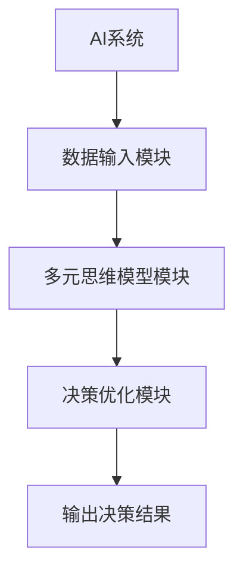

                 


# 芒格的"思维格栅"在人工智能伦理决策中的应用

## 关键词：芒格思维格栅、人工智能、伦理决策、多模型思维、伦理框架、决策优化

## 摘要：  
芒格的"思维格栅"是一种多维度的决策框架，结合了多种学科的思维模型，帮助人们做出更明智的决策。本文探讨了将这种思维格栅应用于人工智能伦理决策中的可能性和方法，通过分析伦理决策的挑战、思维格栅的原理，以及如何将其转化为算法模型，提出了一种基于多元思维模型的伦理决策框架。文章详细解释了从理论到实践的全过程，包括系统架构设计、算法实现、案例分析和未来展望。

---

## 第一部分：芒格思维格栅与人工智能伦理决策的背景介绍

### 第1章：芒格思维格栅的核心概念

#### 1.1 芒格思维格栅的定义与特点
- **1.1.1 芒格思维格栅的定义**  
  芒格思维格栅是由投资者查理·芒格提出的一种决策框架，强调通过多个学科的思维模型来分析问题，避免单一思维的局限性。它是一个多维度的分析工具，帮助决策者从不同角度理解问题。

- **1.1.2 芒格思维格栅的核心特点**  
  - **多维度性**：整合多个学科的原则，如心理学、经济学、伦理学等。  
  - **系统性**：通过系统性地分析问题，减少决策偏差。  
  - **可扩展性**：适用于不同领域和场景的决策问题。  

- **1.1.3 芒格思维格栅与传统决策模型的对比**  
  传统的决策模型通常基于单一的逻辑分析或经验判断，而思维格栅通过多学科的交叉应用，提高了决策的全面性和准确性。

#### 1.2 人工智能伦理决策的重要性
- **1.2.1 伦理决策在人工智能中的作用**  
  人工智能系统在医疗、交通、金融等领域广泛应用，伦理决策直接关系到系统的社会影响和用户信任。  
- **1.2.2 人工智能伦理决策的挑战**  
  包括算法偏见、责任划分、隐私保护等问题，这些都需要在决策过程中综合考虑。  
- **1.2.3 伦理决策在人工智能系统中的必要性**  
  伦理决策是确保AI系统符合社会价值观和法律规范的关键，避免负面社会影响。

---

### 第2章：芒格思维格栅在人工智能伦理决策中的应用

#### 2.1 芒格思维格栅在伦理决策中的优势
- **2.1.1 多元视角分析**  
  通过整合不同学科的思维模型，AI系统能够在伦理决策中考虑更多的因素，如社会影响、法律约束和道德规范。  
- **2.1.2 提高决策的全面性**  
  芒格思维格栅帮助AI系统避免单一维度的决策，减少遗漏重要伦理因素的风险。  

#### 2.2 人工智能伦理决策中的思维格栅模型
- **2.2.1 思维格栅模型的构建**  
  结合伦理学、法学、社会学等多个学科的模型，构建一个适用于AI伦理决策的多维度框架。  
- **2.2.2 思维格栅模型的数学表示**  
  通过数学建模，将多元思维模型整合到AI决策算法中，实现伦理因素的量化评估。

---

## 第二部分：芒格思维格栅在人工智能伦理决策中的核心概念与联系

### 第3章：芒格思维格栅的原理与人工智能伦理决策的联系

#### 3.1 芒格思维格栅的原理
- **3.1.1 芒格思维格栅的基本原理**  
  芒格强调通过多维度的分析来理解问题，避免单一视角的局限性。这一原理在AI伦理决策中尤为重要，因为伦理问题往往涉及复杂的多方面因素。

- **3.1.2 芒格思维格栅的核心要素**  
  - 心理学模型：理解人类行为和决策的偏差。  
  - 经济学模型：分析利益相关者的动机和行为。  
  - 哲学模型：探讨伦理原则和价值判断。  

- **3.1.3 芒格思维格栅的数学模型**  
  通过建立多目标优化模型，将不同学科的思维模型转化为数学表达式，用于AI决策算法的优化。

#### 3.2 人工智能伦理决策中的思维格栅模型

- **3.2.1 思维格栅模型在AI伦理决策中的应用**  
  通过整合多元思维模型，AI系统能够从多个维度分析问题，生成符合伦理的决策。

- **3.2.2 思维格栅模型的优化与调整**  
  根据实际应用中的反馈，动态调整模型参数，提高决策的准确性和适应性。

---

## 第三部分：芒格思维格栅在人工智能伦理决策中的算法实现

### 第4章：算法原理与实现

#### 4.1 思维格栅模型的算法实现
- **4.1.1 算法流程**  
  - 数据预处理：收集与伦理相关的多维度数据。  
  - 模型构建：建立多元思维模型的数学表达式。  
  - 决策优化：通过优化算法生成符合伦理的决策。  

- **4.1.2 算法代码实现**  
  ```python
  def ethical_decision-making(data, models):
      # 集成多个思维模型进行决策计算
      result = integrate_models(data, models)
      return result
  ```

#### 4.2 思维格栅模型的数学公式
- **伦理评估函数**  
  $$ E = \sum_{i=1}^{n} w_i \cdot f_i(x) $$
  其中，$w_i$ 是第$i$个思维模型的权重，$f_i(x)$ 是第$i$个模型的评估函数。  

---

## 第四部分：芒格思维格栅在人工智能伦理决策中的系统架构与设计

### 第5章：系统架构设计

#### 5.1 系统架构图


#### 5.2 接口设计
- **输入接口**：接收多维度的数据输入，如社会影响、法律约束等。  
- **输出接口**：生成符合伦理的决策结果，并提供决策理由的解释。  

---

## 第五部分：芒格思维格栅在人工智能伦理决策中的项目实战

### 第6章：项目实战与案例分析

#### 6.1 项目背景
- 某自动驾驶公司需要在紧急情况下做出符合伦理的决策，如在交通事故中优先保护行人还是车主。

#### 6.2 系统实现
- **环境安装**：安装必要的AI框架和伦理决策模型。  
- **核心代码实现**  
  ```python
  def integrate_models(data, models):
      result = 0
      for model in models:
          result += model(data)
      return result / len(models)
  ```

#### 6.3 案例分析
- **案例一**：自动驾驶在紧急情况下的决策，系统结合功利主义和义务论，优先保护更多人。  
- **案例二**：医疗诊断系统在资源分配中的伦理决策，确保公平性和有效性。

---

## 第六部分：总结与展望

### 第7章：总结与展望

#### 7.1 最佳实践 tips
- 在AI伦理决策中，应结合多元思维模型，确保决策的全面性和伦理合规性。  
- 定期评估和优化决策模型，适应不同的伦理环境和用户需求。  

#### 7.2 小结
芒格的思维格栅为人工智能伦理决策提供了一个多维度的分析框架，通过整合多个学科的思维模型，帮助AI系统做出更符合伦理的决策。

#### 7.3 注意事项
- 确保决策过程的透明性和可解释性，避免用户对AI决策的不信任。  
- 针对不同文化和社会背景，调整伦理决策模型的参数，确保适用性。  

#### 7.4 拓展阅读
- 推荐阅读《芒格的思维格栅》和《人工智能伦理》等相关书籍，深入了解思维格栅的应用和伦理决策的前沿研究。

---

## 作者：AI天才研究院 & 禅与计算机程序设计艺术

