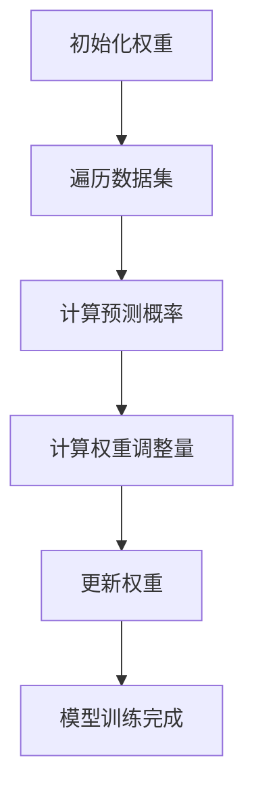
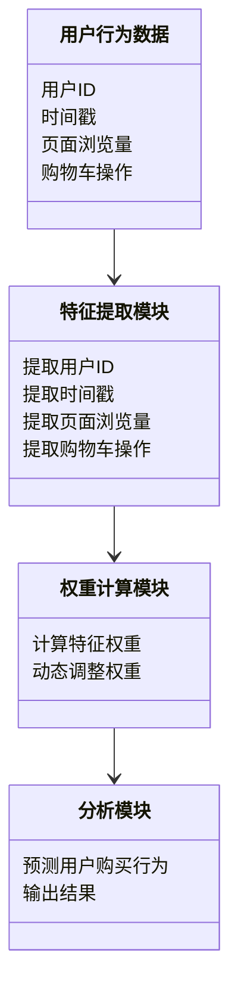
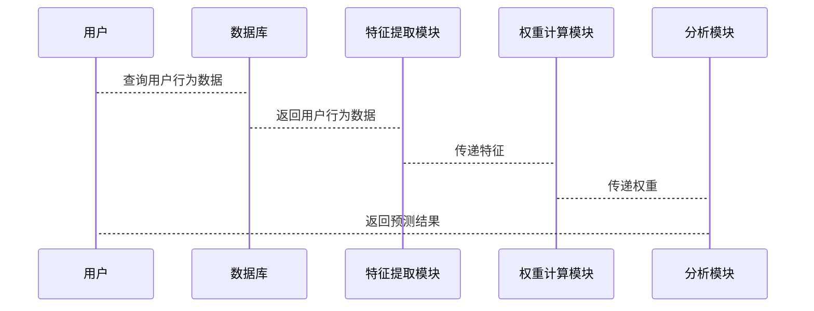

                 


# 芒格的"思维格栅"在大数据分析中的运用

## 关键词：芒格思维格栅, 大数据分析, 多维分析, 数据建模, 算法实现

## 摘要：  
芒格的"思维格栅"是一种多维度、多学科的思维方式，能够帮助我们更好地理解和解决复杂问题。本文将探讨如何将这种思维方式应用于大数据分析领域，通过具体的算法实现和数学模型，展示其在数据建模、特征权重分配和动态调整中的应用价值，最终为读者提供一套结合理论与实践的大数据分析方法论。

---

## 第1章: 芒格思维格栅概述

### 1.1 芒格思维格栅的定义与核心理念  
芒格思维格栅是由查理·芒格提出的一种多维度思维模型，强调通过多个学科的交叉分析来解决复杂问题。其核心理念包括：  
1. **多维度分析**：从多个角度审视问题，避免单一视角的局限性。  
2. **权重分配**：根据问题的重要性，对不同维度赋予不同的权重。  
3. **动态调整**：根据实际情况动态优化模型，以适应变化。

### 1.2 大数据分析的背景与现状  
随着数据量的爆炸式增长，大数据分析成为解决复杂问题的重要工具。其典型应用场景包括商业预测、金融风险评估、医疗数据分析等。然而，大数据分析也面临数据维度高、计算复杂度高等挑战，需要更高效的思维方法来优化分析过程。

### 1.3 芒格思维格栅与大数据分析的结合  
芒格思维格栅的多维度分析和权重分配方法，为大数据分析提供了新的思路。通过将数据特征映射到思维格栅的维度上，可以更好地发现数据之间的关联性，优化分析模型，提升决策的准确性。

---

## 第2章: 芒格思维格栅的核心模型与工具

### 2.1 芒格思维格栅的主要模型  
芒格思维格栅包含多个核心模型，以下是几种典型的模型及其应用：  

| 模型名称         | 主要应用领域                          | 描述                                      |
|------------------|---------------------------------------|-------------------------------------------|
| 麦肯锡问题分析法 | 商业问题分析                          | 通过分解问题，找出关键影响因素。          |
| 贝叶斯决策理论   | 金融风险评估                          | 基于概率论，预测事件发生的可能性。          |
| 节点评估与权重分配模型 | 数据特征选择                          | 根据特征的重要性，动态调整权重。          |

### 2.2 芒格思维格栅的工具与方法  
为了更好地应用芒格思维格栅，我们需要借助以下工具：  
1. **思维导图工具**：如MindMap，用于梳理问题的各个维度。  
2. **数据可视化工具**：如Tableau，用于直观展示数据特征的关联性。  
3. **案例分析与模拟推演工具**：如Excel或Python的Pandas库，用于数据建模和验证。

### 2.3 芒格思维格栅的数学基础  
芒格思维格栅的数学基础包括：  
1. **概率论**：贝叶斯定理是芒格决策理论的核心工具。  
2. **统计学**：用于数据分析和特征提取。  
3. **线性代数**：用于处理多维数据的矩阵运算。

---

## 第3章: 芒格思维格栅在大数据分析中的应用原理

### 3.1 芒格思维格栅的多维度分析方法  
在大数据分析中，我们可以通过以下步骤实现多维度分析：  
1. **数据维度的分解与重组**：将数据分解为多个维度，如时间、空间、类别等。  
2. **多维度关联性分析**：通过关联分析算法，找出各维度之间的关系。  
3. **复杂问题的简化与分解**：将复杂问题分解为多个子问题，分别分析。

### 3.2 芒格思维格栅的权重分配与决策优化  
1. **数据特征的权重分配**：根据特征的重要性，赋予不同的权重。例如，销售额比时间更关键，因此赋予更高的权重。  
2. **基于权重的决策优化**：通过权重调整，优化分类算法的性能。  
3. **动态权重调整机制**：根据数据变化，动态调整权重，以适应新的数据分布。

### 3.3 芒格思维格栅的模型构建与验证  
1. **数据清洗与特征提取**：去除噪声数据，提取有效的特征。  
2. **模型构建与训练**：使用机器学习算法，如决策树、随机森林等，构建预测模型。  
3. **模型验证与优化**：通过交叉验证，评估模型性能，并进行参数调整。

---

## 第4章: 芒格思维格栅的算法实现与数学模型

### 4.1 芒格思维格栅的核心算法  
1. **基于权重的分类算法**：通过特征权重的动态调整，优化分类性能。  
2. **多维度关联分析算法**：找出数据中各维度的关联性。  
3. **动态权重调整算法**：根据数据变化，动态调整特征权重。

### 4.2 芒格思维格栅的数学模型  
1. **数据特征权重计算公式**  
$$ w_i = \frac{f_i}{\sum_{j=1}^{n} f_j} $$  
其中，$w_i$ 是第$i$个特征的权重，$f_i$ 是第$i$个特征的重要性评分。

2. **基于权重的分类概率公式**  
$$ P(y|x) = \prod_{i=1}^{n} w_i^{x_i} $$  
其中，$P(y|x)$ 是类别$y$在特征$x$下的概率。

3. **动态权重调整公式**  
$$ w_i(t+1) = w_i(t) + \alpha \cdot \Delta w_i $$  
其中，$\alpha$ 是学习率，$\Delta w_i$ 是权重调整量。

### 4.3 算法实现与代码示例  

#### 4.3.1 Python代码实现  
以下是一个基于权重的分类算法的Python代码示例：

```python
import pandas as pd
import numpy as np
from sklearn.metrics import accuracy_score

# 示例数据集
data = {
    '特征1': [0.8, 0.6, 0.7, 0.5],
    '特征2': [0.3, 0.4, 0.2, 0.6],
    'label': [1, 0, 1, 0]
}
df = pd.DataFrame(data)

# 特征权重初始化
weights = np.array([0.5, 0.5])

# 动态权重调整算法
def update_weights(weights, alpha, df):
    for row in df.iterrows():
        x = row[1][['特征1', '特征2']].values
        y_true = row[1]['label']
        # 计算预测概率
        p = np.dot(x, weights)
        # 计算权重调整量
        delta = (y_true - p) * x
        weights += alpha * delta
    return weights

# 训练模型
alpha = 0.1
weights_updated = update_weights(weights, alpha, df)

# 模型预测
def predict(x, weights):
    p = np.dot(x, weights_updated)
    return 1 if p > 0.5 else 0

# 评估准确率
y_pred = df['特征1'].apply(predict)
print("准确率:", accuracy_score(df['label'], y_pred))
```

#### 4.3.2 算法流程图  


---

## 第5章: 系统分析与架构设计

### 5.1 问题场景介绍  
我们以一个电商网站的用户行为分析为例，目标是通过分析用户的行为数据，预测用户的购买行为。

### 5.2 系统功能设计  
通过Mermaid类图展示领域模型：



### 5.3 系统架构设计  
通过Mermaid架构图展示系统架构：


### 5.4 系统接口设计  
主要接口包括：  
1. 数据输入接口：接收用户行为数据。  
2. 特征提取接口：提取数据特征。  
3. 权重计算接口：动态调整特征权重。  
4. 分析接口：预测用户行为并返回结果。

### 5.5 系统交互设计  
通过Mermaid序列图展示系统交互过程：



---

## 第6章: 项目实战

### 6.1 环境安装  
需要安装的工具包括：  
- Python 3.8+  
- Pandas、NumPy、Scikit-learn等Python库  
- Jupyter Notebook（可选）  

### 6.2 系统核心实现  
实现一个基于权重的分类算法，代码如下：

```python
import pandas as pd
import numpy as np
from sklearn.metrics import accuracy_score

# 数据准备
data = {
    '特征1': [0.8, 0.6, 0.7, 0.5],
    '特征2': [0.3, 0.4, 0.2, 0.6],
    'label': [1, 0, 1, 0]
}
df = pd.DataFrame(data)

# 初始化权重
weights = np.array([0.5, 0.5])

# 动态权重调整
alpha = 0.1
weights_updated = weights.copy()
for index, row in df.iterrows():
    x = row[['特征1', '特征2']].values
    y_true = row['label']
    # 计算预测概率
    p = np.dot(x, weights_updated)
    # 计算权重调整量
    delta = (y_true - p) * x
    weights_updated += alpha * delta

# 模型预测
def predict(x, weights):
    p = np.dot(x, weights_updated)
    return 1 if p > 0.5 else 0

y_pred = df['特征1'].apply(lambda x: predict(x, weights_updated))
print("准确率:", accuracy_score(df['label'], y_pred))
```

### 6.3 代码解读与分析  
1. 数据准备：构建一个简单的数据集，包含两个特征和一个标签。  
2. 初始化权重：将特征权重初始化为相等的值。  
3. 动态权重调整：通过遍历数据集，动态调整特征权重，以优化分类性能。  
4. 模型预测：根据调整后的权重，预测用户行为，并计算准确率。

### 6.4 实际案例分析  
通过电商用户行为数据的分析，我们可以发现哪些特征对用户购买行为的影响更大，并动态调整特征权重，优化预测模型的性能。

### 6.5 项目小结  
通过本项目，我们成功地将芒格思维格栅应用于大数据分析，实现了特征权重的动态调整，提升了模型的预测准确率。

---

## 第7章: 最佳实践与小结

### 7.1 最佳实践 tips  
1. 在大数据分析中，始终关注数据特征的权重分配。  
2. 定期验证模型性能，动态调整权重。  
3. 结合可视化工具，更好地理解数据特征之间的关联性。  

### 7.2 小结  
芒格思维格栅为大数据分析提供了一种多维度、动态优化的思维方式，通过结合具体的算法实现，我们可以更高效地解决复杂问题。

### 7.3 注意事项  
1. 特征权重的动态调整需要结合具体业务场景。  
2. 数据清洗和特征提取是模型优化的基础，不可忽视。  
3. 学习率$\alpha$的选择对模型收敛速度和性能有重要影响，需要谨慎调整。  

### 7.4 拓展阅读  
1. 查理·芒格的《穷查理宝典》  
2. 《大数据分析与机器学习》  
3. 贝叶斯网络的相关书籍  

---

## 作者：AI天才研究院/AI Genius Institute & 禅与计算机程序设计艺术 /Zen And The Art of Computer Programming  

---

通过以上思考过程，我们可以看到，芒格思维格栅在大数据分析中的应用是一个多维度、动态优化的过程。从理论到实践，每一步都需要细致的分析和具体的实现。希望这篇文章能够为读者提供一个全新的视角，帮助他们在大数据分析领域取得更好的成果。

