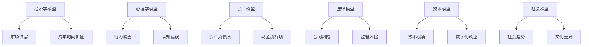
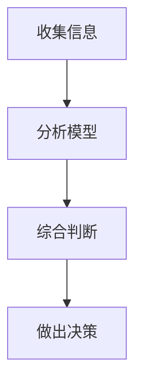
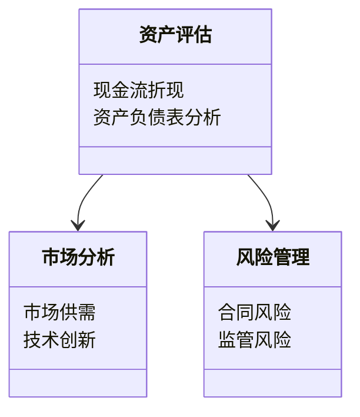
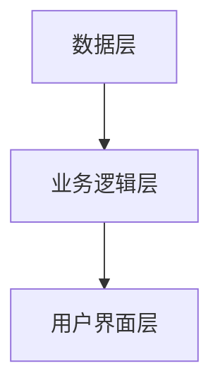

                 


# 芒格的"思维格栅"：构建全面的投资分析框架

---

## 关键词
- 芒格
- 思维格栅
- 投资分析
- 多元思维模型
- 系统性分析

---

## 摘要
芒格的“思维格栅”是一种通过多学科模型构建的投资分析框架，旨在帮助投资者超越传统单一视角的局限，实现更全面、更深入的决策。本文将从思维格栅的背景、核心概念、算法原理、系统架构、项目实战等多维度进行详细分析，结合实际案例，深入探讨其在投资分析中的应用价值和实践意义。

---

## 第一部分：背景介绍

### 第1章：芒格与思维格栅概述

#### 1.1 芒格的生平与投资理念
- **1.1.1 芝加格俱乐部与芒格的成长**
  - 查理·芒格（Charlie Munger）是美国著名投资家，伯克希尔·哈撒韦公司副主席。
  - 他最初在法律领域发展，后转向投资，成为价值投资的倡导者。
  - 芒格的早期经历使其认识到跨学科思考的重要性，这为他后来提出思维格栅奠定了基础。

- **1.1.2 芒格的投资哲学：价值投资与多元思维**
  - 芒格强调价值投资，即寻找市场低估的优质企业进行长期投资。
  - 他提出“多元思维模型”，认为投资者应通过多个学科的模型来理解商业和市场。

- **1.1.3 芒格思维格栅的核心理念**
  - 思维格栅是一种将多个学科模型整合起来，用于分析和决策的方法。
  - 通过多维度分析，投资者可以避免单一视角的局限性，提高决策的准确性和全面性。

#### 1.2 思维格栅的定义与特点
- **1.2.1 思维格栅的定义**
  - 思维格栅是一种将多个学科模型整合起来，用于分析和决策的方法。
  - 通过多维度分析，投资者可以避免单一视角的局限性，提高决策的准确性和全面性。

- **1.2.2 多学科模型的整合与应用**
  - 思维格栅的核心在于将不同领域的知识模型结合起来，用于分析特定问题。
  - 每个模型都有其独特的视角和应用场景，通过整合可以形成更全面的分析框架。

- **1.2.3 思维格栅与传统投资分析的区别**
  - 传统投资分析通常依赖单一学科的模型，如财务指标分析或技术分析。
  - 思维格栅则强调多学科模型的综合应用，注重跨领域知识的整合。

#### 1.3 思维格栅在投资中的应用前景
- **1.3.1 思维格栅的潜在应用场景**
  - 适用于长期投资决策，尤其是对复杂市场环境的分析。
  - 适合分析企业的竞争优势、市场趋势和潜在风险。

- **1.3.2 投资者采用思维格栅的优势**
  - 提高分析的全面性和深度，减少决策偏差。
  - 帮助投资者识别潜在风险，优化投资组合。

- **1.3.3 应用中的挑战与机遇**
  - 挑战：需要广泛的知识储备和模型整合能力。
  - 机遇：通过多维度分析，投资者可以发现新的投资机会和风险。

---

## 第二部分：思维格栅的核心概念与联系

### 第2章：思维格栅的核心模型

#### 2.1 经济学模型
- **2.1.1 边际成本与边际收益**
  - 边际成本是指增加一单位产量所增加的成本。
  - 边际收益是指增加一单位产量所带来的收益。
  - 通过分析边际成本与边际收益的关系，可以判断企业是否处于最优生产状态。

- **2.1.2 市场供需与价格机制**
  - 市场供需关系决定商品价格。
  - 价格机制是市场资源配置的核心机制。
  - 投资者可以通过分析市场供需变化，预测价格波动。

- **2.1.3 资本的时间价值与复利效应**
  - 资本的时间价值是指资金随着时间的推移而产生的价值变化。
  - 复利效应是指资金在多次投资中产生的收益再投资所获得的额外收益。
  - 时间价值和复利效应是价值投资的重要基础。

#### 2.2 心理学模型
- **2.2.1 行为偏差与认知错误**
  - 行为偏差是指投资者在决策过程中因情绪或认知偏差而做出的非理性行为。
  - 认知错误是指投资者对信息的处理过程中产生的系统性错误。

- **2.2.2 心理账户与决策权重**
  - 心理账户是指投资者将资金分配到不同的心理账户中，影响决策权重。
  - 决策权重是指投资者在决策过程中对不同因素的重视程度。

- **2.2.3 社会认同与从众效应**
  - 社会认同是指投资者因社会压力或群体影响而做出的决策。
  - 从众效应是指投资者因跟随大众而忽视个体判断的现象。

#### 2.3 会计与财务模型
- **2.3.1 资产负债表与利润表分析**
  - 资产负债表反映企业的财务状况，包括资产、负债和所有者权益。
  - 利润表反映企业的经营成果，包括收入、成本和利润。

- **2.3.2 资产评估与价值重估**
  - 资产评估是指对资产价值的客观评估。
  - 价值重估是指在市场变化中对资产价值进行重新评估。

- **2.3.3 现金流折现法与企业估值**
  - 现金流折现法是将未来现金流折现到现值，用于评估企业价值。
  - 企业估值是指对企业整体价值的评估，通常用于判断投资价值。

#### 2.4 法律与风险管理模型
- **2.4.1 合同风险与法律纠纷**
  - 合同风险是指因合同履行问题而产生的风险。
  - 法律纠纷是指因法律问题而产生的纠纷，可能影响企业经营。

- **2.4.2 企业合规与监管风险**
  - 企业合规是指企业遵守相关法律法规，确保经营合法。
  - 监管风险是指因监管政策变化而产生的风险。

- **2.4.3 风险对冲与保险机制**
  - 风险对冲是指通过投资组合的调整来降低风险。
  - 保险机制是指通过购买保险来转移风险。

#### 2.5 技术与创新模型
- **2.5.1 技术进步对企业价值的影响**
  - 技术进步可以提高企业生产效率，降低成本，增强竞争力。
  - 技术创新可以带来新产品和新市场，增加企业价值。

- **2.5.2 创新周期与行业颠覆**
  - 创新周期是指技术从发明到应用再到成熟的过程。
  - 行业颠覆是指新技术或新模式对传统行业造成根本性改变。

- **2.5.3 数字化转型与竞争优势**
  - 数字化转型是指企业利用数字技术改变业务模式、流程和组织结构。
  - 数字化转型可以提升企业效率，创造新的竞争优势。

#### 2.6 社会与文化模型
- **2.6.1 社会趋势对企业的影响**
  - 社会趋势包括人口结构、消费习惯、文化变迁等，影响企业经营环境。
  - 企业应关注社会趋势，及时调整战略。

- **2.6.2 文化差异与市场选择**
  - 文化差异影响消费者偏好和市场行为。
  - 企业应根据不同市场的文化差异，制定相应的营销策略。

- **2.6.3 人口结构与消费行为**
  - 人口结构变化影响消费市场的需求和供给。
  - 企业应关注人口结构变化，优化产品和服务。

#### 2.7 自然与生态模型
- **2.7.1 资源稀缺性与替代技术**
  - 资源稀缺性可能导致价格上涨，推动替代技术的发展。
  - 企业应关注资源稀缺性，开发替代技术，降低依赖风险。

- **2.7.2 环境保护与企业责任**
  - 环境保护是企业社会责任的重要组成部分。
  - 企业应积极采取环保措施，减少对环境的影响。

- **2.7.3 可持续发展与长期价值**
  - 可持续发展是指在满足当前需求的同时，不损害未来世代的需求。
  - 企业应注重可持续发展，创造长期价值。

---

## 第三部分：思维格栅的模型联系与整体架构

### 第3章：思维格栅的模型联系与整体架构

#### 3.1 模型之间的关系与协同
- **3.1.1 经济学与心理学模型的协同**
  - 经济学模型关注市场机制和资源配置，心理学模型关注投资者行为和认知。
  - 两者结合可以帮助投资者更好地理解市场动态和行为偏差。

- **3.1.2 会计与法律模型的协同**
  - 会计模型用于企业财务分析，法律模型用于合规风险评估。
  - 两者结合可以帮助投资者全面评估企业的财务状况和法律风险。

- **3.1.3 技术与社会模型的协同**
  - 技术模型关注企业技术创新和竞争优势，社会模型关注社会趋势和文化影响。
  - 两者结合可以帮助投资者更好地把握企业的长期发展潜力。

#### 3.2 思维格栅的整体架构
- **3.2.1 总体架构图**
  - 下图展示了思维格栅的整体架构，包括经济学、心理学、会计学、法律、技术和文化等多个模型。



---

## 第四部分：算法原理与数学模型

### 第4章：算法原理与数学模型

#### 4.1 思维格栅的算法框架
- **4.1.1 系统化分析流程**
  - 收集信息：整合多学科模型的数据和信息。
  - 分析模型：通过不同模型分析问题，识别关键因素。
  - 综合判断：结合各模型的分析结果，做出综合判断。

- **4.1.2 分析流程图**
  - 下图展示了思维格栅的系统化分析流程。



#### 4.2 数学模型与公式
- **4.2.1 资本时间价值计算**
  - 复利公式：$$FV = PV \times (1 + r)^n$$
  - 其中，FV是终值，PV是现值，r是利率，n是时间。

- **4.2.2 现金流折现法**
  - 折现公式：$$PV = \sum_{t=1}^{n} \frac{CF_t}{(1 + r)^t}$$
  - 其中，CF_t是第t期的现金流，r是折现率。

---

## 第五部分：系统分析与架构设计

### 第5章：系统分析与架构设计

#### 5.1 问题场景介绍
- 投资者需要分析一家企业的投资价值，考虑市场、财务、技术和法律等多个因素。

#### 5.2 系统功能设计
- **功能需求：**
  - 收集和整理多学科模型的数据和信息。
  - 分析各模型的关键因素及其影响。
  - 综合各模型的分析结果，做出投资决策。

- **领域模型：**
  - 下图展示了系统功能的领域模型。



#### 5.3 系统架构设计
- **架构设计：**
  - 采用分层架构，包括数据层、业务逻辑层和用户界面层。
  - 数据层负责数据的存储和管理。
  - 业务逻辑层负责各模型的分析和计算。
  - 用户界面层提供友好的操作界面。

- **架构图：**
  - 下图展示了系统的整体架构。



---

## 第六部分：项目实战

### 第6章：项目实战

#### 6.1 环境安装与配置
- 需要安装Python和相关库，如pandas、numpy、scipy等。

#### 6.2 核心实现代码
- 以下是现金流折现法的Python实现代码：

```python
import numpy as np

def discounted_cash_flow(cash_flows, discount_rate):
    return np.npv(discount_rate, cash_flows)

# 示例数据
cash_flows = [-100, 200, 300, 400]
discount_rate = 0.10

# 计算净现值
npv = discounted_cash_flow(cash_flows, discount_rate)
print("净现值：", npv)
```

#### 6.3 实际案例分析
- 以某企业为例，分析其投资价值，展示如何应用思维格栅进行综合分析。

---

## 第七部分：最佳实践与总结

### 第7章：最佳实践与总结

#### 7.1 最佳实践
- **广泛学习：** 持续学习多学科知识，扩展思维格栅的深度和广度。
- **模型整合：** 灵活应用各模型，根据实际情况调整分析框架。
- **持续优化：** 根据实际效果反馈，不断优化思维格栅的应用。

#### 7.2 小结
- 通过思维格栅的系统化分析，投资者可以更好地理解市场和企业，做出更明智的投资决策。

#### 7.3 注意事项
- **模型局限性：** 思维格栅的应用需要结合实际情况，避免机械套用。
- **数据质量：** 确保输入数据的准确性和完整性，避免分析偏差。
- **持续学习：** 投资者的知识更新是保持思维格栅活力的关键。

#### 7.4 拓展阅读
- 推荐阅读芒格的著作《Poor Charlie's Almanack》，深入理解思维格栅的思想。

---

## 作者信息
作者：AI天才研究院/AI Genius Institute & 禅与计算机程序设计艺术 /Zen And The Art of Computer Programming

---

以上是《芒格的"思维格栅"：构建全面的投资分析框架》的文章内容，涵盖了从背景介绍到实际应用的各个方面，结合理论与实践，帮助投资者构建全面的投资分析框架。

