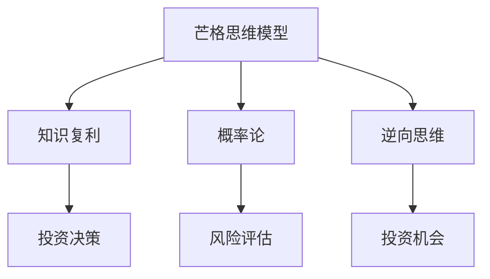
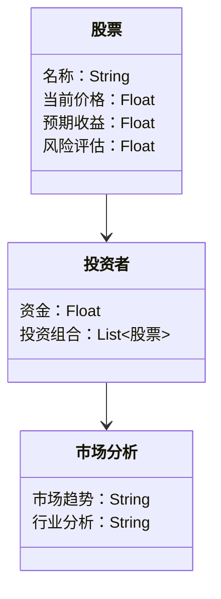
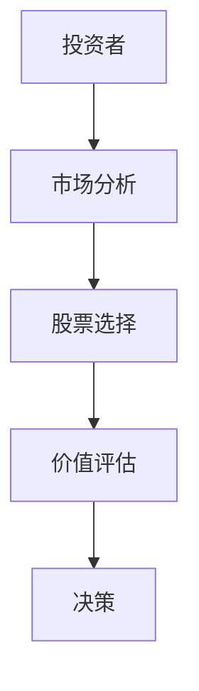

                 


# 芒格的思维模型：在投资中的应用

## 关键词：芒格思维模型，投资决策，多元思维模型，价值投资，概率论，逆向思维

## 摘要：芒格的思维模型是一种以多元思维为基础的投资方法，通过将多个学科的基本原理应用于投资决策中，帮助投资者做出更理性、更长远的选择。本文将详细探讨芒格思维模型的核心概念、算法原理、系统架构以及实际应用，结合具体案例分析，帮助读者理解如何在投资中运用这一模型。

---

## 第一部分: 芒格思维模型的背景与基础

### 第1章: 芒格思维模型的起源与核心概念

#### 1.1 芒格思维模型的起源

##### 1.1.1 查理·芒格的生平简介

查理·芒格（Charlie Munger）是美国著名投资家、伯克希尔·哈撒韦公司的副主席，被誉为“巴菲特的导师”。芒格的思维方式深受其哲学背景影响，他提倡“多元思维模型”（Multidisplinary Thinking Model），认为投资决策应基于跨学科的知识体系。

##### 1.1.2 芒格思维模型的核心思想

芒格思维模型的核心思想是：投资者应通过多学科的知识体系来分析问题，避免单一视角的局限性。这种思维方式强调对知识的深度理解和跨领域的关联性思考。

##### 1.1.3 多元思维模型的定义与特点

多元思维模型是一种通过整合不同学科的基本原理来解决问题的方法。其特点包括：

1. **跨学科整合**：将心理学、经济学、数学等学科的知识结合起来。
2. **知识的复利效应**：通过不断积累和应用知识，形成正向循环。
3. **逆向思维**：从反方向思考问题，发现投资机会。

#### 1.2 芒格思维模型在投资中的应用背景

##### 1.2.1 投资的本质与误区

投资的本质是通过合理配置资源，实现财富的增值。然而，传统投资方法往往依赖于市场情绪和短期波动，容易陷入误区，如过度依赖技术分析或忽视长期价值。

##### 1.2.2 传统投资方法的局限性

传统投资方法往往忽视了企业的基本面分析，容易受到市场情绪的影响。芒格认为，这种方法可能导致投资者在市场波动中做出错误决策。

##### 1.2.3 芒格思维模型的适用场景

芒格思维模型适用于长期价值投资，尤其是在分析企业的基本面和行业趋势时，能够帮助投资者做出更理性的决策。

#### 1.3 芒格思维模型的核心要素

##### 1.3.1 知识的复利效应

知识的复利效应是指通过不断积累和应用知识，形成正向循环，提升决策能力。芒格强调，投资者应不断学习新知识，并将其应用到实际投资中。

##### 1.3.2 概率论与投资决策

概率论是芒格思维模型的重要组成部分。通过分析投资的期望收益和风险，投资者可以做出更理性的决策。

##### 1.3.3 逆向思维的应用

逆向思维是指从反方向思考问题，避免从众思维。芒格认为，逆向思维可以帮助投资者发现市场中的低估机会。

---

## 第二部分: 芒格思维模型的核心概念与联系

### 第2章: 芒格思维模型的核心概念与联系

#### 2.1 核心概念原理

##### 2.1.1 知识的复利效应

知识的复利效应通过不断学习和应用，形成知识的积累和应用正向循环。例如，通过学习财务知识和市场趋势，投资者可以更好地评估企业的价值。

##### 2.1.2 概率论与投资决策

概率论在投资中的应用主要是通过计算投资的期望收益和风险，帮助投资者做出更理性的决策。例如，通过分析股票的预期收益和风险，投资者可以决定是否投资某只股票。

##### 2.1.3 逆向思维的应用

逆向思维在投资中的应用主要是通过分析市场的反常现象，发现投资机会。例如，当市场出现恐慌性抛售时，投资者可以通过逆向思维寻找低估的投资标的。

#### 2.2 核心概念对比表格

| 概念       | 描述                                                                 |
|------------|----------------------------------------------------------------------|
| 知识的复利  | 知识的积累和应用形成正向循环，提升决策能力                              |
| 概率论      | 通过概率分析投资风险和收益，做出更理性的决策                          |
| 逆向思维    | 从反方向思考问题，避免从众思维，发现投资机会                          |

#### 2.3 ER实体关系图



---

## 第三部分: 芒格思维模型的算法原理

### 第3章: 投资决策的数学模型与公式

#### 3.1 投资决策的数学模型

##### 3.1.1 价值投资的数学公式

$$ V = \frac{CF}{r - g} $$

其中，\( V \) 为股票价值，\( CF \) 为未来现金流，\( r \) 为贴现率，\( g \) 为增长率。

##### 3.1.2 概率论在投资中的应用

通过计算投资的期望收益和风险，投资者可以做出更理性的决策。例如，计算某只股票的期望收益为：

$$ E = \sum p_i r_i $$

其中，\( p_i \) 为各个收益情景的概率，\( r_i \) 为对应的收益。

---

## 第四部分: 芒格思维模型的系统分析与架构设计

### 第4章: 系统功能设计与架构图

#### 4.1 系统功能设计

##### 4.1.1 领域模型（领域模型类图）



#### 4.2 系统架构设计

##### 4.2.1 系统架构图



---

## 第五部分: 芒格思维模型的项目实战

### 第5章: 项目实战与案例分析

#### 5.1 环境安装与配置

##### 5.1.1 环境要求

- Python 3.8+
- 财务分析库（如pandas、numpy）
- 可视化工具（如matplotlib）

#### 5.2 系统核心实现源代码

##### 5.2.1 股票价值评估代码

```python
import pandas as pd
import numpy as np

def calculate_value(stock_data, required_return):
    stock_data['expected_return'] = stock_data['return'].mean()
    stock_data['risk'] = stock_data['return'].std()
    stock_data['value'] = stock_data['cash_flows'] / (required_return - stock_data['growth'])
    return stock_data
```

#### 5.3 代码应用解读与分析

##### 5.3.1 代码功能说明

上述代码通过计算股票的预期收益、风险和价值，帮助投资者做出更理性的决策。其中，`cash_flows` 表示未来现金流，`required_return` 表示要求的回报率，`growth` 表示增长率。

##### 5.3.2 代码实现细节

通过计算股票的期望收益和风险，投资者可以评估股票的价值。例如，如果某只股票的预期收益为10%，风险为5%，要求回报率为8%，则其价值为：

$$ V = \frac{CF}{0.08 - 0.05} $$

---

## 第六部分: 芒格思维模型的总结与最佳实践

### 第6章: 总结与最佳实践

#### 6.1 项目小结

芒格思维模型通过跨学科的知识体系，帮助投资者做出更理性的决策。通过实际案例分析，我们可以看到，这种思维方式在投资中具有重要的应用价值。

#### 6.2 最佳实践 tips

1. **持续学习**：不断积累跨学科知识，提升决策能力。
2. **逆向思维**：从反方向思考问题，发现投资机会。
3. **概率论应用**：通过分析概率，评估投资风险和收益。

#### 6.3 注意事项

- 投资者应避免过度依赖单一模型，结合实际情况灵活运用。
- 投资决策应结合市场环境和企业基本面，避免盲目跟风。

#### 6.4 拓展阅读

- 《芒格桥：思维的升级之道》
- 《投资的哲学》

---

## 作者：AI天才研究院/AI Genius Institute & 禅与计算机程序设计艺术 /Zen And The Art of Computer Programming

---

通过本文的详细分析，我们可以看到，芒格思维模型在投资中的应用具有重要的现实意义。通过跨学科的知识体系和系统的分析方法，投资者可以做出更理性的决策，实现长期的财富增值。

