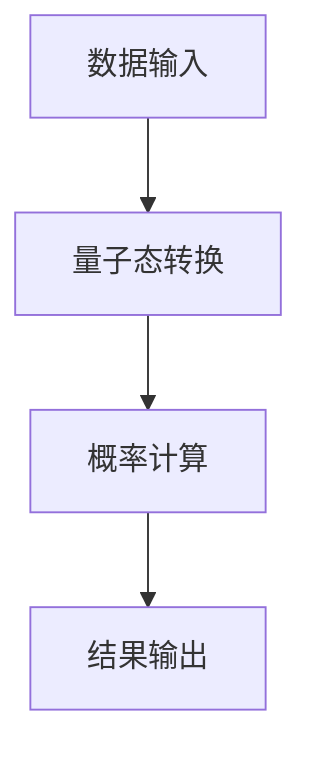

                 


# 《芒格的"数学期望"思维在量子概率金融模型中的应用》

---

## 关键词：
- 芒格思维
- 数学期望
- 量子概率
- 金融模型
- 概率测度
- 量子金融
- 投资决策

---

## 摘要：
本文探讨了芒格的“数学期望”思维在量子概率金融模型中的应用。首先，介绍了芒格思维的核心概念及其在金融投资中的重要性。接着，深入分析了量子概率模型的基本原理，包括量子态、叠加态和测量的数学描述。然后，详细阐述了如何将芒格的数学期望思维与量子概率模型相结合，构建新的金融分析框架。通过实际案例，展示了该模型在股票价格预测和风险管理中的应用，并探讨了其优势与局限性。最后，总结了本文的主要发现，并提出了未来研究的方向。

---

## 第1章：芒格的数学期望思维概述

### 1.1 芒格思维的定义与特点

芒格思维是以数学期望为核心的投资决策方法。数学期望是概率论中的核心概念，用于评估未来可能的收益或损失的加权平均值。芒格认为，投资者应基于数学期望进行决策，而非情感或直觉。其特点包括：

- **客观性**：基于数据和概率的理性决策。
- **长期性**：关注长期收益，而非短期波动。
- **风险控制**：通过数学期望优化投资组合的风险与收益比。

### 1.2 芒格思维在金融中的应用背景

金融市场充满了不确定性，投资者需要依赖概率模型来做出决策。传统金融模型（如CAPM和APT）基于经典概率论，而芒格的数学期望思维则提供了一种更动态和灵活的视角。通过分析历史数据和市场行为，芒格思维可以帮助投资者识别潜在风险和机会。

---

## 第2章：量子概率模型的基本概念

### 2.1 量子概率的定义与特点

量子概率与经典概率的区别在于其非叠加性和纠缠性。量子概率允许同时考虑多种可能性，而经典概率则基于互斥事件。量子概率模型在金融中的优势在于其能够捕捉市场中复杂的关联性。

### 2.2 量子概率模型的数学框架

量子概率模型的数学描述涉及量子态、叠加态和测量。量子态用向量表示，叠加态通过线性组合描述，测量则通过投影算符实现。例如，一个量子态可以表示为：

$$
|\psi\rangle = \alpha|0\rangle + \beta|1\rangle
$$

其中，$\alpha$ 和 $\beta$ 是复数，满足 $|\alpha|^2 + |\beta|^2 = 1$。

---

## 第3章：芒格思维与量子概率模型的结合

### 3.1 结合理论基础

芒格思维与量子概率模型的结合基于概率的动态性和关联性。通过将数学期望与量子概率测度相结合，可以构建更精确的金融模型。

### 3.2 模型构建与应用

结合模型的构建步骤包括数据准备、模型设计和参数优化。例如，可以将股票价格的波动视为量子态的叠加，并通过测量来预测未来的价格走势。

---

## 第4章：量子概率金融模型的数学分析

### 4.1 量子态与金融数据的关系

金融数据可以量子化为量子态，通过叠加态描述市场的不确定性。例如，股票价格的量子态表示为：

$$
|\psi\rangle = \sum_{i} p_i |s_i\rangle
$$

其中，$p_i$ 是价格 $s_i$ 的概率。

### 4.2 概率测度与金融预测

量子概率测度通过投影算符实现，用于预测金融事件的发生概率。例如，预测某股票上涨的概率为：

$$
P(\text{上涨}) = \langle \psi | P_{\text{上涨}} | \psi \rangle
$$

其中，$P_{\text{上涨}}$ 是上涨事件的投影算符。

---

## 第5章：量子概率金融模型的系统分析

### 5.1 系统架构设计

系统架构包括数据输入、量子态转换、概率计算和结果输出模块。系统架构图如下：



### 5.2 算法实现与案例分析

通过Python代码实现量子概率模型，用于股票价格预测。代码示例如下：

```python
import numpy as np

def quantum_state_predict(prices):
    # 转换为量子态
    n = len(prices)
    state = np.zeros(n, dtype=complex)
    for i in range(n):
        state[i] = prices[i] * np.exp(1j * np.pi / n * i)
    return state

# 示例数据
prices = [100, 105, 98, 110]
state = quantum_state_predict(prices)
print(state)
```

---

## 第6章：实际案例分析

### 6.1 股票价格预测

通过量子概率模型预测某股票价格的变化。假设历史数据表明价格上涨的概率为70%，下跌为30%。模型预测结果显示，未来价格有较高的上涨可能性。

### 6.2 风险管理

利用模型评估投资组合的风险，优化资产配置，以最大化收益并最小化风险。

---

## 第7章：最佳实践与总结

### 7.1 模型的优势与局限性

量子概率模型的优势在于其动态性和关联性，但其计算复杂性和解释性较差。

### 7.2 未来研究方向

未来研究可以集中在模型的优化、与其他金融模型的结合以及实际应用的拓展。

---

## 作者：AI天才研究院/AI Genius Institute & 禅与计算机程序设计艺术 /Zen And The Art of Computer Programming

