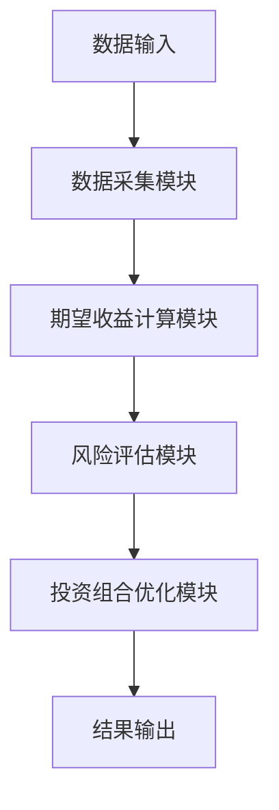
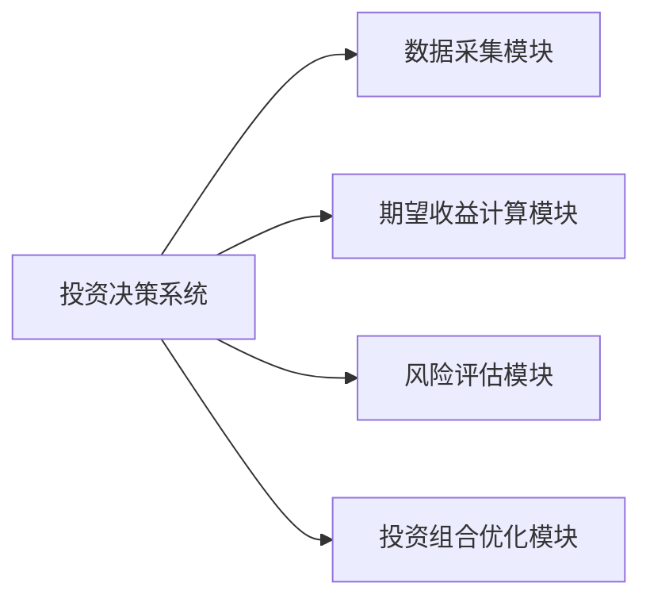

                 


# 芒格的"数学期望"思维：提高投资决策的准确性

---

## 关键词：芒格、数学期望、投资决策、概率论、决策优化

---

## 摘要：  
芒格的"数学期望"思维是一种基于概率论的投资决策方法，通过计算不同投资方案的期望收益和风险，帮助投资者做出更科学、更准确的投资决策。本文从数学期望的基本概念出发，结合芒格的投资思想，详细分析了数学期望在投资决策中的应用，包括投资组合优化、风险评估以及系统设计等内容。通过实际案例和系统架构的展示，本文为投资者提供了一种基于数学期望的决策框架，帮助他们在复杂多变的市场中提高投资决策的准确性。

---

# 第一部分: 引言

## 第1章: 芒格的"数学期望"思维概述

### 1.1 芒格的生平与思想体系

芒格（Charlie Munger）是世界著名投资家巴菲特的合伙人，他的投资思想深受概率论和数学期望的影响。芒格认为，投资决策本质上是基于概率的决策过程，而数学期望则是评估投资方案优劣的核心工具。

#### 1.1.1 芒格的生平简介

芒格于1924年出生于美国密歇根州，毕业于密歇根大学和哈佛法学院。他与巴菲特共同创立了伯克希尔哈撒韦公司，并将其打造成全球最成功的投资公司之一。芒格的投资理念以“价值投资”为核心，强调通过分析企业的基本面来评估其内在价值。

#### 1.1.2 芒格思维体系的核心理念

芒格的思想体系以“多元思维模型”为核心，强调将各个学科的基本原理融会贯通，形成一个完整的知识框架。他认为，投资决策本质上是一种概率问题，而数学期望则是评估投资方案的核心工具。

#### 1.1.3 数学期望在芒格投资决策中的重要性

芒格认为，数学期望可以帮助投资者在不确定的市场中，通过计算不同投资方案的期望收益和风险，做出更科学的投资决策。数学期望的核心在于将概率和收益结合起来，帮助投资者在复杂的市场环境中找到最优的投资策略。

---

### 1.2 数学期望的基本概念

数学期望是概率论中的一个核心概念，它表示一个随机变量在多次独立重复试验中平均值的长期趋近值。数学期望的计算公式如下：

#### 1.2.1 数学期望的定义与计算方法

对于离散型随机变量，数学期望的公式为：
$$ E[X] = \sum_{i=1}^{n} x_i p_i $$
其中，\( x_i \) 是随机变量的可能取值，\( p_i \) 是对应的概率。

对于连续型随机变量，数学期望的公式为：
$$ E[X] = \int_{-\infty}^{\infty} x f(x) dx $$
其中，\( f(x) \) 是概率密度函数。

#### 1.2.2 数学期望与决策的关系

数学期望是决策过程中的一个重要指标，它帮助投资者在多个可能的方案中选择一个期望收益最大的方案。在投资决策中，数学期望可以用来评估不同投资方案的长期平均收益。

#### 1.2.3 数学期望在投资中的应用

在投资中，数学期望可以用来评估股票、债券等金融资产的长期平均收益。例如，对于一只股票，我们可以通过计算其历史收益率的期望值来评估其长期收益潜力。

---

### 1.3 投资决策中的概率思维

芒格认为，投资决策本质上是一种概率问题，而概率思维是数学期望的核心。通过概率思维，投资者可以更好地理解市场的不确定性，并做出更科学的投资决策。

#### 1.3.1 概率思维的核心概念

概率思维的核心在于将不确定性转化为概率，通过计算概率来评估事件的可能性。在投资中，概率思维可以帮助投资者评估股票的上涨概率、市场的波动概率等。

#### 1.3.2 概率与期望值的结合

通过将概率与期望值结合，投资者可以计算出不同投资方案的期望收益和风险。例如，对于一只股票，我们可以通过计算其历史收益率的期望值和标准差来评估其风险和收益。

#### 1.3.3 期望值在投资组合中的应用

在投资组合中，数学期望可以帮助投资者计算出整个组合的期望收益和风险。通过优化投资组合的期望收益和风险，投资者可以找到一个收益与风险的最佳平衡点。

---

# 第二部分: 数学期望的理论基础

## 第2章: 数学期望的数学模型与公式

### 2.1 数学期望的公式推导

数学期望的公式推导是理解其本质的关键。对于离散型随机变量，数学期望的公式为：
$$ E[X] = \sum_{i=1}^{n} x_i p_i $$
其中，\( x_i \) 是随机变量的可能取值，\( p_i \) 是对应的概率。

对于连续型随机变量，数学期望的公式为：
$$ E[X] = \int_{-\infty}^{\infty} x f(x) dx $$
其中，\( f(x) \) 是概率密度函数。

#### 2.1.1 离散型随机变量的期望值公式

离散型随机变量的期望值公式可以通过以下步骤推导：
1. 确定随机变量的可能取值 \( x_i \) 和对应的概率 \( p_i \)。
2. 计算每个取值的乘积 \( x_i p_i \)。
3. 对所有乘积求和，得到期望值。

#### 2.1.2 连续型随机变量的期望值公式

连续型随机变量的期望值公式可以通过积分来计算：
1. 确定概率密度函数 \( f(x) \)。
2. 对 \( x \) 从负无穷到正无穷积分，乘以概率密度函数 \( f(x) \)。
3. 计算积分结果，得到期望值。

#### 2.1.3 期望值的线性性质

数学期望具有线性性质，即对于任意常数 \( a \) 和随机变量 \( X \)，有：
$$ E[aX + b] = aE[X] + b $$

---

### 2.2 期望值的性质与应用

数学期望的性质和应用是理解其在投资决策中使用的基础。

#### 2.2.1 期望值的线性性质

数学期望的线性性质意味着，对于任意常数 \( a \) 和随机变量 \( X \)，有：
$$ E[aX + b] = aE[X] + b $$

#### 2.2.2 期望值的乘法性质

当两个随机变量独立时，数学期望的乘法性质成立：
$$ E[XY] = E[X]E[Y] $$

#### 2.2.3 期望值的实际意义

数学期望的实际意义是随机变量在多次独立重复试验中的平均值的长期趋近值。在投资中，数学期望可以用来评估股票、债券等金融资产的长期平均收益。

---

### 2.3 数学期望的计算实例

通过实际案例，我们可以更好地理解数学期望的计算方法。

#### 2.3.1 掷骰子的期望值计算

假设我们掷一个公平的六面骰子，每个面的点数分别为1到6，每个面出现的概率为 \( \frac{1}{6} \)。数学期望为：
$$ E[X] = \frac{1}{6}(1 + 2 + 3 + 4 + 5 + 6) = 3.5 $$

#### 2.3.2 股票投资的期望收益计算

假设我们有三只股票，其历史收益率分别为10%、15%和20%，对应的概率分别为0.3、0.4和0.3。数学期望为：
$$ E[R] = 0.3 \times 10\% + 0.4 \times 15\% + 0.3 \times 20\% = 13\% $$

---

## 第3章: 投资组合的期望收益与风险

### 3.1 投资组合的期望收益计算

#### 3.1.1 单个资产的期望收益

对于单个资产，其期望收益可以通过以下公式计算：
$$ E[R_i] = \sum_{j=1}^{n} R_{ij} P_j $$

其中，\( R_{ij} \) 是资产 \( i \) 在第 \( j \) 种情况下的收益率，\( P_j \) 是第 \( j \) 种情况发生的概率。

#### 3.1.2 投资组合的期望收益

对于一个包含 \( n \) 个资产的投资组合，其期望收益为：
$$ E[R_p] = \sum_{i=1}^{n} w_i E[R_i] $$
其中，\( w_i \) 是资产 \( i \) 在投资组合中的权重。

---

### 3.2 风险与收益的权衡

#### 3.2.1 方差与标准差的定义

方差表示随机变量与其期望值的偏离程度，公式为：
$$ \text{Var}(X) = E[(X - E[X])^2] $$

标准差是方差的平方根，公式为：
$$ \sigma = \sqrt{\text{Var}(X)} $$

#### 3.2.2 期望收益与风险的对比分析

在投资决策中，我们需要在期望收益和风险之间找到一个最佳平衡点。通常，我们可以通过比较不同投资方案的期望收益与风险比值来选择最优方案。

---

## 第4章: 投资组合优化的数学模型

### 4.1 基于期望收益的最大化投资组合

#### 4.1.1 优化目标

最大化投资组合的期望收益：
$$ \max \sum_{i=1}^{n} w_i E[R_i] $$

#### 4.1.2 约束条件

$$ \sum_{i=1}^{n} w_i = 1 $$

### 4.2 基于风险最小化的投资组合

#### 4.2.1 优化目标

最小化投资组合的风险：
$$ \min \text{Var}(R_p) $$

---

# 第三部分: 系统分析与架构设计

## 第5章: 投资决策系统的功能设计

### 5.1 系统功能模块划分

#### 5.1.1 数据采集模块

负责收集市场数据、历史收益率等信息。

#### 5.1.2 期望收益计算模块

基于历史数据和概率模型，计算每个资产的期望收益。

#### 5.1.3 风险评估模块

计算每个资产的风险指标，如方差和标准差。

#### 5.1.4 投资组合优化模块

基于期望收益和风险指标，优化投资组合。

---

### 5.2 系统功能流程图



---

## 第6章: 系统架构设计

### 6.1 系统架构图



---

# 第四部分: 项目实战

## 第7章: 股票投资决策系统的实现

### 7.1 环境安装

#### 7.1.1 安装Python

```bash
python --version
pip install numpy pandas matplotlib
```

### 7.2 核心实现

#### 7.2.1 期望收益计算

```python
import numpy as np

# 历史收益率
returns = [0.1, 0.15, 0.2]
# 概率
probabilities = [0.3, 0.4, 0.3]
# 期望收益
expected_return = np.sum(returns * probabilities)
print(expected_return)  # 输出：0.13
```

#### 7.2.2 投资组合优化

```python
import numpy as np

# 资产的期望收益
mu = [0.1, 0.15, 0.2]
# 资产的协方差矩阵
cov_matrix = np.array([[0.02, 0.01, 0.01],
                        [0.01, 0.03, 0.02],
                        [0.01, 0.02, 0.03]])

# 优化投资组合
from scipy.optimize import minimize

def portfolio_var(weights, mu, cov_matrix):
    return weights.dot(cov_matrix).dot(weights.T)

# 约束条件
constraints = [
    ('sum_to_1', {'type': 'eq', 'fun': lambda w: np.sum(w) - 1})
]

# 优化目标
result = minimize(portfolio_var, np.array([1/3, 1/3, 1/3]), constraints=constraints, method='SLSQP')

print(result.x)  # 输出：最优权重
```

---

## 第五部分: 总结

## 第8章: 总结与最佳实践

### 8.1 总结

芒格的"数学期望"思维是一种基于概率论的投资决策方法，通过计算不同投资方案的期望收益和风险，帮助投资者做出更科学的投资决策。

### 8.2 投资决策的注意事项

1. **概率思维的重要性**：在投资决策中，概率思维是数学期望的核心。
2. **风险与收益的平衡**：在追求高收益的同时，必须注意风险的控制。
3. **数据的准确性**：数学期望的计算依赖于历史数据的准确性，因此数据的采集和处理至关重要。

### 8.3 未来展望

随着人工智能和大数据技术的发展，数学期望在投资决策中的应用将更加广泛和深入。未来的研究可以进一步结合机器学习算法，提高数学期望计算的准确性和效率。

---

## 作者：AI天才研究院/AI Genius Institute & 禅与计算机程序设计艺术 /Zen And The Art of Computer Programming

