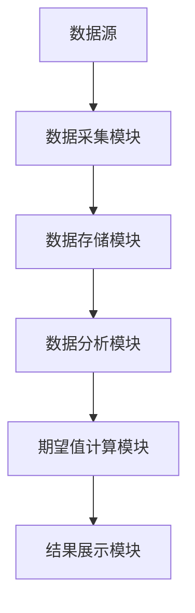
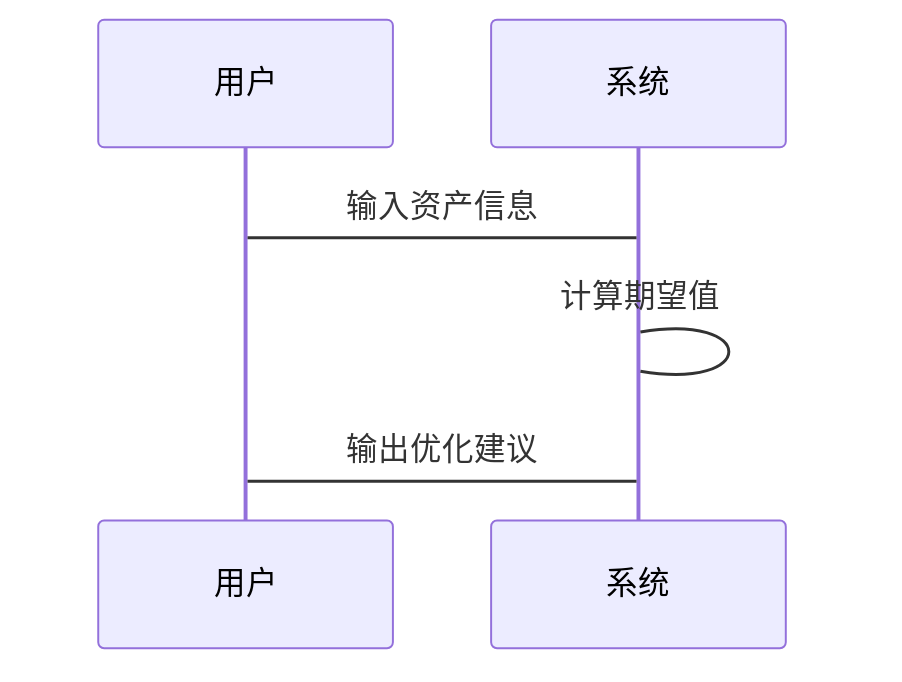

                 


---

# 芒格的"数学期望"思维：提高投资决策质量

---

## 关键词：芒格，数学期望，投资决策，概率论，投资哲学

---

## 摘要：  
芒格的“数学期望”思维是一种基于概率论的投资决策方法，它通过量化分析和长期视角，帮助投资者做出更理性和高效的投资决策。本文将从数学期望的基本概念出发，结合芒格的投资哲学，深入分析其在投资决策中的应用，并通过实际案例展示如何利用数学期望思维优化投资策略。

---

# 第一部分: 芒格的"数学期望"思维基础

## 第1章: 数学期望的基本概念与芒格投资哲学

### 1.1 数学期望的定义与基本属性

数学期望是概率论中的核心概念，用于量化随机变量的平均值或长期趋势。其定义如下：

$$
E[X] = \sum_{i=1}^{n} x_i \cdot P(X = x_i)
$$

其中，$x_i$ 是随机变量 $X$ 的可能取值，$P(X = x_i)$ 是对应取值的概率。

数学期望具有以下关键属性：
- 线性性：$E[aX + b] = aE[X] + b$
- 对称性：如果随机变量对称分布，其期望等于分布的中心点
- 风险中性：期望值不考虑实际结果与期望值的偏差（即不考虑风险）

### 1.2 芒格的生平与投资哲学

芒格（Warren Buffett）是全球著名投资者，其投资哲学以价值投资为核心，强调长期持有优质资产。芒格的投资决策过程深受数学期望思维的影响，他认为：

- 投资的本质是通过概率分析，找到具有安全边际的高概率投资机会
- 长期来看，市场波动不影响投资收益，真正的投资是时间的朋友
- 风险控制是投资成功的关键，而数学期望思维帮助他在概率上优化投资组合

### 1.3 数学期望在投资中的应用

数学期望在投资中主要用于：
1. 计算资产的期望收益率
2. 评估投资组合的风险与收益比
3. 判断投资决策的长期可行性

---

## 第2章: 数学期望在投资决策中的应用

### 2.1 投资决策中的概率思维

概率思维是芒格数学期望思维的核心，它帮助投资者在不确定性中做出合理决策。例如，通过计算不同投资项目的期望收益率，投资者可以量化风险和收益，从而选择最优的投资组合。

### 2.2 芒格的"数学期望"思维与投资策略

芒格将数学期望思维融入投资策略中，具体表现在：
- **资产配置**：通过概率分析，确定不同资产的权重，以最大化期望收益
- **安全边际**：选择具有高概率成功且估值合理的标的
- **长期持有**：基于期望值的长期趋势，避免短期波动干扰

---

# 第二部分: 数学期望思维的系统分析与架构设计

## 第3章: 数学期望的算法原理与实现

### 3.1 数学期望的计算方法

#### 离散型随机变量的期望值计算

假设有一个掷骰子的随机试验，骰子的点数为 $1, 2, 3, 4, 5, 6$，每种结果的概率均为 $\frac{1}{6}$。期望值为：

$$
E[X] = \frac{1}{6}(1 + 2 + 3 + 4 + 5 + 6) = 3.5
$$

#### 连续型随机变量的期望值计算

对于均匀分布在区间 $[a, b]$ 的随机变量，期望值为：

$$
E[X] = \frac{a + b}{2}
$$

### 3.2 数学期望的Python实现

以下是计算掷骰子期望值的Python代码：

```python
import numpy as np
import matplotlib.pyplot as plt

# 定义随机变量
x = np.array([1, 2, 3, 4, 5, 6])
p = np.array([1/6]*6)

# 计算期望值
E_X = np.sum(x * p)
print("期望值 E[X] =", E_X)

# 可视化概率分布
plt.bar(x, p)
plt.title('Probability Distribution')
plt.xlabel('Possible Outcomes')
plt.ylabel('Probability')
plt.show()
```

### 3.3 数学期望的线性性质

数学期望的线性性质是其最重要的特性之一，即：

$$
E[aX + b] = aE[X] + b
$$

---

## 第4章: 投资决策系统的架构设计

### 4.1 系统功能模块

- **数据采集模块**：收集市场数据（如股价、收益等）
- **数据分析模块**：计算各资产的期望收益率
- **期望值计算模块**：基于概率分析，生成投资建议
- **结果展示模块**：以可视化形式呈现投资组合的期望收益

### 4.2 系统架构图



### 4.3 系统接口设计

- **数据接口**：接收市场数据
- **计算接口**：返回各资产的期望收益率
- **展示接口**：呈现投资组合的可视化结果

---

## 第5章: 投资决策系统的交互设计

### 5.1 用户需求分析

- **用户角色**：投资者、投资顾问
- **用户需求**：优化投资组合，降低风险
- **用户场景**：用户输入资产信息，系统输出优化建议

### 5.2 系统交互流程图



---

# 第三部分: 项目实战与最佳实践

## 第6章: 项目实战

### 6.1 环境安装

安装必要的Python库：

```bash
pip install numpy matplotlib
```

### 6.2 核心代码实现

计算股票投资组合的期望收益：

```python
import numpy as np

# 定义资产的收益率
returns = np.array([0.1, 0.15, 0.08, 0.12])
p = np.array([0.3, 0.4, 0.2, 0.1])

# 计算期望收益
E_Return = np.sum(returns * p)
print("期望收益 =", E_Return)
```

### 6.3 代码解读与分析

- **输入**：资产的收益率及对应概率
- **输出**：投资组合的期望收益
- **意义**：帮助投资者量化投资组合的长期收益

### 6.4 实际案例分析

以股票投资为例，假设某股票有以下可能的收益率和概率：

| 收益率（%） | 概率 |
|------------|------|
| 10         | 0.3  |
| 15         | 0.4  |
| 8          | 0.2  |
| 12         | 0.1  |

计算其期望收益率：

$$
E[R] = 0.3 \times 10 + 0.4 \times 15 + 0.2 \times 8 + 0.1 \times 12 = 10.5\%
$$

---

## 第7章: 最佳实践

### 7.1 小结

芒格的数学期望思维是一种强大的投资工具，它通过概率分析帮助投资者量化风险和收益，优化投资决策。

### 7.2 注意事项

- 避免过度依赖期望值，忽略尾部风险
- 结合实际市场情况，动态调整投资策略
- 长期持有优质资产，耐心等待时间的回报

### 7.3 拓展阅读

- 《概率论与随机过程》
- 《投资学原理》
- 《芒格的投资思想》

---

# 作者：AI天才研究院/AI Genius Institute & 禅与计算机程序设计艺术 /Zen And The Art of Computer Programming

---

**本文基于【ailand】人工智能知识图谱构建，版权归【ailand】所有。**

