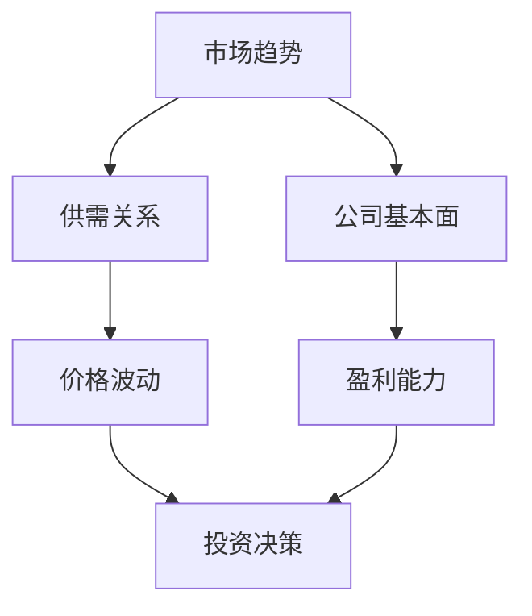
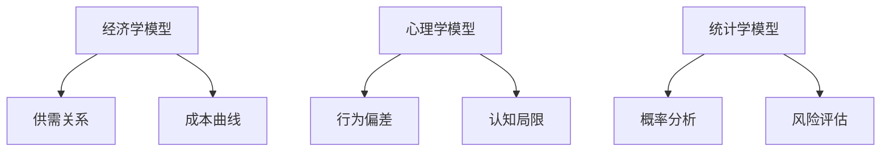
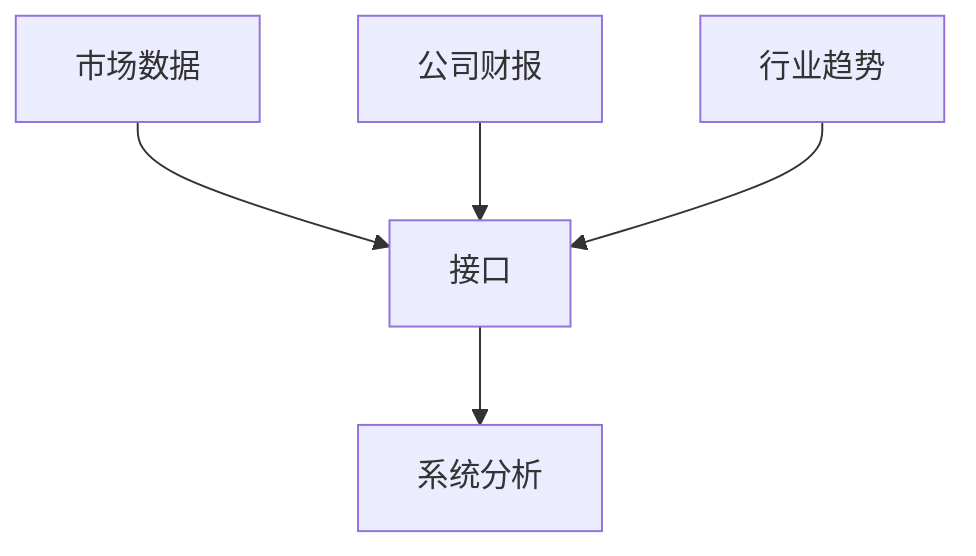
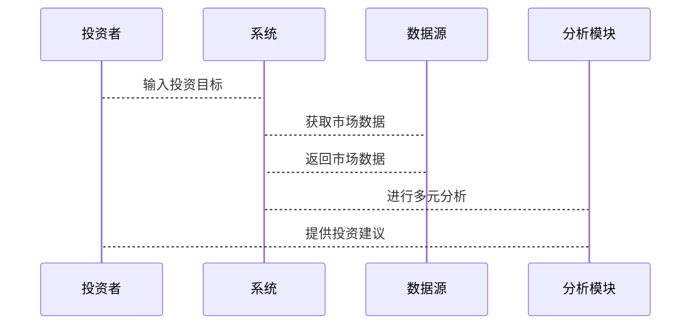

                 


# 芒格的"智力组合"理念：多元化思维在投资中的应用

## 关键词
芒格, 多元思维模型, 投资理念, 心理学, 经济学, 统计学

## 摘要
本文探讨了查理·芒格提出的“智力组合”理念，即多元化思维模型在投资中的应用。通过分析多元思维模型的核心要素、系统分析与架构设计，以及实际案例，文章展示了如何将多种思维方式整合，以做出更全面的投资决策。本文旨在为投资者提供一种新的视角，帮助他们在复杂多变的市场中做出明智决策。

---

## 第1章：芒格的背景与“智力组合”理念的提出

### 1.1 芒格的生平与投资哲学
查理·芒格是美国著名的投资者和作家，与沃伦·巴菲特共同创立了伯克希尔哈撒韦公司。他的投资哲学强调价值投资和长期思维，认为成功的投资需要对人性和市场规律有深刻的理解。

### 1.2 “智力组合”理念的定义与核心思想
芒格提出，“智力组合”理念是指将多个学科和思维方式结合起来，形成一个全面的决策框架。这种多元化的思维方式能够帮助投资者避免单一思维的局限性，从而更全面地分析问题。

### 1.3 多元思维模型的背景与重要性
传统的投资方法往往依赖于单一的分析框架，容易忽视市场的复杂性和不确定性。多元思维模型通过整合多个学科的视角，帮助投资者更全面地理解市场和公司，从而做出更明智的投资决策。

---

## 第2章：多元思维模型的核心要素

### 2.1 多元思维模型的结构
多元思维模型由多个相互关联的子模型组成，每个子模型代表一个特定的思维方式或学科视角。这些子模型共同构成了一个动态的分析框架，能够随着市场变化进行调整。

#### 2.1.1 经济学模型
经济学模型帮助投资者理解市场的供需关系和成本结构。例如，供给曲线和需求曲线的交点决定了市场的均衡价格。

#### 2.1.2 心理学模型
心理学模型帮助投资者识别和理解市场参与者的心理偏差，如过度自信和从众心理。

#### 2.1.3 统计学模型
统计学模型用于评估风险和概率。例如，通过贝叶斯定理可以更新对市场的概率预测。

### 2.2 核心模型的分析与对比
以下是几种核心模型的对比：

| 模型类型 | 核心观点 | 优缺点 |
|----------|----------|--------|
| 经济学模型 | 市场供需关系 | 能够解释市场定价，但难以预测短期波动 |
| 心理学模型 | 行为偏差 | 帮助识别市场非理性，但难以量化 |
| 统计学模型 | 风险与概率 | 提供量化工具，但依赖于数据质量 |

### 2.3 模型之间的关系与协同效应
多元思维模型的各部分之间存在协同效应。例如，经济学模型可以解释市场趋势，心理学模型可以识别市场情绪，统计学模型可以量化风险。

---

## 第3章：系统分析与架构设计方案

### 3.1 投资决策的系统分析
投资决策是一个复杂的过程，涉及多个变量和不确定性。系统分析需要考虑市场的动态变化和公司基本面的多种因素。

#### 3.1.1 系统架构设计
以下是多元思维模型的系统架构图：



### 3.2 多元化思维模型的架构设计
以下是多元思维模型的架构图：



### 3.3 系统接口设计
系统接口需要整合多个数据源，如市场数据、公司财报和行业趋势。以下是接口设计的示意图：



### 3.4 系统交互设计
以下是系统交互的序列图：



---

## 第4章：项目实战

### 4.1 环境安装
为了进行多元分析，需要安装以下工具：
- 数据分析工具：Python、Pandas、NumPy
- 图表工具：Matplotlib、Seaborn
- 计划工具：Mermaid、Git

### 4.2 核心实现源代码
以下是Python代码示例：

```python
import pandas as pd
import numpy as np
import matplotlib.pyplot as plt

# 示例数据
data = {'市场趋势': [1, 2, 3, 4, 5],
        '公司基本面': [5, 4, 3, 2, 1]}
df = pd.DataFrame(data)

# 绘制散点图
plt.scatter(df['市场趋势'], df['公司基本面'])
plt.xlabel('市场趋势')
plt.ylabel('公司基本面')
plt.title('多元思维模型示例')
plt.show()
```

### 4.3 实际案例分析
以某科技公司为例，分析其市场趋势和公司基本面。通过多元思维模型，识别其潜在风险和机会。

### 4.4 代码应用解读
上述代码生成了一个散点图，展示了市场趋势与公司基本面之间的关系。通过分析图表，可以识别出市场趋势与公司基本面之间的相关性。

---

## 第5章：总结与最佳实践

### 5.1 总结
芒格的“智力组合”理念通过整合多元思维模型，帮助投资者更全面地分析问题，做出更明智的投资决策。

### 5.2 最佳实践 tips
- 定期更新模型，适应市场变化
- 多学科交叉，拓宽思维广度
- 注重数据质量，确保分析准确

### 5.3 小结
多元思维模型是一种强大的工具，能够帮助投资者避免单一思维的局限性，做出更全面的投资决策。通过系统分析和实际案例，我们可以更好地理解和应用这种理念。

---

## 作者：AI天才研究院

---

这篇文章详细探讨了芒格的“智力组合”理念，通过系统分析和实际案例，展示了多元思维模型在投资中的应用。希望读者能够从中获得启发，提升自己的投资决策能力。

