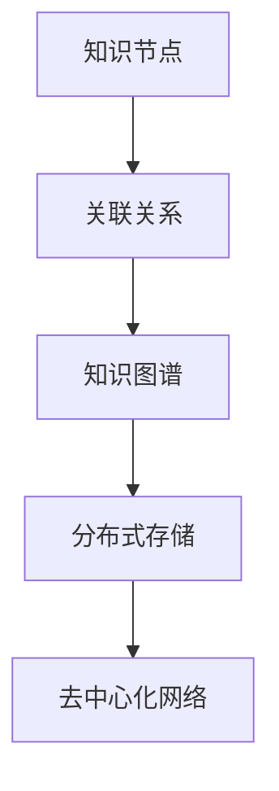

                 


# 芒格的"智者圈"理论在去中心化知识图谱中的新解读

> 关键词：芒格、智者圈、知识图谱、去中心化、分布式系统

> 摘要：本文通过分析芒格的"智者圈"理论，结合现代去中心化知识图谱的技术特点，探讨其在知识管理、分布式系统和人工智能领域的创新应用。文章从理论背景、核心概念、算法原理、系统架构、项目实战等多个维度，详细解读如何将芒格的"智者圈"理论与去中心化知识图谱相结合，为现代知识管理提供新的思路和解决方案。

---

## 第一部分: 芒格的"智者圈"理论与去中心化知识图谱的背景介绍

### 第1章: 芒格的"智者圈"理论概述

#### 1.1 芒格"智者圈"理论的核心概念

芒格的"智者圈"理论是查理·芒格在《穷查理 Malkiel Warren Buffett’s stock investing principles》中提出的一种知识管理和决策框架。其核心思想是：通过构建一个由多个知识节点组成的网络，每个节点代表一个具体的领域或概念，节点之间的关联关系则代表这些概念之间的逻辑联系。当一个人的知识网络足够广泛且深度足够时，他就能在面对问题时，快速调动相关知识节点，形成一个完整的"智者圈"，从而做出更明智的决策。

- **知识的组织与结构化**：芒格强调知识的组织和结构化，认为零散的知识难以形成有效的决策支持。
- **"智者圈"的决策框架**：通过构建多维度的知识网络，形成一个完整的决策支持系统。
- **知识网络的形成与应用**：知识网络的动态演化决定了个体或组织的决策能力。

#### 1.2 "智者圈"理论的核心要素

- **知识节点**：每个节点代表一个具体的领域或概念。
- **关联关系**：节点之间的联系，形成知识网络。
- **动态演化**：知识网络随着新知识的加入而不断扩展和优化。

---

### 第2章: 去中心化知识图谱的基本概念

#### 2.1 知识图谱的定义与特点

知识图谱是一种以图结构形式表示知识的语义网络，节点代表实体或概念，边代表它们之间的关系。与传统的数据库不同，知识图谱强调语义关联和结构化的知识表示。

- **知识图谱的定义**：通过图结构描述实体及其关系的网络。
- **知识图谱的核心属性**：
  - 结构化：节点代表实体，边代表关系。
  - 可扩展性：支持动态添加新实体和关系。
  - 语义关联：节点之间的语义联系。

#### 2.2 去中心化知识图谱的构建原理

- **分布式存储技术**：采用区块链等分布式技术，确保数据的安全性和去中心化。
- **知识节点的关联关系**：通过分布式网络中的节点进行知识关联。
- **去中心化网络的共识机制**：通过共识算法确保知识图谱的准确性和一致性。

---

## 第二部分: 芒格"智者圈"理论与去中心化知识图谱的核心概念与联系

### 第3章: 芒格"智者圈"理论与去中心化知识图谱的关系

#### 3.1 核心概念的对比分析

- **"智者圈"的知识网络与知识图谱的异同**：
  - 相同点：两者都强调知识的网络化和结构化。
  - 不同点："智者圈"更注重个体知识的动态演化，而知识图谱更注重全局知识的组织和管理。

- **"智者圈"的决策框架与知识图谱的关联**：
  - "智者圈"的决策框架依赖于知识网络的深度和广度。
  - 知识图谱通过语义关联提供全局的知识视角。

- **"智者圈"的动态演化与知识图谱的可扩展性**：
  - "智者圈"通过个体学习不断扩展和优化。
  - 知识图谱通过分布式存储实现动态扩展。

#### 3.2 核心概念属性对比表格

| 概念       | 核心属性                     |
|------------|------------------------------|
| "智者圈"    | 知识网络、决策框架、动态演化 |
| 知识图谱    | 分布式存储、关联关系、可扩展性 |

#### 3.3 ER实体关系图架构（Mermaid流程图）



---

## 第三部分: 芒格"智者圈"理论与去中心化知识图谱的算法原理

### 第4章: 算法原理讲解

#### 4.1 "智者圈"知识网络的构建算法

- **知识节点的识别与提取**：通过自然语言处理技术从文本中提取实体和概念。
- **关联关系的计算与权重赋值**：基于语义相似度计算节点之间的关系权重。
- **网络的动态演化与优化**：通过增量学习不断优化知识网络的结构。

#### 4.2 去中心化知识图谱的构建算法

- **分布式存储技术**：采用区块链等技术实现数据的去中心化存储。
- **知识节点的关联关系**：通过分布式网络中的节点进行知识关联。
- **去中心化网络的共识机制**：通过共识算法确保知识图谱的准确性和一致性。

---

## 第四部分: 芒格"智者圈"理论与去中心化知识图谱的系统分析与架构设计

### 第5章: 系统分析与架构设计方案

#### 5.1 问题场景介绍

- **知识管理**：如何通过知识图谱实现高效的知识管理和检索。
- **分布式系统**：如何在去中心化网络中实现知识图谱的动态扩展。

#### 5.2 项目介绍

- **项目目标**：构建一个基于"智者圈"理论的去中心化知识图谱。
- **项目背景**：通过分布式技术实现知识的动态管理和全局共享。

#### 5.3 系统功能设计

- **领域模型设计**：使用Mermaid类图描述系统功能模块。
- **系统架构设计**：使用Mermaid架构图展示系统的整体结构。
- **系统接口设计**：定义系统接口和交互流程。

---

## 第五部分: 芒格"智者圈"理论与去中心化知识图谱的项目实战

### 第6章: 项目实战

#### 6.1 环境安装

- **分布式存储环境**：安装区块链节点和分布式数据库。
- **开发工具**：安装Python和相关开发库。

#### 6.2 系统核心实现源代码

```python
def build_knowledge_graph():
    # 初始化知识图谱
    graph = {}
    # 添加知识节点
    nodes = ["芒格", "知识图谱", "分布式系统"]
    for node in nodes:
        graph[node] = []
    # 添加关联关系
    relations = {
        "芒格": ["知识图谱", "分布式系统"],
        "知识图谱": ["分布式系统"]
    }
    for node, related in relations.items():
        for r in related:
            graph[node].append(r)
    return graph

# 调用函数
knowledge_graph = build_knowledge_graph()
print(knowledge_graph)
```

#### 6.3 代码应用解读与分析

- **代码功能**：构建一个简单的知识图谱。
- **代码实现**：通过Python字典实现知识节点和关联关系。
- **代码扩展**：通过动态添加节点和关系，实现知识图谱的扩展。

---

## 第六部分: 最佳实践、小结与展望

### 第7章: 最佳实践

- **知识管理**：定期更新知识图谱，确保知识的准确性和时效性。
- **系统维护**：定期检查分布式网络的健康状态，确保数据的一致性。
- **安全性**：采用多重加密和权限控制，确保知识图谱的安全性。

### 7.2 小结

本文通过分析芒格的"智者圈"理论，结合现代去中心化知识图谱的技术特点，探讨了其在知识管理、分布式系统和人工智能领域的创新应用。通过理论与实践的结合，为现代知识管理提供了新的思路和解决方案。

### 7.3 注意事项

- **数据一致性**：确保知识图谱的数据一致性和准确性。
- **系统扩展性**：在系统设计中充分考虑知识图谱的动态扩展性。
- **安全性**：采用多重加密和权限控制，确保知识图谱的安全性。

---

## 结语

芒格的"智者圈"理论与去中心化知识图谱的结合，不仅为知识管理提供了新的思路，也为分布式系统和人工智能领域的发展提供了重要的理论支持和技术保障。未来，随着技术的不断进步，"智者圈"理论在去中心化知识图谱中的应用将更加广泛和深入。

---

**作者：AI天才研究院/AI Genius Institute & 禅与计算机程序设计艺术 /Zen And The Art of Computer Programming**

