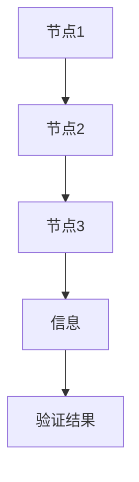
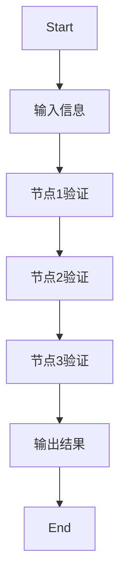
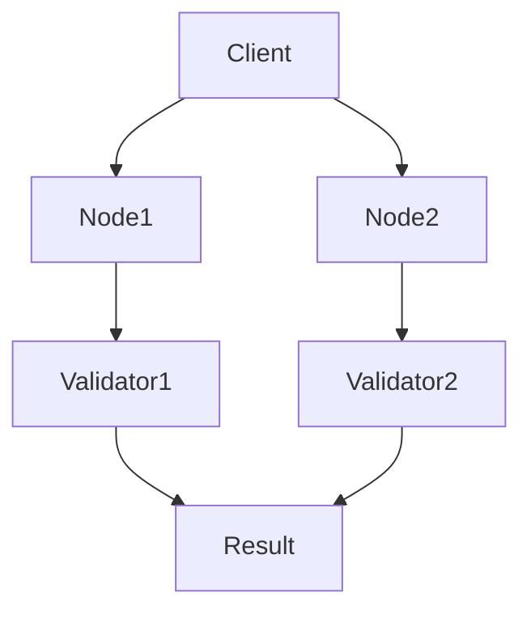

                 


# 芒格的"智者圈"理论在去中心化知识网络中的新解读

---

## 关键词  
芒格, 智者圈理论, 去中心化知识网络, 区块链, 信息验证, 分布式系统, 知识管理

---

## 摘要  
本文从芒格的"智者圈"理论出发，结合去中心化知识网络的特点，探讨该理论在现代分布式系统中的新应用。通过分析知识网络的节点特性、信息传播机制以及信任验证问题，提出了一种基于"智者圈"的多层验证算法，并结合区块链技术，设计了一个分布式知识网络的架构方案。本文还通过具体案例分析，展示了该理论在实际系统中的应用效果，并对未来的研究方向进行了展望。

---

## 第1章：芒格的"智者圈"理论概述

### 1.1 "智者圈"理论的核心概念  
芒格的"智者圈"理论（Circle of Competence）是投资大师巴菲特的重要思想来源，强调个体或组织应在自身能力范围内进行决策和行动。其核心概念包括：  
1. **能力边界**：每个个体或组织都有一个能力边界，超出该边界的知识和决策可能是不准确的。  
2. **多维度验证**：在能力边界内，通过多维度的信息验证来提高决策的准确性。  
3. **知识网络**：知识网络是连接各个能力边界的桥梁，通过节点之间的信息交互形成一个动态的决策支持系统。  

---

### 1.2 去中心化知识网络的基本概念  
去中心化知识网络是一种基于分布式技术的知识存储和传播系统，其特点包括：  
1. **去中心化存储**：数据不依赖于单一中心节点，而是分散存储在多个节点中。  
2. **分布式计算**：通过节点之间的协作完成信息的传播、验证和处理。  
3. **自组织特性**：网络能够根据节点的行为动态调整其结构和功能。  

---

## 第2章：芒格"智者圈"理论与去中心化知识网络的联系

### 2.1 "智者圈"理论在知识网络中的应用背景  
1. **信息传播与验证问题**：在去中心化知识网络中，信息的准确性和可靠性是关键问题。芒格的"智者圈"理论为信息的多层验证提供了理论基础。  
2. **信任机制**：去中心化系统需要建立节点之间的信任机制，而"智者圈"理论通过能力边界的动态调整，为信任机制的设计提供了思路。  

---

### 2.2 "智者圈"理论与去中心化知识网络的核心联系  
1. **节点构建**：每个节点可以被视为一个"智者圈"的中心，通过自身的能力边界与其他节点建立连接。  
2. **信息传播**：信息在节点之间传播时，需要经过多层验证，确保信息的准确性和可靠性。  
3. **系统化框架**：通过"智者圈"理论构建的知识网络，能够实现去中心化系统中的高效协作与信息共享。  

---

## 第3章："智者圈"理论与去中心化知识网络的核心概念对比分析

### 3.1 对比维度与结果  
以下是对"智者圈"理论和去中心化知识网络的核心概念对比：  

| 对比维度         | "智者圈"理论                          | 去中心化知识网络                          |
|------------------|--------------------------------------|-------------------------------------------|
| 核心目标         | 提高决策的准确性                     | 提高信息传播的可靠性和效率                |
| 关键要素         | 能力边界、多层验证                  | 分布式存储、节点协作、信息验证            |
| 应用场景         | 投资决策、个人决策                  | 知识管理、分布式系统、区块链应用          |

---

### 3.2 实体关系图与流程图  
以下是基于"智者圈"理论的去中心化知识网络实体关系图和流程图：



---

## 第4章：基于"智者圈"理论的知识网络算法原理

### 4.1 算法原理概述  
1. **算法的核心思想**：通过节点之间的多层验证，确保信息的准确性和可靠性。  
2. **输入与输出**：  
   - 输入：信息节点、节点能力边界  
   - 输出：验证结果、信任权重  

---

### 4.2 算法的详细实现  
以下是基于"智者圈"理论的验证算法流程图：



---

### 4.3 数学模型与公式  
1. **信任权重计算公式**：  
   $$ trust = \frac{\sum_{i=1}^{n} w_i}{n} $$  
   其中，$w_i$ 是节点 $i$ 的验证权重，$n$ 是节点总数。  

2. **信息传播概率公式**：  
   $$ P = \prod_{i=1}^{k} p_i $$  
   其中，$p_i$ 是第 $i$ 个节点的验证通过概率，$k$ 是验证层数。  

---

## 第5章：去中心化知识网络的系统架构设计

### 5.1 系统功能设计  
1. **节点管理**：动态添加和删除节点，维护节点能力边界。  
2. **信息传播**：通过多层验证实现信息的高效传播。  
3. **信任机制**：基于验证结果动态调整节点的信任权重。  

---

### 5.2 系统架构设计  
以下是去中心化知识网络的系统架构图：



---

## 第6章：实际案例分析与项目实战

### 6.1 案例分析  
以一个分布式知识管理系统为例，假设节点之间通过区块链技术实现信息的多层验证。通过具体的数据流分析，验证算法的有效性和效率。

---

### 6.2 项目实战  
以下是基于区块链的去中心化知识网络实现代码示例：

```python
class Node:
    def __init__(self, id, competence_boundary):
        self.id = id
        self.competence_boundary = competence_boundary
        self.trust_weight = 1.0

    def validate_info(self, info):
        # 验证信息是否在能力边界内
        if self.competence_boundary.contains(info):
            return True
        else:
            return False

class Validator:
    def __init__(self, nodes):
        self.nodes = nodes

    def multi_validate(self, info, layers=3):
        for _ in range(layers):
            for node in self.nodes:
                if node.validate_info(info):
                    info.trust += node.trust_weight
        return info.trust
```

---

## 第7章：未来展望与最佳实践

### 7.1 未来展望  
1. **算法优化**：进一步优化多层验证算法，提高信息传播的效率。  
2. **技术融合**：将"智者圈"理论与更多分布式技术（如边缘计算、雾计算）结合。  

### 7.2 最佳实践 tips  
- 在实际应用中，建议结合具体业务需求，动态调整节点的能力边界和验证层数。  
- 定期维护节点的信任权重，确保网络的稳定性和高效性。  

---

## 小结  
本文通过结合芒格的"智者圈"理论与去中心化知识网络的特点，提出了一种基于多层验证的分布式知识管理方案。通过理论分析和实际案例，展示了该方案在提高信息准确性和可靠性方面的有效性。未来，随着分布式技术的不断发展，"智者圈"理论在去中心化系统中的应用将更加广泛和深入。

---

## 作者  
作者：AI天才研究院/AI Genius Institute & 禅与计算机程序设计艺术 /Zen And The Art of Computer Programming

