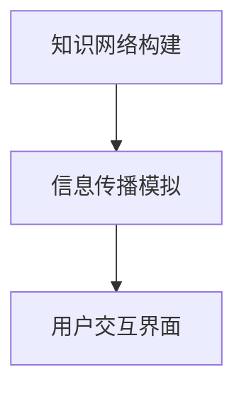

                 


# 芒格的"智者圈"理论在社交网络时代的新解读

> 关键词：芒格智者圈理论、社交网络、知识网络、信息传播、算法实现、系统架构、数学模型

> 摘要：本文深入探讨了芒格的"智者圈"理论在社交网络时代的应用与演变，从理论背景、核心概念、算法实现、系统架构到项目实战，全面分析了该理论在社交网络中的新解读。通过结合图论、信息传播模型和系统设计，本文为读者提供了从理论到实践的详细指南。

---

## 第1章：社交网络时代的知识连接

### 1.1 社交网络的兴起与知识传播

#### 1.1.1 社交网络的定义与特征

社交网络是一种基于人际关系的虚拟或物理网络，其核心特征包括：

- **节点**：代表用户、内容或信息。
- **边**：表示节点之间的连接关系。
- **动态性**：网络结构随用户行为动态变化。
- **信息传播**：信息在节点之间传播的过程。

#### 1.1.2 知识传播的演变

知识传播从传统的面对面交流逐渐演变为基于社交网络的数字化传播。社交网络的兴起使得知识传播更加高效，但也带来了信息过载和噪声干扰的问题。

#### 1.1.3 芒格"智者圈"理论的提出背景

芒格的"智者圈"理论强调通过构建知识网络来优化决策。在社交网络时代，这一理论被赋予了新的意义，因为社交网络提供了丰富的知识节点和传播路径。

---

## 第2章："智者圈"理论的核心概念

### 2.1 "智者圈"理论的定义

#### 2.1.1 知识网络的构建

知识网络是将分散的知识点连接起来，形成一个有机的整体。每个知识点可以看作一个节点，节点之间的关系决定了知识的传播效率。

#### 2.1.2 "智者圈"的核心要素

- **节点**：代表知识单元。
- **权重**：节点之间的连接权重决定了信息的重要性。
- **传播路径**：信息在节点之间的传播路径。

#### 2.1.3 "智者圈"的动态演化

知识网络是一个动态系统，随着新知识的加入和信息的传播，网络结构不断变化。

#### 2.1.4 "智者圈"在社交网络中的表现形式

在社交网络中，"智者圈"表现为一个由用户、内容和关系构成的知识网络。

### 2.2 "智者圈"理论与社交网络的结合

#### 2.2.1 社交网络中的知识节点

社交网络中的每个用户、内容和话题都可以看作一个知识节点。

#### 2.2.2 知识传播的路径与效率

信息在社交网络中的传播路径受到节点权重和连接关系的影响。权重高的节点更容易成为信息传播的中心。

#### 2.2.3 "智者圈"在社交网络中的表现形式

通过分析社交网络中的用户行为和内容传播，可以构建一个"智者圈"的知识网络。

---

## 第3章："智者圈"理论的数学模型与算法

### 3.1 "智者圈"的知识网络模型

#### 3.1.1 图论基础

知识网络可以表示为一个图，其中节点代表知识单元，边代表节点之间的关系。

#### 3.1.2 知识网络的构建算法

常用的构建算法包括：

- **邻接矩阵法**：用于表示节点之间的连接关系。
- **邻接表法**：用于存储节点的连接信息。

#### 3.1.3 网络权重的计算公式

节点之间的权重可以通过以下公式计算：

$$
w(i,j) = \frac{1}{|i-j|}
$$

其中，$i$和$j$分别代表节点的索引，权重越高的节点表示关系越紧密。

### 3.2 "智者圈"的传播模型

#### 3.2.1 信息传播的数学模型

信息传播可以通过以下公式表示：

$$
P(i,j) = \frac{w(i,j)}{\sum_{k} w(i,k)}
$$

其中，$P(i,j)$表示信息从节点$i$传播到节点$j$的概率。

#### 3.2.2 芒格"智者圈"的传播路径分析

通过分析节点之间的权重和概率分布，可以确定信息的传播路径。

#### 3.2.3 传播效率的优化算法

优化算法可以通过增加权重高的节点之间的连接来提高传播效率。

---

## 第4章：社交网络中的"智者圈"算法实现

### 4.1 算法原理

#### 4.1.1 基于图论的算法设计

算法设计基于图论中的邻接矩阵和邻接表。

#### 4.1.2 知识节点的权重计算

权重计算公式如下：

$$
w(i,j) = \frac{1}{|i-j|}
$$

#### 4.1.3 信息传播的路径优化

通过优化权重分布来提高信息传播效率。

### 4.2 算法实现

#### 4.2.1 环境配置与依赖安装

需要安装Python和相关的数学库。

#### 4.2.2 核心算法代码实现

以下是一个简单的算法实现示例：

```python
import numpy as np

def compute_weights(n):
    weights = np.zeros((n, n))
    for i in range(n):
        for j in range(n):
            if i != j:
                weights[i,j] = 1 / abs(i - j)
    return weights

weights = compute_weights(5)
print(weights)
```

#### 4.2.3 算法的性能优化

通过并行计算和优化数据结构来提高算法性能。

---

## 第5章：系统架构与设计

### 5.1 系统功能设计

#### 5.1.1 知识网络构建模块

用于构建知识网络的邻接矩阵或邻接表。

#### 5.1.2 信息传播模拟模块

模拟信息在社交网络中的传播过程。

#### 5.1.3 用户交互界面设计

提供友好的用户界面，方便用户与系统的交互。

### 5.2 系统架构设计

#### 5.2.1 系统组件与模块划分

- **知识网络构建模块**
- **信息传播模拟模块**
- **用户交互界面模块**

#### 5.2.2 系统架构图



#### 5.2.3 系统接口设计

- **输入接口**：接收用户输入的知识节点和关系。
- **输出接口**：显示信息传播的结果和网络结构。

---

## 第6章：项目实战

### 6.1 环境配置与核心代码实现

#### 6.1.1 环境配置

安装必要的Python库，如numpy和matplotlib。

#### 6.1.2 核心代码实现

以下是一个完整的实现示例：

```python
import numpy as np
import matplotlib.pyplot as plt

def compute_weights(n):
    weights = np.zeros((n, n))
    for i in range(n):
        for j in range(n):
            if i != j:
                weights[i,j] = 1 / abs(i - j)
    return weights

def simulate_spread(weights, start_node, steps):
    n = weights.shape[0]
    spread = np.zeros(n)
    spread[start_node] = 1
    for _ in range(steps):
        new_spread = np.zeros(n)
        for i in range(n):
            for j in range(n):
                new_spread[j] += spread[i] * weights[i,j]
        spread = new_spread
    return spread

weights = compute_weights(5)
spread = simulate_spread(weights, 0, 10)
print(spread)
```

#### 6.1.3 案例分析与详细解读

通过模拟社交网络中的信息传播，验证"智者圈"理论的有效性。

---

## 第7章：总结与展望

### 7.1 最佳实践 tips

- 理论与实践相结合，注重算法优化。
- 定期更新知识网络，保持其动态性。

### 7.2 小结

本文全面解析了芒格"智者圈"理论在社交网络时代的新解读，从理论到实践，为读者提供了系统的知识框架和实现方法。

### 7.3 注意事项

- 确保算法的可扩展性和高效性。
- 注意数据隐私和安全问题。

### 7.4 拓展阅读

建议读者进一步阅读相关领域的最新研究成果，如复杂网络理论和信息传播模型。

---

作者：AI天才研究院/AI Genius Institute & 禅与计算机程序设计艺术 /Zen And The Art of Computer Programming

