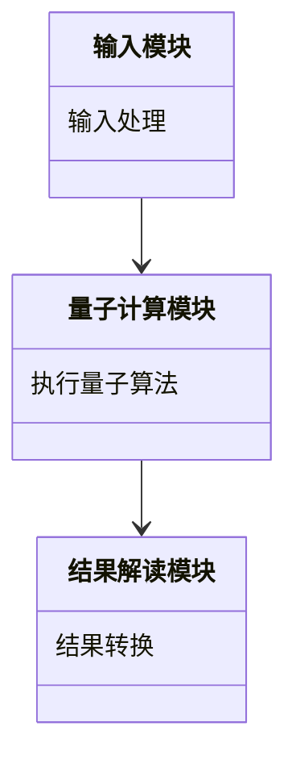

                 


# 芒格的"智者圈"理论在量子专家系统构建中的新解读

## 关键词：芒格"智者圈"理论，量子专家系统，量子计算，人工智能，系统架构

## 摘要：  
芒格的"智者圈"理论作为一种心理学与决策科学的交叉理论，为我们理解人类认知偏差和决策过程提供了深刻的洞见。而量子专家系统则代表了人工智能领域的前沿技术，结合量子计算的超强算力与专家系统的领域知识，为复杂问题的解决提供了新的可能性。本文将从"智者圈"理论的核心概念出发，结合量子计算的基本原理，探讨如何将这一理论应用于量子专家系统的构建中。通过分析两者的结合点，本文将揭示一种全新的系统设计思路，为量子人工智能的发展提供理论与实践的双重支持。

---

## 第一部分：芒格的"智者圈"理论与量子计算基础

### 第1章：芒格的"智者圈"理论概述

#### 1.1 "智者圈"理论的核心概念

##### 1.1.1 心理学基础
芒格的"智者圈"理论源自于心理学中的认知偏差研究，强调人类在决策过程中往往受到自身知识边界和心理偏见的影响。"智者圈"理论认为，人类的认知能力是有限的，我们只能在自己的知识领域内做出合理的决策，而超出这个领域的决策往往会受到偏差的影响。

##### 1.1.2 "智者圈"理论的定义与特点
"智者圈"理论的核心观点是：  
1. **知识边界**：人类的认知能力受限于自身的知识储备和经验。  
2. **心理偏差**：在决策过程中，人们往往会受到各种心理偏差的影响，如确认偏差、从众偏差等。  
3. **决策优化**：通过识别和纠正这些偏差，可以提升决策的科学性和合理性。

##### 1.1.3 理论在决策中的应用
"智者圈"理论广泛应用于投资决策、企业管理等领域。例如，在投资决策中，芒格强调要避免"能力圈"之外的投资，以降低决策风险。

---

#### 1.2 量子计算基础

##### 1.2.1 量子计算的基本原理
量子计算利用量子叠加和量子纠缠的特性，能够在某些问题上远超经典计算机的计算能力。例如，量子计算机可以通过并行计算大幅缩短某些复杂问题的求解时间。

##### 1.2.2 量子计算与经典计算的区别
- **量子叠加**：量子计算机可以在同一时间处理多个状态，而经典计算机需要逐一处理。  
- **量子纠缠**：量子比特之间的关联性可以用于构建高效的计算模型。  
- **量子测量**：量子状态的测量会破坏量子系统的叠加态，这是量子计算与经典计算的主要区别之一。

##### 1.2.3 量子计算在AI中的潜力
量子计算在AI中的应用潜力主要体现在优化问题、复杂模式识别和大数据处理等方面。例如，量子算法可以用于图像识别、自然语言处理等任务。

---

### 第2章："智者圈"理论与量子计算的结合

#### 2.1 理论与技术的交叉点

##### 2.1.1 "智者圈"理论在量子计算中的应用潜力
"智者圈"理论可以帮助我们理解量子计算在AI中的应用边界和局限性。例如，量子计算在某些领域的优势可能超出了我们的"能力圈"，需要通过理论指导来规避潜在的风险。

##### 2.1.2 量子计算如何增强"智者圈"理论的分析能力
量子计算的并行性和高效性可以为"智者圈"理论提供新的分析工具。例如，量子算法可以用于优化决策过程中的复杂计算，从而提高决策的科学性。

##### 2.1.3 理论在量子计算中的指导作用
"智者圈"理论可以帮助我们认识到量子计算的应用范围和限制，从而避免在量子计算的研究和应用中出现认知偏差。

---

#### 2.2 "智者圈"理论在量子专家系统中的角色

##### 2.2.1 理论在系统构建中的指导作用
"智者圈"理论可以帮助我们识别量子专家系统在设计和实现中的关键问题，例如知识边界和算法优化。

##### 2.2.2 理论与量子计算的协同效应
通过结合"智者圈"理论和量子计算，我们可以构建一种更加高效和可靠的量子专家系统，从而提升AI的决策能力。

##### 2.2.3 理论在系统优化中的具体应用
例如，"智者圈"理论可以帮助我们优化量子专家系统的算法设计，避免因认知偏差而导致的错误决策。

---

## 第二部分：量子专家系统的算法与数学模型

### 第3章：量子算法的核心原理

#### 3.1 量子算法的基本原理

##### 3.1.1 量子叠加原理
量子叠加原理表明，量子系统可以同时处于多个状态的叠加态。这为量子算法提供了并行计算的能力。

##### 3.1.2 量子纠缠原理
量子纠缠是指两个或多个量子比特之间的关联性，这种关联性可以用于构建高效的量子算法。

##### 3.1.3 量子测量原理
量子测量会破坏量子系统的叠加态，这是量子计算区别于经典计算的核心特征。

---

#### 3.2 量子专家系统的算法框架

##### 3.2.1 算法的基本流程
1. **输入处理**：将问题转化为量子计算的输入形式。  
2. **量子计算**：利用量子算法进行计算。  
3. **结果解读**：将量子计算结果转化为可理解的形式。  

##### 3.2.2 算法的数学模型
量子算法的核心是利用量子叠加和量子纠缠的特性，构建高效的计算模型。例如，量子傅里叶变换是一种常见的量子算法，用于解决某些复杂问题。

##### 3.2.3 算法的复杂度分析
量子算法的时间复杂度通常远低于经典算法，尤其是在处理某些特定问题时。

---

### 第4章：数学模型与公式

#### 4.1 量子算法的数学模型

##### 4.1.1 量子态的表示
量子态可以用复数向量表示，例如：
$$
|\psi\rangle = a|0\rangle + b|1\rangle
$$
其中，$a$ 和 $b$ 是满足 $|a|^2 + |b|^2 = 1$ 的复数。

##### 4.1.2 量子门的矩阵表示
量子门可以用矩阵表示，例如，Pauli-X门的矩阵为：
$$
X = \begin{pmatrix} 0 & 1 \\ 1 & 0 \end{pmatrix}
$$

##### 4.1.3 量子电路的数学描述
量子电路可以用一系列量子门的组合来描述，例如：

$$
CNOT门的量子电路表示为：
$$
CNOT = \begin{pmatrix} 1 & 0 & 0 & 0 \\ 0 & 1 & 0 & 0 \\ 0 & 0 & 0 & 1 \\ 0 & 0 & 1 & 0 \end{pmatrix}
$$

---

## 第三部分：量子专家系统的系统设计与实现

### 第5章：系统分析与架构设计

#### 5.1 系统功能设计

##### 5.1.1 系统的功能模块划分
1. **输入模块**：接收问题输入。  
2. **量子计算模块**：执行量子算法。  
3. **结果解读模块**：将量子计算结果转化为可理解的形式。  

##### 5.1.2 模块之间的关系
模块之间的关系可以用类图表示，如下：



##### 5.1.3 系统的输入输出设计
输入包括问题描述和相关参数，输出包括量子计算结果和结果解读。

---

#### 5.2 系统架构设计

##### 5.2.1 分层架构设计
系统可以分为输入层、量子计算层和输出层。

##### 5.2.2 模块化设计
系统由多个模块组成，每个模块负责特定的功能。

##### 5.2.3 系统的可扩展性设计
系统设计应具有可扩展性，以便未来增加新的功能模块。

---

### 第6章：系统接口与交互设计

#### 6.1 系统接口设计

##### 6.1.1 系统内部接口
模块之间的接口设计需要明确，例如输入模块与量子计算模块之间的接口。

##### 6.1.2 系统外部接口
系统与外部环境之间的接口设计，例如用户输入接口。

##### 6.1.3 接口的标准化设计
接口设计应遵循标准化，以便不同模块之间的通信。

---

#### 6.2 系统交互设计

##### 6.2.1 用户与系统的交互流程
用户输入问题，系统执行量子算法，输出结果。

##### 6.2.2 交互的可视化设计
系统可以通过图形界面展示量子计算的过程和结果。

##### 6.2.3 交互的优化与改进
根据用户反馈，不断优化系统交互设计。

---

## 第四部分：项目实战与案例分析

### 第7章：项目实战

#### 7.1 环境安装与配置

##### 7.1.1 量子计算开发环境
安装必要的量子计算开发工具，例如Qiskit。

#### 7.2 系统核心实现源代码

##### 7.2.1 量子算法实现
以下是一个简单的量子算法实现示例：

```python
from qiskit import QuantumCircuit, execute, Aer
from qiskit.circuit import X, Measure

qc = QuantumCircuit(2, 2)
qc.h(0)
qc.cnot(0, 1)
qc.measure(0, 0)
qc.measure(1, 1)

backend = Aer.get_backend('qasm_simulator')
job = execute(qc, backend)
result = job.result()
print(result.get_counts())
```

##### 7.2.2 结果解读
量子计算结果可以通过统计概率进行解读。

---

### 第8章：案例分析

#### 8.1 实际案例分析

##### 8.1.1 案例背景
例如，利用量子专家系统进行投资决策优化。

##### 8.1.2 系统应用
通过量子算法优化投资组合，降低风险。

##### 8.1.3 分析结果
量子算法可以帮助我们更科学地做出投资决策。

---

## 结语

芒格的"智者圈"理论为我们理解人类认知偏差和决策过程提供了深刻的洞见。而量子计算作为一种新兴技术，为AI的发展提供了新的可能性。通过将"智者圈"理论与量子计算相结合，我们可以构建一种更加高效和可靠的量子专家系统，从而提升AI的决策能力。

---

## 作者：AI天才研究院/AI Genius Institute & 禅与计算机程序设计艺术 /Zen And The Art of Computer Programming

