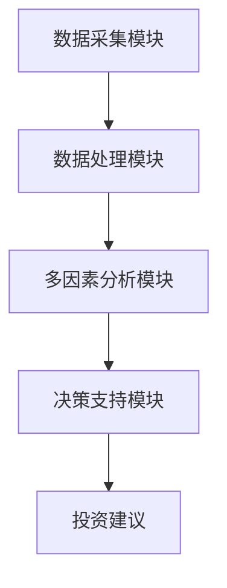

                 


# 《芒格的"智者圈"理论：如何构建你的投资智囊团》

---

## 关键词：
-芒格、智者圈、投资决策、决策支持系统、多因素分析、投资团队、系统架构

---

## 摘要：
芒格的"智者圈"理论是一种基于心理学和投资决策科学的理论，旨在通过构建一个多维度的“智者圈”来优化投资决策过程。本文将从理论背景、核心概念、算法原理、系统架构、项目实战等多个维度深入剖析“智者圈”理论，并结合实际案例，展示如何通过系统化的方法构建高效的投资智囊团。文章还详细探讨了“智者圈”理论在投资决策中的应用，包括多因素分析模型、决策支持算法、系统架构设计等，并给出了最佳实践建议。

---

## 第一部分：芒格"智者圈"理论的背景与核心概念

### 第1章：芒格"智者圈"理论概述

#### 1.1 芒格"智者圈"理论的起源与背景
- **芒格的生平与投资哲学**：查理·芒格是沃伦·巴菲特的长期合作伙伴，他的投资哲学强调理性思维、多因素分析和长期价值。芒格的“智者圈”理论正是基于这种哲学，提出了一种通过多维度分析和团队协作来优化投资决策的方法。
- **"智者圈"理论的核心思想**：芒格认为，投资决策是一个复杂的过程，需要综合考虑多个因素，包括市场趋势、财务数据、行业动态、团队智慧等。通过构建一个“智者圈”，投资者可以更好地捕捉市场机会，降低决策风险。
- **理论在投资领域的应用背景**：随着金融市场的复杂化和竞争的加剧，单纯依靠个人决策的投资方式已经难以应对复杂的市场环境。芒格的“智者圈”理论为投资者提供了一种系统化的方法，帮助他们在复杂的市场环境中做出更明智的投资决策。

#### 1.2 投资决策中的"智者圈"理论
- **投资决策的基本问题与挑战**：投资决策涉及多个变量，包括市场波动、公司基本面、行业趋势、宏观经济环境等。单一的决策方式往往难以全面考虑这些因素，容易导致决策失误。
- **"智者圈"理论如何解决投资问题**：通过构建一个多维度的“智者圈”，投资者可以整合团队的智慧和资源，全面分析市场信息，从而做出更准确的投资决策。
- **理论的边界与外延**：芒格的“智者圈”理论主要应用于投资决策领域，但其方法论也可以扩展到其他需要多维度分析的领域，如企业战略、风险管理等。

#### 1.3 "智者圈"理论的核心要素与结构
- **核心要素的定义与特征**：芒格的“智者圈”理论主要包括以下几个核心要素：多因素分析、团队协作、系统化决策、风险管理。
- **"智者圈"的结构与层次分析**：从结构上看，“智者圈”可以分为三个层次：信息层、分析层和决策层。信息层负责收集和整合市场信息；分析层负责对信息进行多维度分析；决策层负责基于分析结果做出最终决策。
- **理论的数学模型与公式**：芒格的“智者圈”理论可以表示为一个多因素加权模型，其数学表达式如下：

$$
\text{投资决策} = \sum_{i=1}^{n} w_i \cdot f_i
$$

其中，$w_i$ 是第 $i$ 个因素的权重，$f_i$ 是第 $i$ 个因素的分析结果。

---

### 第2章："智者圈"理论的核心原理

#### 2.1 "智者圈"的决策支持模型
- **决策支持模型的原理**：芒格的“智者圈”理论通过整合多个因素的分析结果，为投资决策提供支持。其核心原理是通过多因素分析模型，将各个因素的影响程度进行量化，并根据权重进行加权平均，最终得出投资决策。
- **模型的输入与输出**：输入包括市场数据、财务数据、行业趋势等；输出包括投资建议、风险评估、收益预测等。
- **模型的数学表达式**：多因素分析模型可以表示为：

$$
\text{投资建议} = \sum_{i=1}^{n} w_i \cdot f_i
$$

其中，$w_i$ 是第 $i$ 个因素的权重，$f_i$ 是第 $i$ 个因素的分析结果。

#### 2.2 "智者圈"的多因素分析方法
- **多因素分析的定义**：多因素分析是指在投资决策中，综合考虑多个因素的影响，以确保决策的全面性和准确性。
- **各因素的权重分配**：在“智者圈”理论中，每个因素的权重需要根据其对投资决策的影响程度进行分配。权重的分配可以基于历史数据、专家意见或数学模型。
- **因素之间的相互作用**：因素之间的相互作用是多因素分析的重要组成部分。例如，宏观经济环境可能影响行业趋势，而行业趋势又可能影响公司的财务表现。

#### 2.3 "智者圈"的数学模型与公式
- **多因素分析模型**：如前所述，多因素分析模型可以表示为：

$$
\text{投资建议} = \sum_{i=1}^{n} w_i \cdot f_i
$$

其中，$w_i$ 是第 $i$ 个因素的权重，$f_i$ 是第 $i$ 个因素的分析结果。
- **权重分配的数学方法**：权重分配可以通过多种方法实现，例如基于历史数据的回归分析、基于专家意见的权重分配等。以下是一个简单的权重分配公式：

$$
w_i = \frac{\sum_{j=1}^{m} r_j \cdot f_{ij}}{\sum_{j=1}^{m} r_j}
$$

其中，$r_j$ 是第 $j$ 个专家的权重，$f_{ij}$ 是第 $i$ 个因素在第 $j$ 个专家意见中的得分。

---

## 第二部分：芒格"智者圈"理论的系统分析与架构设计

### 第3章：投资决策支持系统的架构设计

#### 3.1 问题场景介绍
- **投资决策支持系统的定义**：投资决策支持系统（IDSS）是一种利用信息技术辅助投资者进行决策的系统。芒格的“智者圈”理论可以通过投资决策支持系统来实现。
- **系统的目标与功能**：系统的目标是通过整合多因素分析结果，为投资者提供科学的投资决策支持。系统的主要功能包括数据采集、分析、决策支持等。
- **系统架构的总体思路**：系统架构设计包括数据层、分析层和决策层三个部分。数据层负责数据的采集和存储；分析层负责对数据进行多因素分析；决策层负责基于分析结果生成投资建议。

#### 3.2 系统功能设计
- **数据采集与处理**：系统需要采集市场数据、财务数据、行业趋势等多方面数据，并进行清洗和预处理。
- **多因素分析模块**：系统需要实现多因素分析功能，包括权重分配、因素得分计算等。
- **决策支持模块**：系统需要根据多因素分析结果生成投资建议，并提供风险评估和收益预测。

#### 3.3 系统架构设计
- **系统架构的分层设计**：系统架构分为数据层、分析层和决策层。数据层负责数据的采集和存储；分析层负责对数据进行多因素分析；决策层负责基于分析结果生成投资建议。
- **系统架构的模块划分**：系统架构包括数据采集模块、数据处理模块、多因素分析模块、决策支持模块等。
- **系统架构的mermaid图**：



#### 3.4 系统接口设计
- **接口设计的总体思路**：系统接口设计需要考虑模块之间的数据传递和功能调用。例如，数据采集模块需要将数据传递给数据处理模块，数据处理模块需要将处理后的数据传递给多因素分析模块，多因素分析模块需要将分析结果传递给决策支持模块。
- **接口的具体实现**：接口的具体实现可以采用API的方式。例如，数据处理模块可以通过API将处理后的数据传递给多因素分析模块。

#### 3.5 系统交互设计
- **系统交互的总体思路**：系统交互设计需要考虑用户与系统的互动。例如，用户可以通过界面对系统进行操作，系统根据用户输入生成投资建议。
- **系统交互的mermaid图**：

```mermaid
sequenceDiagram
    participant 用户
    participant 界面模块
    participant 多因素分析模块
    participant 决策支持模块
    用户 -> 界面模块：输入投资需求
    界面模块 -> 多因素分析模块：请求多因素分析
    多因素分析模块 --> 决策支持模块：传递分析结果
    决策支持模块 --> 界面模块：返回投资建议
    界面模块 -> 用户：显示投资建议
```

---

## 第三部分：芒格"智者圈"理论的项目实战

### 第4章：从零开始构建投资智囊团

#### 4.1 项目环境安装
- **项目环境的总体思路**：构建投资智囊团需要安装必要的软件和工具。例如，需要安装Python编程语言、数据分析工具、数据库管理工具等。
- **具体环境配置**：以下是具体的环境配置示例：

```bash
# 安装Python
sudo apt-get install python3 python3-pip

# 安装数据分析库
pip install numpy pandas matplotlib scikit-learn

# 安装数据库
sudo apt-get install postgresql postgresql-client
```

#### 4.2 系统核心代码实现
- **多因素分析模块的实现**：以下是一个多因素分析模块的Python代码示例：

```python
import numpy as np
import pandas as pd

# 定义多因素分析函数
def multifactor_analysis(factors, weights):
    factor_scores = [factors[i] * weights[i] for i in range(len(factors))]
    return sum(factor_scores)

# 示例数据
factors = [85, 90, 75]
weights = [0.3, 0.5, 0.2]

# 计算投资建议
investment_recommendation = multifactor_analysis(factors, weights)
print(f"投资建议：{investment_recommendation}")
```

- **决策支持模块的实现**：以下是一个决策支持模块的Python代码示例：

```python
import numpy as np
import pandas as pd

# 定义决策支持函数
def decision_support(recommendation):
    if recommendation >= 90:
        return "强烈推荐"
    elif recommendation >= 70:
        return "推荐"
    else:
        return "不推荐"

# 示例数据
recommendation = 85

# 生成投资建议
investment_advice = decision_support(recommendation)
print(f"投资建议：{investment_advice}")
```

#### 4.3 项目实战案例分析
- **案例分析的总体思路**：以下是一个具体的案例分析示例：
  - 案例背景：某投资者希望投资于科技行业，但面临市场波动较大的风险。
  - 数据收集：收集科技行业的市场数据、财务数据、行业趋势等。
  - 分析与决策：通过多因素分析模型，综合考虑市场趋势、公司基本面、行业竞争等多方面因素，最终得出投资建议。
- **案例的具体分析**：
  - 数据收集：收集过去三年的科技行业数据，包括股票价格、公司利润、行业新闻等。
  - 权重分配：假设市场趋势、公司基本面、行业竞争的权重分别为0.5、0.3、0.2。
  - 多因素分析：假设市场趋势得分为85，公司基本面得分为90，行业竞争得分为75。
  - 投资建议：根据多因素分析模型，投资建议得分为：

$$
\text{投资建议} = 0.5 \times 85 + 0.3 \times 90 + 0.2 \times 75 = 42.5 + 27 + 15 = 84.5
$$

  - 决策支持：根据决策支持模块，投资建议得分为84.5，属于“推荐”类别。

---

## 第四部分：芒格"智者圈"理论的最佳实践与总结

### 第5章：芒格"智者圈"理论的最佳实践

#### 5.1 小结与总结
- **小结**：芒格的“智者圈”理论通过构建一个多维度的“智者圈”，帮助投资者在复杂的市场环境中做出更明智的投资决策。
- **总结**：本文从理论背景、核心概念、算法原理、系统架构、项目实战等多个维度深入剖析了芒格的“智者圈”理论，并结合实际案例，展示了如何通过系统化的方法构建高效的投资智囊团。

#### 5.2 注意事项与风险提示
- **注意事项**：
  - 在实际应用中，需要根据具体情况调整权重和因素。
  - 数据的准确性和完整性对分析结果有重要影响，需要注意数据质量。
  - 投资决策具有不确定性，需要结合市场实际情况进行判断。
- **风险提示**：
  - 本文的分析和建议基于理论模型，实际投资需要谨慎考虑市场风险。
  - 本文的代码示例仅供参考，实际应用中需要根据具体情况调整。

#### 5.3 未来展望与拓展阅读
- **未来展望**：
  - 随着人工智能和大数据技术的发展，“智者圈”理论可以进一步优化和扩展。
  - 可以通过引入机器学习算法，进一步提高多因素分析的准确性和效率。
- **拓展阅读**：
  - 《芒格的"智者圈"理论：如何构建你的投资智囊团》
  - 《投资学基础》
  - 《风险管理与投资决策》

---

## 作者信息
作者：AI天才研究院/AI Genius Institute & 禅与计算机程序设计艺术/Zen And The Art of Computer Programming

