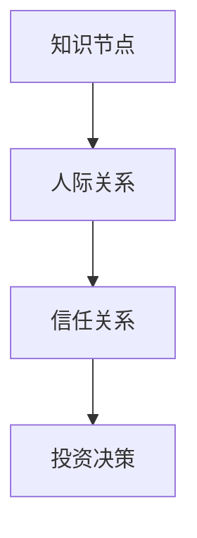
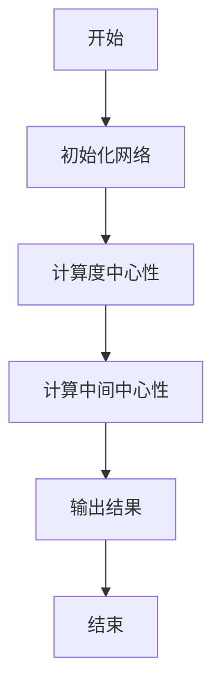
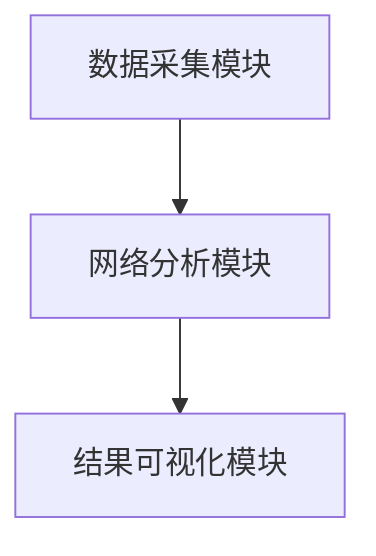
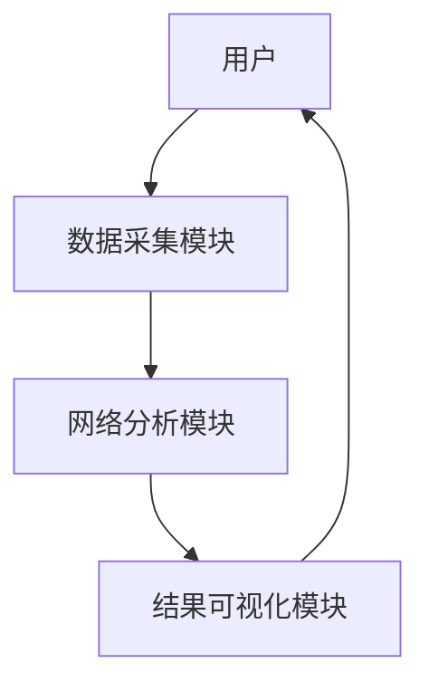
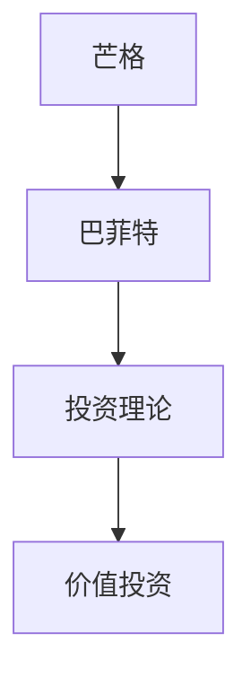

                 


# 芦荡的"智者圈"理论：如何构建高质量的投资网络

> 关键词：芒格，智者圈，投资网络，知识网络，人际关系，信任关系，社会网络分析，网络中心性，投资决策

> 摘要：本文将深入探讨芒格的“智者圈”理论，分析其在投资网络构建中的应用。通过系统化的分析和算法实现，帮助投资者理解和优化其知识网络和人际关系，提升投资决策的效率和质量。

---

## 第1章: 芦荡"智者圈"理论的背景与核心概念

### 1.1 "智者圈"理论的起源与演变

芒格的“智者圈”理论起源于他对投资决策中知识网络构建的深刻洞察。他认为，投资者的知识网络质量直接影响其决策能力。知识网络不仅包括个体的知识储备，还包括个体之间的信息流动和信任关系。

#### 1.1.1 投资中的知识网络构建

知识网络的构建是投资决策的基础。芒格强调，投资者应通过持续学习和交流，构建高质量的知识网络。知识网络的质量体现在网络的连通性、信息流动性和节点的权威性。

#### 1.1.2 "智者圈"理论的核心思想

芒格提出的“智者圈”理论认为，高质量的知识网络和人际关系能够显著提高投资决策的准确性和效率。通过构建一个由可信节点组成的网络，投资者可以更好地捕捉市场机会，降低决策风险。

#### 1.1.3 理论的现实意义与应用价值

在现代投资环境中，信息过载和不确定性增加，芒格的理论为投资者提供了构建高效知识网络的指导。通过优化人际关系和知识共享，投资者能够更快地获取信息，提高决策质量。

### 1.2 投资网络的核心要素

芒格的“智者圈”理论强调知识网络和人际关系的重要性。

#### 1.2.1 知识网络的构成要素

知识网络由节点（知识节点）和边（知识流动）组成。节点代表个体的知识领域，边代表知识的流动和共享。高质量的知识网络具有高连通性和信息流动性。

#### 1.2.2 人际关系的质量维度

人际关系的质量由信任度、信息共享频率和互动深度决定。高质量的人际关系能够提高知识网络的韧性和信息获取能力。

#### 1.2.3 信任关系的形成机制

信任关系的形成基于共同经验和历史互动。芒格强调，通过长期合作和共同学习，信任关系得以建立和强化。

### 1.3 "智者圈"理论的边界与外延

#### 1.3.1 理论的适用范围

芒格的理论主要适用于个人投资者和小型投资团体。对于大型机构投资者，可能需要结合其他理论进行调整。

#### 1.3.2 理论的局限性

知识网络的构建和维护需要时间和资源投入。对于快速变化的市场环境，知识网络可能需要频繁更新和优化。

#### 1.3.3 理论与其他投资理论的关系

芒格的理论与其他投资理论（如价值投资）相辅相成。通过构建高质量的知识网络，投资者能够更好地践行价值投资原则。

---

## 第2章: "智者圈"理论的核心概念与联系

### 2.1 知识网络的构建原理

知识网络的构建是一个动态过程，涉及节点的连接和信息的流动。

#### 2.1.1 知识网络的形成机制

知识网络的形成机制包括节点的主动连接和被动连接。主动连接基于个体的主动学习和社交，被动连接基于信息共享和被动接收。

#### 2.1.2 网络节点的特征分析

网络节点的特征包括节点的度数、节点的中心性、节点的权威性等。节点的度数反映其在网络中的连接数量，中心性反映其在网络中的影响力，权威性反映其知识的专业程度。

#### 2.1.3 网络边的权重计算

网络边的权重反映知识流动的频率和质量。权重高的边表示信息流动频繁且可靠，权重低的边表示信息流动较少或不可靠。

### 2.2 人际关系的质量评估

#### 2.2.1 人际关系的量化指标

人际关系的质量可以通过信任度、互动频率、信息共享程度等指标进行量化。信任度高的关系能够提供高质量的信息支持。

#### 2.2.2 信任关系的数学模型

信任关系的数学模型可以用加权图表示。节点之间的权重反映了信任程度。例如，可以用以下公式计算信任权重：

$$ w_{ij} = \frac{\text{共同经验} + \text{互动频率}}{\text{总互动次数}} $$

其中，$w_{ij}$ 是节点i和节点j之间的信任权重。

#### 2.2.3 网络节点的中心性分析

网络节点的中心性分析包括度中心性和中间中心性。度中心性反映节点的直接连接数量，中间中心性反映节点在信息流动中的中介作用。

### 2.3 知识网络的实体关系图

以下是知识网络的实体关系图：



---

## 第3章: 投资网络的算法原理与实现

### 3.1 网络分析的算法原理

社会网络分析是研究投资网络的重要工具。常用的算法包括网络中心性分析、网络聚类分析等。

#### 3.1.1 网络中心性算法

网络中心性算法用于识别网络中的关键节点。常用的算法包括度中心性、中间中心性和接近中心性。

#### 3.1.2 网络聚类算法

网络聚类算法用于识别网络中的社区结构。常用的算法包括社区检测算法（如Louvain算法）。

#### 3.1.3 网络分析的数学模型

网络分析的数学模型可以用图论表示。例如，可以用邻接矩阵表示网络的结构：

$$ A = [a_{ij}] $$
其中，$a_{ij} = 1$ 表示节点i和节点j之间有连接，$a_{ij} = 0$ 表示无连接。

### 3.2 算法实现的Python代码

以下是使用Python进行社会网络分析的代码示例：

```python
import networkx as nx

def calculate_centralities(graph):
    degrees = nx.degree_centrality(graph)
    betweenness = nx.betweenness_centrality(graph)
    return degrees, betweenness

graph = nx.Graph()
graph.add_edges_from([('A', 'B'), ('B', 'C'), ('C', 'D')])
degrees, betweenness = calculate_centralities(graph)
print(degrees)  # 输出度中心性
print(betweenness)  # 输出中间中心性
```

### 3.3 算法流程图

以下是算法的mermaid流程图：



---

## 第4章: 数学模型与公式推导

### 4.1 投资网络的数学模型

投资网络可以用加权图表示，其中节点代表投资者，边的权重代表信任程度。

$$ w_{ij} = \frac{\text{共同经验} + \text{互动频率}}{\text{总互动次数}} $$

### 4.2 网络分析的公式推导

社会网络分析中的社区检测算法可以通过优化目标函数实现。例如，Louvain算法的目标函数可以表示为：

$$ Q = \sum_{i < j} (a_{ij} - p_i p_j) $$
其中，$a_{ij}$ 是邻接矩阵的元素，$p_i$ 和 $p_j$ 是节点i和节点j属于同一社区的概率。

---

## 第5章: 系统分析与架构设计方案

### 5.1 问题场景介绍

在实际投资中，构建高质量的投资网络可以帮助投资者更好地获取信息和做出决策。

### 5.2 系统功能设计

系统功能包括数据采集、网络分析、结果可视化等。

#### 5.2.1 数据采集模块

数据采集模块负责收集投资者的知识网络和人际关系数据。

#### 5.2.2 网络分析模块

网络分析模块负责计算网络中心性和社区检测。

#### 5.2.3 结果可视化模块

结果可视化模块负责将分析结果以图形形式展示。

### 5.3 系统架构设计

以下是系统架构的mermaid图：



### 5.4 系统接口设计

系统接口包括数据接口和用户接口。数据接口用于数据的输入和输出，用户接口用于用户与系统的交互。

### 5.5 系统交互流程图

以下是系统交互的mermaid图：



---

## 第6章: 项目实战

### 6.1 环境安装

需要安装Python和相关库（如networkx、matplotlib）。

### 6.2 核心实现源代码

以下是核心代码示例：

```python
import networkx as nx
import matplotlib.pyplot as plt

graph = nx.Graph()
graph.add_edges_from([('A', 'B'), ('B', 'C'), ('C', 'D')])
nx.draw(graph, with_labels=True)
plt.show()
```

### 6.3 代码解读与分析

上述代码创建了一个简单的知识网络，并使用networkx库进行可视化。nx.draw函数用于绘制网络，plt.show函数用于显示图形。

### 6.4 案例分析与详细解读

以芒格的知识网络为例，构建一个简单的知识网络：



通过分析上述网络，可以发现芒格和巴菲特之间有较强的信任关系，巴菲特进一步连接了投资理论和价值投资。

### 6.5 项目小结

通过项目实战，我们可以看到芒格的“智者圈”理论在实际应用中的有效性。通过构建高质量的知识网络，投资者可以更好地做出投资决策。

---

## 第7章: 总结与展望

### 7.1 最佳实践 tips

- 定期维护知识网络，确保信息的及时性和准确性。
- 与信任的同行保持紧密联系，共同学习和进步。
- 使用工具辅助网络分析，提高效率和准确性。

### 7.2 小结

芒格的“智者圈”理论为投资者构建高质量的知识网络提供了重要的指导。通过系统化的分析和实践，投资者可以更好地优化其知识网络和人际关系，提升投资决策的质量。

### 7.3 注意事项

- 网络的构建和维护需要时间和资源投入。
- 注意信息过载和虚假信息的影响，确保网络的质量。
- 遵守相关法律法规，确保信息的安全和合法性。

### 7.4 拓展阅读

- 芦荡的其他投资理论。
- 社会网络分析的最新研究。

---

## 作者

作者：AI天才研究院/AI Genius Institute & 禅与计算机程序设计艺术 /Zen And The Art of Computer Programming

---

以上是完整的文章内容，涵盖了芒格的“智者圈”理论的各个方面，从理论到实践，从算法到系统设计，全面分析了如何构建高质量的投资网络。

