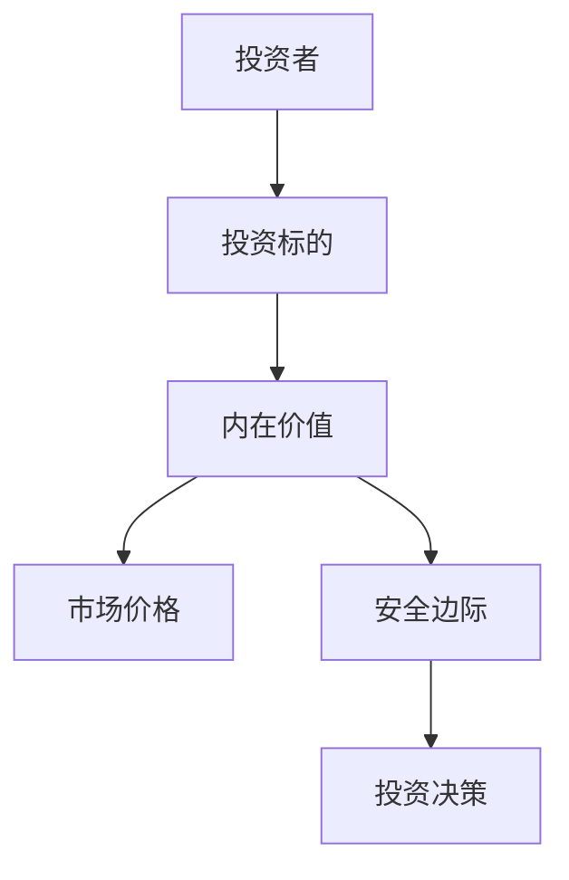
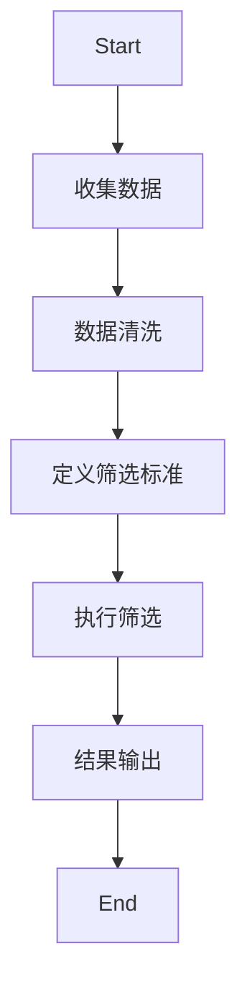
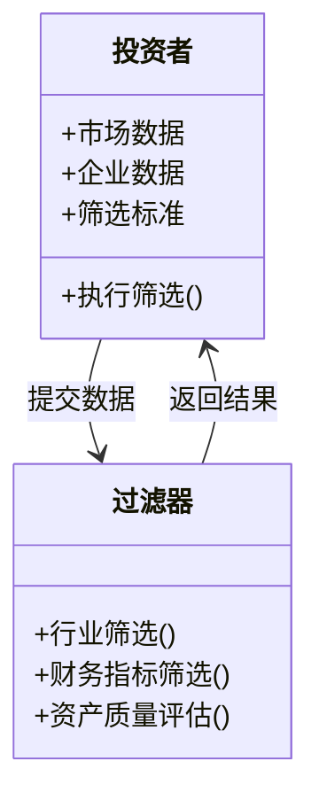
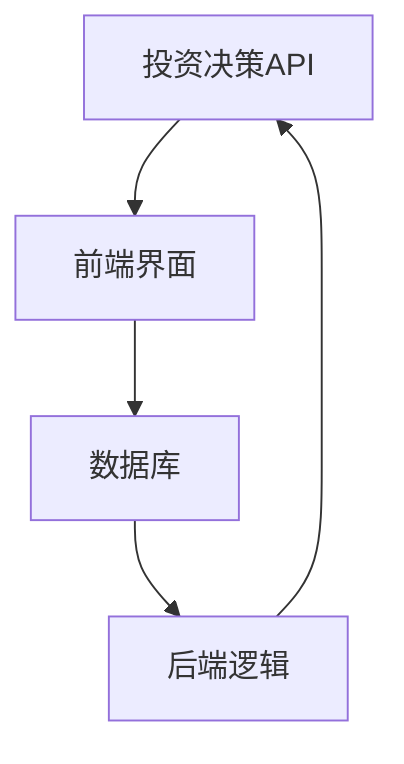

                 


# 芒格的"最低标准"原则：投资决策的过滤器

## 关键词：芒格, 投资决策, 最低标准原则, 安全边际, 资产质量评估

## 摘要：芒格的“最低标准”原则是一种投资决策的过滤器，帮助投资者筛选出具备安全边际和优质资产的投资机会。本文将从背景、核心概念、算法原理、数学模型、系统架构、项目实战等多方面深入剖析这一原则，结合实际案例和最佳实践，为投资者提供系统的指导。

---

## 第一部分：芒格的"最低标准"原则概述

### 第1章：芒格及其投资理念

#### 1.1 芒格的生平简介
- **1.1.1 芝加格大学教育背景**  
  查理·芒格在加州大学伯克利分校获得法律学位，后转向心理学和经济学研究。
  
- **1.1.2 合伙人制度的创立者**  
  芒格与巴菲特共同创立了伯克希尔哈撒韦公司，采用合伙制模式。

- **1.1.3 在伯克希尔哈撒韦的角色**  
  芒格负责公司的投资决策和风险管理，强调长期价值投资。

#### 1.2 芒格的投资哲学
- **1.2.1 价值投资的倡导者**  
  芒格认为市场先生是疯狂的，投资应基于企业的内在价值。

- **1.2.2 投资中的心理学因素**  
  芒格强调避免情绪化决策，重视心理账户和认知偏差。

- **1.2.3 长期投资的坚持**  
  芒格倡导长期持有优质资产，避免频繁交易。

### 第2章："最低标准"原则的起源

#### 2.1 什么是"最低标准"原则
- **2.1.1 原则的基本定义**  
  "最低标准"原则是指在投资前设定严格的筛选标准，确保投资标的具备足够的安全边际和竞争优势。

- **2.1.2 原则的哲学基础**  
  基于价值投资理念，强调安全性和可预测性。

- **2.1.3 原则的演变历程**  
  芒格在长期实践中不断完善这一原则，形成系统的投资筛选方法。

#### 2.2 "最低标准"原则的核心要素
- **2.2.1 风险管理的重要性**  
  芒格认为风险管理是投资的第一步，确保本金安全。

- **2.2.2 安全边际的概念**  
  安全边际 = 内在价值 - 市场价格，确保投资的安全性。

- **2.2.3 资产质量的评估**  
  芒格强调投资于具备竞争优势和良好治理的企业。

### 第3章：投资决策的过滤机制

#### 3.1 过滤机制的基本框架
- **3.1.1 过滤器的层次结构**  
  从行业、企业、财务三个层次进行筛选。

- **3.1.2 过滤器的动态调整**  
  根据市场变化和企业经营状况，动态调整筛选标准。

- **3.1.3 过滤器的适用范围**  
  适用于长期股权投资，尤其在市场波动较大的情况下。

#### 3.2 过滤器的具体应用
- **3.2.1 行业分析的过滤**  
  选择具备持续增长潜力的行业，避开夕阳行业。

- **3.2.2 企业基本面的过滤**  
  评估企业的盈利能力、资产负债表和现金流状况。

- **3.2.3 财务指标的过滤**  
  重点关注ROE、净利率、负债率等关键指标。

---

## 第二部分：最低标准原则的核心概念与联系

### 第4章：核心概念的原理分析

#### 4.1 安全边际的数学模型
- **4.1.1 安全边际的计算公式**  
  $$\text{安全边际} = \text{内在价值} - \text{市场价格}$$

- **4.1.2 安全边际的应用场景**  
  在市场恐慌时，安全边际高的标的更具吸引力。

- **4.1.3 安全边际与投资风险的关系**  
  安全边际越高，投资风险越小，回报潜力越大。

#### 4.2 资产质量评估的指标体系
- **4.2.1 资产质量的定义**  
  指标的权重分配，例如ROE权重为30%，净利率为20%。

- **4.2.2 资产质量评估的指标**  
  包括ROE、ROA、净利率、负债率等。

- **4.2.3 指标权重的分配**  
  根据行业特性和企业类型，动态调整指标权重。

#### 4.3 实体关系图的构建


---

### 第5章：概念属性特征对比表

| **概念** | **定义** | **重要性** | **应用**
|---------|---------|---------|---------
| 安全边际 | 内在价值与市场价格的差额 | 高 | 确保投资本金安全
| 资产质量 | 企业的盈利能力与财务状况 | 高 | 选择具备竞争优势的企业

---

## 第三部分：最低标准原则的算法原理

### 第6章：算法原理的详细讲解

#### 6.1 算法步骤
1. **确定过滤标准**：根据市场环境和投资目标，设定行业、财务指标等筛选标准。
2. **数据收集与处理**：收集目标企业的财务数据，进行清洗和标准化处理。
3. **过滤器的执行**：逐一筛选企业，评估其是否符合设定的标准。

#### 6.2 算法流程图


---

### 第7章：数学模型与公式

#### 7.1 安全边际计算公式
$$\text{安全边际} = \text{内在价值} - \text{市场价格}$$

#### 7.2 资产质量评估模型
$$\text{资产质量评分} = \sum (\text{指标权重} \times \text{指标得分})$$

---

## 第四部分：系统架构与项目实战

### 第8章：系统分析与架构设计

#### 8.1 系统功能设计


#### 8.2 系统架构设计


---

### 第9章：项目实战

#### 9.1 环境安装
- 安装Python、Pandas、NumPy等工具。

#### 9.2 核心代码实现
```python
def calculate_margin(value, price):
    return value - price

def assess_asset_quality(financials, weights):
    score = 0
    for metric, weight in weights.items():
        score += financials[metric] * weight
    return score
```

#### 9.3 案例分析
- 以某科技公司为例，计算其安全边际和资产质量评分，决定是否投资。

---

## 第五部分：总结与展望

### 第10章：总结与展望

#### 10.1 最佳实践
- 定期回顾和调整筛选标准，适应市场变化。

#### 10.2 小结
芒格的"最低标准"原则为投资者提供了一套系统化的投资筛选方法，结合安全边际和资产质量评估，帮助做出明智的投资决策。

#### 10.3 注意事项
- 避免过度依赖单一指标，综合考虑多方面因素。
- 定期复盘，及时调整投资组合。

#### 10.4 拓展阅读
推荐阅读《芒格的智慧》和《巴菲特的选股术》等书籍，深入理解价值投资的理念。

---

## 作者：AI天才研究院 & 禅与计算机程序设计艺术

---

以上为完整的技术博客文章结构，涵盖了芒格"最低标准"原则的各个方面，结合技术分析和实际案例，为投资者提供系统化的指导。

