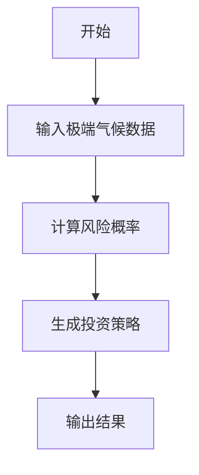
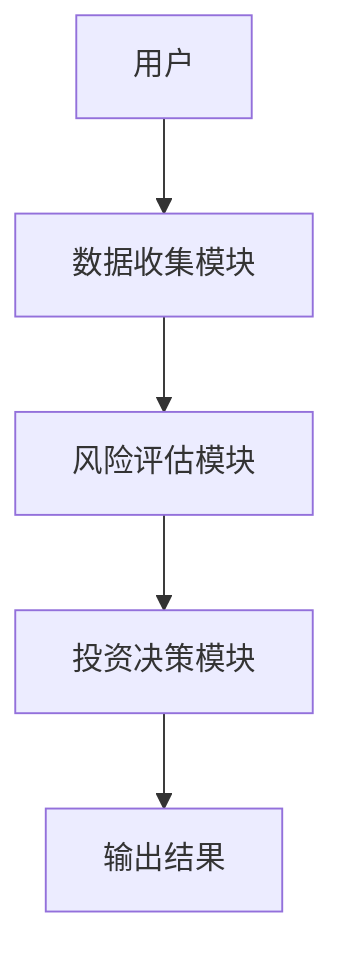

                 

# 芒格的"极端后果"思维在气候变化投资中的应用

## 关键词：极端后果思维, 气候变化投资,芒格投资理念,风险管理,系统设计,项目实战

## 摘要：  
芒格的“极端后果”思维是一种从极端情况出发的逆向思维方式，在投资领域具有重要意义。本文探讨了极端后果思维在气候变化投资中的应用，分析其核心原理、算法模型，并结合系统设计和项目实战，提供了详细的应用方案和案例分析。

---

## 目录大纲：

### 第一部分：背景介绍  
#### 第1章：芒格的“极端后果”思维  
- 1.1 极端后果思维的定义与核心理念  
- 1.2 投资中的极端后果思维：概念与特征  

#### 第2章：气候变化对投资的影响  
- 2.1 气候变化的定义与特征  
- 2.2 气候变化对全球经济与投资的影响  
- 2.3 投资决策中的极端后果思维  

### 第二部分：极端后果思维的核心概念与联系  
#### 第3章：极端后果思维的核心原理  
- 3.1 极端后果思维的数学模型  
- 3.2 极端后果思维与其他投资思维的对比  

#### 第4章：极端后果思维的ER实体关系图  
- 4.1 实体关系分析  
- 4.2 图表展示  

### 第三部分：极端后果思维的算法原理  
#### 第5章：算法实现与代码分析  
- 5.1 环境安装（Python、相关库）  
- 5.2 核心代码实现  
- 5.3 代码功能分析  

#### 第6章：极端后果思维的算法流程  
- 6.1 决策树分析与mermaid流程图  
- 6.2 蒙特卡洛模拟与代码实现  

### 第四部分：系统分析与架构设计  
#### 第7章：系统功能设计  
- 7.1 功能模块划分  
- 7.2 系统功能流程图  

#### 第8章：系统架构设计  
- 8.1 系统架构图  
- 8.2 系统接口设计  

### 第五部分：项目实战与案例分析  
#### 第9章：项目实战指导  
- 9.1 项目背景介绍  
- 9.2 项目核心实现  
- 9.3 项目案例分析  

#### 第10章：案例分析与详细解读  
- 10.1 案例背景  
- 10.2 案例分析过程  
- 10.3 案例结果与总结  

### 第六部分：总结与展望  
#### 第11章：全书总结  
- 11.1 核心概念回顾  
- 11.2 算法原理总结  
- 11.3 项目实战总结  

#### 第12章：最佳实践与注意事项  
- 12.1 投资思维培养  
- 12.2 风险管理建议  
- 12.3 数据收集与分析  
- 12.4 持续学习与优化  
- 12.5 拓展阅读推荐  
- 12.6 注意事项与风险提示  

### 附录：mermaid 图表  
#### 算法原理图  

#### 系统架构图  

---

## 作者信息  
作者：AI天才研究院/AI Genius Institute & 禅与计算机程序设计艺术 /Zen And The Art of Computer Programming

