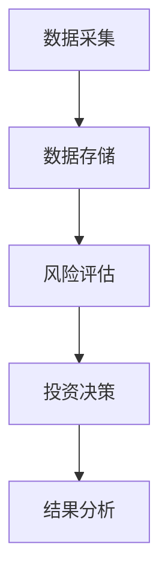

                 

# 芒格的"极端后果"思维在气候适应性技术投资中的应用

> 关键词：芒格，极端后果，气候适应性技术，投资，风险管理

> 摘要：本文探讨了芒格的“极端后果”思维在气候适应性技术投资中的应用，结合技术原理和投资策略，分析了气候适应性技术的核心特征、风险评估模型、系统架构设计以及实际投资案例，为投资者提供了科学的决策参考。

---

## 第1章: 芒格的"极端后果"思维概述

### 1.1 芒格的"极端后果"思维的核心概念

#### 1.1.1 "极端后果"思维的定义
芒格的“极端后果”思维是一种以结果为导向的思维方式，强调在决策过程中考虑可能的最坏情况，并据此调整决策策略。这种思维的核心在于，通过分析潜在的极端结果，降低投资风险，提高决策的稳健性。

#### 1.1.2 "极端后果"思维的哲学基础
芒格的“极端后果”思维深受决策理论和行为经济学的影响。他认为，人类的决策过程往往受到情感和认知偏差的干扰，而极端后果思维通过聚焦于最坏情况，帮助投资者克服这些偏差，做出更理性的决策。

#### 1.1.3 "极端后果"思维在投资中的应用
在投资领域，芒格的“极端后果”思维被广泛应用于风险评估和资产配置。通过分析可能的极端市场情况，投资者可以更好地理解投资标的的潜在风险，并据此制定更为稳健的投资策略。

---

### 1.2 气候变化对投资的影响

#### 1.2.1 气候变化的现状与趋势
气候变化是当前全球面临的重大挑战，极端天气事件频发，海平面上升，以及生态系统破坏等问题，正在对全球经济和社会造成深远影响。这些变化不仅影响自然环境，也对投资领域提出了新的挑战。

#### 1.2.2 气候变化对经济和金融的冲击
气候变化可能导致资产贬值、企业利润下降以及政策调整等多重风险。例如，化石能源相关资产可能面临“ stranded assets”的风险，而绿色能源技术则可能成为新的投资热点。

#### 1.2.3 气候适应性技术的兴起
为应对气候变化带来的挑战，气候适应性技术应运而生。这些技术包括可再生能源、碳捕获、智能城市等，旨在通过技术创新降低气候变化的影响，并为投资者创造新的投资机会。

---

## 第2章: "极端后果"思维与气候适应性技术的结合

### 2.1 气候适应性技术的定义与分类

#### 2.1.1 气候适应性技术的定义
气候适应性技术是指能够帮助社会和经济系统适应气候变化影响的技术。这些技术包括但不限于：可再生能源、节能技术、智能农业、海绵城市等。

#### 2.1.2 气候适应性技术的主要分类
气候适应性技术可以分为以下几类：
1. **可再生能源技术**：如太阳能、风能等。
2. **节能与能效技术**：如高效 HVAC 系统、智能电网等。
3. **智能城市技术**：如智能交通系统、智慧城市管理平台等。
4. **农业适应性技术**：如耐旱作物品种、精准农业等。

#### 2.1.3 气候适应性技术的核心特征
气候适应性技术的核心特征包括：技术的创新性、环境友好性、经济可行性和可扩展性。

---

### 2.2 "极端后果"思维在气候适应性技术投资中的应用

#### 2.2.1 "极端后果"思维在技术选择中的作用
通过分析不同气候适应性技术在极端气候条件下的表现，投资者可以更好地选择具有抗风险能力的技术。

#### 2.2.2 "极端后果"思维在风险评估中的应用
投资者可以通过分析极端气候事件对不同技术的影响，评估投资风险，并据此调整投资组合。

#### 2.2.3 "极端后果"思维在投资决策中的体现
芒格的“极端后果”思维要求投资者在决策时考虑最坏情况，并据此制定应对策略。在气候适应性技术投资中，这意味着投资者需要评估技术在极端气候条件下的表现，并制定相应的风险管理措施。

---

## 第3章: 气候适应性技术的数学模型与算法原理

### 3.1 气候适应性技术的风险评估模型

#### 3.1.1 风险评估模型的构建
气候适应性技术的风险评估模型通常包括以下几个步骤：
1. **数据收集**：收集气候数据、技术性能数据、市场数据等。
2. **模型构建**：基于数据构建风险评估模型。
3. **模型验证**：通过历史数据验证模型的准确性。
4. **模型优化**：根据验证结果优化模型。

#### 3.1.2 模型的数学表达
风险评估模型可以通过以下公式表示：
$$ R = f(C, T, M) $$
其中，$R$ 表示风险，$C$ 表示气候条件，$T$ 表示技术性能，$M$ 表示市场因素。

#### 3.1.3 模型的验证与优化
模型的验证可以通过回测和交叉验证进行。优化可以通过调整模型参数和引入新的变量来实现。

---

### 3.2 "极端后果"思维的算法实现

#### 3.2.1 算法的基本原理
“极端后果”思维的算法实现主要基于极端值分析和风险评估。通过分析极端气候事件对技术的影响，评估投资风险。

#### 3.2.2 算法的实现步骤
1. **数据预处理**：对数据进行清洗和标准化处理。
2. **极端值分析**：识别数据中的极端值。
3. **风险评估**：基于极端值评估投资风险。

#### 3.2.3 算法的优缺点分析
优点：能够有效识别极端风险，提高投资决策的稳健性。
缺点：极端值分析依赖于数据的完整性和准确性，可能存在数据不足的问题。

---

## 第4章: 气候适应性技术的系统分析与架构设计

### 4.1 系统分析与设计概述

#### 4.1.1 系统分析的目标
系统分析的目标是识别气候适应性技术的关键组成部分，并分析它们之间的关系。

#### 4.1.2 系统设计的原则
系统设计应遵循模块化、可扩展性和可维护性原则。

#### 4.1.3 系统架构的组成部分
系统架构通常包括数据层、业务逻辑层和用户界面层。

---

### 4.2 气候适应性技术的系统架构设计

#### 4.2.1 系统功能模块划分
系统功能模块通常包括数据采集、风险评估、投资决策和结果分析。

#### 4.2.2 系统架构的 mermaid 图

#### 4.2.3 系统接口设计
系统接口设计需要考虑数据输入、处理和输出的标准化。

---

## 第5章: 项目实战——基于"极端后果"思维的气候适应性技术投资

### 5.1 项目背景与目标

#### 5.1.1 项目背景介绍
本项目旨在通过芒格的“极端后果”思维，评估某气候适应性技术的投资风险，并制定相应的投资策略。

#### 5.1.2 项目目标设定
项目目标包括：构建风险评估模型、分析极端气候事件对技术的影响、制定投资决策策略。

#### 5.1.3 项目范围界定
项目范围包括：数据收集、模型构建、风险评估和投资决策。

---

### 5.2 项目实施过程

#### 5.2.1 环境安装与配置
需要安装 Python、数据分析库（如 Pandas）、可视化库（如 Matplotlib）等工具。

#### 5.2.2 系统核心功能实现
实现风险评估模型、极端值分析和投资决策模块。

#### 5.2.3 代码实现与测试
代码实现需要包括数据预处理、模型构建和结果分析等步骤。

---

### 5.3 项目案例分析

#### 5.3.1 案例背景介绍
假设我们选择某可再生能源技术作为投资标的，分析其在极端气候条件下的表现。

#### 5.3.2 投资决策过程
通过风险评估模型，分析极端气候事件对技术的影响，并据此制定投资策略。

#### 5.3.3 投资结果分析
分析投资结果，总结经验教训，并优化投资策略。

---

## 第6章: 总结与展望

### 6.1 总结
本文探讨了芒格的“极端后果”思维在气候适应性技术投资中的应用，通过理论分析和实际案例，验证了该思维的有效性。

### 6.2 小结
通过芒格的“极端后果”思维，投资者可以更好地应对气候变化带来的风险，制定更为稳健的投资策略。

### 6.3 注意事项
在实际应用中，需要注意数据的准确性和模型的可解释性。

### 6.4 拓展阅读
推荐阅读相关领域的书籍和文献，以进一步深入理解气候适应性技术和投资策略。

---

作者：AI天才研究院/AI Genius Institute & 禅与计算机程序设计艺术 /Zen And The Art of Computer Programming

