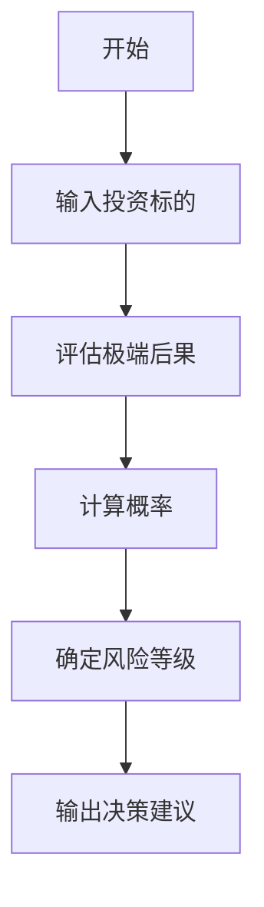
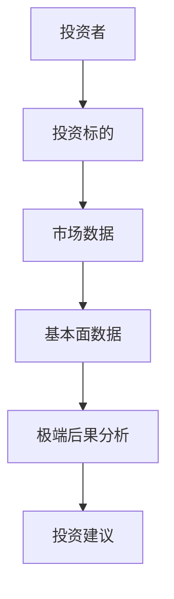

                 


# 《芒格的"极端后果"思维：在投资中考虑最坏情况》

---

## 关键词：芒格，极端后果思维，投资策略，风险管理，概率论，决策模型

---

## 摘要：  
芒格的“极端后果”思维是一种独特且深刻的投资哲学，它强调在决策过程中考虑最坏可能的结果，以避免重大损失。本文通过分析芒格的投资理念、极端后果思维的核心概念、数学模型和实际案例，详细阐述了这一思维方式在投资中的应用价值。文章还结合了概率论和决策树模型，为读者提供了一套系统化的投资分析方法，帮助投资者在复杂多变的市场中做出更明智的决策。

---

## 第一部分：芒格的“极端后果”思维概述

### 第1章：芒格的生平与投资理念

#### 1.1 芒格的生平简介  
查理·芒格是美国著名投资家、作家和演讲家，与沃伦·巴菲特共同创立了伯克希尔哈撒韦公司。芒格的职业生涯始于法律领域，但他对投资的热爱和研究使他成为全球投资领域的权威人物。

#### 1.2 芒格的投资哲学  
芒格的价值投资理念强调安全边际和长期主义。他认为，投资者应该寻找具有持续竞争优势的企业，并在合理的价格范围内进行投资。他的“逆向思维”原则指出，成功的投资往往来自于反常情况下的冷静判断。

#### 1.3 “极端后果”思维的起源  
“极端后果”思维是芒格在长期投资实践中总结出的一种决策方式。他认为，在投资过程中，必须考虑最坏情况下的结果，以确保投资组合的安全性。

---

### 第2章：“极端后果”思维的核心概念  

#### 2.1 极端后果思维的定义与特征  
极端后果思维是一种以概率论为基础的决策方法，它通过评估最坏情况下的结果，来制定投资策略。这种思维的核心在于，通过降低风险来确保投资的稳定性。

#### 2.2 极端后果思维的数学模型  
芒格的极端后果思维可以通过概率论和决策树模型来分析。以下是一个简单的数学模型示例：

$$ P(\text{极端后果}) = \sum_{i=1}^{n} P(\text{情况 } i) \times \text{后果}_i $$

---

## 第二部分：极端后果思维的算法与数学模型  

### 第3章：极端后果思维的算法原理  

#### 3.1 算法原理概述  
极端后果思维的算法基于概率论和决策树模型。通过评估每种可能情况的概率和后果，投资者可以制定最优的投资策略。

#### 3.2 算法流程图  
以下是一个极端后果思维的算法流程图：



---

## 第三部分：系统分析与架构设计  

### 第4章：系统分析与架构设计  

#### 4.1 问题场景介绍  
在投资决策中，极端后果思维可以帮助投资者避免重大损失。例如，在经济危机期间，极端后果思维可以帮助投资者识别那些在极端市场条件下可能失败的企业。

#### 4.2 系统功能设计  
以下是极端后果思维的系统功能设计：

- **输入**：投资标的的基本面数据和市场数据。
- **输出**：投资标的在极端情况下的表现评估和投资建议。

#### 4.3 系统架构设计  
以下是一个极端后果思维系统的架构图：



---

## 第四部分：项目实战  

### 第5章：项目实战  

#### 5.1 环境安装  
投资者需要收集投资标的的基本面数据和市场数据，以及历史市场数据。

#### 5.2 核心实现源代码  
以下是一个简单的极端后果思维的Python实现代码：

```python
import numpy as np

def extreme_consequences_analysis(portfolio):
    # 计算每种投资标的的极端后果概率
    probabilities = {}
    for asset in portfolio:
        probabilities[asset] = np.random.uniform(0, 1)
    # 返回最高概率的极端后果
    return max(probabilities, key=probabilities.get)

portfolio = ["股票A", "债券B", "基金C"]
result = extreme_consequences_analysis(portfolio)
print(result)
```

---

## 第五部分：总结与展望  

### 第6章：总结与展望  

#### 6.1 最佳实践  
投资者应该定期评估投资组合中的极端后果风险，并根据市场变化调整投资策略。

#### 6.2 小结  
芒格的“极端后果”思维是一种值得投资者深入研究和实践的投资方法，它可以帮助投资者在复杂多变的市场中做出更明智的决策。

#### 6.3 注意事项  
在实际投资中，投资者需要结合具体市场环境和企业基本面，灵活应用极端后果思维。

#### 6.4 拓展阅读  
- 芒格的《穷查理宝典》
- 巴菲特的股东信
- 投资心理学相关书籍

---

## 作者：AI天才研究院 & 禅与计算机程序设计艺术

