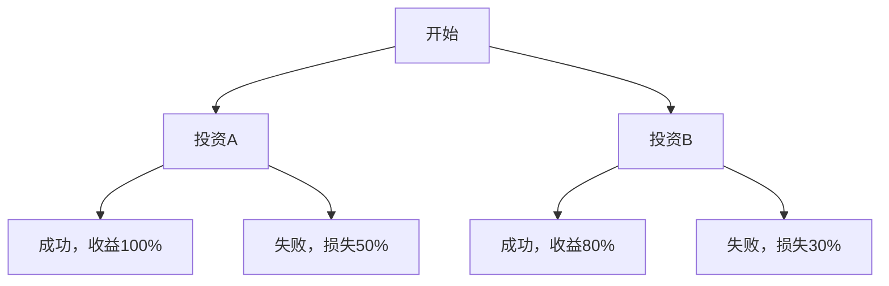
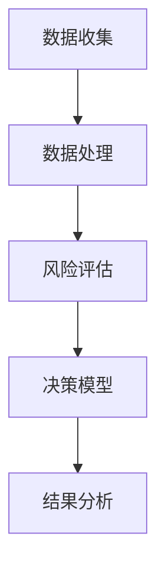

                 


# 《芒格的"极端后果"思维：在投资决策中考虑最坏情况》

---

## 关键词：
芒格，极端后果，投资决策，风险管理，决策思维，系统分析

---

## 摘要：
查理·芒格的"极端后果"思维是一种以风险管理为核心的投资决策方法，强调在决策过程中考虑最坏情况的可能性。本文详细解析了芒格的这一思想，结合心理学、数学模型和系统架构设计，探讨了如何在实际投资中应用这一思维，帮助投资者规避潜在风险，实现稳健收益。通过案例分析和系统设计，本文为读者提供了深入理解和应用芒格思维的实用指南。

---

# 第一部分: 芒格的"极端后果"思维概述

## 第1章: 芒格的生平与思想体系

### 1.1 芒格的生平简介

查理·芒格（Charlie Munger）是美国著名的投资家、作家和律师，同时也是沃伦·巴菲特（Warren Buffett）的长期合作伙伴。芒格于1924年1月17日出生于美国密歇根州的底特律，毕业于密歇根大学和哈佛法学院，拥有法律博士学位。

芒格的职业生涯始于律师事务所，后来转向投资领域，逐渐发展出一套独特的投资哲学。他与巴菲特共同创立了伯克希尔·哈撒韦公司（Berkshire Hathaway），并担任该公司的副主席，负责公司的投资决策和管理。

### 1.2 芒格的决策思维特点

芒格的决策思维以理性、严谨和逆向思维为特点，强调在决策过程中考虑所有可能的极端情况和潜在风险。他的思想体系涵盖了心理学、经济学、哲学等多个领域，尤其注重通过"极端后果"思维来规避重大风险。

---

## 第2章: "极端后果"思维的核心概念

### 2.1 "极端后果"思维的定义

"极端后果"思维是一种以风险管理为核心的投资决策方法。它要求投资者在决策过程中，不仅要考虑正常情况下的收益和风险，还要思考在极端情况下可能产生的最坏后果，并据此调整决策策略。

### 2.2 "极端后果"思维的心理学基础

人类在决策过程中常常受到各种心理偏差的影响，如过度自信、确认偏差、损失厌恶等。"极端后果"思维通过强调最坏情况的考量，帮助投资者克服这些偏差，避免在决策中犯下重大错误。

### 2.3 "极端后果"思维在投资中的重要性

在投资决策中，"极端后果"思维能够帮助投资者识别和规避高风险投资，降低潜在损失。尤其是在市场波动剧烈的情况下，这种思维方式能够帮助投资者保持冷静，避免盲目跟风。

---

# 第二部分: "极端后果"思维的数学模型与决策算法

## 第3章: "极端后果"思维的数学模型

### 3.1 机会成本模型

机会成本是指在做出某项决策时，放弃其他可能选择所付出的代价。在投资决策中，机会成本是"极端后果"思维的重要组成部分。例如，如果将资金投入一个高风险项目，就意味着放弃了投资低风险项目的潜在收益。

#### 3.1.1 机会成本的计算公式

$$\text{机会成本} = \text{可获得的最大收益} - \text{实际获得的收益}$$

### 3.2 预期效用理论

预期效用理论（Expected Utility Theory）是一种描述人们在面对不确定性和风险时如何做出决策的理论。它假设投资者会根据概率和效用来评估不同选择的预期价值。

#### 3.2.1 预期效用函数

$$U = \sum_{i=1}^{n} p_i x_i$$

其中，\(U\) 是效用，\(p_i\) 是第 \(i\) 种结果的概率，\(x_i\) 是第 \(i\) 种结果的效用值。

### 3.3 反事实分析模型

反事实分析（Counterfactual Analysis）是一种通过假设相反事实来评估决策结果的方法。在"极端后果"思维中，反事实分析被用来评估在极端情况下，不同决策可能导致的最坏后果。

---

## 第4章: 基于"极端后果"思维的决策算法

### 4.1 简化版决策树算法

决策树是一种直观地表示决策过程及其可能结果的工具。在"极端后果"思维中，决策树可以帮助投资者清晰地识别和评估不同决策路径的风险和收益。

#### 4.1.1 决策树的基本结构



### 4.2 风险评估与排序算法

风险评估与排序算法通过量化不同投资选项的风险和收益，帮助投资者做出更科学的决策。

#### 4.2.1 风险评估的数学模型

$$\text{风险值} = \text{概率} \times \text{损失}$$

---

# 第三部分: "极端后果"思维的系统分析与架构设计

## 第5章: 投资决策系统的构成与分析

### 5.1 投资决策系统的总体架构

投资决策系统通常包括以下几个功能模块：

1. **数据收集与处理**：收集市场数据、公司财务数据等。
2. **风险评估**：评估不同投资的潜在风险。
3. **决策模型**：基于"极端后果"思维构建决策模型。
4. **结果分析**：分析决策结果并提供反馈。

#### 5.1.1 系统功能模块划分



---

## 第6章: 项目实战

### 6.1 环境安装与系统核心实现

#### 6.1.1 环境安装

为了实现基于"极端后果"思维的投资决策系统，需要安装以下工具和库：

- **Python**：编程语言
- **Pandas**：数据分析库
- **NumPy**：数值计算库
- **Matplotlib**：数据可视化库

#### 6.1.2 核心代码实现

以下是基于"极端后果"思维的决策树算法的Python代码示例：

```python
import numpy as np
import pandas as pd
from sklearn.tree import DecisionTreeClassifier
from sklearn.model_selection import train_test_split
from sklearn.metrics import accuracy_score

# 示例数据集
data = {
    '投资': ['A', 'A', 'B', 'B'],
    '结果': ['成功', '失败', '成功', '失败']
}

df = pd.DataFrame(data)

# 数据预处理
X = df[['投资']]
y = df['结果']

# 划分训练集和测试集
X_train, X_test, y_train, y_test = train_test_split(X, y, test_size=0.2, random_state=42)

# 构建决策树模型
model = DecisionTreeClassifier()
model.fit(X_train, y_train)

# 预测结果
y_pred = model.predict(X_test)

# 计算准确率
accuracy = accuracy_score(y_test, y_pred)
print(f"准确率: {accuracy}")
```

### 6.2 案例分析与详细解读

#### 6.2.1 案例分析

假设我们有两个投资选项，A和B，分别有以下特征：

- **投资A**：
  - 成功概率：60%
  - 成功收益：100%
  - 失败概率：40%
  - 失败损失：50%

- **投资B**：
  - 成功概率：70%
  - 成功收益：80%
  - 失败概率：30%
  - 失败损失：30%

#### 6.2.2 详细解读

通过计算两个投资的期望值和风险值，我们可以更科学地做出决策：

- **投资A的期望值**：

  $$\text{期望值}_A = (0.6 \times 100\%) - (0.4 \times 50\%) = 60\% - 20\% = 40\%$$

- **投资B的期望值**：

  $$\text{期望值}_B = (0.7 \times 80\%) - (0.3 \times 30\%) = 56\% - 9\% = 47\%$$

从期望值来看，投资B的期望值更高。然而，考虑到极端情况下的风险，投资A的失败损失更大（50%），而投资B的失败损失较小（30%）。因此，在考虑"极端后果"思维时，投资B可能更为稳妥。

---

## 第7章: 最佳实践与小结

### 7.1 最佳实践

1. **保持理性**：避免情绪化决策。
2. **多做反事实分析**：在决策前思考可能的最坏情况。
3. **结合数学模型**：利用决策树、期望效用理论等工具辅助决策。
4. **持续学习**：不断优化自己的决策模型。

### 7.2 小结

芒格的"极端后果"思维是一种以风险管理为核心的投资决策方法，能够帮助投资者在复杂多变的市场环境中做出更为稳健的决策。通过结合心理学、数学模型和系统架构设计，我们可以更好地理解和应用这一思维。

---

## 作者信息

作者：AI天才研究院/AI Genius Institute & 禅与计算机程序设计艺术 /Zen And The Art of Computer Programming

