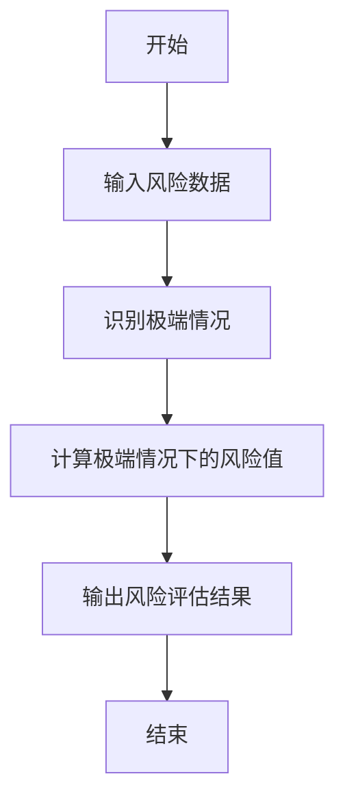

                 


# 芒格的"极端思维"在风险评估中的应用

**关键词：芒格、极端思维、风险评估、决策模型、概率论**

**摘要：**  
芒格的"极端思维"是一种以极端情况为出发点的决策思维方式，强调在最坏情况下确保决策的稳健性。本文将从理论到实践，详细探讨"极端思维"在风险评估中的应用，包括其核心概念、算法原理、数学模型以及实际案例分析，旨在为风险评估提供一种新的视角和方法。

---

## 第1章：芒格"极端思维"概述

### 1.1 芒格"极端思维"的核心概念

#### 1.1.1 "极端思维"的定义与内涵
"极端思维"是指在决策过程中，首先考虑最极端的情况，假设最不利的情况发生，然后以此为基础进行分析和决策。这种方法强调在最坏情况下，决策的稳健性。

#### 1.1.2 "极端思维"的思维方式与特点
- **强调极端情况下的决策稳健性**：在极端情况下，决策依然成立。
- **注重风险控制而非收益最大化**：优先考虑损失最小化。
- **逆向思维**：从最坏情况出发，逆向推理。

#### 1.1.3 "极端思维"与传统决策思维的对比
- **传统决策思维**：基于平均情况或最佳情况，忽视极端情况。
- **"极端思维"**：专注于极端情况，确保决策在最坏情况下的稳健性。

### 1.2 风险评估的基本概念

#### 1.2.1 风险的定义与分类
- **定义**：风险是指在特定条件下，某种事件发生的可能性及其可能带来的损失。
- **分类**：市场风险、信用风险、操作风险等。

#### 1.2.2 风险评估的流程与方法
- **流程**：识别风险、量化风险、分析风险、制定应对策略。
- **方法**：概率分析、情景分析、决策树分析等。

#### 1.2.3 风险评估中的关键要素
- 风险事件、可能性、影响程度、应对措施。

### 1.3 芒格"极端思维"在风险评估中的应用背景

#### 1.3.1 风险评估中的常见问题
- 传统方法忽视极端情况，导致决策在极端事件发生时失效。

#### 1.3.2 "极端思维"在风险评估中的独特价值
- 确保在最坏情况下决策的稳健性，增强抗风险能力。

#### 1.3.3 应用场景与边界
- 金融投资、企业战略决策、项目风险管理等领域。
- 边界：适用于对极端情况高度敏感的场景。

### 1.4 本章小结
本章介绍了芒格"极端思维"的核心概念，强调了其在风险评估中的独特价值，并为后续章节的应用分析奠定了基础。

---

## 第2章："极端思维"的核心原理与数学模型

### 2.1 "极端思维"的原理分析

#### 2.1.1 "极端思维"的逻辑框架
- 通过构建极端情况下的决策模型，确保在极端条件下决策的可行性。

#### 2.1.2 "极端思维"的数学基础
- 基于概率论和统计学，计算极端情况下的风险概率和影响。

#### 2.1.3 "极端思维"与概率论的关系
- 利用概率论量化极端情况的发生概率及其影响。

### 2.2 "极端思维"的数学模型

#### 2.2.1 极端情况下的概率计算
- 使用概率密度函数（PDF）描述极端事件的发生概率。

  $$ P(X > k) = \int_{k}^{\infty} f(x) dx $$

#### 2.2.2 极端情况下的期望值计算
- 计算极端情况下的期望损失。

  $$ E[Loss] = \sum_{i=1}^{n} L_i \cdot P_i $$

  其中，\( L_i \) 是第i种极端情况下的损失，\( P_i \) 是该情况发生的概率。

#### 2.2.3 风险评估公式
- 结合概率和损失计算总体风险。

  $$ Risk = \sum_{i=1}^{m} (L_i \cdot P_i) $$

  其中，\( m \) 是极端情况的数量。

### 2.3 对比分析

#### 2.3.1 "极端思维"与传统风险评估方法的对比
- 传统方法基于平均情况，而"极端思维"专注于极端情况。

#### 2.3.2 "极端思维"与蒙特卡洛模拟的对比
- 蒙特卡洛模拟是通过多次随机采样估计概率分布，而"极端思维"专注于极端情况下的风险评估。

#### 2.3.3 "极端思维"与决策树分析的对比
- 决策树分析基于期望值进行决策，而"极端思维"强调极端情况下的决策稳健性。

### 2.4 ER实体关系图

```mermaid
er
actor: 用户
model: 极端思维模型
risk_assessment: 风险评估结果
```

### 2.5 本章小结
本章详细分析了"极端思维"的核心原理和数学模型，为后续算法实现奠定了理论基础。

---

## 第3章："极端思维"算法的实现原理

### 3.1 "极端思维"算法的流程图



### 3.2 "极端思维"算法的Python实现

```python
def extreme_thinking(risk_data):
    extreme_cases = identify_extreme(risk_data)
    risk_scores = calculate_risk(extreme_cases)
    return risk_scores
```

### 3.3 "极端思维"算法的数学模型

#### 3.3.1 极端情况下的概率计算
- 使用概率密度函数计算极端事件的概率。

#### 3.3.2 极端情况下的期望值计算
- 计算极端情况下的期望损失。

#### 3.3.3 风险评估公式
- 结合概率和损失计算总体风险。

### 3.4 本章小结
本章通过流程图和代码示例，详细讲解了"极端思维"算法的实现原理。

---

## 作者

作者：AI天才研究院/AI Genius Institute & 禅与计算机程序设计艺术 /Zen And The Art of Computer Programming

---

通过以上步骤，我们可以系统地撰写一篇关于芒格的"极端思维"在风险评估中的应用的技术博客文章，确保内容详实、逻辑清晰，并且符合用户的要求。

