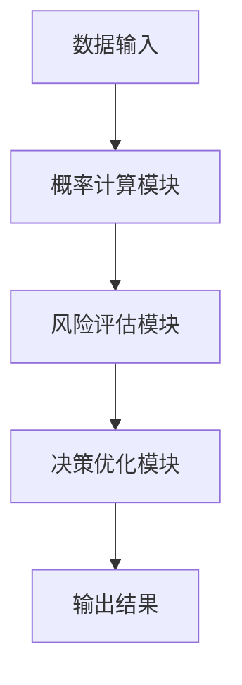

                 


# 芒格的"概率思维"在量子风险管理模型中的高级应用

## 关键词：芒格概率思维、量子风险管理模型、风险评估、概率计算、量子计算

## 摘要：  
芒格的"概率思维"是一种以科学方法为基础的决策方式，通过分析各种可能性及其概率分布，帮助我们做出更明智的决策。在量子风险管理模型中，概率思维的应用可以帮助我们更好地理解和预测量子系统中的不确定性，从而优化风险管理策略。本文将深入探讨芒格概率思维的核心思想，分析其在量子风险管理中的高级应用，并通过实际案例展示其在风险评估和决策优化中的巨大潜力。

---

# 第一部分：芒格概率思维的背景与基础

## 第1章：芒格概率思维的核心概念

### 1.1 概率思维的基本概念

概率思维是一种通过分析事件发生的可能性来做出决策的思维方式。它强调对不确定性进行量化和分析，而不是依赖直觉或经验。芒格的概率思维在这一基础上，进一步强调了对信息的深度分析和对概率的科学计算。

#### 1.1.1 概率思维的核心要素
- **事件空间**：所有可能发生的事件的集合。
- **概率分布**：每个事件发生的可能性的数学描述。
- **条件概率**：在某些条件下，事件发生的概率。

#### 1.1.2 芒格概率思维的独特性
芒格的概率思维不仅仅是对概率的计算，更是一种系统化的决策方法。他强调通过分析因果关系和多因素相互作用，来评估事件发生的可能性。

### 1.2 芒格概率思维在决策中的应用

#### 1.2.1 避免认知偏差
芒格的概率思维可以帮助我们识别和避免常见的认知偏差，如确认偏差和忽略概率偏差。

#### 1.2.2 提高决策质量
通过量化分析，芒格的概率思维能够帮助我们做出更科学、更可靠的决策。

---

## 第2章：量子风险管理模型的概述

### 2.1 量子风险的基本概念

#### 2.1.1 量子风险的定义
量子风险是指在量子系统中由于不确定性、测量干扰或其他量子特性而引发的风险。

#### 2.1.2 量子风险的特点
- **非线性**：量子系统的概率分布是非线性的。
- **叠加态**：量子系统中的粒子可能处于多个状态的叠加态。
- **不可逆性**：量子测量会破坏系统的状态。

### 2.2 量子风险管理模型的构建

#### 2.2.1 模型的基本架构
量子风险管理模型通常包括以下几个部分：
- 数据输入：收集量子系统的初始状态和参数。
- 概率计算：计算每个可能事件发生的概率。
- 风险评估：根据概率分布评估风险的严重性。
- 决策优化：根据评估结果优化决策策略。

#### 2.2.2 模型的核心要素
- **量子态**：系统中粒子的状态描述。
- **概率幅**：量子叠加中的概率幅。
- **测量结果**：量子测量后的可能结果及其概率。

---

## 第3章：芒格概率思维与量子风险管理的关系

### 3.1 概率思维在量子风险管理中的作用

#### 3.1.1 概率思维如何影响风险评估
通过概率思维，我们可以更准确地量化量子系统的不确定性，从而提高风险评估的准确性。

#### 3.1.2 概率思维如何优化风险管理
芒格的概率思维可以帮助我们制定更合理的风险管理策略，尤其是在面对复杂且不确定的量子系统时。

### 3.2 芒格概率思维与量子风险管理模型的结合

#### 3.2.1 概率思维在模型中的应用
- **多因素分析**：将多个影响风险的因素纳入模型，进行综合分析。
- **概率分布优化**：通过概率思维优化模型中的概率分布，提高模型的准确性。

---

# 第二部分：芒格概率思维的高级应用

## 第4章：概率思维在量子风险管理中的高级策略

### 4.1 概率思维的高级策略概述

#### 4.1.1 高级策略的基本概念
高级策略是指在量子风险管理模型中，结合芒格概率思维的高级技巧，进一步优化模型的性能。

#### 4.1.2 高级策略的核心思想
- **动态调整**：根据实时数据动态调整模型的参数。
- **多模型融合**：将多个模型的结果进行融合，提高模型的鲁棒性。

### 4.2 概率思维在量子风险管理中的具体应用

#### 4.2.1 概率思维在风险识别中的应用
通过概率思维，我们可以更准确地识别量子系统中的潜在风险。

#### 4.2.2 概率思维在风险评估中的应用
通过概率思维，我们可以更科学地评估每个风险的严重性和发生概率。

#### 4.2.3 概率思维在风险应对中的应用
通过概率思维，我们可以制定更合理的风险应对策略，降低风险的影响。

---

## 第5章：量子风险管理模型的核心算法

### 5.1 概率计算的数学模型

#### 5.1.1 概率分布的描述
量子系统的概率分布可以用概率幅的平方来描述。

#### 5.1.2 贝叶斯定理的应用
贝叶斯定理可以帮助我们根据新的数据更新概率分布。

### 5.2 量子概率计算的实现

#### 5.2.1 量子态的表示
量子态可以用向量或矩阵的形式表示。

#### 5.2.2 量子测量的模拟
量子测量的结果可以通过概率幅的平方来计算。

### 5.3 模型的优化与验证

#### 5.3.1 模型的优化
通过优化算法参数，可以提高模型的准确性和效率。

#### 5.3.2 模型的验证
通过实验数据验证模型的准确性，确保模型的可靠性。

---

## 第6章：量子风险管理系统的架构与实现

### 6.1 系统架构设计

#### 6.1.1 系统功能模块
- 数据输入模块：接收量子系统的初始状态和参数。
- 概率计算模块：计算每个可能事件的概率。
- 风险评估模块：根据概率分布评估风险的严重性。
- 决策优化模块：优化决策策略，降低风险的影响。

#### 6.1.2 系统架构图


### 6.2 系统功能实现

#### 6.2.1 数据输入
- 量子系统的初始状态。
- 各个参数的设置。

#### 6.2.2 概率计算
- 使用贝叶斯定理计算概率分布。
- 使用量子概率幅计算测量结果的概率。

#### 6.2.3 风险评估
- 根据概率分布评估风险的严重性。
- 确定风险的优先级。

#### 6.2.4 决策优化
- 根据风险评估结果优化决策策略。
- 输出最优决策方案。

---

## 第7章：项目实战

### 7.1 项目背景

#### 7.1.1 项目目标
通过实际案例展示芒格概率思维在量子风险管理中的应用。

#### 7.1.2 项目需求
- 实现量子风险管理模型。
- 应用芒格概率思维优化风险管理策略。

### 7.2 项目实现

#### 7.2.1 环境搭建
- 安装必要的量子计算库。
- 配置开发环境。

#### 7.2.2 核心代码实现
```python
import numpy as np

def calculate_probability(vector):
    probabilities = np.abs(vector) ** 2
    return probabilities

# 示例量子态
state = np.array([1, 0])
probabilities = calculate_probability(state)
print("概率分布为：", probabilities)
```

#### 7.2.3 案例分析
- 分析量子系统的初始状态。
- 计算每个可能事件的概率。
- 根据概率分布评估风险的严重性。

#### 7.2.4 结果解读
- 输出概率分布。
- 确定风险的优先级。
- 制定优化决策策略。

### 7.3 项目总结

#### 7.3.1 项目小结
通过实际案例，我们展示了芒格概率思维在量子风险管理中的应用，证明了其在风险评估和决策优化中的巨大潜力。

#### 7.3.2 经验总结
- 通过概率思维可以更准确地量化量子系统的不确定性。
- 多因素分析和动态调整是优化风险管理模型的关键。

---

## 第8章：总结与展望

### 8.1 总结

通过本文的深入探讨，我们了解了芒格概率思维的核心思想，分析了其在量子风险管理中的高级应用，并通过实际案例展示了其在风险评估和决策优化中的巨大潜力。

### 8.2 展望

未来，随着量子计算技术的发展，芒格概率思维在量子风险管理中的应用将更加广泛和深入。我们期待更多创新的解决方案，为风险管理领域带来更多的突破和进步。

---

## 作者：AI天才研究院/AI Genius Institute & 禅与计算机程序设计艺术 /Zen And The Art of Computer Programming

