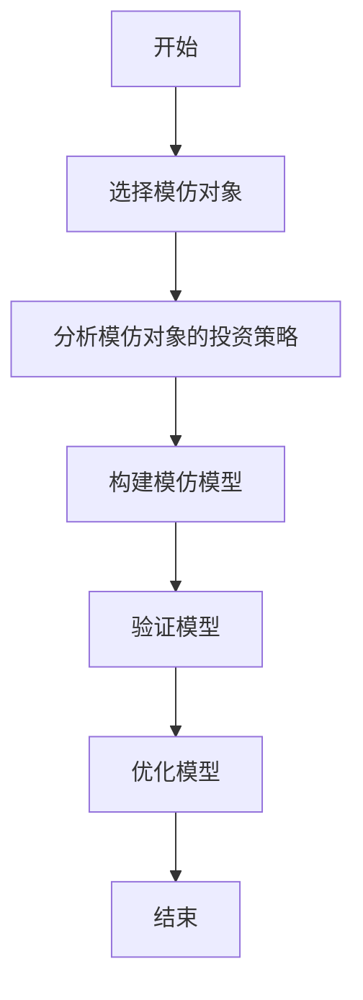
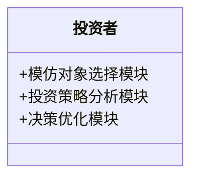
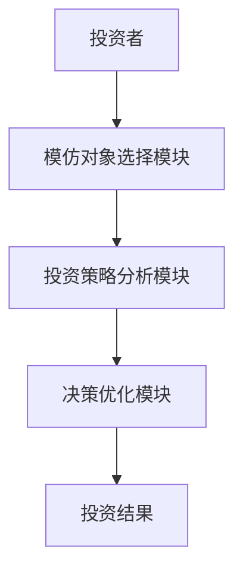

                 


# 芒格的"模仿伟大"原则在投资中的应用

> 关键词：芒格，模仿伟大，投资策略，价值投资，成长投资，决策框架

> 摘要：本文详细探讨了芒格提出的"模仿伟大"原则在投资中的应用。通过对芒格投资哲学的分析，结合实际案例和系统架构设计，展示了如何在投资决策中应用这一原则，构建有效的投资策略和决策框架。

---

# 第一部分: 芒格的"模仿伟大"原则概述

## 第1章: 芒格及其投资理念概述

### 1.1 芒格及其投资哲学

#### 1.1.1 芒格的生平简介

查理·芒格（Charlie Munger）是美国著名投资者、伯克希尔哈撒韦公司副董事长。他以独特的投资哲学闻名，强调理性思考和安全边际。芒格的“模仿伟大”原则源于他对伟大投资者的深入研究，认为通过模仿这些投资者的投资策略和思维方式，可以避免常见错误，提高投资成功率。

#### 1.1.2 芒格的投资哲学核心

芒格的投资哲学强调“逆向思维”和“多元思维模型”。他主张投资者应构建多学科的知识框架，以更好地理解投资标的的本质。同时，芒格强调安全边际和避免情绪化决策的重要性。

#### 1.1.3 "模仿伟大"原则的提出背景

在芒格看来，许多投资者失败的原因是缺乏深度研究和盲目跟随市场情绪。因此，他提出“模仿伟大”原则，鼓励投资者寻找并模仿那些具有卓越投资记录和深厚知识的投资者，从而降低投资风险。

---

### 1.2 "模仿伟大"原则的定义与内涵

#### 1.2.1 原则的定义

“模仿伟大”原则是指在投资过程中，选择那些具有卓越投资记录和深厚知识的投资者作为模仿对象，学习他们的投资策略和思维方式，从而提高自身的投资能力。

#### 1.2.2 原则的核心要素

- **模仿对象选择**：选择那些具有长期成功投资记录、良好声誉和清晰投资理念的投资者。
- **投资策略分析**：深入研究模仿对象的投资策略，理解其背后的逻辑和原则。
- **策略优化**：结合自身的实际情况，对模仿来的策略进行优化，形成独特的投资方法。

#### 1.2.3 原则的边界与外延

“模仿伟大”原则并非简单复制他人的策略，而是在理解其背后逻辑的基础上，结合自身情况进行调整和优化。其外延包括对投资理念、策略和心理层面的学习和借鉴。

---

## 1.3 本章小结

本章介绍了芒格及其投资哲学，重点阐述了“模仿伟大”原则的定义、核心要素和应用边界。通过理解这一原则的背景和内涵，读者可以更好地应用于实际投资中。

---

# 第二部分: "模仿伟大"原则在投资中的应用

## 第2章: "模仿伟大"原则的核心概念与联系

### 2.1 核心概念原理

#### 2.1.1 投资决策中的模仿机制

模仿机制是指投资者在决策过程中，参考其他成功投资者的策略和思路，从而优化自身的投资决策。这一机制强调学习和借鉴，而非盲目复制。

#### 2.1.2 伟大投资者的共同特征

- **深度知识**：对投资标的有深刻理解。
- **长期视角**：注重长期价值而非短期波动。
- **安全边际**：注重风险控制和安全边际。
- **理性决策**：避免情绪化投资。

#### 2.1.3 模仿与创新的平衡点

在投资中，模仿和创新并非对立，而是相辅相成。通过模仿学习，投资者可以快速积累知识和经验，而创新则帮助投资者找到适合自身的方法。

---

### 2.2 核心概念属性特征对比表格

以下表格对比了模仿和创新在投资中的属性特征：

| 属性          | 模仿 | 创新 |
|---------------|------|------|
| 风险          | 较低 | 较高 |
| 成功概率      | 较高 | 较低 |
| 学习成本      | 较低 | 较高 |
| 创新性        | 低   | 高   |
| 适应性        | 高   | 中   |

---

### 2.3 ER实体关系图

以下为“模仿伟大”原则的ER实体关系图：


---

## 2.4 本章小结

本章通过分析“模仿伟大”原则的核心概念，对比了模仿与创新在投资中的属性特征，并通过ER实体关系图展示了其内在联系。

---

## 第3章: "模仿伟大"原则的算法原理

### 3.1 算法原理概述

#### 3.1.1 基于模仿的决策树构建

决策树是一种用于投资决策的树状结构，基于模仿对象的策略，构建决策树以优化投资决策。

#### 3.1.2 基于模仿的聚类分析

聚类分析用于将投资标的分为不同的类别，帮助投资者更好地理解和模仿成功投资者的策略。

#### 3.1.3 基于模仿的回归分析

回归分析用于分析投资标的之间的关系，帮助投资者理解模仿对象的策略背后的数学模型。

---

### 3.2 算法流程图

以下是基于“模仿伟大”原则的算法流程图：



---

### 3.3 算法数学模型

#### 3.3.1 决策树模型

决策树模型用于构建投资决策树，公式如下：

$$决策树构建公式$$

---

## 3.4 本章小结

本章详细介绍了“模仿伟大”原则的算法原理，包括决策树构建、聚类分析和回归分析，并通过流程图和数学模型展示了其应用过程。

---

## 第4章: 投资决策系统的架构设计

### 4.1 问题场景介绍

#### 4.1.1 投资决策的复杂性

投资决策涉及多个因素，如市场波动、经济周期等，具有高度复杂性。

#### 4.1.2 "模仿伟大"原则的应用场景

在选择模仿对象时，投资者需要分析其投资策略和市场适应性，确保其适合自身的投资目标。

---

### 4.2 系统功能设计

#### 4.2.1 领域模型

以下是投资决策系统的领域模型：



---

### 4.2.2 系统架构设计

以下是投资决策系统的架构设计：



---

## 4.3 本章小结

本章通过问题场景介绍和系统功能设计，展示了如何利用“模仿伟大”原则构建投资决策系统。

---

# 第三部分: 实战与总结

## 第5章: 投资项目实战

### 5.1 环境安装与配置

#### 5.1.1 系统环境要求

- 操作系统：Windows/Mac/Linux
- 开发工具：Python、Jupyter Notebook
- 依赖库：numpy、pandas、scikit-learn

#### 5.1.2 环境配置代码

```python
# 安装依赖库
!pip install numpy pandas scikit-learn
```

---

### 5.2 系统核心实现

#### 5.2.1 代码实现

以下是基于“模仿伟大”原则的Python代码实现：

```python
import numpy as np
import pandas as pd
from sklearn.tree import DecisionTreeClassifier
from sklearn.model_selection import train_test_split
from sklearn.metrics import accuracy_score

# 示例数据集
data = pd.DataFrame({
    '特征1': [1, 2, 3, 4, 5],
    '特征2': [2, 3, 4, 5, 6],
    '标签': [0, 1, 0, 1, 0]
})

X = data.drop('标签', axis=1)
y = data['标签']

# 划分训练集和测试集
X_train, X_test, y_train, y_test = train_test_split(X, y, test_size=0.3)

# 构建决策树模型
model = DecisionTreeClassifier()
model.fit(X_train, y_train)

# 预测与评估
y_pred = model.predict(X_test)
print("准确率:", accuracy_score(y_test, y_pred))
```

---

### 5.3 案例分析与解读

#### 5.3.1 案例分析

以价值投资为例，假设模仿对象是巴菲特，投资者可以通过分析其投资策略，选择具有高分红、低市盈率的股票进行投资。

#### 5.3.2 代码应用解读

上述代码通过决策树模型，展示了如何基于特征数据进行投资决策。投资者可以根据实际数据进行调整和优化。

---

## 5.4 本章小结

本章通过实战案例，展示了如何在实际投资中应用“模仿伟大”原则，从环境配置到代码实现，帮助投资者构建有效的投资决策系统。

---

## 第6章: 总结与展望

### 6.1 总结

本文详细探讨了芒格的“模仿伟大”原则在投资中的应用，从理论分析到系统设计，再到实战案例，全面展示了其在投资决策中的重要性。

---

### 6.2 展望

未来，随着人工智能和大数据技术的发展，“模仿伟大”原则将进一步与这些技术结合，为投资者提供更强大的工具和方法。

---

## 6.3 注意事项和最佳实践

### 6.3.1 注意事项

- **选择模仿对象**：确保模仿对象具有长期成功记录和良好声誉。
- **风险控制**：在模仿过程中，注重风险控制，避免过度集中投资。
- **持续学习**：投资环境不断变化，需持续学习和优化策略。

---

### 6.3.2 最佳实践

- **构建知识框架**：通过学习多学科知识，构建多元思维模型。
- **结合自身情况**：在模仿基础上，结合自身实际情况进行策略优化。
- **保持耐心**：投资是长期过程，需保持耐心，避免短期波动影响决策。

---

## 6.4 本章小结

本章总结了全文内容，并提出了投资中的注意事项和最佳实践，帮助读者更好地应用“模仿伟大”原则。

---

# 作者

**作者：AI天才研究院/AI Genius Institute & 禅与计算机程序设计艺术 /Zen And The Art of Computer Programming**

---

通过本文的详细分析和实战指导，读者可以深入了解芒格的“模仿伟大”原则，并在实际投资中灵活应用，提升投资决策的科学性和有效性。

