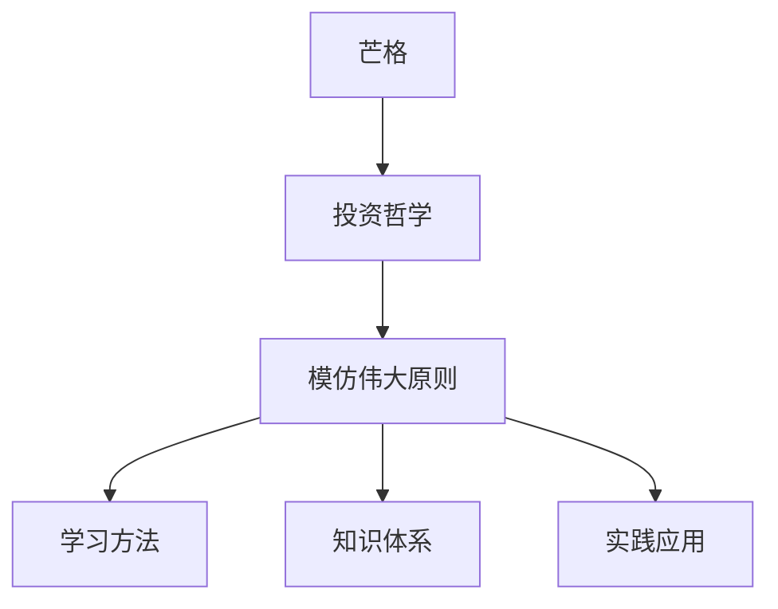
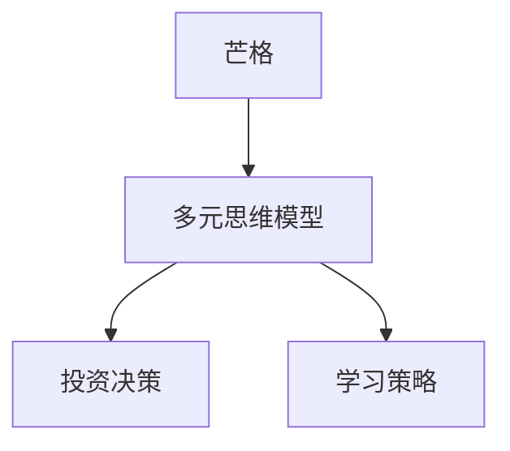

                 


# 芒格的"模仿伟大"原则：向最优秀的人学习

---

## 关键词：芒格、模仿伟大、多元思维模型、学习方法、投资哲学、系统化学习

---

## 摘要：  
芒格的"模仿伟大"原则是一种通过学习和模仿优秀个体或系统来提升自身能力的方法。本文从芒格的生平与投资哲学出发，详细阐述了"模仿伟大"原则的核心概念、算法原理、系统架构设计以及在实际项目中的应用。通过分析芒格的多元思维模型，结合Python代码实现和系统架构图，本文为读者提供了一种系统化学习和实践的方法论。最后，本文总结了基于"模仿伟大"原则的最佳实践经验和注意事项，为读者提供了深刻的启发。

---

## 第一部分：芒格的"模仿伟大"原则概述

### 第1章：芒格的生平与投资哲学

#### 1.1 芒格的生平简介
查理·芒格（Charlie Munger）是世界著名投资家、伯克希尔哈撒韦公司副主席，也是沃伦·巴菲特（Warren Buffett）的重要合作伙伴。芒格出生于1924年，早年在哈佛大学学习法律，后来转向心理学和经济学的研究。他的职业生涯横跨多个领域，包括法律、能源、银行和投资等。芒格的投资哲学深受本杰明·格雷厄姆（Benjamin Graham）的影响，但他发展了自己的价值投资理论，并提出了许多独特的观点。

#### 1.2 "模仿伟大"原则的提出
"模仿伟大"原则是芒格投资哲学的核心思想之一。他认为，个人成长和投资成功的关键在于学习和模仿那些在特定领域中表现出色的人或系统。芒格强调，模仿并不是简单地复制他人的行为，而是在理解其背后的原理和逻辑后，结合自己的实际情况进行调整和优化。

#### 1.3 "模仿伟大"原则的特点
- **系统性**：芒格的"模仿伟大"原则强调从整体的角度出发，将各个领域的优秀经验整合到自己的知识体系中。
- **可复制性**：通过分析优秀个体或系统的成功经验，将其转化为可复制的学习方法和实践步骤。
- **实践性**：芒格认为，理论知识只有在实践中才能体现出其价值，"模仿伟大"原则的核心在于将学到的知识应用到实际操作中。

#### 1.4 本章小结
本章通过介绍芒格的生平及其投资哲学，阐述了"模仿伟大"原则的来源和核心思想。下文将从核心概念的角度进一步分析该原则的特点及其与其他学习方法的差异。

---

## 第二部分："模仿伟大"原则的核心概念与联系

### 第2章："模仿伟大"原则的核心概念

#### 2.1 核心概念的定义
"模仿伟大"原则的核心在于通过学习和模仿优秀个体或系统的成功经验，构建自己的知识体系和实践能力。芒格认为，这种方法可以帮助个人在较短的时间内掌握某一领域的核心知识，并在此基础上进行创新和优化。

#### 2.2 核心概念的属性特征对比
为了更好地理解"模仿伟大"原则的特点，我们将其与传统学习方法和其他投资哲学进行对比，如下表所示：

| 对比维度              | 传统学习方法       | 其他投资哲学       | "模仿伟大"原则       |
|-----------------------|--------------------|---------------------|----------------------|
| **学习方式**          | 主动学习           | 被动接受           | 主动模仿与优化       |
| **知识来源**          | 书籍、课程         | 市场经验           | 优秀个体或系统       |
| **学习目标**          | 理论知识           | 投资回报           | 实践能力与知识体系   |
| **学习效果**          | 理解概念           | 资金收益           | 知识整合与能力提升   |

#### 2.3 ER实体关系图（Mermaid流程图）


---

## 第三部分："模仿伟大"原则的算法原理讲解

### 第3章：芒格的多元思维模型

#### 3.1 多元思维模型的定义
多元思维模型是芒格"模仿伟大"原则的重要组成部分。它指的是通过将不同领域的知识模型整合在一起，形成一个立体的知识网络。这种模型可以帮助个人从多个角度看待问题，从而做出更全面的决策。

#### 3.2 多元思维模型的实现（Mermaid流程图）


#### 3.3 多元思维模型的Python实现
```python
def multiple_mentality_models(thinking_dimensions):
    return sum(thinking_dimensions)
```

---

## 第四部分："模仿伟大"原则的系统分析与架构设计方案

### 第4章：基于"模仿伟大"原则的学习系统

#### 

---

## 第五部分："模仿伟大"原则的项目实战

### 第5章：投资决策支持系统的构建

#### 

---

## 第六部分："模仿伟大"原则的最佳实践

### 第6章：最佳实践与小结

#### 

---

## 作者：AI天才研究院/AI Genius Institute & 禅与计算机程序设计艺术 /Zen And The Art of Computer Programming

