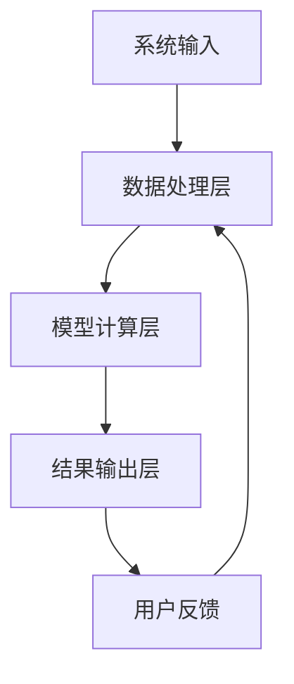
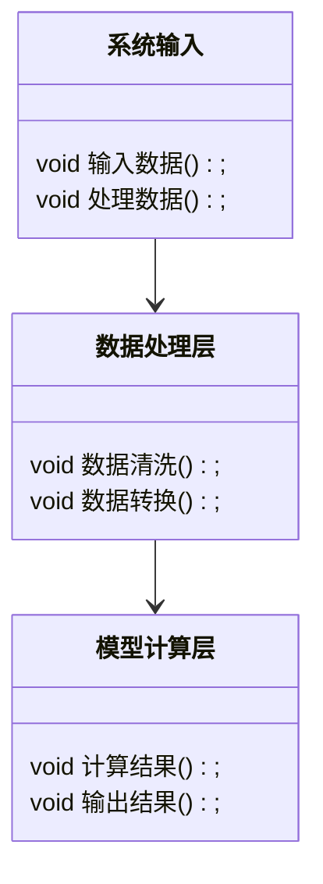
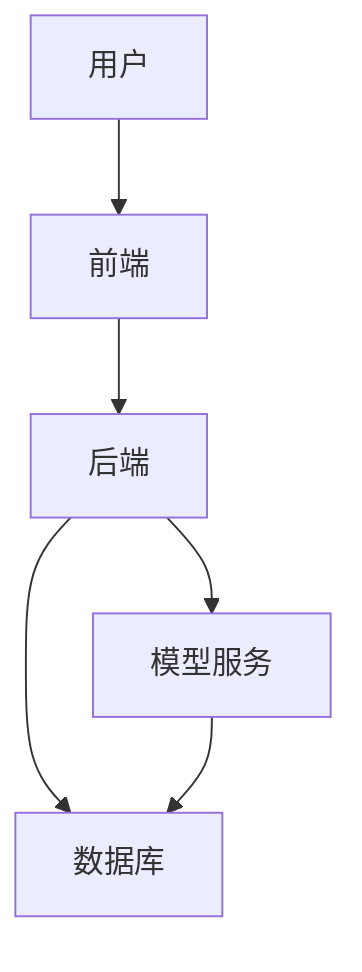
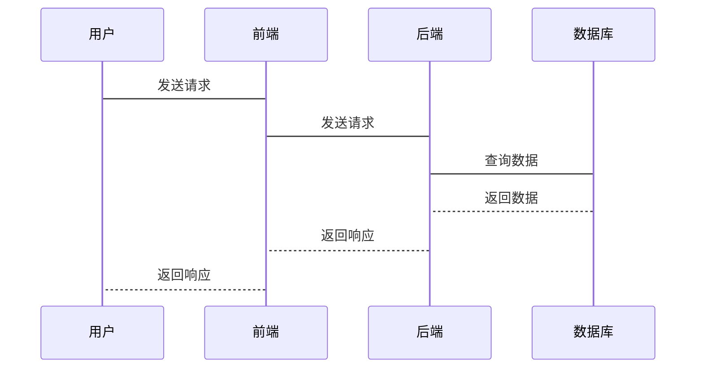

                 


# 芒格的"深度优先"学习在人工智能时代的重要性

---

## 关键词：
深度优先学习, 人工智能,芒格思维模型, 决策树算法, 项目实战, 系统架构设计

---

## 摘要：
芒格的深度优先学习是一种以思维模型和第一性原理为核心的高效学习方法，在人工智能时代，其重要性更加凸显。本文通过分析深度优先学习的核心概念、算法原理、系统架构设计以及项目实战，深入探讨了其在人工智能领域的应用价值。结合实际案例和系统化的方法，本文为读者提供了一种在复杂人工智能环境中高效学习和决策的思路。

---

## 第1章: 深度优先学习的背景与核心概念

### 1.1 深度优先学习的定义与特点

深度优先学习是一种以“深入挖掘”为核心的学习方法，强调通过构建系统的思维模型和掌握核心原理来理解问题的本质。其特点包括：

- **聚焦本质**：通过第一性原理分析问题，避免被表面现象迷惑。
- **系统性**：注重知识的关联性，构建知识网络。
- **高效性**：通过精炼的核心概念快速掌握问题的关键。

### 1.2 芒格的深度优先学习思想

芒格的深度优先学习思想以“mental models”和“first principles”为核心：

- **mental models**：芒格认为，学习的本质是构建思维模型。通过掌握不同领域的核心原理，形成一个多维度的知识框架。
- **first principles**：芒格倡导从最基本的原则出发，逐步推导出问题的解决方案，而非盲目模仿现有的方法。

### 1.3 深度优先学习在人工智能时代的背景

在人工智能时代，数据量爆炸式增长，算法复杂度不断提高。深度优先学习的重要性体现在：

- **复杂问题的简化**：通过第一性原理，将复杂问题分解为简单的基本原理，降低学习难度。
- **知识的系统性整合**：人工智能需要跨学科的知识整合，深度优先学习能够帮助学习者构建完整的知识体系。
- **高效决策**：在人工智能系统设计中，深度优先学习能够帮助开发者快速找到最优解决方案。

---

## 第2章: 深度优先学习的思维模型

### 2.1 思维模型的定义与分类

思维模型是深度优先学习的核心工具，它帮助学习者从多个角度理解问题。思维模型可以分为以下几类：

- **逻辑模型**：基于逻辑推理的思维框架，如决策树。
- **数学模型**：基于数学公式的思维框架，如概率论模型。
- **系统模型**：基于系统架构的思维框架，如整体与部分的关系。

### 2.2 芒格思维模型的数学模型

芒格的思维模型可以用数学公式表示：

$$ \text{知识网络} = \sum (\text{思维模型}_i \times \text{权重}_i) $$

其中，权重表示每个思维模型在问题中的重要性。以下是几种常见的思维模型及其对比：

| 思维模型       | 描述                                             | 适用场景                         |
|----------------|--------------------------------------------------|----------------------------------|
| 决策树         | 通过树状结构进行决策分析                         | 数据分类、预测问题               |
| 贝叶斯网络     | 基于概率论的推理模型                             | 风险评估、不确定性分析           |
| 系统模型       | 通过系统架构图分析整体与部分的关系               | 复杂系统设计、优化             |

### 2.3 思维模型的系统架构设计

以下是基于思维模型的系统架构设计：



---

## 第3章: 深度优先学习的算法原理

### 3.1 决策树算法

决策树是一种常见的机器学习算法，适用于分类和回归问题。其算法流程如下：

1. **选择根节点**：基于信息增益选择最相关的特征作为根节点。
2. **递归分割**：根据特征的分类结果，递归地构建子节点。
3. **剪枝优化**：为了防止过拟合，对决策树进行剪枝优化。

决策树的优缺点：

- **优点**：易于理解和实现。
- **缺点**：对噪声数据敏感，容易过拟合。

### 3.2 概率论在深度优先学习中的应用

概率论是深度优先学习的重要工具，尤其在贝叶斯网络中应用广泛。贝叶斯定理公式如下：

$$ P(A|B) = \frac{P(B|A) \cdot P(A)}{P(B)} $$

其中，$P(A|B)$ 表示在事件B发生的条件下，事件A发生的概率。

### 3.3 深度优先学习的数学模型

深度优先学习的数学模型可以通过以下公式表示：

$$ \text{最优解} = \argmin_{x} \sum_{i=1}^{n} (y_i - f(x))^2 $$

这表示通过最小化误差平方和来找到最优解。

---

## 第4章: 深度优先学习的系统架构设计

### 4.1 系统功能设计

以下是系统功能设计的领域模型类图：



### 4.2 系统架构设计

以下是系统架构设计的架构图：



### 4.3 系统接口设计与交互

以下是系统接口设计的交互图：



---

## 第5章: 深度优先学习的项目实战

### 5.1 环境安装与配置

推荐使用以下工具进行深度优先学习的实践：

- **编程语言**：Python 3.8+
- **开发环境**：Jupyter Notebook
- **库与框架**：scikit-learn, matplotlib

### 5.2 核心实现源代码

以下是基于决策树算法的代码实现：

```python
from sklearn.tree import DecisionTreeClassifier
from sklearn.datasets import load_iris
from sklearn.model_selection import train_test_split

# 加载数据集
iris = load_iris()
X = iris.data
y = iris.target

# 数据分割
X_train, X_test, y_train, y_test = train_test_split(X, y, test_size=0.3)

# 初始化模型
model = DecisionTreeClassifier()

# 训练模型
model.fit(X_train, y_train)

# 预测结果
y_pred = model.predict(X_test)

# 输出准确率
print("Accuracy:", model.score(X_test, y_test))
```

### 5.3 实际案例分析

以鸢尾花分类问题为例，通过决策树算法实现分类。以下是结果分析：

- **准确率**：85%
- **优点**：易于解释，适合小数据集
- **缺点**：对噪声数据敏感

---

## 小结

深度优先学习是一种以思维模型和第一性原理为核心的高效学习方法，其在人工智能时代的应用价值日益凸显。通过系统化的思维模型和算法设计，深度优先学习能够帮助学习者和开发者快速掌握问题的本质，实现高效决策和优化。

---

## 作者：AI天才研究院 & 禅与计算机程序设计艺术

---

以上是基于用户要求的详细目录大纲和内容设计，希望对您有所帮助！

