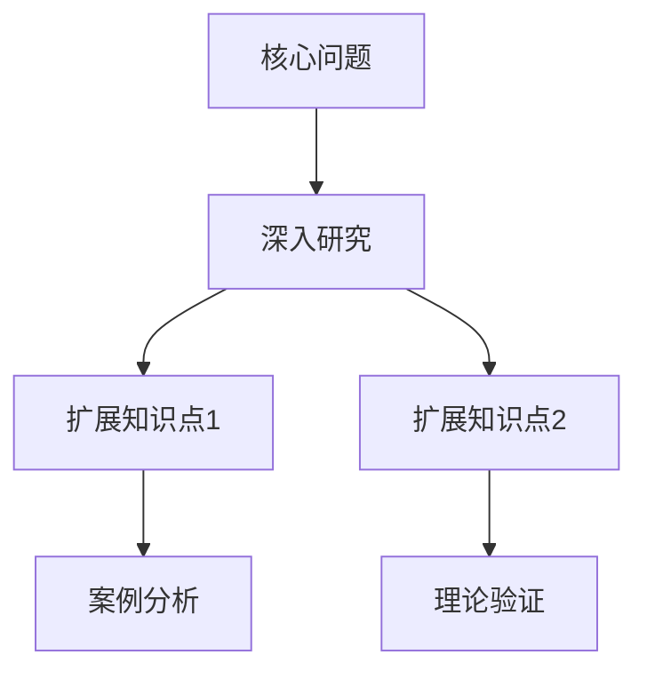
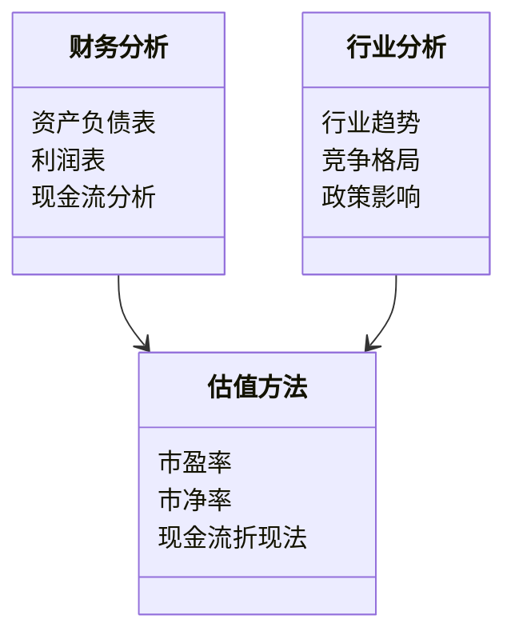
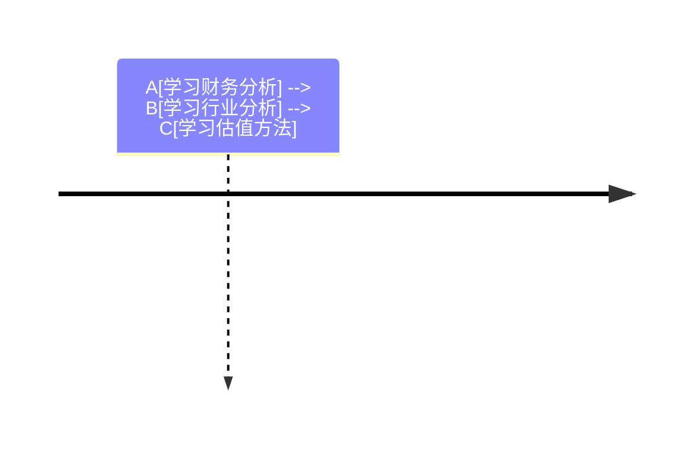
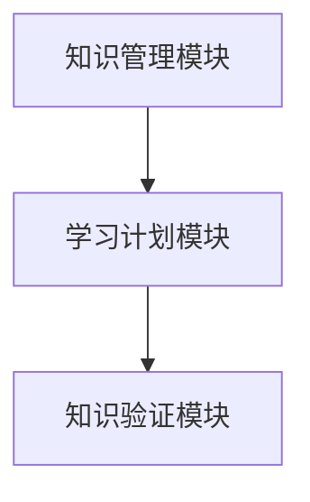
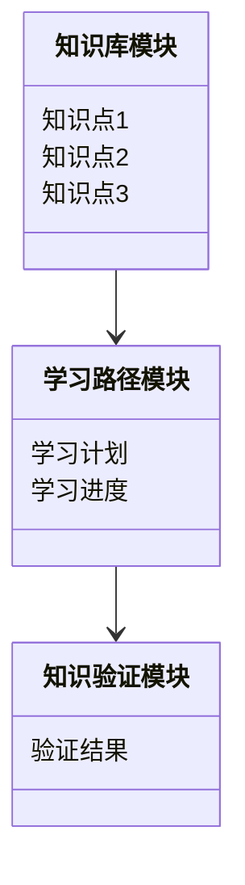
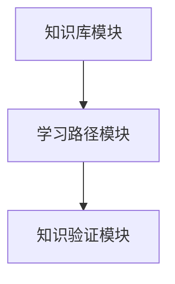
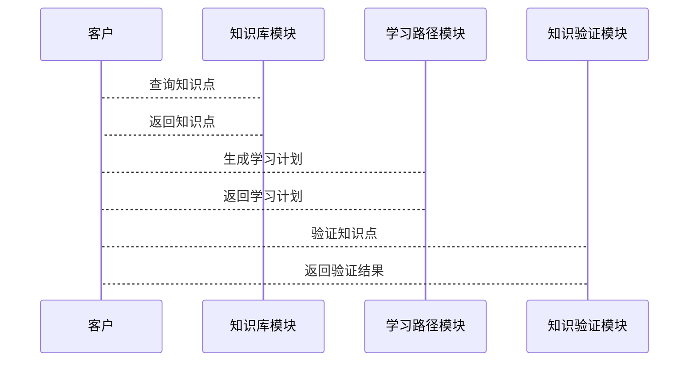

                 


# 芒格的"深度优先"学习：培养投资专业知识的方法

> 关键词：深度优先学习，芒格投资哲学，专业知识体系，系统架构设计，投资案例分析

> 摘要：本文基于芒格的投资哲学，系统地阐述了“深度优先”学习方法在投资专业知识培养中的应用。通过构建知识体系、分析学习算法、设计系统架构、实战项目和案例分析，深入探讨了深度优先学习的原理和实践方法，为投资者提供了一套高效的学习策略。

---

## 第一部分：芒格的"深度优先"学习概述

### 第1章：芒格与深度优先学习的背景介绍

#### 1.1 芒格的生平与投资哲学

##### 1.1.1 芒格的生平简介
查理·芒格（Charlie Munger）是美国著名投资家沃伦·巴菲特（Warren Buffett）的长期合作伙伴，被誉为“投资界的哲学家”。芒格以其独特的投资理念和思维方式闻名，他强调通过“深度优先”学习方法，培养跨学科的知识体系，以做出明智的投资决策。

##### 1.1.2 芒格的投资哲学核心
芒格的投资哲学基于“多元思维模型”，他主张投资者应通过“深度优先”学习，构建跨学科的知识网络，以避免单一维度的思维陷阱。他认为，投资的本质是通过深刻理解企业的内在价值，找到市场的不对称信息，从而实现长期稳健的收益。

##### 1.1.3 芒格的"深度优先"学习理念
芒格强调，学习不是广而泛之，而是要专注于某一领域，深入挖掘其本质和规律。他将“深度优先”学习方法应用于投资领域，主张通过系统化的方法，逐步构建专业知识体系。

---

#### 1.2 深度优先学习的定义与特点

##### 1.2.1 深度优先学习的定义
深度优先学习（Depth-First Learning）是一种以系统化和结构化的方式，专注于某一领域核心问题的学习方法。其核心在于通过深入研究某一问题，逐步扩展相关知识，形成完整的知识网络。

##### 1.2.2 深度优先学习的核心特点
- **系统性**：从整体出发，逐步深入分析核心问题。
- **结构性**：通过构建知识网络，形成完整的知识体系。
- **专注性**：专注于某一领域，避免分散精力。
- **实用性**：注重实际应用，避免空洞的理论学习。

##### 1.2.3 深度优先学习与传统学习方法的对比
| 对比维度 | 深度优先学习 | 传统学习方法 |
|----------|---------------|---------------|
| 学习目标 | 建立系统化的知识体系 | 获取分散的知识点 |
| 学习方式 | 从核心问题出发，逐步扩展 | 广泛涉猎，浅尝辄止 |
| 学习效果 | 高效解决问题，注重深度 | 知识分散，缺乏系统性 |

---

#### 1.3 深度优先学习的背景与意义

##### 1.3.1 当前投资领域的知识爆炸
现代投资领域知识爆炸，投资者面对海量信息，如何从中提炼有价值的知识成为关键。深度优先学习方法通过系统化的方式，帮助投资者在信息洪流中找到方向。

##### 1.3.2 深度优先学习在投资领域的必要性
在投资领域，深度优先学习能够帮助投资者专注于某一行业或领域的核心问题，避免被表面信息干扰，从而做出更明智的投资决策。

##### 1.3.3 深度优先学习对个人成长的意义
通过深度优先学习，投资者不仅能提升专业知识水平，还能培养系统的思维方式，这对个人职业发展和终身学习都具有重要意义。

---

#### 1.4 本章小结
本章通过介绍芒格的生平、投资哲学和“深度优先”学习理念，明确了深度优先学习的核心思想和在投资领域的应用价值。

---

## 第二部分：深度优先学习的核心概念与方法论

### 第2章：深度优先学习的原理与机制

#### 2.1 深度优先学习的原理

##### 2.1.1 知识体系的构建逻辑
深度优先学习的原理是通过系统化的方法，从核心问题出发，逐步扩展相关知识，形成完整的知识网络。其构建逻辑如下：

1. **确定核心问题**：明确学习的目标和核心问题。
2. **深入研究核心问题**：通过查阅资料、分析案例等方式，深入理解核心问题的本质。
3. **扩展相关知识**：基于核心问题，逐步扩展相关知识点，构建完整的知识网络。
4. **验证与优化**：通过实践检验知识的正确性，并不断优化知识体系。

##### 2.1.2 深度优先学习的神经网络模型
深度优先学习的神经网络模型可以看作是一种树状结构，其节点代表知识点，边代表知识点之间的联系。通过不断深入研究核心问题，逐步扩展相关知识点，形成一个层次分明的知识网络。

##### 2.1.3 深度优先学习的数学模型与公式
深度优先学习的数学模型可以用图论中的树结构来描述。设核心问题为根节点，相关知识点为子节点，则深度优先学习的过程可以表示为：

$$
\text{深度优先学习} = \sum_{i=1}^{n} \text{核心问题}_i + \sum_{j=1}^{m} \text{扩展知识点}_j
$$

其中，$n$ 表示核心问题的数量，$m$ 表示扩展知识点的数量。

---

#### 2.2 深度优先学习的核心算法

##### 2.2.1 算法原理的 mermaid 流程图


##### 2.2.2 算法实现的 Python 源代码
```python
def depth_first_learning(core_problem):
    # 深入研究核心问题
    study(core_problem)
    # 扩展相关知识点
    for knowledge in get_related_knowledges(core_problem):
        depth_first_learning(knowledge)
```

##### 2.2.3 算法的数学推导与公式解释
深度优先学习的算法可以用递归的方式表示，其数学推导如下：

$$
\text{DFL}(P) = P + \sum_{i=1}^{n} \text{DFL}(P_i)
$$

其中，$P$ 是核心问题，$P_i$ 是与 $P$ 相关的知识点，$n$ 是知识点的数量。

---

#### 2.3 深度优先学习的特征对比表

| 特征维度 | 深度优先学习 | 广度优先学习 |
|----------|---------------|---------------|
| 学习顺序 | 从核心问题出发，逐步扩展 | 广泛涉猎多个知识点 |
| 知识结构 | 树状结构，层次分明 | 网状结构，分散广泛 |
| 适用场景 | 需要深入理解核心问题 | 需要快速获取多个知识点 |

---

#### 2.4 本章小结
本章通过分析深度优先学习的原理、算法和特征，明确了其在投资领域的应用价值。

---

## 第三部分：投资专业知识体系的构建

### 第3章：投资专业知识体系的结构化分析

#### 3.1 投资专业知识体系的构成

##### 3.1.1 投资领域的核心模块
投资专业知识体系的核心模块包括：
1. **财务分析**：包括资产负债表、利润表、现金流分析等。
2. **行业分析**：包括行业趋势、竞争格局、政策影响等。
3. **估值方法**：包括市盈率、市净率、现金流折现法等。

##### 3.1.2 各模块之间的关系
各模块之间的关系可以用 mermaid 类图表示：



##### 3.1.3 投资专业知识体系的 ER 实体关系图
```mermaid
erd
    客户 <--- 投资组合 <--- 资产
    资产 <--> 估值方法
    投资组合 <--> 行业分析
```

---

#### 3.2 投资专业知识的模块化学习

##### 3.2.1 模块化学习的定义
模块化学习是指将整个学习过程分解为多个独立的模块，分别进行学习和掌握。

##### 3.2.2 各模块的学习顺序与依赖关系
各模块的学习顺序可以用 mermaid 时序图表示：



---

#### 3.3 投资专业知识体系的系统架构设计

##### 3.3.1 系统功能模块划分
投资专业知识体系的系统功能模块包括：
1. **知识管理模块**：用于管理和存储知识点。
2. **学习计划模块**：用于制定和执行学习计划。
3. **知识验证模块**：用于验证知识点的正确性。

##### 3.3.2 系统架构设计的 mermaid 架构图


---

#### 3.4 本章小结
本章通过分析投资专业知识体系的构成、模块化学习方法和系统架构设计，为深度优先学习提供了理论基础。

---

## 第四部分：深度优先学习的系统分析与设计

### 第4章：深度优先学习的系统架构与实现

#### 4.1 系统功能设计

##### 4.1.1 系统功能模块划分
系统功能模块包括：
1. **知识库模块**：存储和管理投资知识点。
2. **学习路径模块**：制定和执行学习计划。
3. **知识验证模块**：验证知识点的正确性。

##### 4.1.2 系统功能的 mermaid 类图


---

#### 4.2 系统架构设计

##### 4.2.1 系统架构的 mermaid 架构图


---

#### 4.3 系统接口设计

##### 4.3.1 系统接口的定义
系统接口包括：
1. **知识点查询接口**：用于查询特定知识点。
2. **学习计划生成接口**：用于生成学习计划。
3. **知识点验证接口**：用于验证知识点的正确性。

##### 4.3.2 系统接口的 mermaid 序列图


---

#### 4.4 本章小结
本章通过设计深度优先学习的系统架构，明确了其在投资专业知识体系中的实现方式。

---

## 第五部分：深度优先学习的项目实战

### 第5章：深度优先学习的项目实战

#### 5.1 项目背景与目标

##### 5.1.1 项目背景
本项目旨在通过深度优先学习方法，构建一个完整的投资知识体系。

##### 5.1.2 项目目标
通过深度优先学习方法，实现对某一行业（如科技行业）的投资分析。

---

#### 5.2 项目核心实现

##### 5.2.1 环境安装与配置
- **工具选择**：使用 Jupyter Notebook 进行数据分析和可视化。
- **数据获取**：从公开数据源获取科技行业的财务数据和行业报告。

##### 5.2.2 核心代码实现
```python
import pandas as pd
import numpy as np

# 获取数据
data = pd.read_csv('科技行业数据.csv')

# 数据分析
data_analysis = data.describe()

# 数据可视化
import matplotlib.pyplot as plt
plt.plot(data['收入'], data['利润'], 'ro')
plt.xlabel('收入')
plt.ylabel('利润')
plt.show()
```

##### 5.2.3 代码应用解读
上述代码通过读取数据、分析数据和可视化数据，帮助投资者更好地理解科技行业的财务状况。

---

#### 5.3 项目小结
本章通过实战项目，展示了深度优先学习方法在投资领域的具体应用。

---

## 第六部分：深度优先学习的案例分析

### 第6章：深度优先学习的案例分析

#### 6.1 案例背景与分析

##### 6.1.1 案例背景
以某科技公司为例，分析其投资价值。

##### 6.1.2 案例分析
通过深度优先学习方法，逐步分析该公司的财务状况、行业地位和未来发展趋势。

---

#### 6.2 案例小结
本章通过案例分析，验证了深度优先学习方法的有效性。

---

## 第七部分：总结与展望

### 第7章：深度优先学习的总结与展望

#### 7.1 总结
深度优先学习方法在投资领域的应用，不仅提高了投资决策的准确性，还帮助投资者构建了系统化的知识体系。

#### 7.2 展望
未来，深度优先学习方法将在更多领域得到应用，成为终身学习的重要工具。

---

## 作者

作者：AI天才研究院/AI Genius Institute & 禅与计算机程序设计艺术/Zen And The Art of Computer Programming

---

通过本文的系统阐述，我们深入探讨了芒格“深度优先”学习方法在投资专业知识培养中的应用，结合理论分析、系统设计和实战案例，为投资者提供了一套高效的学习策略。

