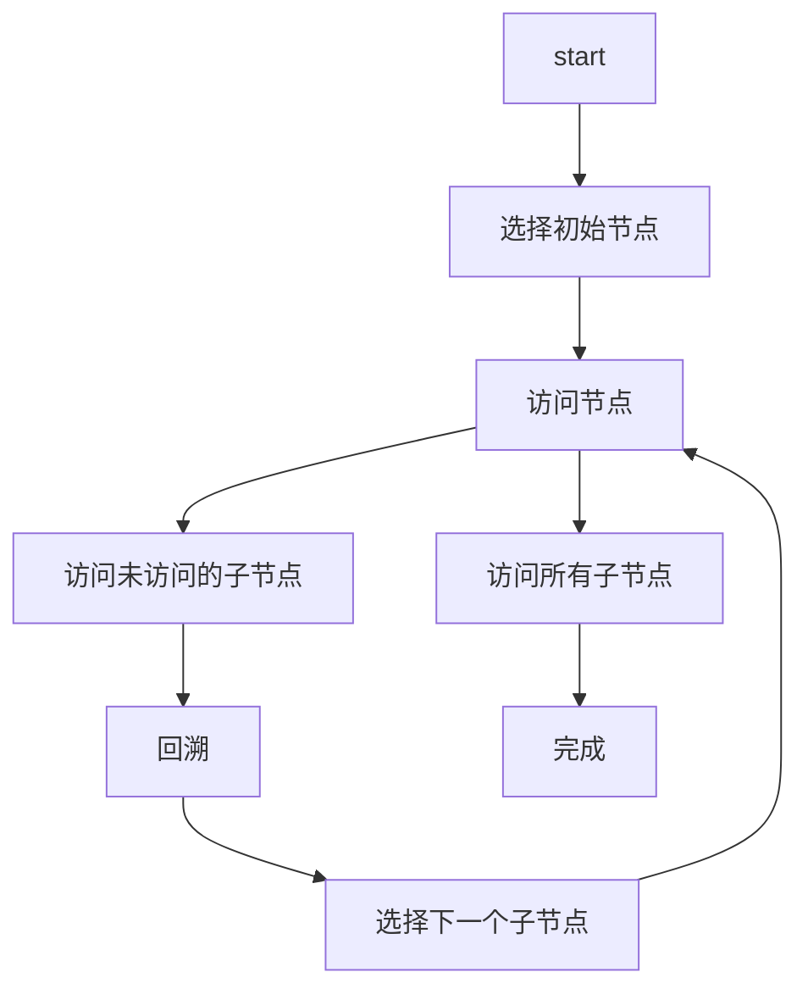
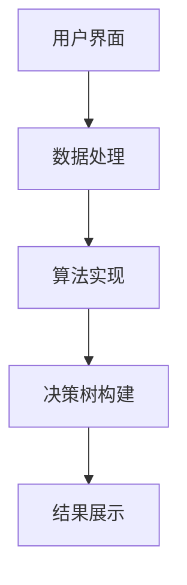
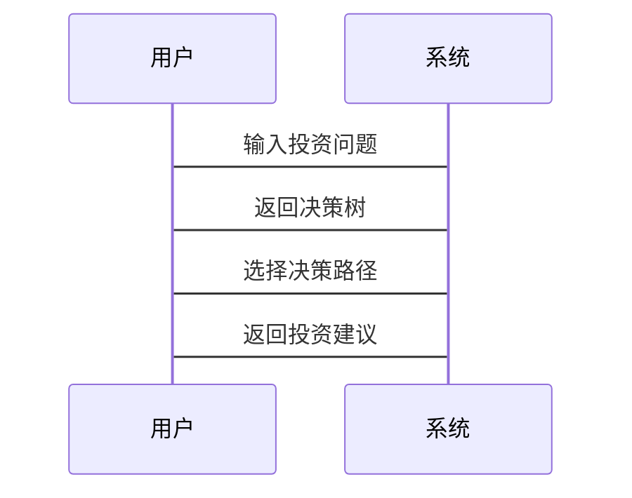

                 


# 芒格的“深度优先”学习：培养投资专业知识的方法

> 关键词：芒格，深度优先学习，投资专业知识，决策树，系统化投资方法

> 摘要：本文详细探讨了芒格的“深度优先”学习方法在投资专业知识培养中的应用。通过系统化的方法，结合深度优先搜索算法和决策树模型，本文分析了如何构建投资决策体系，并通过实际案例展示了如何将这种方法应用于投资实战。文章从理论到实践，结合技术语言和专业分析，为读者提供了一套完整的投资学习和决策框架。

---

## 第一部分: 芒格的深度优先学习概述

### 第1章: 深度优先学习的起源与背景

#### 1.1 芒格的深度优先学习方法

##### 1.1.1 深度优先学习的定义
深度优先学习（Depth-First Learning）是一种系统化的学习方法，其核心理念是通过递归的方式，逐步深入地探索某一领域的问题。这种方法类似于计算机科学中的深度优先搜索算法（DFS），通过不断深入挖掘问题的核心，构建完整的知识体系。

##### 1.1.2 芒格的生平与投资理念
查理·芒格（Charlie Munger）是著名的投资家、作家和心理学家，他以其独特的思维方式和投资理念闻名。芒格强调“反向思考”（Inversion）和“多学科思维模型”，他的投资理念深刻影响了深度优先学习方法的应用。

##### 1.1.3 深度优先学习在投资中的应用
深度优先学习在投资中的应用，主要体现在对投资问题的递归分析和决策树的构建。通过将复杂的投资问题分解为多个层次，逐一深入分析每个子问题，最终构建出完整的投资决策体系。

#### 1.2 深度优先学习的核心概念

##### 1.2.1 树状结构与决策路径
深度优先学习的核心是树状结构，其中每个节点代表一个问题或决策点，分支代表可能的选择。通过深度优先搜索，我们可以逐步深入探索每个分支，找到最优的投资路径。

##### 1.2.2 投资决策的层次化分析
深度优先学习强调层次化分析，即将投资问题分解为多个层次，从宏观的市场分析到微观的个股研究，逐步深入分析每个层次的问题。

##### 1.2.3 深度优先学习的数学模型
深度优先学习的数学模型可以表示为一棵决策树，其中每个节点代表一个决策点，分支代表可能的行动。通过构建决策树，我们可以系统化地分析投资问题，并找到最优的决策路径。

---

### 第2章: 深度优先学习与广度优先学习的对比

#### 2.1 广度优先学习的特点

##### 2.1.1 广度优先学习的定义
广度优先学习（Breadth-First Learning）是一种从上至下、全面覆盖的学习方法，类似于广度优先搜索算法（BFS）。这种方法注重横向扩展知识面，但可能缺乏深度。

##### 2.1.2 广度优先学习的优点与缺点
- **优点**：覆盖面广，适合快速掌握多个领域的基础知识。
- **缺点**：缺乏深度，难以在特定领域构建系统的知识体系。

##### 2.1.3 广度优先学习在投资中的局限性
在投资中，广度优先学习可能导致投资者缺乏对某个领域的深入理解，难以做出准确的投资决策。

#### 2.2 深度优先学习的特点

##### 2.2.1 深度优先学习的定义
深度优先学习是一种从上至下、逐步深入的学习方法，注重构建系统的知识体系，类似于深度优先搜索算法（DFS）。

##### 2.2.2 深度优先学习的优点与缺点
- **优点**：知识体系完整，适合复杂问题的分析。
- **缺点**：可能忽略其他领域的重要信息。

##### 2.2.3 深度优先学习在投资中的优势
深度优先学习可以帮助投资者构建系统的投资决策体系，深入分析每个投资问题的核心，提高投资决策的准确性。

#### 2.3 两种学习方法的对比分析

##### 2.3.1 核心概念对比
- **广度优先学习**：注重横向扩展，覆盖面广。
- **深度优先学习**：注重纵向深入，构建系统知识体系。

##### 2.3.2 投资效果对比
- **广度优先学习**：适合初步了解多个投资领域。
- **深度优先学习**：适合深入研究某个投资领域，构建系统的投资决策体系。

##### 2.3.3 适用场景对比
- **广度优先学习**：适用于投资新手，快速掌握基础知识。
- **深度优先学习**：适用于投资专家，深入研究特定领域。

---

### 第3章: 深度优先学习的数学模型与算法

#### 3.1 深度优先搜索算法

##### 3.1.1 算法流程图


##### 3.1.2 算法实现代码
```python
def depth_first_search(graph, start_node):
    visited = set()
    path = []

    def dfs(node):
        if node not in visited:
            visited.add(node)
            path.append(node)
            for neighbor in graph[node]:
                dfs(neighbor)
        return path

    return dfs(start_node)
```

##### 3.1.3 算法的数学模型
深度优先搜索的数学模型可以用图论中的树结构表示，其中每个节点代表一个决策点，分支代表可能的选择。通过递归遍历树的节点，我们可以找到最优的投资路径。

#### 3.2 投资决策树的构建

##### 3.2.1 决策树的定义
投资决策树是一种用于分析投资决策问题的树状结构，其中每个节点代表一个决策点，分支代表可能的选择。

##### 3.2.2 决策树的构建过程
1. 确定投资问题的目标。
2. 分解投资问题为多个子问题。
3. 构建决策树的树状结构。
4. 计算每个决策点的期望值或概率。

##### 3.2.3 决策树的优化与剪枝
为了提高决策树的准确性和效率，可以通过剪枝技术去除冗余的分支，优化决策树的结构。

#### 3.3 投资决策的层次化分析

##### 3.3.1 层次化分析的定义
层次化分析是一种将复杂问题分解为多个层次的方法，每个层次代表一个决策点。

##### 3.3.2 层次化分析的步骤
1. 确定投资问题的目标。
2. 分解投资问题为多个层次。
3. 构建层次化分析的树状结构。
4. 计算每个层次的权重和概率。

##### 3.3.3 层次化分析的数学模型
层次化分析的数学模型可以用加权和公式表示：
$$
\text{权重和} = \sum_{i=1}^{n} w_i x_i
$$
其中，\(w_i\) 是第i个层次的权重，\(x_i\) 是第i个层次的值。

---

## 第4章: 深度优先学习的系统架构设计

### 第4.1 系统功能模块设计

#### 4.1.1 用户界面模块
用户界面模块包括投资问题的输入、决策树的构建和结果的展示。

#### 4.1.2 数据处理模块
数据处理模块负责处理投资数据，包括市场数据、财务数据等。

#### 4.1.3 算法实现模块
算法实现模块包括深度优先搜索算法和决策树的构建算法。

### 第4.2 系统架构图



### 第4.3 系统接口设计

#### 4.3.1 系统交互序列图



---

## 第5章: 项目实战

### 第5.1 环境安装

#### 5.1.1 安装Python
```bash
python --version
pip install --upgrade pip
```

#### 5.1.2 安装依赖库
```bash
pip install graphviz
pip install numpy
pip install pandas
```

### 第5.2 系统核心实现源代码

#### 5.2.1 深度优先搜索算法实现
```python
def depth_first_search(graph, start_node):
    visited = set()
    path = []

    def dfs(node):
        if node not in visited:
            visited.add(node)
            path.append(node)
            for neighbor in graph[node]:
                dfs(neighbor)
        return path

    return dfs(start_node)
```

#### 5.2.2 投资决策树的构建
```python
from graphviz import Digraph

def build_decision_tree(decision_points):
    graph = Digraph()
    for point in decision_points:
        graph.node(point)
    return graph
```

### 第5.3 案例分析与详细讲解

#### 5.3.1 案例分析
假设我们有一个投资问题，需要在股票A和股票B之间做出选择。我们可以通过深度优先搜索算法构建决策树，分析每个股票的优缺点，最终找到最优的投资路径。

#### 5.3.2 详细讲解
1. 确定投资问题的目标。
2. 分解投资问题为多个子问题。
3. 构建决策树的树状结构。
4. 计算每个决策点的期望值或概率。
5. 选择最优的投资路径。

### 第5.4 项目小结

通过深度优先搜索算法和决策树的构建，我们可以系统化地分析投资问题，找到最优的投资路径。这种方法不仅可以提高投资决策的准确性，还可以帮助投资者构建系统的知识体系。

---

## 第6章: 最佳实践、小结、注意事项与拓展阅读

### 6.1 最佳实践 tips
1. 在投资学习中，注重深度优先学习方法的应用。
2. 结合实际案例，逐步深入分析投资问题。
3. 定期回顾和优化投资决策体系。

### 6.2 小结
本文详细探讨了芒格的“深度优先”学习方法在投资专业知识培养中的应用。通过系统化的方法，结合深度优先搜索算法和决策树模型，我们可以构建完整的投资决策体系，提高投资决策的准确性。

### 6.3 注意事项
1. 投资决策需要结合实际情况，避免过于依赖理论模型。
2. 定期更新和优化投资决策体系，适应市场变化。

### 6.4 拓展阅读
1. 《芒格的“深度优先”学习方法》
2. 《系统化投资方法》
3. 《决策树在投资中的应用》

---

作者：AI天才研究院/AI Genius Institute & 禅与计算机程序设计艺术/Zen And The Art of Computer Programming

