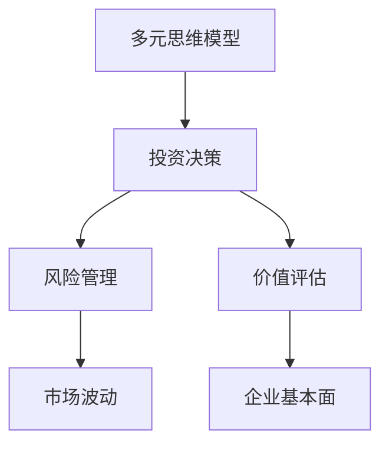
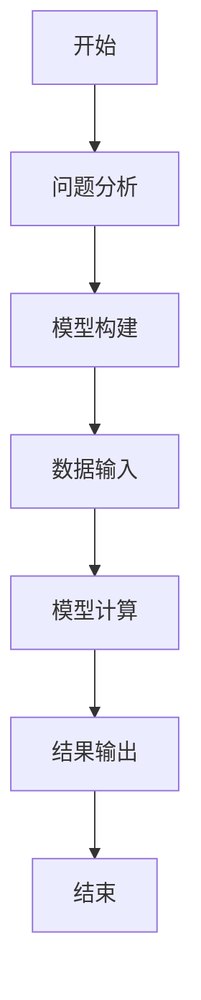
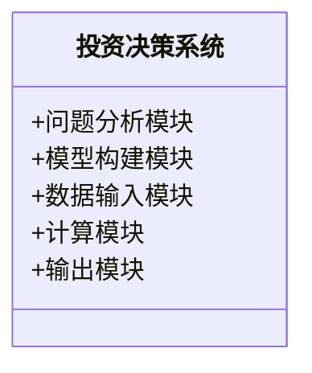

                 


# 芒格的"清晰思考"在投资决策中的重要性

## 关键词：芒格、清晰思考、投资决策、思维模型、风险管理、价值评估、决策优化

## 摘要：芒格的“清晰思考”是一种通过多元思维模型优化投资决策的独特方法，它强调对问题的深入分析和多维度考量，以帮助投资者做出更明智的选择。本文将从芒格思维模型的核心要素、算法原理、系统架构等多方面详细解析“清晰思考”在投资中的重要性，并通过实际案例分析其应用效果。

---

## 第1章: 芒格"清晰思考"的背景与重要性

### 1.1 芒格"清晰思考"的核心概念

#### 1.1.1 什么是"清晰思考"
芒格的“清晰思考”是一种通过多维度分析问题的思维方式，强调逻辑性和系统性，避免认知偏差。其核心在于将复杂问题拆解为简单易懂的元素，逐一分析后再综合判断。

#### 1.1.2 芒格"清晰思考"的特点
- **多维度分析**：从多个角度审视问题，避免单一视角的局限性。
- **逻辑性**：强调逻辑推理，确保每一步分析都有坚实的基础。
- **系统性**：将各个因素联系起来，形成一个完整的系统进行分析。

#### 1.1.3 芒格"清晰思考"的边界与外延
- **边界**：适用于需要深入分析和多维度考量的决策场景。
- **外延**：不仅限于投资领域，还可应用于生活中的各类决策。

### 1.2 芒格"清晰思考"在投资中的应用

#### 1.2.1 投资决策中的问题背景
投资决策常常面临信息不全、市场波动等复杂因素，需要投资者具备清晰的思维能力来应对不确定性。

#### 1.2.2 "清晰思考"如何解决投资问题
通过多元思维模型，芒格能够识别潜在风险和机会，避免盲目决策。

#### 1.2.3 投资决策中的关键要素
- 市场分析
- 企业基本面
- 风险管理

---

## 第2章: 芒格思维模型的核心要素

### 2.1 多元思维模型的定义与特点

#### 2.1.1 多元思维模型的定义
多元思维模型是一种将多个学科的基本原理和规律整合起来，用于分析问题的方法。

#### 2.1.2 多元思维模型的核心特征
- **多样性**：涵盖多个学科的视角。
- **系统性**：各模型之间相互关联，形成一个完整的系统。
- **实用性**：能够应用于实际决策中。

#### 2.1.3 多元思维模型与其他思维模型的对比
| 特性       | 多元思维模型         | 单一思维模型         |
|------------|----------------------|----------------------|
| 覆盖范围   | 广泛                 | 有限                 |
| 适用场景   | 复杂问题             | 简单问题             |
| 效果       | 更全面、准确         | 可能片面             |

### 2.2 芒格思维模型的实体关系图


---

## 第3章: 芒格"清晰思考"的算法原理

### 3.1 芒格"清晰思考"的算法流程



### 3.2 算法实现代码

```python
def 芒格思考算法(问题):
    思维模型 = 多元思维模型()
    问题分析 = 分解问题(问题)
    模型构建 = 构建模型(问题分析)
    数据输入 = 获取数据(模型构建)
    计算结果 = 计算模型(数据输入)
    输出结果 = 分析结果(计算结果)
    return 输出结果
```

### 3.3 数学模型与公式

#### 3.3.1 芒格思维模型的基本公式
$$ 思维模型 = \sum_{i=1}^{n} 思维维度_i $$

#### 3.3.2 芒格决策模型的优化公式
$$ 决策结果 = f(问题分析, 数据输入, 模型计算) $$

---

## 第4章: 芒格"清晰思考"的系统分析与架构设计

### 4.1 投资决策系统的功能设计

#### 4.1.1 系统功能模块
- 问题分析模块
- 模型构建模块
- 数据输入模块

### 4.2 投资决策系统的架构图



---

## 第5章: 项目实战与案例分析

### 5.1 投资决策系统的环境安装

```bash
pip install 芒格思维库
```

### 5.2 核心代码实现

```python
def 投资决策系统(输入数据):
    分析结果 = 分解问题(输入数据)
    模型构建 = 构建模型(分析结果)
    计算结果 = 计算模型(模型构建)
    输出结果 = 分析结果(计算结果)
    return 输出结果
```

### 5.3 案例分析

#### 5.3.1 案例背景
某公司基本面良好，但面临市场波动的风险。

#### 5.3.2 分析过程
1. 分解问题：基本面分析、市场分析。
2. 模型构建：构建多元思维模型。
3. 数据输入：输入财务数据和市场数据。
4. 计算结果：计算出投资风险和潜在收益。
5. 输出结果：建议投资。

---

## 第6章: 总结与展望

### 6.1 总结

芒格的“清晰思考”通过多元思维模型优化了投资决策过程，帮助投资者做出更明智的选择。

### 6.2 展望

未来，随着技术的发展，芒格思维模型将进一步融入人工智能和大数据分析，提升投资决策的效率和准确性。

---

## 作者：AI天才研究院 & 禅与计算机程序设计艺术

---

通过以上内容，芒格的“清晰思考”在投资决策中的重要性得以全面展示，从理论到实践，从算法到系统架构，均为读者提供了详实的参考和指导。

