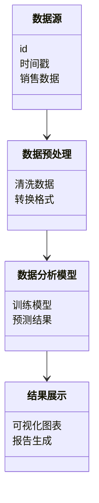

                 


# 芒格的"清晰思考"方法在复杂数据分析中的运用

## 关键词：芒格、清晰思考、数据分析、思维模型、复杂问题、决策优化

## 摘要

本文探讨了芒格的“清晰思考”方法如何在复杂数据分析中应用，通过多学科思维模型提升分析质量，优化决策过程，帮助数据分析师高效解决问题。

---

## 第1章 芒格的“清晰思考”方法

### 1.1 芒格的背景与思想体系

查理·芒格以其独特的“清晰思考”方法闻名，强调使用多学科思维模型来分析问题。这种方法的核心在于通过多个领域的知识来全面理解问题，避免单一视角的局限性。

### 1.2 “清晰思考”方法在数据分析中的重要性

在数据分析中，清晰思考方法帮助分析师构建全面的分析框架，优化决策过程，提升分析质量。

---

## 第2章 芒格思维模型的核心概念

### 2.1 多学科思维模型

多学科模型通过整合多个学科的原理，提供全面的分析视角。例如，经济学的供需理论和心理学的行为模型结合，帮助预测市场趋势。

### 2.2 格栅式决策系统

格栅系统通过多个模型的协同作用，提升决策的准确性和全面性。每个模型作为一个筛选器，确保问题分析的全面性。

### 2.3 芒格思维模型的对比分析

| 模型 | 描述 | 优点 | 局限性 |
|------|------|------|--------|
| 经济模型 | 分析市场行为 | 预测市场趋势 | 忽略非理性因素 |
| 心理模型 | 描述行为动机 | 理解决策动机 | 无法量化 |

### 2.4 数据关系的ER图展示

```mermaid
erDiagram
    customer[客户] {
        id : int
        name : string
        age : int
    }
    product[产品] {
        id : int
        name : string
        price : float
    }
    sale[销售] {
        id : int
        customer_id : int
        product_id : int
        sale_date : date
    }
    customer -> sale : 购买
    product -> sale : 被购买
```

---

## 第3章 数据分析的思维框架

### 3.1 数据分析的基本原理

数据分析是通过数据预处理、建模和结果解释，从数据中提取有价值的信息的过程。芒格方法强调在每个步骤中应用多模型分析。

### 3.2 数据预处理中的多模型应用

数据清洗阶段，使用统计模型识别异常值；特征工程阶段，利用领域模型提取有效特征。

### 3.3 数据分析模型的选择

根据数据类型和业务需求，选择合适的模型，如线性回归或决策树，并通过多模型对比优化结果。

---

## 第4章 复杂数据问题的分析与解决

### 4.1 问题场景介绍

以预测客户流失为例，分析客户行为数据，识别流失风险因素。

### 4.2 数据分析的思维模型应用

应用统计模型分析客户行为数据，结合心理模型预测客户流失概率，使用机器学习模型优化预测准确性。

---

## 第5章 系统分析与架构设计

### 5.1 问题场景介绍

设计一个实时数据分析系统，处理大量客户数据，预测销售趋势。

### 5.2 系统功能设计



### 5.3 系统架构设计


### 5.4 系统接口设计

设计REST API接口，实现数据输入、处理和结果输出。

---

## 第6章 项目实战

### 6.1 环境安装

安装Python、Pandas、Scikit-learn等工具。

### 6.2 核心实现代码

```python
import pandas as pd
from sklearn.model_selection import train_test_split
from sklearn.linear_model import LinearRegression

# 数据加载
data = pd.read_csv('sales.csv')

# 数据预处理
data.dropna(inplace=True)
data['date'] = pd.to_datetime(data['date'])

# 特征提取
features = data[['price', 'quantity']]
target = data['revenue']

# 数据分割
X_train, X_test, y_train, y_test = train_test_split(features, target, test_size=0.2)

# 模型训练
model = LinearRegression()
model.fit(X_train, y_train)

# 预测与评估
predictions = model.predict(X_test)
print('Predictions:', predictions)
```

### 6.3 代码解读

上述代码展示了如何加载数据，进行预处理，选择特征，训练模型并进行预测。模型选择基于经济模型和统计模型的应用。

---

## 第7章 最佳实践与小结

### 7.1 最佳实践

1. 在数据分析中，始终应用多学科思维模型。
2. 使用格栅系统优化决策过程。
3. 定期验证模型假设，确保分析结果的准确性。

### 7.2 注意事项

- 数据质量直接影响分析结果，需谨慎处理数据。
- 模型选择需结合业务需求和数据特征。
- 结果解释需清晰，避免误导决策。

### 7.3 未来趋势

随着AI的发展，结合更多学科模型的分析方法将更受重视。

---

## 作者：AI天才研究院 & 禅与计算机程序设计艺术

---

通过本文的详细讲解，读者可以理解并应用芒格的“清晰思考”方法，提升复杂数据分析的质量和效率。

