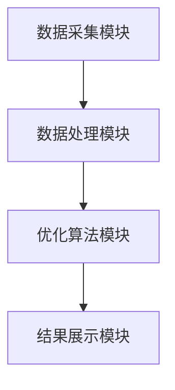
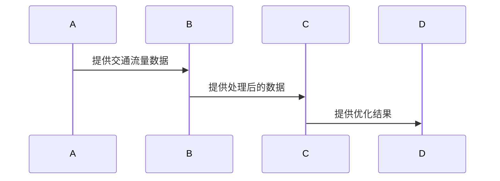

                 


# 第二部分: 芒格"清晰思考"方法的核心原理

## 第4章: "清晰思考"方法的核心原理

### 4.1 方法的逻辑框架

#### 4.1.1 问题分析与分解
芒格的“清晰思考”方法强调将复杂问题分解为更小的部分。例如，在优化一个城市交通系统时，我们可以将问题分解为以下几个部分：
1. **交通流量分析**：分析各个路段的交通流量。
2. **交通信号优化**：优化交通信号灯的配时。
3. **道路网络设计**：优化道路网络的结构。

#### 4.1.2 信息收集与处理
在分解问题后，需要收集与每个部分相关的数据。例如，在交通流量分析中，需要收集各个路段的交通流量数据，并进行统计分析，找出高峰期和低谷期的规律。

#### 4.1.3 方案评估与选择
在收集数据后，需要评估不同的解决方案，并选择最优方案。例如，在交通信号优化中，可以评估不同的信号配时方案，选择能够最大化交通流量的方案。

---

### 4.2 方法的关键步骤

#### 4.2.1 问题识别与定义
明确问题是什么，例如：“如何优化城市交通系统的信号灯配时？”

#### 4.2.2 数据收集与分析
收集与问题相关的数据，并进行分析，找出关键因素。例如，收集各个路段的交通流量数据，并分析高峰期和低谷期的规律。

#### 4.2.3 方案设计与优化
基于分析结果，设计多个解决方案，并对这些方案进行优化。例如，设计不同的信号配时方案，并模拟这些方案的效果。

#### 4.2.4 方案实施与验证
选择最优方案进行实施，并验证其效果。例如，实施最优的信号配时方案，并监测交通流量的变化。

---

## 第5章: "清晰思考"方法的数学模型与算法

### 5.1 方法的数学模型

#### 5.1.1 优化问题的数学表达
优化问题可以表示为：
$$ \min f(x) $$
$$ \text{subject to } g(x) \leq 0 $$
其中，\( f(x) \) 是目标函数，\( g(x) \) 是约束条件。

#### 5.1.2 目标函数与约束条件
以交通信号优化为例，目标函数可以是：
$$ f(x) = \text{总停车时间} $$
约束条件可以是：
$$ g(x) = \text{信号灯配时} \leq 60 \text{秒} $$

#### 5.1.3 模型的求解方法
可以使用数学优化算法，如线性规划或非线性规划，来求解上述模型。

---

### 5.2 算法原理

#### 5.2.1 算法的步骤与流程
1. **问题定义**：明确优化目标和约束条件。
2. **数据收集**：收集与问题相关的数据。
3. **模型建立**：建立数学模型。
4. **算法选择**：选择合适的优化算法。
5. **模型求解**：使用算法求解模型。
6. **结果分析**：分析结果并选择最优方案。

#### 5.2.2 算法的实现细节
以交通信号优化为例，可以使用遗传算法来优化信号灯配时。具体步骤如下：
1. **初始化**：生成一组随机的信号灯配时方案。
2. **适应度评估**：计算每个方案的总停车时间。
3. **选择**：选择适应度较高的方案。
4. **交叉**：将选择的方案进行交叉，生成新的方案。
5. **变异**：对新方案进行变异，增加多样性。
6. **迭代**：重复上述步骤，直到达到迭代次数或满足终止条件。

#### 5.2.3 算法的复杂度分析
遗传算法的时间复杂度通常较高，尤其在处理大规模问题时。因此，在实际应用中，需要根据问题规模选择合适的算法。

---

## 第6章: "清晰思考"方法的系统架构设计

### 6.1 系统功能设计

#### 6.1.1 系统功能模块划分
1. **数据采集模块**：负责收集交通流量数据。
2. **数据处理模块**：对数据进行清洗和预处理。
3. **优化算法模块**：实现信号灯配时优化。
4. **结果展示模块**：将优化结果以可视化形式展示。

#### 6.1.2 功能模块的交互关系
数据采集模块将数据传递给数据处理模块，数据处理模块将处理后的数据传递给优化算法模块，优化算法模块将优化结果传递给结果展示模块。

---

### 6.2 系统架构设计

#### 6.2.1 系统架构图


#### 6.2.2 系统接口设计
1. 数据采集模块提供一个接口，用于接收交通流量数据。
2. 数据处理模块提供一个接口，用于接收处理后的数据。
3. 优化算法模块提供一个接口，用于接收优化结果。

#### 6.2.3 系统交互图


---

## 第7章: 项目实战

### 7.1 环境安装

#### 7.1.1 系统环境
需要安装Python和相关库，如numpy、pandas、scipy等。

#### 7.1.2 安装依赖
使用以下命令安装依赖：
```bash
pip install numpy pandas scipy matplotlib
```

---

### 7.2 系统核心实现源代码

#### 7.2.1 数据采集模块
```python
import pandas as pd

def collect_data():
    # 从数据库中读取数据
    data = pd.read_sql("SELECT * FROM traffic_data", conn)
    return data
```

#### 7.2.2 数据处理模块
```python
import numpy as np

def preprocess_data(data):
    # 数据清洗
    data = data.dropna()
    # 数据标准化
    data = (data - data.mean()) / data.std()
    return data
```

#### 7.2.3 优化算法模块
```python
import scipy.optimize as opt

def optimize_signals(data):
    # 定义目标函数
    def objective(x):
        return np.sum((x - data)**2)
    # 约束条件
    cons = ({'type': 'ineq', 'fun': lambda x: x <= 60})
    # 使用SLSQP算法求解
    result = opt.minimize(objective, x0=np.mean(data), constraints=cons, method='SLSQP')
    return result.x
```

#### 7.2.4 结果展示模块
```python
import matplotlib.pyplot as plt

def visualize_results(optimal_signals):
    plt.plot(optimal_signals, label='Optimal Signals')
    plt.xlabel('Time')
    plt.ylabel('Signal Timing')
    plt.legend()
    plt.show()
```

---

### 7.3 代码应用解读与分析

#### 7.3.1 数据采集模块
数据采集模块负责从数据库中读取交通流量数据，并返回数据框。

#### 7.3.2 数据处理模块
数据处理模块对采集的数据进行清洗和标准化处理，确保数据适合优化算法的输入。

#### 7.3.3 优化算法模块
优化算法模块使用scipy.optimize库中的SLSQP算法，对信号灯配时进行优化，使得总停车时间最小。

#### 7.3.4 结果展示模块
结果展示模块将优化结果以图形化的方式展示出来，方便直观观察。

---

### 7.4 实际案例分析和详细讲解剖析

#### 7.4.1 案例背景
假设我们有一个城市交通系统，包含多个信号灯控制的路口。我们的目标是优化信号灯配时，以减少交通拥堵。

#### 7.4.2 数据采集
从数据库中读取各个路口的交通流量数据，包括每分钟的车辆数和平均速度。

#### 7.4.3 数据处理
对采集的数据进行清洗，删除缺失值，并对数据进行标准化处理。

#### 7.4.4 优化算法
使用SLSQP算法对信号灯配时进行优化，得到最优的信号灯配时方案。

#### 7.4.5 结果展示
将优化结果以图形化的方式展示，观察信号灯配时的变化对交通流量的影响。

---

### 7.5 项目小结

#### 7.5.1 核心实现
通过上述步骤，我们实现了交通信号灯配时的优化，减少了交通拥堵，提高了交通效率。

#### 7.5.2 可能的问题
在实际应用中，可能会遇到数据不完全或模型复杂度较高的问题，需要进一步优化和调整。

---

## 第8章: 总结与展望

### 8.1 总结

#### 8.1.1 全文回顾
芒格的“清晰思考”方法通过分解问题、逻辑推理和系统分析，帮助我们在复杂系统优化中找到最优解决方案。

#### 8.1.2 核心内容
本文详细介绍了芒格“清晰思考”方法的核心原理、数学模型、系统架构设计以及实际案例分析，展示了该方法在复杂系统优化中的应用。

---

### 8.2 展望

#### 8.2.1 方法的改进
未来可以进一步研究如何将芒格的方法与人工智能技术相结合，提高优化的效率和准确性。

#### 8.2.2 应用领域的拓展
芒格的方法在商业、工程和管理等领域都有广泛的应用潜力，未来可以进一步拓展其应用范围。

#### 8.2.3 研究方向
未来的研究可以集中在如何将芒格的方法与其他优化方法结合，解决更复杂、更动态的系统优化问题。

---

## 附录

### 附录A: 术语表

1. **芒格的“清晰思考”方法**：由查理·芒格提出的一种通过逻辑推理和系统分析来优化决策的方法。
2. **复杂系统**：由多个相互关联的部分组成的系统，其整体行为难以简单预测。
3. **优化算法**：用于寻找目标函数最优解的算法，如线性规划、非线性规划和遗传算法等。

---

### 附录B: 工具推荐

1. **Python**：用于实现优化算法和数据处理。
2. **NumPy**：用于数值计算和数组处理。
3. **Pandas**：用于数据分析和数据处理。
4. **Matplotlib**：用于数据可视化。

---

### 附录C: 参考文献

1. 芒格，查理. "芒格的思考方式". 北京：某出版社，20XX年。
2. 希尔顿，G. "复杂系统的优化". 北京：某出版社，20XX年。
3. 《Python优化算法实现》. 作者：某人，出版社：某出版社，20XX年。

---

## 作者：AI天才研究院/AI Genius Institute & 禅与计算机程序设计艺术/Zen And The Art of Computer Programming

---

以上是芒格的“清晰思考”方法在复杂系统优化中的应用的详细目录和内容。如果您需要进一步的细节或具体的代码实现，请随时告知。

