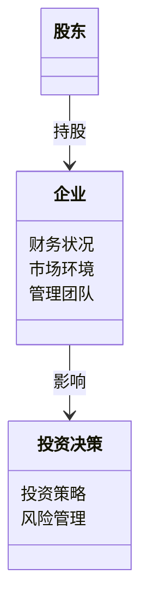
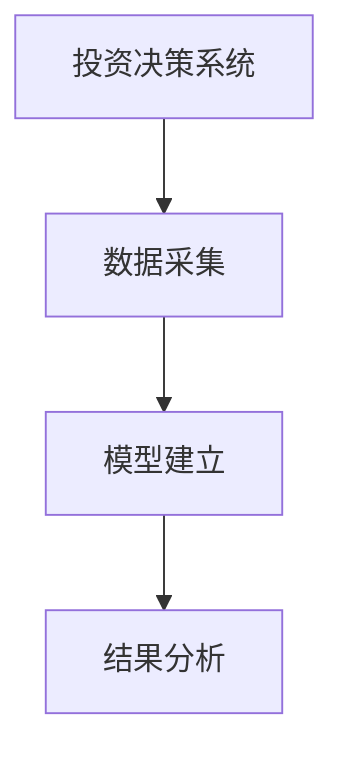
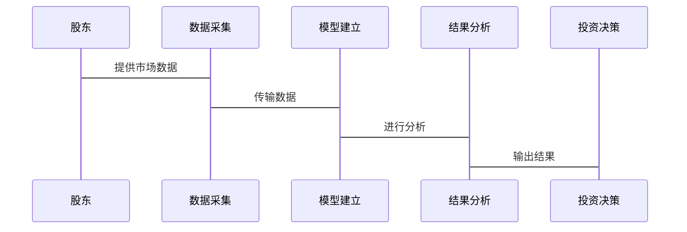

                 


# 芒格的"清晰思考"方法在复杂系统投资中的应用

> 关键词：芒格、清晰思考、复杂系统、投资决策、系统分析、逆向思维、数学模型

> 摘要：本文详细探讨了芒格的“清晰思考”方法在复杂系统投资中的应用。通过分析芒格的核心思想、系统分析方法和数学模型，结合实际案例，展示了如何将“清晰思考”应用于投资决策，以提高决策的准确性和效率。

---

## 第1章：芒格的生平与思想体系

### 1.1 芒格的生平简介

#### 1.1.1 芝加格大学教育背景
查理·芒格在芝加哥大学法学院学习期间，培养了严谨的逻辑思维能力。他的法学背景使他对事物的本质和结构有深刻的理解，这为他后来的投资哲学奠定了基础。

#### 1.1.2 早期职业经历与投资理念的形成
芒格早期的职业生涯涉及法律和投资，这使他接触到各种复杂的社会和经济问题。他逐渐意识到，投资不仅仅是数字游戏，更是一个涉及人类行为、市场动态和经济规律的复杂系统。

#### 1.1.3 芒格与伯克希尔哈撒韦的合伙人生涯
芒格与巴菲特的合伙关系使他成为伯克希尔哈撒韦的重要人物。在这段合作关系中，芒格发展出了独特的投资哲学，强调长期价值和风险管理。

### 1.2 芒格的核心思想体系

#### 1.2.1 “清晰思考”的核心理念
芒格的“清晰思考”方法强调理解问题的本质，避免被表象迷惑。他认为，投资者必须具备清晰的思维方式，才能在复杂市场中做出明智决策。

#### 1.2.2 芒格的决策框架与思维方式
芒格的决策框架包括逆向思维和第二性思维。逆向思维是指从结果出发，反推原因；第二性思维则关注问题的次要影响和间接后果。

#### 1.2.3 芒格投资哲学的演变与影响
芒格的投资哲学从早期的短期套利转向长期价值投资，强调安全边际和风险管理。他的思想影响了无数投资者，并成为现代投资理论的重要组成部分。

---

## 第2章：芒格“清晰思考”方法的核心概念

### 2.1 清晰思考的核心要素

#### 2.1.1 理解问题的本质
芒格认为，投资者必须深入理解企业的商业模式、财务状况和市场环境。只有真正理解企业，才能做出正确的投资决策。

#### 2.1.2 逆向思维（Inversion）的应用
逆向思维是芒格方法的重要组成部分。他建议投资者从结果出发，反推可能的原因，从而避免常见的错误决策。

#### 2.1.3 第二性思维（Second-order Thinking）
第二性思维关注问题的间接影响和长期后果。芒格认为，大多数投资者只关注直接影响，而忽视了次要影响，这可能导致错误的决策。

### 2.2 复杂系统的定义与特征

#### 2.2.1 复杂系统的构成要素
复杂系统通常由多个相互关联的组成部分构成，具有动态性和非线性特征。投资中的复杂系统包括市场、企业、经济等多个因素。

#### 2.2.2 系统的动态性与非线性关系
复杂系统的动态性使其难以预测，非线性关系意味着变量之间的关系不是简单的线性叠加。这使得投资决策更加复杂和具有挑战性。

#### 2.2.3 投资中的复杂系统特征
在投资中，复杂系统特征表现为市场的不确定性、企业的经营风险和宏观经济的波动性。投资者需要具备系统思维，才能应对这些挑战。

### 2.3 芒格思考方法与复杂系统的联系

#### 2.3.1 芒格方法在复杂系统中的适用性
芒格的“清晰思考”方法能够帮助投资者在复杂系统中找到关键因素，从而做出更明智的投资决策。

#### 2.3.2 清晰思考对投资决策的影响
清晰思考方法通过强调问题的本质和系统的动态性，帮助投资者避免短期波动的干扰，关注长期价值。

#### 2.3.3 芒格方法在风险管理中的应用
芒格的逆向思维和第二性思维能够帮助投资者识别潜在风险，制定有效的风险管理策略，从而在复杂系统中保持稳健的投资。

---

## 第3章：芒格“清晰思考”方法的系统分析

### 3.1 投资决策的系统模型

#### 3.1.1 系统模型的构建
芒格的系统分析方法将投资视为一个复杂系统，包括市场、企业、经济等多个因素。构建系统模型需要考虑各个因素之间的相互作用和动态关系。

#### 3.1.2 系统模型的动态分析
动态分析关注系统的随时间变化的特征，包括市场的波动、企业的成长和经济的周期性变化。芒格的方法强调对系统进行动态分析，以捕捉投资机会和规避风险。

#### 3.1.3 系统模型的优化与调整
系统模型需要根据实际情况不断优化和调整。芒格的清晰思考方法帮助投资者识别系统中的关键因素，优化模型的准确性。

### 3.2 投资决策中的关键因素分析

#### 3.2.1 经济周期的波动性
经济周期的波动性对投资决策有重要影响。芒格的方法通过逆向思维和第二性思维，帮助投资者在经济周期的不同阶段做出明智决策。

#### 3.2.2 行业趋势的判断
行业趋势的判断是投资决策的关键因素之一。芒格的清晰思考方法帮助投资者识别行业趋势的潜在变化，并制定相应的投资策略。

#### 3.2.3 企业基本面的分析
企业基本面的分析是投资决策的核心。芒格强调对企业基本面的深入理解，包括财务状况、管理团队和竞争优势。

### 3.3 芒格方法在系统分析中的应用

#### 3.3.1 系统分析的步骤与流程
芒格的系统分析方法包括以下步骤：问题识别、因素分析、关系建模、动态分析和结果验证。

#### 3.3.2 芒格方法在系统分析中的具体应用
芒格的方法在系统分析中的具体应用包括：逆向思维用于问题识别，第二性思维用于因素分析，动态分析用于系统建模。

#### 3.3.3 系统分析结果的验证与反馈
系统分析结果需要不断验证和反馈。芒格的清晰思考方法帮助投资者通过验证和反馈，优化系统的分析和决策。

---

## 第4章：芒格“清晰思考”方法的算法原理

### 4.1 系统动力学模型的构建

#### 4.1.1 系统动力学的基本原理
系统动力学是一种研究系统随时间变化的方法，强调系统的动态性和非线性关系。芒格的清晰思考方法与系统动力学模型有很强的关联性。

#### 4.1.2 系统动力学模型的构建步骤
系统动力学模型的构建步骤包括：识别系统中的关键因素，建立变量之间的关系，模拟系统的动态行为。

#### 4.1.3 系统动力学模型的应用实例
通过一个具体的案例，展示系统动力学模型在投资决策中的应用。例如，分析一家企业的市场扩展和财务状况的变化。

### 4.2 芒格方法的数学模型

#### 4.2.1 芒格方法的数学表达
芒格方法的数学模型包括逆向思维和第二性思维的数学表达式。例如，逆向思维可以通过概率论和统计学方法进行建模。

#### 4.2.2 数学模型的验证与优化
数学模型需要通过实际数据进行验证和优化。芒格的清晰思考方法帮助投资者识别模型中的关键变量，并优化模型的准确性。

#### 4.2.3 数学模型在投资决策中的应用
通过数学模型，投资者可以量化分析市场趋势、企业基本面和经济周期的变化，从而做出更科学的投资决策。

### 4.3 算法实现与案例分析

#### 4.3.1 算法实现的步骤
算法实现的步骤包括：数据收集、模型建立、模拟运行和结果分析。通过具体的投资案例，展示算法实现的具体过程。

#### 4.3.2 投资案例分析
通过一个实际的投资案例，展示芒格方法在算法实现中的应用。例如，分析一家科技企业的投资价值，利用系统动力学模型和数学模型进行预测和决策。

#### 4.3.3 算法实现的结果与启示
通过对投资案例的分析，展示算法实现的结果，并总结芒格方法在投资决策中的优势和局限性。

---

## 第5章：芒格“清晰思考”方法的系统分析

### 5.1 系统分析的背景介绍

#### 5.1.1 问题场景介绍
本章将通过一个具体的投资案例，展示芒格方法在系统分析中的应用。案例涉及一家企业的市场扩展和财务状况的变化。

#### 5.1.2 项目介绍
项目目标是通过系统分析，帮助企业制定投资决策，优化资源配置，提高企业价值。

### 5.2 系统功能设计

#### 5.2.1 领域模型（Mermaid类图）
领域模型展示了系统中的关键因素及其相互关系。例如，企业的财务状况、市场环境和管理团队之间的关系。



#### 5.2.2 系统架构设计（Mermaid架构图）
系统架构设计展示了系统的整体结构和功能模块。例如，投资决策系统包括数据采集、模型建立和结果分析三个模块。



#### 5.2.3 系统交互设计（Mermaid序列图）
系统交互设计展示了系统各模块之间的交互过程。例如，投资决策系统通过数据采集模块获取市场数据，然后通过模型建立模块进行分析，最后输出结果。



### 5.3 项目实战

#### 5.3.1 环境配置与数据准备
投资决策系统的环境配置包括安装必要的软件和工具，如Python、NumPy、Matplotlib等。数据准备包括收集市场数据、企业财务数据等。

#### 5.3.2 核心实现源代码

```python
import numpy as np
import matplotlib.pyplot as plt

def clear_thinking_model(data):
    # 数据预处理
    processed_data = data.dropna()
    # 模型建立
    trends = processed_data.rolling(3).mean()
    plt.plot(trends)
    plt.show()
    return trends

# 数据加载与处理
data = pd.read_csv('market_data.csv')
result = clear_thinking_model(data)
print(result)
```

#### 5.3.3 代码应用解读与分析
通过对代码的解读和分析，展示芒格方法在投资决策中的具体应用。例如，利用Python代码进行数据处理和模型建立，分析市场趋势和企业基本面。

#### 5.3.4 投资案例分析
通过具体的投资案例，展示芒格方法在实际投资中的应用。例如，分析一家科技企业的投资价值，利用系统分析和数学模型进行预测和决策。

#### 5.3.5 项目小结
总结项目实施过程中的经验和教训，提出改进建议，为未来的投资决策提供参考。

---

## 第6章：芒格“清晰思考”方法的最佳实践

### 6.1 小结与总结

#### 6.1.1 芒格方法的核心要点
芒格的“清晰思考”方法强调理解问题的本质，逆向思维和第二性思维的应用，以及系统的动态性和非线性关系。

#### 6.1.2 芒格方法在投资中的优势
芒格方法的优势在于其系统的分析和清晰的思维方式，能够帮助投资者在复杂市场中做出明智决策。

### 6.2 注意事项与风险提示

#### 6.2.1 投资中的常见误区
投资者在应用芒格方法时，需要注意常见的误区，如过度依赖模型、忽视市场变化等。

#### 6.2.2 投资中的风险管理
芒格方法强调风险管理，投资者需要在实际操作中制定有效的风险管理策略，以应对市场的不确定性。

#### 6.2.3 模型的局限性
数学模型和系统分析虽然能够帮助投资者做出科学决策，但其结果具有一定的局限性。投资者需要结合实际情况，灵活调整投资策略。

### 6.3 拓展阅读与学习资源

#### 6.3.1 芒格经典著作推荐
芒格的《Poor Charlie's Almanack》是理解其思想的重要资源。

#### 6.3.2 相关技术书籍推荐
推荐一些与系统分析和数学建模相关的技术书籍，帮助投资者深入理解芒格方法的数学基础和实际应用。

#### 6.3.3 在线课程与学习资源
推荐一些在线课程和学习资源，帮助投资者进一步学习芒格方法及其在复杂系统中的应用。

---

## 作者：AI天才研究院/AI Genius Institute & 禅与计算机程序设计艺术 /Zen And The Art of Computer Programming

