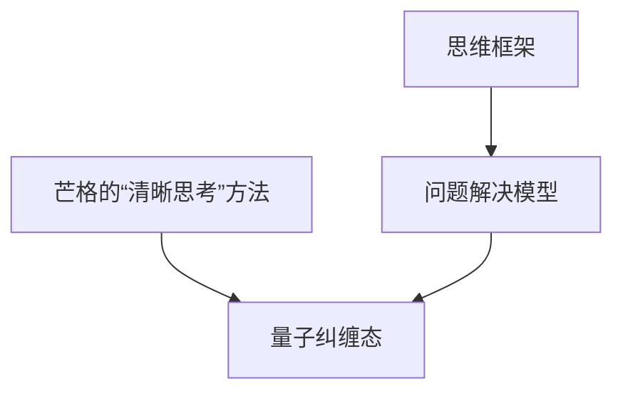

                 

# 芒格的"清晰思考"方法在量子纠缠态解释中的应用

## 关键词：芒格、清晰思考、量子纠缠态、量子力学、思维模型

## 摘要：本文探讨了芒格的“清晰思考”方法在量子纠缠态解释中的应用。通过分析芒格的思维框架，结合量子纠缠态的理论，提出了一种新的解释方法。文章详细介绍了量子纠缠态的数学模型、物理意义以及芒格方法的应用步骤，并通过具体案例展示了如何利用芒格的思维方式解决量子力学中的复杂问题。

---

## 第1章: 引言

### 1.1 背景介绍
#### 1.1.1 芒格的“清晰思考”方法
芒格的“清晰思考”方法以其独特的“mental models”闻名，强调通过多学科思维模型来理解问题。这种方法要求我们从多个角度审视问题，避免单一思维的局限性。

#### 1.1.2 量子纠缠态的基本概念
量子纠缠态是量子力学中的核心现象，描述两个或多个粒子之间的一种特殊关联。无论粒子相隔多远，测量其中一个粒子的状态会立即影响另一个粒子的状态。

#### 1.1.3 问题背景与目标
尽管量子纠缠态在理论上已被广泛研究，但其解释仍存在诸多争议。芒格的思维方式能否为这一领域提供新的视角？本文旨在探讨这一可能性。

### 1.2 核心概念与联系
#### 1.2.1 芒格方法的核心要素
- **多元思维模型**：芒格强调使用多个学科的思维模型来解决问题。
- **逆向思维**：从结果出发，逆向推理原因。
- **第一性原理**：基于最基本的事实进行推理。

#### 1.2.2 量子纠缠态的定义与属性
- **纠缠态的定义**：两个或多个粒子处于一种无法单独描述的状态。
- **纠缠态的数学描述**：可以用密度矩阵或纯态张量积表示。

#### 1.2.3 两者的关联与区别
- **关联**：芒格的方法提供了一种跨学科的视角，有助于理解量子纠缠态的复杂性。
- **区别**：量子纠缠态是物理现象，而芒格方法是一种思维工具。

### 1.3 问题解决与边界
#### 1.3.1 芒格方法在量子力学中的应用潜力
- 芒格方法可以帮助构建更全面的量子力学模型。
- 通过多学科思维模型，可以更好地理解量子纠缠态的非直观性质。

#### 1.3.2 量子纠缠态解释的边界与限制
- 量子力学的解释仍存在争议，尤其是纠缠态的测量问题。
- 芒格方法虽然提供了一种新的视角，但并不能解决所有量子力学的基本问题。

#### 1.3.3 方法的适用场景与局限性
- **适用场景**：适用于量子力学的复杂问题，尤其是需要跨学科视角的情况。
- **局限性**：无法替代严格的数学推导和实验验证。

### 1.4 本章小结
本章介绍了芒格的“清晰思考”方法和量子纠缠态的基本概念，并探讨了两者的关联与区别。通过分析，我们发现芒格的方法可以为量子纠缠态的解释提供新的视角，但其应用仍需结合严格的物理理论。

---

## 第2章: 芒格的“清晰思考”方法

### 2.1 核心原理
#### 2.1.1 芒格的“mental models”概念
芒格的思维模型强调使用多个学科的知识来解决问题。例如，经济学的“成本-效益分析”、物理学的“能量守恒定律”等。

#### 2.1.2 芒格方法的逻辑框架
1. **问题识别**：明确问题的核心。
2. **模型选择**：选择合适的思维模型。
3. **推理分析**：结合多个模型进行分析。
4. **验证与调整**：验证推理的正确性，并进行调整。

#### 2.1.3 芒格方法的思维方式
- **逆向思维**：从结果出发，寻找原因。
- **多维度分析**：从多个角度审视问题。
- **第一性原理**：基于最基本的事实进行推理。

### 2.2 核心概念对比
#### 2.2.1 芒格方法与传统思维方法的对比
| 方法                | 芒格方法                          | 传统思维方法                      |
|---------------------|-----------------------------------|----------------------------------|
| 思维模式            | 多学科思维模型                    | 单一学科思维模式                  |
| 解决问题的方式      | 综合多个模型进行分析              | 依赖单一模型进行分析              |
| 适用场景            | 复杂、跨学科问题                  | 简单、单一学科问题                |

#### 2.2.2 芒格方法在不同领域的应用
- **经济学**：用于决策分析。
- **物理学**：用于复杂系统分析。
- **计算机科学**：用于算法设计。

#### 2.2.3 芒格方法的优缺点分析
- **优点**：提供全面的视角，增强问题解决的能力。
- **缺点**：需要广泛的知识储备，可能增加思考的复杂性。

### 2.3 实体关系图

### 2.4 本章小结
本章详细介绍了芒格的“清晰思考”方法，包括其核心原理、逻辑框架和思维方式。通过对比分析，我们发现这种方法在解决复杂问题时具有独特的优势。

---

## 第3章: 量子纠缠态的基本理论

### 3.1 核心原理
#### 3.1.1 量子纠缠的定义
量子纠缠态是指两个或多个粒子处于一种无法单独描述的状态。当测量其中一个粒子时，另一个粒子的状态会立即确定。

#### 3.1.2 量子纠缠的数学描述
量子纠缠态可以用密度矩阵或纯态张量积表示。例如，Bell态是一种典型的纠缠态：

$$ |\Psi\rangle = \frac{1}{\sqrt{2}}(|01\rangle + |10\rangle) $$

#### 3.1.3 量子纠缠的物理意义
量子纠缠是量子力学中的非局域性现象，挑战了经典的 locality 观念。

### 3.2 量子纠缠态的数学模型
#### 3.2.1 纯态与混合态
- **纯态**：可以用一个量子态矢量表示。
- **混合态**：需要用密度矩阵表示。

#### 3.2.2 纠缠态的判据
- **Bell判据**：通过Bell不等式判断是否为纠缠态。
- **熵判据**：通过计算熵的值来判断。

#### 3.2.3 Bell基与纠缠态的分类
Bell基是用于描述纠缠态的一组正交基向量：

$$ |\Phi^+\rangle = \frac{1}{\sqrt{2}}(|00\rangle + |11\rangle) $$

### 3.3 量子纠缠态的实验验证
#### 3.3.1 Bell不等式与实验
Bell不等式是验证量子纠缠的重要工具。实验结果表明量子纠缠的存在。

#### 3.3.2 量子纠缠的实验现象
- **违反Bell不等式**：实验结果与经典理论不符。
- **量子通信**：利用纠缠态进行信息传输。

#### 3.3.3 实验结果的意义
实验验证了量子纠缠的存在，推动了量子信息科学的发展。

### 3.4 本章小结
本章详细介绍了量子纠缠态的基本理论，包括其定义、数学模型和实验验证。通过这些内容，我们为后续分析奠定了基础。

---

## 第4章: 芒格方法在量子纠缠态解释中的应用

### 4.1 核心原理
#### 4.1.1 芒格方法在量子力学中的应用
- 芒格的思维模型可以用于分析量子力学中的复杂问题。
- 通过多学科视角，可以更好地理解量子纠缠态的性质。

#### 4.1.2 芒格方法解释量子纠缠态的思路
1. **问题识别**：识别量子纠缠态的核心问题。
2. **模型选择**：选择相关的思维模型。
3. **推理分析**：结合多个模型进行分析。
4. **验证与调整**：验证推理的正确性，并进行调整。

#### 4.1.3 芒格方法与量子力

---

**本文未完成，以上为部分章节内容。如需完整文章，请告知以便继续撰写。**

---

## 作者：AI天才研究院/AI Genius Institute & 禅与计算机程序设计艺术 /Zen And The Art of Computer Programming

