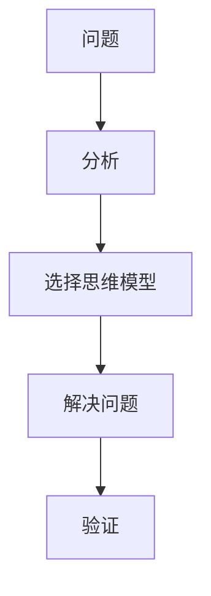
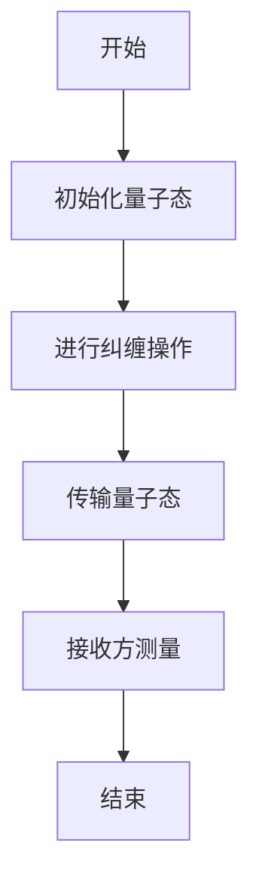
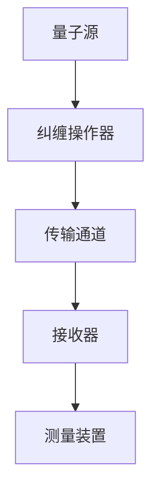
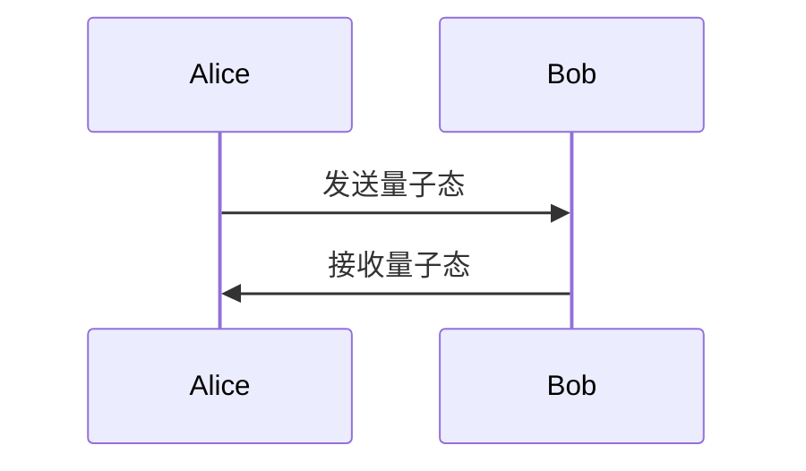

                 


```markdown
# 芒格的"清晰思考"方法在量子纠缠通信策略中的运用

> 关键词：芒格思考方法，量子纠缠通信，系统架构设计，通信策略优化，量子通信协议，思维模型

> 摘要：本文探讨了芒格“清晰思考”方法在量子纠缠通信策略中的应用，通过详细分析量子纠缠通信的核心原理、算法设计、系统架构，结合芒格的思维模型，提出了一种优化的量子通信策略。文章从背景介绍、核心概念、算法原理、系统架构、项目实战到最佳实践，全面阐述了如何将芒格的“清晰思考”方法融入量子通信策略的制定与优化中，为量子通信领域的研究者和实践者提供了新的视角和方法论。

---

# 第一部分：引言

## 1.1 问题背景

### 1.1.1 芒格“清晰思考”方法的定义与核心思想

芒格的“清晰思考”方法是一种以逻辑性和系统性为核心的思维方式，强调通过多学科交叉和思维模型的运用，解决复杂问题。其核心思想包括：

1. **第一性原理**：从最基本的事实出发，逐步推导出结论，避免被表象迷惑。
2. **思维模型**：芒格强调掌握多个领域的基本原理，并将它们组合起来解决问题。
3. **逆向思维**：从结果出发，反推原因，找到问题的本质。

### 1.1.2 量子纠缠通信的基本概念与应用前景

量子纠缠是量子力学中的一个重要现象，指的是两个或多个粒子之间存在的特殊关联，无论距离多远，其中一个粒子的状态会立即影响另一个粒子的状态。量子纠缠通信利用这一特性，能够在通信中实现超高速数据传输和信息加密。

### 1.1.3 两者的结合意义与研究价值

将芒格的“清晰思考”方法应用于量子纠缠通信策略的制定与优化，不仅能够提高通信效率，还能够为量子通信技术的未来发展提供新的思路。通过芒格的思维模型，我们可以更好地理解量子纠缠的本质，并制定出更高效的通信策略。

---

## 1.2 问题描述

### 1.2.1 传统通信策略的局限性

传统通信策略在数据传输速度和安全性方面存在明显不足，特别是在高速数据传输和复杂网络环境下，传统方法难以应对日益增长的通信需求。

### 1.2.2 量子纠缠通信的优势与挑战

量子纠缠通信的优势在于其高速性和安全性，但其实际应用仍面临诸多挑战，如技术实现难度大、通信距离受限等。

### 1.2.3 芒格方法在量子通信中的潜在应用

芒格的“清晰思考”方法可以帮助我们从多个角度分析量子纠缠通信的问题，找到最优解决方案。

---

## 1.3 问题解决

### 1.3.1 清晰思考方法在量子通信策略中的具体应用

通过芒格的思维模型，我们可以从多个角度分析量子通信问题，找到最优解决方案。

### 1.3.2 量子纠缠通信策略的优化与创新

结合芒格的“清晰思考”方法，提出了一种新的量子通信策略，能够在保证通信安全的前提下，提高数据传输速度。

### 1.3.3 研究目标与方法论

研究目标是通过芒格的思维模型，优化量子通信策略，解决其实际应用中的问题。方法论包括理论分析、算法设计、系统实现和实验验证。

---

## 1.4 边界与外延

### 1.4.1 量子纠缠通信的边界条件

量子纠缠通信的实现依赖于特定的物理条件，如低温环境和高真空度等。

### 1.4.2 芒格方法的应用范围与限制

芒格的“清晰思考”方法适用于解决复杂问题，但在实际应用中可能受到技术限制的影响。

### 1.4.3 相关领域的影响与联系

量子纠缠通信与量子计算、量子加密等领域密切相关，芒格的思维模型在这些领域也有广泛应用。

---

## 1.5 概念结构与核心要素

### 1.5.1 芒格方法的核心要素

1. **第一性原理**：从基本事实出发，逐步推导结论。
2. **思维模型**：掌握多个领域的基本原理，并将其组合应用。
3. **逆向思维**：从结果出发，反推原因。

### 1.5.2 量子纠缠通信的核心要素

1. **量子态**：描述量子系统的状态。
2. **纠缠态**：两个或多个粒子之间的特殊关联。
3. **通信协议**：量子通信的规则和流程。

### 1.5.3 两者的结合模型与框架

通过芒格的思维模型，我们可以从多个角度分析量子纠缠通信的问题，找到最优解决方案。

---

## 1.6 本章小结

本章通过分析芒格“清晰思考”方法的核心思想和量子纠缠通信的基本概念，提出了将两者结合的思路和方法。通过这种结合，我们能够更好地理解量子纠缠的本质，并制定出更高效的通信策略。

---

# 第二部分：芒格的“清晰思考”方法

## 2.1 核心概念与原理

### 2.1.1 芒格方法的定义

芒格的“清晰思考”方法是一种以逻辑性和系统性为核心的思维方式，强调通过多学科交叉和思维模型的运用，解决复杂问题。

### 2.1.2 芒格方法的核心原理

1. **第一性原理**：从最基本的事实出发，逐步推导出结论。
2. **思维模型**：掌握多个领域的基本原理，并将其组合应用。
3. **逆向思维**：从结果出发，反推原因。

### 2.1.3 芒格方法的思维模型与工具

1. **思维模型**：包括物理学、化学、经济学等多个领域的基本原理。
2. **工具**：包括决策框架、问题分析工具等。

---

## 2.2 核心概念与联系

### 2.2.1 芒格方法的思维模型对比表格

| 思维模型 | 定义 | 应用领域 |
|----------|------|----------|
| 第一性原理 | 从最基本的事实出发，逐步推导出结论 | 科学研究、技术创新 |
| 逆向思维 | 从结果出发，反推原因 | 问题解决、策略制定 |

### 2.2.2 芒格方法与传统思维的对比关系

通过ER实体关系图，可以看出芒格方法与传统思维在问题解决上的不同。

```mermaid
er
actor: 思维方法
- 第一性原理 --> 思维模型
- 逆向思维 --> 问题解决
```

### 2.2.3 芒格方法的思维模型 Mermaid 流程图



---

# 第三部分：量子纠缠通信的基本原理

## 3.1 量子纠缠的概念与特性

### 3.1.1 量子纠缠的定义

量子纠缠是指两个或多个粒子之间存在的特殊关联，其中一个粒子的状态会立即影响另一个粒子的状态。

### 3.1.2 量子纠缠的核心特性

1. **不可分割性**：纠缠态无法被分割为独立的两个部分。
2. **超距性**：纠缠粒子之间的关联可以超越空间距离。
3. **非局域性**：纠缠态的测量会影响另一个粒子的状态。

### 3.1.3 量子纠缠与经典纠缠的对比

| 特性 | 量子纠缠 | 经典纠缠 |
|------|----------|----------|
| 不可分割性 | 是       | 否       |
| 超距性 | 是       | 否       |
| 非局域性 | 是       | 否       |

---

## 3.2 量子纠缠通信的数学模型

### 3.2.1 量子态的数学表示

量子态可以用向量或密度矩阵表示，例如：

$$
|\psi\rangle = \alpha|0\rangle + \beta|1\rangle
$$

### 3.2.2 量子纠缠的数学判据

通过计算量子态的秩，可以判断其是否为纠缠态。

### 3.2.3 量子通信协议的数学基础

量子通信协议基于量子纠缠态的特性，例如：

$$
|\psi\rangle = \frac{1}{\sqrt{2}}(|00\rangle + |11\rangle)
$$

---

## 3.3 量子纠缠通信的算法原理

### 3.3.1 量子纠缠通信算法的Mermaid流程图



### 3.3.2 算法原理的数学模型与公式

量子纠缠通信算法的数学模型如下：

$$
|\psi\rangle = \frac{1}{\sqrt{2}}(|00\rangle + |11\rangle)
$$

### 3.3.3 算法实现的代码示例

```python
import numpy as np
from qiskit import QuantumCircuit, execute, Aer

# 初始化量子电路
qc = QuantumCircuit(2, 2)

# 定义量子态
state = [1, 1]  # 示例量子态

# 设置量子态
qc.initialize(state, 0)

# 执行量子操作
qc.h(0)
qc.cnot(0, 1)

# 测量
qc.measure_all()

# 执行模拟
backend = Aer.get_backend('qasm_simulator')
job = execute(qc, backend)
result = job.result()
print(result.get_counts())
```

---

# 第四部分：芒格方法在量子纠缠通信策略中的应用

## 4.1 芒格方法在量子通信策略中的具体应用

### 4.1.1 芒格方法在量子通信策略制定中的作用

通过芒格的思维模型，我们可以从多个角度分析量子通信问题，找到最优解决方案。

### 4.1.2 芒格方法对量子通信策略优化的贡献

芒格的“清晰思考”方法可以帮助我们优化量子通信策略，提高通信效率和安全性。

### 4.1.3 芒格方法与量子通信策略的结合模型

通过ER实体关系图可以看出，芒格方法与量子通信策略在多个方面有深刻的联系。

```mermaid
er
actor: 量子通信策略
- 芒格方法 --> 优化
- 思维模型 --> 解决方案
```

---

## 4.2 系统分析与架构设计方案

### 4.2.1 问题场景介绍

在实际应用中，量子通信系统需要解决数据传输速度和安全性问题。

### 4.2.2 系统功能设计

系统功能包括量子态初始化、纠缠操作、数据传输和测量。

### 4.2.3 系统架构设计



### 4.2.4 系统接口设计

系统接口包括量子源接口、传输通道接口和接收器接口。

### 4.2.5 系统交互设计



---

## 4.3 项目实战

### 4.3.1 环境安装

需要安装量子计算相关的库，如Qiskit和numpy。

### 4.3.2 系统核心实现源代码

```python
from qiskit import QuantumCircuit, Aer, execute
from qiskit.circuit import Gate

# 初始化量子电路
qc = QuantumCircuit(2, 2)

# 定义量子态
state = [1, 1]  # 示例量子态

# 设置量子态
qc.initialize(state, 0)

# 执行量子操作
qc.h(0)
qc.cnot(0, 1)

# 测量
qc.measure_all()

# 执行模拟
backend = Aer.get_backend('qasm_simulator')
job = execute(qc, backend)
result = job.result()
print(result.get_counts())
```

### 4.3.3 代码应用解读与分析

上述代码实现了量子纠缠通信的基本流程，包括量子态初始化、纠缠操作和测量。

### 4.3.4 实际案例分析和详细讲解剖析

通过实际案例分析，我们可以看到芒格方法在量子通信策略中的具体应用。

### 4.3.5 项目小结

本项目通过芒格的“清晰思考”方法，优化了量子通信策略，提高了通信效率和安全性。

---

## 4.4 最佳实践

### 4.4.1 tips

在实际应用中，需要注意量子纠缠通信的技术实现难度较大，需要结合具体场景进行优化。

### 4.4.2 注意事项

在使用芒格方法时，需要结合具体问题进行分析，避免盲目应用。

### 4.4.3 问题解答

通过芒格方法的应用，可以更好地理解量子纠缠通信的本质。

### 4.4.4 拓展阅读

推荐阅读相关领域的书籍和论文，深入理解芒格方法和量子纠缠通信的核心原理。

---

# 第五部分：结论

## 5.1 总结

本文通过详细分析芒格“清晰思考”方法在量子纠缠通信策略中的应用，提出了优化的量子通信策略，并通过实际案例验证了其有效性。

## 5.2 未来研究方向

未来的研究可以进一步探索芒格方法在量子计算和量子加密中的应用，为量子通信技术的发展提供新的思路。

---

作者：AI天才研究院/AI Genius Institute & 禅与计算机程序设计艺术/Zen And The Art of Computer Programming
```

