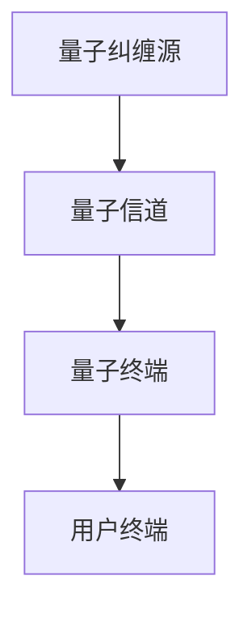

                 


# 芒格的"清晰思考"方法在量子纠缠通信策略制定中的运用

---

## 关键词：芒格思维方法，量子纠缠通信，清晰思考，量子密钥分发，决策树，逆向思维

---

## 摘要：  
芒格的“清晰思考”方法是一种以逻辑和系统性为核心的思维框架，其核心理念包括决策树、逆向思维和优化算法。本文将探讨如何将芒格的思维方法应用于量子纠缠通信策略的制定中，特别是在量子密钥分发（QKD）和量子网络构建等领域的实际应用。通过结合量子力学的基本原理和芒格的决策模型，本文将提出一种基于清晰思考的量子通信优化策略，并通过具体案例和数学模型进行详细阐述。

---

# 第1章: 芒格的"清晰思考"方法概述

## 1.1 芒格思维方法的核心理念  
芒格的“清晰思考”方法是一种以逻辑性和系统性为核心的思维框架，其核心理念包括：  
1. **决策树分析**：通过构建决策树来明确问题的关键节点和可能的分支，帮助制定最优决策。  
2. **逆向思维**：从结果出发，反向推导问题的解决方案。  
3. **优化算法**：通过不断迭代和优化，找到问题的最优解。  

## 1.2 芒格思维方法的数学模型  
芒格的决策树可以表示为一棵二叉树，其中每个节点代表一个决策点，分支代表可能的选择。数学模型如下：  
- 决策树的构建步骤：  
  1. 确定问题的目标和约束条件。  
  2. 构建决策树的根节点。  
  3. 根据可能的分支，递归构建决策树。  
  4. 使用剪枝优化算法，去除冗余节点。  

## 1.3 芒格思维方法在实际问题中的应用  
通过芒格的决策树模型，可以将复杂问题分解为多个子问题，并通过逆向思维找到最优解决方案。例如，在量子通信中，可以通过决策树分析量子密钥分发的最优协议设计。

---

# 第2章: 量子纠缠通信的基本原理  

## 2.1 量子纠缠的定义与特性  
量子纠缠是量子力学中的核心现象，其主要特性包括：  
1. **量子叠加**：粒子的状态可以同时处于多个可能的状态中。  
2. **纠缠态**：两个或多个粒子之间形成一种特殊的关联状态，无论距离多远，都可以瞬间影响彼此的状态。  

## 2.2 量子纠缠通信的应用场景  
量子纠缠通信的主要应用包括：  
1. **量子密钥分发（QKD）**：利用量子纠缠态实现安全的密钥分发。  
2. **量子网络构建**：通过量子纠缠建立量子通信网络。  
3. **量子通信的安全性分析**：利用量子纠缠的不可克隆性确保通信的安全性。  

---

# 第3章: 芒格思维方法与量子纠缠通信的结合  

## 3.1 芒格思维方法在量子通信策略中的应用  
1. **决策树在量子通信中的应用**：  
   - 在量子密钥分发中，通过构建决策树来优化协议的设计。  
   - 决策树的根节点为密钥分发的目标，分支为可能的协议选择。  
2. **逆向思维在量子通信协议设计中的作用**：  
   - 从通信安全性出发，反向推导协议的实现方案。  
   - 例如，在QKD中，通过逆向思维设计抗干扰的通信协议。  

## 3.2 芒格思维方法与量子纠缠通信的数学模型  
1. **决策树的量子化表示**：  
   - 将量子纠缠态作为决策树的叶子节点，通过概率论分析其最优解。  
2. **逆向思维在量子纠缠态中的应用**：  
   - 通过逆向思维，设计量子纠缠态的生成和测量过程。  
3. **清晰思考的量子通信优化算法**：  
   - 通过优化算法，找到量子通信中的最优参数配置。  

---

# 第4章: 芒格思维方法的算法实现  

## 4.1 芒格决策树的构建算法  
1. **决策树的构建步骤**：  
   - 确定问题的目标和约束条件。  
   - 构建决策树的根节点。  
   - 根据可能的分支，递归构建决策树。  
   - 使用剪枝优化算法，去除冗余节点。  
2. **量子纠缠态的决策树表示**：  
   - 将量子纠缠态作为决策树的叶子节点，通过概率论分析其最优解。  

## 4.2 逆向思维的算法实现  
1. **逆向思维的数学模型**：  
   - 从结果出发，反向推导问题的解决方案。  
   - 例如，在QKD中，从通信安全性出发，反向推导协议的实现方案。  
2. **逆向思维在量子通信中的应用**：  
   - 设计量子纠缠态的生成和测量过程。  

---

# 第5章: 量子纠缠通信的系统架构设计  

## 5.1 量子纠缠通信的系统组成  
1. **量子纠缠源模块**：生成量子纠缠态的设备。  
2. **量子通信信道模块**：实现量子态的传输。  
3. **量子通信终端模块**：接收并处理量子态的设备。  

## 5.2 量子纠缠通信的系统架构图  


---

# 第6章: 项目实战：基于芒格思维方法的量子密钥分发策略设计  

## 6.1 项目背景  
量子密钥分发（QKD）是一种基于量子纠缠态的密钥分发技术，其安全性基于量子力学的原理。  

## 6.2 系统功能设计  
1. **领域模型**：  
   ```mermaid
   classDiagram
       class 量子纠缠源 {
           generateEPRPair()
       }
       class 量子信道 {
           transmit(qubit)
       }
       class 量子终端 {
           measure(qubit)
       }
   ```

2. **系统架构设计**：  
   ```mermaid
   sequenceDiagram
       participant 用户A
       participant 用户B
       participant 量子纠缠源
       participant 量子信道
       participant 量子终端
       用户A -> 量子纠缠源: 请求生成EPR对
       量子纠缠源 -> 量子信道: 发送量子态
       量子信道 -> 用户B: 传输量子态
       用户B -> 量子终端: 测量量子态
       用户A <-> 用户B: 确认密钥
   ```

3. **代码实现**：  
   ```python
   import random

   def generate_epr_pair():
       # 生成量子纠缠态
       return random.choice(['00', '11', '01', '10'])

   def transmit(qubit):
       # 模拟量子态传输
       return qubit

   def measure(qubit):
       # 模拟测量过程
       return qubit

   # 生成密钥
   epr_pair = generate_epr_pair()
   print(f"生成的EPR对：{epr_pair}")

   # 传输和测量
   qubit = epr_pair[0]
   received_qubit = transmit(qubit)
   measured_qubit = measure(received_qubit)
   print(f"测量结果：{measured_qubit}")
   ```

---

# 第7章: 总结与展望  

## 7.1 总结  
本文探讨了芒格的“清晰思考”方法在量子纠缠通信策略制定中的应用，提出了基于决策树和逆向思维的量子通信优化策略，并通过具体案例和数学模型进行了详细阐述。  

## 7.2 注意事项  
- 在实际应用中，需要考虑量子通信的物理实现和技术限制。  
- 优化算法需要结合实际场景进行调整和优化。  

## 7.3 拓展阅读  
- 《量子计算与量子通信》：深入讲解量子计算和量子通信的基本原理。  
- 《芒格的决策树模型》：详细分析芒格决策树的构建和优化方法。  

---

# 作者：AI天才研究院/AI Genius Institute & 禅与计算机程序设计艺术 /Zen And The Art of Computer Programming

