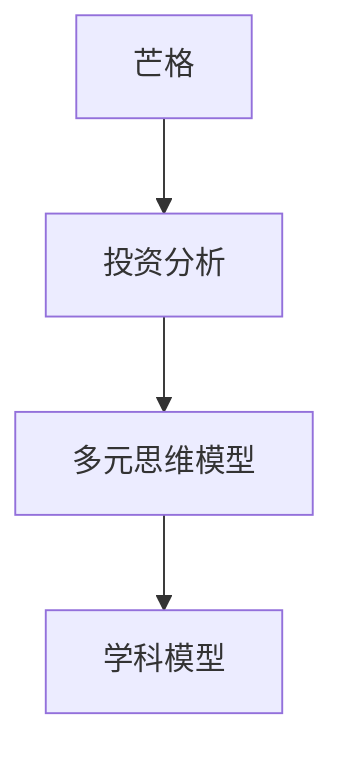
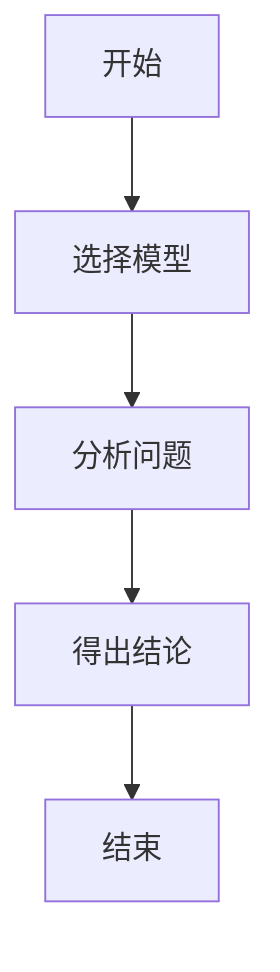
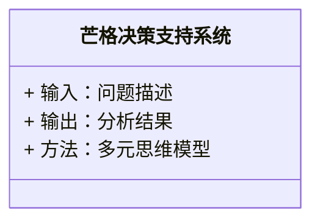
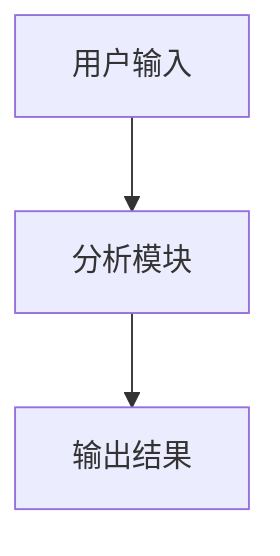

                 


# 芒格的"清晰思考"方法：提高投资分析的准确性

> 关键词：芒格、清晰思考、多元思维模型、投资分析、决策支持系统

> 摘要：本文将介绍芒格的“清晰思考”方法，详细探讨其核心概念、算法原理、系统架构设计以及在投资分析中的应用。通过实际案例分析和系统设计，展示如何利用多元思维模型来提高投资决策的准确性。

---

# 第一部分: 芒格的"清晰思考"方法概述

## 第1章: 芒格的生平与成就

### 1.1 芒格的早年经历
芒格（Charlie Munger）出生于1924年，美国著名投资者、作家和哲学家。他在1950年代进入哈佛大学学习法律，毕业后进入律师事务所工作。

### 1.2 芒格的职业生涯
芒格的职业生涯始于律师事务所，后来转向投资领域，与巴菲特（Warren Buffett）共同创立了伯克希尔哈撒韦公司。他的投资理念强调价值投资和长期持有。

### 1.3 芒格的哲学与投资理念
芒格是一位理性主义者，他提倡“清晰思考”方法，强调通过多元思维模型来分析问题，避免认知偏差。

---

## 第2章: "清晰思考"方法的定义与特点

### 2.1 多元思维模型的概念
多元思维模型是指通过多个学科的思维方式来分析问题，以获得更全面的视角。

### 2.2 多元思维模型的特点
- **通用性**：适用于多个领域。
- **互补性**：不同模型相互补充，提高分析的准确性。
- **可扩展性**：能够不断添加新的模型。

### 2.3 多元思维模型与传统思考方式的对比
传统思考方式往往局限于单一学科，而多元思维模型能够综合多个学科的视角。

---

# 第二部分: 多元思维模型的核心概念与联系

## 第4章: 多元思维模型的核心原理

### 4.1 多元思维模型的原理
多元思维模型通过综合多个学科的思维方式，帮助分析者避免认知偏差，提高决策的准确性。

### 4.2 多元思维模型的数学模型
多元思维模型的数学模型可以表示为：
$$
\text{决策} = \sum_{i=1}^{n} w_i \cdot m_i
$$
其中，$w_i$ 是模型 $m_i$ 的权重。

### 4.3 多元思维模型的优缺点对比
| 特性 | 优点 | 缺点 |
|------|------|------|
| 通用性 | 适用性强 | 需要掌握多个学科的知识 |
| 互补性 | 分析全面 | 时间成本较高 |

---

## 第5章: 多元思维模型的属性特征对比

### 5.1 多元思维模型的属性特征
- **通用性**：模型适用于多个领域。
- **适用性**：模型能够解决具体问题。
- **可扩展性**：模型能够不断扩展。

### 5.2 多元思维模型的ER实体关系图


---

# 第三部分: 多元思维模型的算法原理讲解

## 第7章: 多元思维模型的算法原理

### 7.1 多元思维模型的算法流程


### 7.2 多元思维模型的数学公式
$$
P(A|B) = \frac{P(B|A) \cdot P(A)}{P(B)}
$$
其中，$P(A|B)$ 表示在B发生的条件下，A发生的概率。

---

## 第8章: 多元思维模型的系统分析与架构设计方案

### 8.1 项目介绍
本项目旨在构建一个基于多元思维模型的决策支持系统，帮助投资者提高投资分析的准确性。

### 8.2 系统功能设计


### 8.3 系统架构设计


### 8.4 系统接口设计
接口设计如下：
- 输入接口：接收问题描述。
- 输出接口：输出分析结果。

---

## 第9章: 多元思维模型的项目实战

### 9.1 环境安装
需要安装Python和相关库。

### 9.2 系统核心实现源代码
```python
def multi_model_analysis(models, problem):
    results = []
    for model in models:
        result = model.analyze(problem)
        results.append(result)
    return results

# 示例代码
models = [economics_model, psychology_model]
problem = "投资分析"
print(multi_model_analysis(models, problem))
```

### 9.3 代码应用解读与分析
代码通过调用多个模型的分析方法，综合得出最终结果。

---

## 第10章: 最佳实践与小结

### 10.1 最佳实践 tips
- 定期更新模型库。
- 结合具体问题选择合适的模型。

### 10.2 小结
芒格的“清晰思考”方法通过多元思维模型，帮助投资者提高分析的准确性。

---

## 第11章: 注意事项与拓展阅读

### 11.1 注意事项
- 避免模型过多导致分析复杂。
- 定期更新模型库。

### 11.2 拓展阅读
- 《芒格投资哲学》
- 《思考，快与慢》

---

作者：AI天才研究院 & 禅与计算机程序设计艺术

