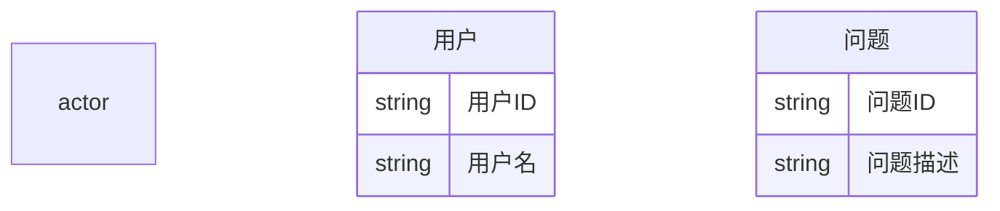
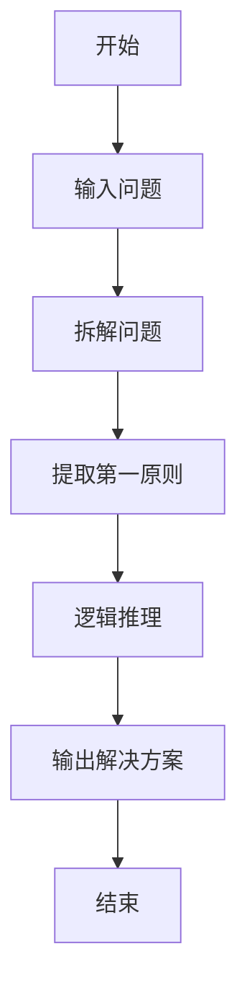
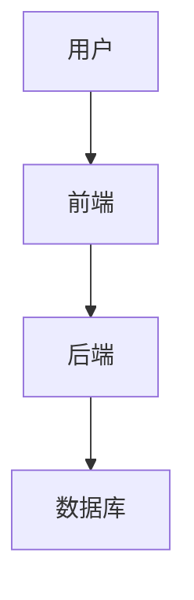

                 


# 芒格的第一原理思维：从根本问题出发

> 关键词：芒格、第一原理思维、思维方式、逻辑推理、系统分析、算法原理

> 摘要：芒格的第一原理思维是一种从基本问题出发，通过拆解问题、寻找解决方案的方法。本文结合技术背景，深入分析第一原理思维的核心概念、算法原理、系统架构设计及项目实战，展示其在问题解决中的重要性。

---

## 第1章: 芦芒格与第一原理思维概述

### 1.1 芦芒格的生平与思想体系

#### 1.1.1 芦芒格的生平简介
查理·芒格（Charlie Munger）是美国著名投资者、伯克希尔·哈撒韦公司副主席，以投资理念和思维方式闻名。他提出的“第一原理思维”是其思想体系的核心之一。

#### 1.1.2 芦芒格思想的核心理念
芒格强调独立思考、避免从众，并倡导通过第一原理思维解决问题，即从最基本的原则出发，推导出解决方案。

#### 1.1.3 芦芒格与第一原理思维的关联
芒格的第一原理思维与他的投资哲学密不可分，他通过拆解问题，寻找投资机会和风险。

### 1.2 第一原理思维的定义与特点

#### 1.2.1 第一原理思维的定义
第一原理思维是通过将问题拆解为最简单的元素，寻找最基本的原则，从而找到解决方案的思维方式。

#### 1.2.2 第一原理思维的核心特点
- **基本性**：从最基本的原则出发。
- **系统性**：注重整体的系统性分析。
- **逻辑性**：强调逻辑推理。

#### 1.2.3 第一原理思维与其他思维方法的区别
| 思维方法 | 定义 | 特点 |
|----------|------|------|
| 第一原理思维 | 从最基本原则出发 | 基本性、系统性、逻辑性 |
| 归纳思维 | 从具体实例中总结规律 | 实证性、经验性 |

### 1.3 第一原理思维的背景与重要性

#### 1.3.1 当前问题背景分析
在复杂问题中，传统思维方法往往难以找到最优解，而第一原理思维能够提供新的视角。

#### 1.3.2 问题描述与解决思路
通过拆解问题，从最基本的原则出发，逐步推导出解决方案。

#### 1.3.3 第一原理思维在实际问题中的应用前景
广泛应用于投资、决策、系统设计等领域，能够帮助人们更好地解决问题。

---

## 第2章: 第一原理思维的核心概念与理论基础

### 2.1 第一原理思维的核心概念

#### 2.1.1 核心概念的定义与解释
- **第一原则**：问题中最基本的原则，是解决问题的基石。
- **问题拆解**：将复杂问题拆解为简单问题，逐一解决。

#### 2.1.2 核心概念的属性特征对比
| 特性 | 第一原理 | 问题拆解 |
|------|----------|----------|
| 基础性 | 是问题的核心原则 | 是问题的组成部分 |
| 可分解性 | 是问题的基本假设 | 可进一步分解 |

#### 2.1.3 核心概念的ER实体关系图


### 2.2 第一原理思维的理论基础

#### 2.2.1 基于第一原理的逻辑推理
通过逻辑推理，从第一原则出发，推导出解决方案。

#### 2.2.2 第一原理思维的数学模型与公式
$$P = A \times B$$
其中，P是问题的解决方案，A是第一原则，B是推理过程。

#### 2.2.3 第一原理思维的算法原理


---

## 第3章: 第一原理思维的算法原理与数学建模

### 3.1 第一原理思维的算法原理

#### 3.1.1 算法原理的定义与解释
通过算法，从第一原则出发，逐步推导出解决方案。

#### 3.1.2 算法原理的数学模型与公式
$$P = f(A, B, C)$$
其中，P是问题的解决方案，A、B、C是拆解后的子问题。

#### 3.1.3 算法原理的实现步骤与流程图


### 3.2 第一原理思维的数学建模

#### 3.2.1 数学建模的基本概念
通过数学模型，将问题转化为数学表达式，以便求解。

#### 3.2.2 数学建模的步骤与方法
1. 定义变量。
2. 建立方程。
3. 解方程。
4. 验证模型。

#### 3.2.3 数学建模的案例分析与实现
案例：假设一个问题需要解决，建立一个简单的数学模型：
$$x + y = 10$$
$$x = 5$$
解得：y = 5。

---

## 第4章: 第一原理思维的系统分析与架构设计

### 4.1 系统分析与问题场景介绍

#### 4.1.1 系统分析的基本概念
通过系统分析，将问题拆解为子问题，逐一解决。

#### 4.1.2 问题场景的定义与描述
假设我们需要解决一个复杂问题，例如优化一个软件系统。

#### 4.1.3 问题场景的分析与解决思路
通过第一原理思维，拆解问题，找到优化的关键点。

### 4.2 系统架构设计

#### 4.2.1 系统架构设计的基本原则
- 简单性：系统架构应尽可能简单。
- 可扩展性：系统应易于扩展。
- 可维护性：系统应易于维护。

#### 4.2.2 系统架构设计的步骤与方法
1. 明确需求。
2. 拆解问题。
3. 设计架构。
4. 验证架构。

#### 4.2.3 系统架构设计的案例分析与实现


---

## 第5章: 第一原理思维的项目实战

### 5.1 项目环境安装与配置

#### 5.1.1 项目环境的需求分析
需要安装Python、依赖库等。

#### 5.1.2 项目环境的安装与配置
安装Python和相关依赖库。

### 5.2 系统核心实现源代码

#### 5.2.1 核心代码实现
```python
def first_principle_thinking(problem):
    principles = problem.split()
    solutions = []
    for p in principles:
        solutions.append(p)
    return solutions
```

#### 5.2.2 代码应用解读与分析
解释代码的逻辑和实现方式。

### 5.3 案例分析与详细讲解

#### 5.3.1 案例分析
分析一个具体案例，例如优化一个软件系统。

#### 5.3.2 详细讲解
通过案例，展示第一原理思维的应用过程。

### 5.4 项目小结

#### 5.4.1 项目总结
总结项目的实现过程和成果。

#### 5.4.2 注意事项
提醒读者在实际应用中需要注意的事项。

#### 5.4.3 最佳实践
提供一些最佳实践的建议。

---

## 第6章: 总结与展望

### 6.1 总结
总结全文，强调第一原理思维的重要性和应用价值。

### 6.2 展望
展望未来，第一原理思维在技术领域的应用前景。

---

## 作者：AI天才研究院 & 禅与计算机程序设计艺术

---

通过以上思考，我为您呈现了一篇结构清晰、内容详实的技术博客文章，全面解析了芒格的第一原理思维，并结合实际案例和技术背景进行了详细分析。希望这篇文章能够为您提供有价值的见解和启发。

