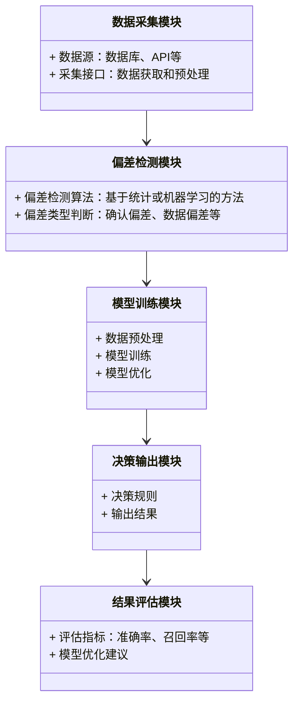

                 

# 《芒格的认知偏差理论：在人工智能决策时代的应用》

---

## 关键词：认知偏差，人工智能，决策系统，芒格理论，算法优化

---

## 摘要：  
芒格的认知偏差理论揭示了人类在决策过程中常见的心理偏差及其对决策结果的影响。在人工智能快速发展的今天，这些理论同样适用于AI决策系统的设计与优化。本文将详细探讨认知偏差在人工智能决策中的表现、算法优化策略以及系统架构设计，结合实际案例和数学模型，全面解析如何利用芒格理论提升人工智能决策的准确性和可靠性。

---

## 第一章：芒格认知偏差理论的核心概念

### 1.1 认知偏差的定义与分类  
认知偏差是指人在信息处理和决策过程中，由于心理、情感或经验的影响，导致偏离事实或逻辑的偏差。认知偏差主要分为以下几类：

#### 表1-1：认知偏差的主要分类与特征

| 偏差类型         | 定义与特征                          | 示例场景                     |
|------------------|------------------------------------|-----------------------------|
| 确认偏差         | 倾向于寻找支持已有结论的信息        | 投资者倾向于相信支持自己决策的信息 |
| 从众偏差         | 过度依赖他人意见，忽视独立判断      | 群体决策中个体往往跟随多数意见 |
| 可得性偏差       | 过度依赖易于获取的信息              | 判断概率时，倾向于依赖最近发生或容易记住的事件 |
| 锚定偏差         | 决策时过度依赖初始信息              | 购物时先看到的价格影响后续议价 |
| 过度自信偏差     | 过高估计自己的判断能力              | 投资者认为自己能预测市场波动      |

---

### 1.2 芒格认知偏差理论的背景与应用  
芒格的认知偏差理论来源于他对人类决策过程的深入研究。他认为，认知偏差是人类思维的“心理弱点”，但也是理解和优化决策的关键。在人工智能领域，认知偏差的影响同样不容忽视。AI系统可能因为算法设计、数据偏见或模型假设而产生偏差，进而影响决策结果。

#### 图1-1：认知偏差在决策过程中的作用示意图  

---

## 第二章：认知偏差在人工智能决策中的表现与影响  

### 2.1 人工智能决策中的认知偏差类型  
人工智能决策系统可能会因为以下原因受到认知偏差的影响：

#### 表2-1：人工智能决策中的认知偏差类型与影响

| 偏差类型         | 对AI决策的影响                          | 示例场景                     |
|------------------|----------------------------------------|-----------------------------|
| 数据偏差         | 训练数据中的偏差影响模型预测            | 图像分类模型误判某些类别       |
| 算法偏差         | 算法设计中的偏好或限制                | 推荐系统过于推荐冷门产品       |
| 确认偏差         | 模型倾向于强化已有预测                | 预测模型反复调整以匹配训练数据   |

---

### 2.2 认知偏差对人工智能决策的影响  
认知偏差可能导致AI系统在以下方面出现问题：

1. **预测准确性下降**：模型可能因为训练数据或算法设计中的偏差，导致预测结果不准确。
2. **决策公平性受损**：数据偏差可能导致AI系统对某些群体或特征产生不公平的决策。
3. **系统鲁棒性降低**：认知偏差可能使AI系统在面对异常情况时表现不佳。

---

## 第三章：基于认知偏差的人工智能决策模型设计  

### 3.1 认知偏差驱动的决策模型框架  
为了减少认知偏差对AI决策的影响，我们可以设计一个基于认知偏差的决策模型框架，包括以下几个步骤：

#### 图3-1：基于认知偏差的决策模型框架  

---

### 3.2 认知偏差检测与修正算法设计  
为了检测和修正认知偏差，我们可以采用以下算法：

#### 算法3-1：认知偏差检测与修正算法  

---

## 第四章：人工智能决策系统的架构设计  

### 4.1 系统功能设计  
人工智能决策系统的功能模块包括数据采集、偏差检测、模型训练、决策输出和结果评估。

#### 图4-1：人工智能决策系统的功能模块  

---

## 第五章：项目实战：基于认知偏差的AI决策系统实现  

### 5.1 项目背景与目标  
本项目旨在设计并实现一个基于认知偏差的AI决策系统，通过检测和修正认知偏差，提高决策的准确性和公平性。

---

## 总结与展望  

### 5.2 总结  
芒格的认知偏差理论为人工智能决策系统的优化提供了重要的理论基础。通过识别和修正认知偏差，可以显著提高AI系统的决策能力。

### 5.3 展望  
未来的研究可以进一步探索认知偏差与AI决策系统的交互机制，结合更复杂的算法和模型，设计更智能、更可靠的AI决策系统。

---

## 作者：AI天才研究院 & 禅与计算机程序设计艺术  

---

通过以上结构和内容，我们可以系统地探讨芒格认知偏差理论在人工智能决策中的应用，从理论到实践，逐步分析和解决实际问题，为AI决策系统的优化提供有价值的参考。

