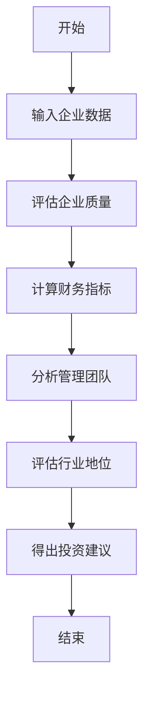
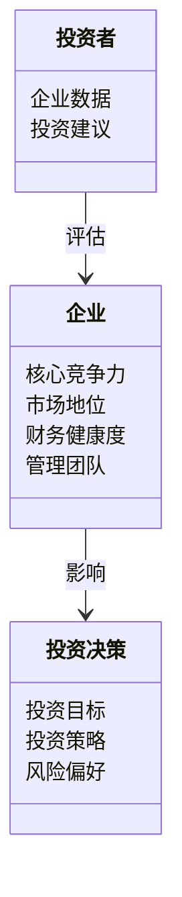

                 


# 《芒格的质量优先原则在投资中的应用》

> 关键词：芒格投资理念，质量优先原则，企业质量评估，投资决策模型，长期价值

> 摘要：芒格的质量优先原则是一种以企业内在价值为核心的投资策略，强调通过评估企业的质量、管理团队和行业地位来做出投资决策。本文将详细探讨该原则的背景、核心概念、算法原理、系统架构以及实际应用，帮助读者更好地理解和应用这一投资理念。

---

# 第一部分: 芒格的质量优先原则概述

## 第1章: 芒格投资理念的起源与核心思想

### 1.1 芒格投资理念的起源
#### 1.1.1 芒格与巴菲特的合作背景
- 芒格与巴菲特的长期合作关系
- 芒格作为巴菲特的“幕后智囊”的角色
- 芒格如何影响巴菲特的投资策略

#### 1.1.2 芒格投资哲学的核心思想
- 质量优先原则的核心理念
- 股价与企业价值的长期关系
- 质量优先原则在投资决策中的重要性

#### 1.1.3 质量优先原则的定义与内涵
- 质量优先原则的定义
- 质量优先原则与其他投资策略的对比
- 质量优先原则的边界与外延

### 1.2 质量优先原则的背景与问题背景
#### 1.2.1 传统投资方法的局限性
- 基于价格波动的传统投资策略的不足
- 投资者在选择企业时的核心问题
- 质量优先原则的提出背景

#### 1.2.2 质量优先原则的核心要素
- 企业质量评估的维度
- 质量优先原则的属性特征对比
- 质量优先原则与企业长期价值的关系

### 1.3 质量优先原则的核心要素
#### 1.3.1 企业质量评估的维度
- 核心竞争力
- 管理团队
- 财务健康度
- 市场地位

#### 1.3.2 质量优先原则的属性特征对比
- 企业质量评估的核心要素
- 质量优先原则的边界与外延
- 质量优先原则与企业长期价值的关系

#### 1.3.3 质量优先原则的ER实体关系图
- 投资者、企业、投资决策的实体关系
- 实体属性的详细描述
- 实体之间的关联关系

---

## 第2章: 质量优先原则的核心概念与联系

### 2.1 质量优先原则的核心概念
#### 2.1.1 企业质量评估的核心要素
- 核心竞争力
- 管理团队
- 财务健康度
- 市场地位

#### 2.1.2 质量优先原则的属性特征对比
- 企业质量评估的核心要素
- 质量优先原则的边界与外延
- 质量优先原则与企业长期价值的关系

#### 2.1.3 质量优先原则的ER实体关系图
- 投资者、企业、投资决策的实体关系
- 实体属性的详细描述
- 实体之间的关联关系

### 2.2 质量优先原则的评估模型
#### 2.2.1 评估模型的输入与输出
- 输入：企业数据
- 输出：投资建议

#### 2.2.2 评估模型的算法流程
- 数据输入
- 企业质量评估
- 财务指标计算
- 管理团队分析
- 行业地位评估
- 投资建议得出

#### 2.2.3 评估模型的数学模型与公式
$$
企业质量评估得分 = \sum_{i=1}^{n} w_i \cdot x_i
$$

---

## 第3章: 质量优先原则的算法原理

### 3.1 质量优先原则的评估模型
#### 3.1.1 评估模型的输入与输出
- 输入：企业数据
- 输出：投资建议

#### 3.1.2 评估模型的算法流程
- 数据输入
- 企业质量评估
- 财务指标计算
- 管理团队分析
- 行业地位评估
- 投资建议得出

#### 3.1.3 评估模型的数学模型与公式
$$
企业质量评估得分 = \sum_{i=1}^{n} w_i \cdot x_i
$$

### 3.2 质量优先原则的评估流程
#### 3.2.1 评估流程的步骤
- 收集企业数据
- 评估企业质量
- 计算财务指标
- 分析管理团队
- 评估行业地位
- 得出投资建议

#### 3.2.2 评估流程的mermaid图


### 3.3 质量优先原则的数学模型
#### 3.3.1 企业质量评估公式
$$
企业质量评估得分 = \sum_{i=1}^{n} w_i \cdot x_i
$$

#### 3.3.2 财务指标计算公式
$$
财务指标 = \frac{净利润}{营业收入} \times 100
$$

---

## 第4章: 质量优先原则的系统分析与架构设计

### 4.1 系统分析
#### 4.1.1 问题场景介绍
- 投资者在选择企业时的核心问题
- 质量优先原则的应用场景
- 系统的功能需求

#### 4.1.2 系统功能设计
- 企业质量评估模块
- 财务指标计算模块
- 管理团队分析模块
- 行业地位评估模块
- 投资建议生成模块

#### 4.1.3 系统架构设计
- 层次结构
- 组件之间的关系
- 数据流的处理

#### 4.1.4 系统接口设计
- 输入接口
- 输出接口
- 数据格式

#### 4.1.5 系统交互设计
- 用户与系统的交互流程
- 系统内部组件的交互流程

### 4.2 系统架构设计
#### 4.2.1 系统功能设计
- 企业质量评估模块
- 财务指标计算模块
- 管理团队分析模块
- 行业地位评估模块
- 投资建议生成模块

#### 4.2.2 系统架构图


### 4.3 系统交互设计
#### 4.3.1 用户与系统的交互流程
- 用户输入企业数据
- 系统评估企业质量
- 系统计算财务指标
- 系统分析管理团队
- 系统评估行业地位
- 系统生成投资建议

#### 4.3.2 系统内部组件的交互流程
- 企业质量评估模块与财务指标计算模块的交互
- 财务指标计算模块与管理团队分析模块的交互
- 管理团队分析模块与行业地位评估模块的交互
- 行业地位评估模块与投资建议生成模块的交互

---

## 第5章: 质量优先原则的项目实战

### 5.1 环境安装
#### 5.1.1 系统环境要求
- 操作系统
- 软件依赖
- 数据库要求

#### 5.1.2 开发工具安装
- 编程语言
- 开发框架
- 依赖管理工具

### 5.2 系统核心实现
#### 5.2.1 企业质量评估模块的实现
- 数据处理
- 评估算法
- 结果输出

#### 5.2.2 财务指标计算模块的实现
- 数据输入
- 计算过程
- 结果输出

#### 5.2.3 管理团队分析模块的实现
- 数据输入
- 分析过程
- 结果输出

#### 5.2.4 行业地位评估模块的实现
- 数据输入
- 评估过程
- 结果输出

#### 5.2.5 投资建议生成模块的实现
- 数据输入
- 生成过程
- 结果输出

### 5.3 代码实现与解读
#### 5.3.1 企业质量评估模块的代码实现
```python
def assess_business_quality(enterprise_data):
    quality_score = sum(w_i * x_i for w_i, x_i in zip(weights, enterprise_data))
    return quality_score
```

#### 5.3.2 财务指标计算模块的代码实现
```python
def calculate_financial_indices(financial_data):
    financial_indices = {}
    financial_indices['net_profit_margin'] = (financial_data['net_profit'] / financial_data['revenue']) * 100
    return financial_indices
```

#### 5.3.3 管理团队分析模块的代码实现
```python
def analyze_management_team(management_data):
    team_score = sum(w_i * x_i for w_i, x_i in zip(team_weights, management_data))
    return team_score
```

#### 5.3.4 行业地位评估模块的代码实现
```python
def assess_industry_position(industry_data):
    position_score = sum(w_i * x_i for w_i, x_i in zip(position_weights, industry_data))
    return position_score
```

#### 5.3.5 投资建议生成模块的代码实现
```python
def generate_investment_recommendation(quality_score, financial_indices, team_score, position_score):
    recommendation = {}
    recommendation['investment_score'] = quality_score + financial_indices + team_score + position_score
    return recommendation
```

### 5.4 实际案例分析
#### 5.4.1 案例背景介绍
- 案例企业的基本信息
- 案例企业的财务数据
- 案例企业的管理团队
- 案例企业的行业地位

#### 5.4.2 数据处理与分析
- 数据清洗
- 数据转换
- 数据分析

#### 5.4.3 投资建议生成
- 企业质量评估
- 财务指标计算
- 管理团队分析
- 行业地位评估
- 投资建议

### 5.5 项目小结
#### 5.5.1 项目总结
- 项目目标的实现
- 项目成果的展示
- 项目过程中的问题与解决

#### 5.5.2 项目经验与启示
- 项目中的关键经验
- 对质量优先原则的进一步理解
- 对投资决策模型的优化建议

---

## 第6章: 质量优先原则的最佳实践与小结

### 6.1 最佳实践 tips
#### 6.1.1 投资者在应用质量优先原则时的关键注意事项
- 数据的准确性和完整性
- 模型的适用性和可扩展性
- 投资决策的灵活性和适应性

#### 6.1.2 质量优先原则的局限性与改进方向
- 质量优先原则的局限性
- 模型优化的方向
- 研究与实践的结合

### 6.2 本章小结
#### 6.2.1 质量优先原则的核心思想
- 质量优先原则的定义与内涵
- 质量优先原则的核心要素
- 质量优先原则的应用场景

#### 6.2.2 质量优先原则的算法与系统架构
- 评估模型的输入与输出
- 评估流程的步骤与方法
- 系统架构的设计与实现

#### 6.2.3 质量优先原则的项目实战经验
- 项目背景与目标
- 项目实现与分析
- 项目总结与启示

---

## 作者：AI天才研究院/AI Genius Institute & 禅与计算机程序设计艺术 /Zen And The Art of Computer Programming

