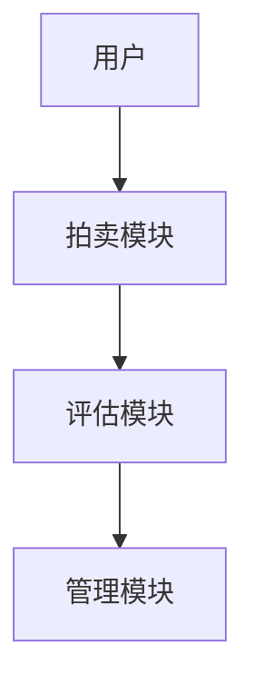
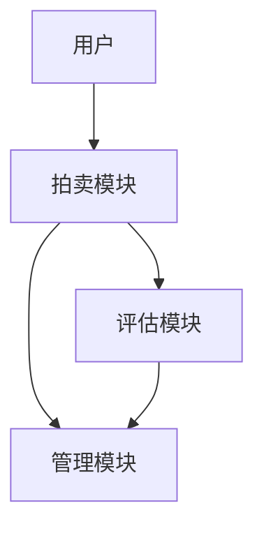

                 


# 芒格的"赢家的诅咒"提醒在前沿科技拍卖中的应用

---

## 关键词：
芒格的赢家诅咒、前沿科技拍卖、拍卖机制、风险管理、科技企业战略

---

## 摘要：
本文通过分析芒格提出的“赢家的诅咒”这一概念，探讨其在前沿科技拍卖中的应用。文章首先介绍了“赢家的诅咒”的背景和基本概念，分析了其在科技领域的具体表现和影响。接着，深入探讨了前沿科技拍卖的基本原理和特点，以及“赢家的诅咒”如何在其中体现。通过构建数学模型和系统架构，本文提出了如何利用“赢家的诅咒”优化拍卖机制的设计。最后，结合实际案例，展示了如何通过项目实战规避“赢家的诅咒”带来的风险，并提出了相应的风险管理策略和最佳实践建议。

---

# 正文

## 第一部分: 芒格的"赢家的诅咒"与前沿科技拍卖的背景

### 第1章: 芒格的"赢家的诅咒"概述

#### 1.1 问题背景

##### 1.1.1 竞争优势的陷阱
在商业和技术领域，许多企业追求竞争优势，但往往忽视了竞争优势可能带来的负面影响。芒格提出的“赢家的诅咒”提醒我们，胜出并不总是有利的。例如，在科技拍卖中，中标者可能会因为过度出价而面临财务压力，或者因为技术复杂性而难以实现预期收益。

##### 1.1.2 赢家的诅咒定义
“赢家的诅咒”是指在竞争中胜出的一方，由于过度出价或承担过多风险，反而可能导致不利结果的现象。这种现象在拍卖中尤为明显，因为中标者往往需要支付高于市场价的金额。

##### 1.1.3 赢家的诅咒的边界与外延
赢家的诅咒不仅限于拍卖场景，还适用于其他竞争性活动。例如，在专利收购、技术招标等领域，胜出者可能会面临同样的风险。

#### 1.2 芒格的"赢家的诅咒"在科技领域的应用

##### 1.2.1 科技领域的竞争特点
科技领域的竞争通常涉及高度不确定性和高风险，参与者需要在有限信息下做出决策。这种不确定性使得赢家的诅咒更加容易发生。

##### 1.2.2 赢家的诅咒在科技行业的表现
在科技行业，赢家的诅咒表现为：企业为了中标某项技术或专利，可能会支付过高的价格，导致财务负担或无法实现预期的商业价值。

##### 1.2.3 赢家的诅咒与科技企业生命周期的关系
赢家的诅咒可能影响企业的生命周期，导致企业因过度扩张或财务压力而陷入困境。

### 第2章: 前沿科技拍卖的基本概念

#### 2.1 前沿科技拍卖的定义

##### 2.1.1 拍卖的基本概念
拍卖是一种通过竞争定价的机制，用于分配稀缺资源。它广泛应用于艺术品、房地产、专利等多种场景。

##### 2.1.2 前沿科技拍卖的独特性
前沿科技拍卖涉及高技术门槛和高价值标的，通常需要专业的知识和经验。拍卖结果可能对参与企业的未来发展产生重大影响。

##### 2.1.3 前沿科技拍卖的分类
前沿科技拍卖可以分为专利拍卖、技术转让拍卖、设备拍卖等多种形式，每种形式都有其特定的规则和特点。

#### 2.2 前沿科技拍卖的核心要素

##### 2.2.1 拍卖标的物的特性
前沿科技拍卖的标的物通常具有高技术价值、高风险和高回报的特点。例如，某项前沿技术的专利可能具有巨大的市场潜力，但也可能面临技术不成熟或法律纠纷的风险。

##### 2.2.2 参与者的角色与行为
参与者包括拍卖方、竞拍者和拍卖机构。竞拍者的行为受理性预期和非理性行为的影响，可能导致赢家的诅咒的发生。

##### 2.2.3 拍卖机制的设计
拍卖机制的设计直接影响拍卖结果。例如， Vickrey auction（ Vickrey拍卖）是一种赢家支付次高价的机制，可以减少赢家的诅咒的发生。

### 第3章: 芒格的"赢家的诅咒"与前沿科技拍卖的联系

#### 3.1 赢家的诅咒在拍卖中的体现

##### 3.1.1 赢家的诅咒的形成机制
赢家的诅咒通常由信息不对称和理性预期偏差引起。竞拍者可能低估了其他参与者的出价，导致自己出价过高。

##### 3.1.2 赢家的诅咒对拍卖结果的影响
赢家的诅咒可能导致中标者支付过高的价格，或者无法实现预期的收益。这种现象可能影响拍卖市场的效率和公平性。

##### 3.1.3 赢家的诅咒与拍卖参与者的决策
参与者在拍卖中的决策受心理因素和理性预期的影响。赢家的诅咒提醒我们，理性决策并不总是最优的。

#### 3.2 赢家的诅咒对科技企业的影响

##### 3.2.1 赢家的诅咒对科技企业战略的影响
企业需要在追求竞争优势的同时，避免赢家的诅咒。这要求企业在制定战略时，充分考虑技术和市场的不确定性。

##### 3.2.2 赢家的诅咒对科技企业风险管理的影响
企业可以通过风险管理策略，降低赢家的诅咒带来的风险。例如，采用灵活的投标策略或引入第三方评估机构。

##### 3.2.3 赢家的诅咒对科技企业长期发展的启示
赢家的诅咒提醒企业，长期发展需要平衡短期竞争和长期价值。企业应注重技术研发和市场拓展的协调。

### 第4章: 赢家的诅咒在前沿科技拍卖中的具体应用

#### 4.1 赢家的诅咒在专利拍卖中的应用

##### 4.1.1 专利拍卖的基本流程
专利拍卖通常包括拍卖公告、竞拍者报名、拍卖会和成交确认等阶段。每个阶段都可能涉及赢家的诅咒的风险。

##### 4.1.2 赢家的诅咒在专利拍卖中的表现
某项高价值专利的拍卖可能吸引多家企业参与，导致中标者支付过高的价格。这种现象就是赢家的诅咒的典型表现。

##### 4.1.3 如何通过赢家的诅咒优化专利拍卖
企业可以通过引入多元化的评估指标和灵活的拍卖机制，降低赢家的诅咒的风险。例如，采用 Vickrey auction 或荷兰式拍卖。

#### 4.2 赢家的诅咒在技术转让中的应用

##### 4.2.1 技术转让拍卖的流程
技术转让拍卖通常包括技术评估、拍卖公告、竞拍和成交确认等阶段。每个阶段都需要考虑赢家的诅咒的风险。

##### 4.2.2 赢家的诅咒在技术转让中的表现
某项关键技术的转让可能吸引多家企业参与，导致中标者支付过高的价格。这种现象就是赢家的诅咒的典型表现。

##### 4.2.3 如何通过赢家的诅咒优化技术转让拍卖
企业可以通过引入多元化的评估指标和灵活的拍卖机制，降低赢家的诅咒的风险。例如，采用 Vickrey auction 或荷兰式拍卖。

---

## 第二部分: 算法原理与系统架构设计

### 第5章: 算法原理

#### 5.1 数学模型与公式

##### 5.1.1 赢家的诅咒的数学模型
$$ C = max(bid_i) $$

其中，C 表示赢家的诅咒，bid_i 表示参与者的出价。

##### 5.1.2 拍卖机制的数学模型
$$ P = \sum_{i=1}^{n} p_i $$

其中，P 表示拍卖标的的总价值，p_i 表示每个参与者的出价。

#### 5.2 算法步骤

##### 5.2.1 Vickrey auction 算法
```python
def Vickrey_auction(bids):
    max_bid = max(bids)
    winner_index = bids.index(max_bid)
    return winner_index, max_bid
```

##### 5.2.2 荷兰式拍卖算法
```python
def Dutch_auction(reserve_price, bids):
    sorted_bids = sorted(bids, reverse=True)
    for bid in sorted_bids:
        if bid > reserve_price:
            return bid
    return None
```

### 第6章: 系统架构设计

#### 6.1 系统功能设计

##### 6.1.1 系统模块划分
- 用户模块
- 拍卖模块
- 评估模块
- 管理模块

##### 6.1.2 系统流程图


#### 6.2 系统架构图


---

## 第三部分: 项目实战

### 第7章: 项目实战

#### 7.1 环境安装

##### 7.1.1 Python 环境安装
安装 Python 和必要的库，如 matplotlib 和 numpy。

#### 7.2 核心代码实现

##### 7.2.1 Vickrey auction 实现
```python
def Vickrey_auction(bids):
    max_bid = max(bids)
    winner_index = bids.index(max_bid)
    return winner_index, max_bid
```

##### 7.2.2 荷兰式 auction 实现
```python
def Dutch_auction(reserve_price, bids):
    sorted_bids = sorted(bids, reverse=True)
    for bid in sorted_bids:
        if bid > reserve_price:
            return bid
    return None
```

#### 7.3 案例分析

##### 7.3.1 案例分析
某项前沿技术的专利拍卖吸引了多家企业参与，最终中标者支付了过高的价格，导致财务压力。通过分析案例，我们发现赢家的诅咒在拍卖中的表现。

##### 7.3.2 解决方案
引入多元化的评估指标和灵活的拍卖机制，例如采用 Vickrey auction 或荷兰式拍卖，可以降低赢家的诅咒的风险。

#### 7.4 项目小结

##### 7.4.1 项目总结
通过项目实战，我们验证了赢家的诅咒在前沿科技拍卖中的应用，并提出了相应的优化策略。

##### 7.4.2 项目建议
未来的研究可以进一步探讨赢家的诅咒在其他领域的应用，例如艺术品拍卖和房地产拍卖。

---

## 第四部分: 总结与展望

### 第8章: 总结与展望

#### 8.1 总结

##### 8.1.1 核心内容回顾
赢家的诅咒提醒我们，在竞争中胜出并不总是有利的。前沿科技拍卖中，中标者可能会因为过度出价而面临财务压力。

##### 8.1.2 最佳实践 tips
企业可以通过引入多元化的评估指标和灵活的拍卖机制，降低赢家的诅咒的风险。

#### 8.2 展望

##### 8.2.1 未来研究方向
未来的研究可以进一步探讨赢家的诅咒在其他领域的应用，例如艺术品拍卖和房地产拍卖。

##### 8.2.2 拓展阅读
推荐阅读芒格的其他著作，深入理解赢家的诅咒的理论基础。

---

## 作者

作者：AI天才研究院/AI Genius Institute & 禅与计算机程序设计艺术 /Zen And The Art of Computer Programming

---

希望这个大纲能够满足您的需求！如果需要进一步修改或补充，请随时告诉我。

