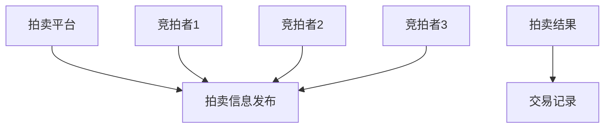

                 


# 芒格的"赢家的诅咒"提醒在量子专利拍卖中的应用

---

## 关键词

-芒格思想，赢家的诅咒，量子专利拍卖，拍卖算法，系统架构设计，理性决策

---

## 摘要

芒格的"赢家的诅咒"理论提醒我们在追求胜利的过程中，往往会因为过度竞争而付出更大的代价。本文将探讨这一理论在量子专利拍卖中的应用，分析量子专利拍卖的背景、核心概念、算法原理、系统架构设计，以及实际案例。通过芒格的思想，我们可以更好地理解量子专利拍卖中的理性决策与非理性行为，从而在实际操作中避免"赢家的诅咒"的影响。

---

## 第一部分：引言

### 第1章：芒格的"赢家的诅咒"与量子专利拍卖的结合

#### 1.1 芒格"赢家的诅咒"概述

芒格"赢家的诅咒"理论指出，在竞争激烈的环境中，获胜者往往会因为过度追求胜利而付出更大的代价。这一理论在量子专利拍卖中具有重要的启示意义，特别是在高价值专利的竞争中，参与者需要理性决策，避免陷入"赢家的诅咒"。

#### 1.2 量子专利拍卖的背景

量子专利拍卖是指通过拍卖方式分配量子技术相关的专利权。随着量子计算技术的快速发展，专利的价值和竞争日益激烈，量子专利拍卖成为重要的知识产权分配方式。

---

## 第二部分：芒格"赢家的诅咒"的核心概念与量子专利拍卖的结合

### 第2章：芒格"赢家的诅咒"的核心概念

#### 2.1 芒格"赢家的诅咒"的核心要素

- **定义**：芒格"赢家的诅咒"是指在竞争激烈的环境中，获胜者往往因为过度追求胜利而付出更大的代价。
- **核心思想**：理性决策是避免"赢家的诅咒"的关键。
- **数学模型**：通过概率论和博弈论分析，我们可以量化"赢家的诅咒"的影响。

#### 2.2 芒格"赢家的诅咒"在量子专利拍卖中的应用

- **现象分析**：量子专利拍卖中，参与者往往因为过度竞争而提高出价，导致最终的成交价远高于实际价值。
- **数学模型**：通过拍卖算法分析，我们可以量化"赢家的诅咒"对量子专利拍卖的影响。

---

## 第三部分：量子专利拍卖的系统分析与架构设计

### 第3章：量子专利拍卖的系统分析

#### 3.1 量子专利拍卖的系统组成

- **参与者**：拍卖方、竞拍者、拍卖平台。
- **流程**：发布拍卖信息、竞拍者提交报价、拍卖平台确定中标者。
- **规则与机制**：最高价拍卖、密封投标、 Vickrey auction 等。

#### 3.2 量子专利拍卖的系统功能设计

- **需求分析**：高价值专利的拍卖需要高效、安全的平台支持。
- **功能设计**：包括拍卖信息发布、竞拍者报价、拍卖结果确定、交易记录存档等。

---

## 第四部分：量子专利拍卖的算法原理

### 第4章：量子专利拍卖的算法原理

#### 4.1 拍卖算法的选择

- **Vickrey auction**：密封投标，出价第二高的竞拍者获胜，支付其出价。
- **密封递增拍卖**：竞拍者提交出价，系统自动确定最高价。

#### 4.2 拍卖算法的数学模型

$$ \text{Vickrey auction 的获胜价格为第二高的出价 } p_2 $$

$$ \text{密封递增拍卖的获胜价格为最高出价 } p_{max} $$

---

## 第五部分：量子专利拍卖的系统架构设计

### 第5章：量子专利拍卖的系统架构设计

#### 5.1 系统架构图



---

## 第六部分：量子专利拍卖的项目实战

### 第6章：量子专利拍卖的项目实战

#### 6.1 环境安装

- **工具**：Python、NumPy、Matplotlib、Mermaid。

#### 6.2 核心代码实现

```python
import numpy as np
import matplotlib.pyplot as plt

# 模拟量子专利拍卖数据
def simulate_auction(n=100):
    bids = np.random.normal(loc=50, scale=10, size=n)
    bids.sort()
    # Vickrey auction 的结果
    vickrey_price = bids[-2] if n >= 2 else 0
    # 密封递增拍卖的结果
   密封递增_price = bids[-1] if n >= 1 else 0
    return vickrey_price, 密封递增_price

# 运行模拟
vickrey_price, 密封递增_price = simulate_auction(100)
print(f"Vickrey auction price: {vickrey_price}")
print(f"密封递增 auction price: {密封递增_price}")
```

---

## 第七部分：量子专利拍卖的结论与展望

### 第7章：量子专利拍卖的结论

- **结论**：芒格"赢家的诅咒"提醒我们在量子专利拍卖中理性决策，避免过度竞争。
- **展望**：未来需要进一步研究拍卖算法的优化和系统设计的改进。

---

## 作者信息

作者：AI天才研究院/AI Genius Institute & 禅与计算机程序设计艺术 /Zen And The Art of Computer Programming

---

**注**：由于篇幅限制，以上内容为示例性的部分章节内容，完整文章将根据目录大纲进一步扩展，涵盖更多细节和具体案例分析。

