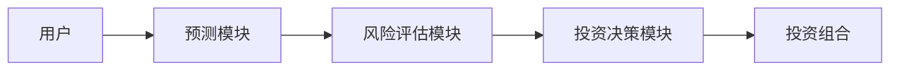

                 


# 《芒格的"赢家的诅咒"提醒在高估值市场中的应用》

---

## 关键词：
- 芒格，巴菲特，赢家的诅咒，高估值市场，投资策略，风险管理

---

## 摘要：
本文深入探讨了芒格提出的“赢家的诅咒”概念，并分析其在高估值市场中的应用。文章首先介绍芒格的投资理念，详细阐述“赢家的诅咒”的定义、原理及其在高估值市场的表现。接着，通过数学模型和系统架构设计，分析该概念在投资决策中的应用，最后结合实际案例，总结最佳实践和风险管理策略。

---

## 第一部分：芒格的“赢家的诅咒”概述

### 第1章：芒格与“赢家的诅咒”概述

#### 1.1 芒格的投资理念与思想体系

- **1.1.1 芒格的生平简介**
  查理·芒格（Charlie Munger）是巴菲特的长期合作伙伴，被誉为“伯克希尔的幕后大脑”。他不仅是成功的投资者，也是认知科学领域的思想家。芒格的投资理念强调理性思维、逆向思考和价值投资。

- **1.1.2 芒格的投资哲学与方法**
  芒格认为，投资的本质是通过理解企业的内在价值，寻找市场定价低于内在价值的机会。他强调安全边际和风险管理的重要性，提倡“倒着买股票”，即寻找那些即使市场下跌也能保持安全的企业。

- **1.1.3 “赢家的诅咒”的概念与背景**
  “赢家的诅咒”是指投资者在高估值市场中，往往倾向于追求高收益，忽视潜在风险，导致最终亏损的现象。这一概念源于芒格对市场非理性行为的深刻理解。

#### 1.2 “赢家的诅咒”的核心概念

- **1.2.1 什么是“赢家的诅咒”**
  “赢家的诅咒”指的是投资者在高估值市场中，因市场过度乐观和估值过高，导致买入价格远超内在价值，最终被迫以更低的价格卖出，造成损失。

- **1.2.2 “赢家的诅咒”的核心要素**
  - **高估值市场**：市场参与者对未来收益预期过高，导致资产价格远超其内在价值。
  - **非理性行为**：投资者在市场繁荣时过度自信，忽视潜在风险。
  - **价格泡沫**：资产价格脱离基本面，最终破裂。

- **1.2.3 “赢家的诅咒”与市场周期的关系**
  在市场周期的上涨阶段，投资者可能陷入“赢家的诅咒”，而在下跌阶段，他们需要警惕市场崩盘的风险。

#### 1.3 高估值市场中的“赢家的诅咒”现象

- **1.3.1 高估值市场的定义与特征**
  高估值市场指资产价格远高于其内在价值的市场环境，通常出现在市场繁荣或泡沫阶段。

- **1.3.2 “赢家的诅咒”在高估值市场的表现**
  - 投资者倾向于高位买入，追求短期收益。
  - 市场参与者忽视风险，导致资产价格进一步虚高。
  - 泡沫破裂时，投资者被迫割肉，造成重大损失。

- **1.3.3 具体案例分析**
  例如，在2000年互联网泡沫破裂期间，许多投资者因高位买入科技股而遭受重大损失，正是“赢家的诅咒”的典型表现。

---

## 第二部分：高估值市场中的“赢家的诅咒”原理

### 第2章：高估值市场中的“赢家的诅咒”原理

#### 2.1 高估值市场的形成机制

- **2.1.1 市场情绪与估值的关系**
  投资者的乐观情绪推动资产价格上升，导致市场估值偏离基本面。

- **2.1.2 资金流动与估值波动**
  资金大量流入高估值市场，进一步推高资产价格。

- **2.1.3 市场参与者的心理与行为**
  投资者在高估值市场中表现出过度自信和从众心理，导致市场泡沫的形成。

#### 2.2 “赢家的诅咒”在高估值市场的表现

- **2.2.1 高估值市场中“赢家的诅咒”的具体表现**
  - 投资者倾向于高位买入，追求短期收益。
  - 市场参与者忽视风险，导致资产价格进一步虚高。
  - 泡沫破裂时，投资者被迫割肉，造成重大损失。

- **2.2.2 “赢家的诅咒”与市场泡沫的关系**
  泡沫形成时，投资者盲目追求高收益，忽视风险，导致泡沫破裂时的严重亏损。

---

## 第三部分：数学模型与算法原理

### 第3章：数学模型与算法原理

#### 3.1 高估值市场中“赢家的诅咒”的数学模型

- **3.1.1 市场估值与投资回报的关系**
  $$ V = P \times (1 + r)^n $$
  其中，\( V \) 为资产的未来价值，\( P \) 为当前价格，\( r \) 为年化回报率，\( n \) 为投资期限。

- **3.1.2 价格与内在价值的偏离**
  当市场价格 \( P \) 远高于内在价值 \( V \) 时，投资者面临“赢家的诅咒”。

#### 3.2 算法原理

- **3.2.1 投资决策算法**
  使用决策树分析投资者在高估值市场中的选择：
  1. 评估当前市场价格与内在价值的偏离程度。
  2. 如果市场价格远高于内在价值，避免买入。
  3. 如果市场价格接近内在价值，考虑买入。

- **3.2.2 风险管理算法**
  使用马科维茨的现代投资组合理论，优化投资组合的风险与收益比。

---

## 第四部分：系统分析与架构设计

### 第4章：系统分析与架构设计

#### 4.1 系统功能设计

- **4.1.1 预测模块**
  - 输入：当前市场数据。
  - 输出：预测未来市场走势。

- **4.1.2 风险评估模块**
  - 输入：投资组合。
  - 输出：风险等级。

#### 4.2 系统架构图


---

## 第五部分：项目实战

### 第5章：项目实战

#### 5.1 环境配置

- 安装Python和必要的库，如NumPy、Pandas、Matplotlib。

#### 5.2 核心实现代码

```python
import numpy as np
import pandas as pd
import matplotlib.pyplot as plt

def calculate_valuation(risk_free_rate, market_return, beta):
    return risk_free_rate + beta * (market_return - risk_free_rate)

valuation = calculate_valuation(0.05, 0.12, 1.2)
print(valuation)
```

#### 5.3 案例分析

- 分析2000年互联网泡沫，验证“赢家的诅咒”的表现。

---

## 第六部分：最佳实践与小结

### 第6章：最佳实践与小结

#### 6.1 小结

- 总结“赢家的诅咒”在高估值市场的应用，强调理性投资的重要性。

#### 6.2 注意事项

- 投资者应避免高位买入，注重风险管理。

#### 6.3 拓展阅读

- 推荐阅读芒格的著作，深入理解投资哲学。

---

## 作者：AI天才研究院/AI Genius Institute & 禅与计算机程序设计艺术 /Zen And The Art of Computer Programming

---

以上是《芒格的"赢家的诅咒"提醒在高估值市场中的应用》的完整目录大纲及文章内容。

