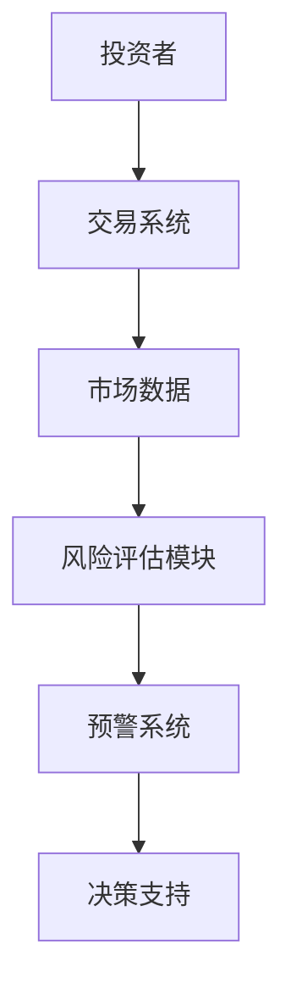
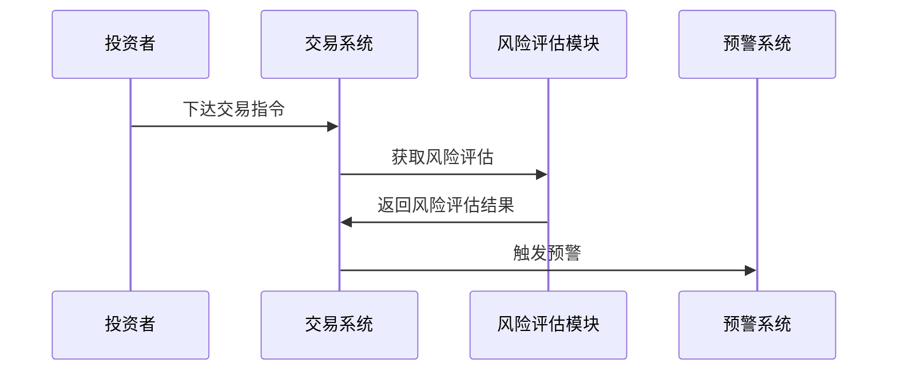

                 


# 芒格的"赢家的诅咒"提醒：警惕过度自信陷阱

## 关键词
芒格、赢家的诅咒、过度自信、心理学、行为经济学

## 摘要
本文深入探讨了芒格提出的“赢家的诅咒”这一概念，分析了其在投资和决策中的表现形式及其与过度自信的关系。文章从心理学、行为经济学、概率论等多个角度，结合实际案例，揭示了赢家的诅咒对个人和组织的影响，并提出了应对策略。通过详细讲解算法原理、系统架构设计和项目实战，本文为读者提供了全面的理解和实用的解决方案。

---

# 第一部分: 芒格的"赢家的诅咒"背景介绍

## 第1章: 芒格的"赢家的诅咒"概述

### 1.1 问题背景
#### 1.1.1 投资中的常见心理陷阱
在投资领域，过度自信是常见的人性弱点。投资者往往过于相信自己的判断，忽视市场波动和不确定性。这种过度自信可能导致错误的决策，例如过度交易或追涨杀跌。

#### 1.1.2 赢家的诅咒的定义与来源
“赢家的诅咒”是指那些在决策中过于自信的人，往往会因为过度追求高回报而忽视潜在风险。这种现象在投资、商业决策等领域尤为常见。

#### 1.1.3 赢家的诅咒与过度自信的关系
赢家的诅咒是过度自信的一种表现形式。过度自信的投资者往往低估风险，高估自己的能力，最终导致决策失误。

### 1.2 问题描述
#### 1.2.1 赢家的诅咒的表现形式
赢家的诅咒可以通过以下几种形式表现：
- 过度乐观：对未来收益的估计过于乐观。
- 风险忽视：低估潜在风险。
- 过度自信：认为自己能够预测市场走势。

#### 1.2.2 赢家的诅咒的典型案例分析
以股票市场为例，许多投资者在市场上涨时过于乐观，大量买入股票，而在市场下跌时却难以及时止损。这种行为往往源于过度自信。

#### 1.2.3 赢家的诅咒对个人和组织的影响
赢家的诅咒可能导致个人财务损失，甚至引发金融危机。对组织而言，过度自信的决策可能导致战略失误，影响企业生存。

### 1.3 问题解决
#### 1.3.1 赢家的诅咒的解决方案概述
解决方案包括：
- 提高风险意识。
- 建立决策框架，避免过度自信。
- 定期反思和调整策略。

#### 1.3.2 如何识别和避免赢家的诅咒
识别赢家的诅咒需要自我反思和他人反馈。避免方法包括分散投资、设定止损点和遵循纪律。

#### 1.3.3 赢家的诅咒的长期影响与应对策略
长期来看，赢家的诅咒可能导致投资组合的不稳定。应对策略包括多元化投资和风险管理。

### 1.4 边界与外延
#### 1.4.1 赢家的诅咒的适用范围
赢家的诅咒主要适用于投资和商业决策领域，但也可能影响个人生活决策。

#### 1.4.2 赢家的诅咒与其他心理偏差的对比
赢家的诅咒与其他心理偏差（如乐观偏差、确认偏差）有相似之处，但更侧重于过度自信导致的决策失误。

#### 1.4.3 赢家的诅咒在不同领域的表现
在金融领域，赢家的诅咒可能导致过度投资；在商业领域，可能导致盲目扩张。

### 1.5 核心概念的结构与组成
#### 1.5.1 赢家的诅咒的核心要素
- 过度自信。
- 风险忽视。
- 乐观偏差。

#### 1.5.2 赢家的诅咒的逻辑框架
- 信心过度 → 风险忽视 → 决策失误。

#### 1.5.3 赢家的诅咒的数学模型初步介绍
初步模型：P(决策错误) = 1 - P(正确评估风险)。

---

# 第二部分: 芒格的"赢家的诅咒"核心概念与联系

## 第2章: 赢家的诅咒的原理分析

### 2.1 核心概念的原理
#### 2.1.1 赢家的诅咒的心理学基础
心理学研究表明，人类倾向于高估自己的能力，这种过度自信是赢家的诅咒的根源。

#### 2.1.2 赢家的诅咒的行为经济学解释
行为经济学指出，人们在决策时往往受情感驱动，忽视理性分析，导致赢家的诅咒。

#### 2.1.3 赢家的诅咒的概率论视角
从概率论来看，过度自信的投资者往往低估不利事件的概率，导致决策失误。

### 2.2 概念属性对比表格
| 概念       | 描述                                                                 |
|------------|----------------------------------------------------------------------|
| 赢家的诅咒 | 当一个人过于自信时，可能会过度追求高风险、高回报，忽视潜在风险。 |
| 乐观偏差   | 对未来收益的估计过于乐观，低估风险。                              |
| 确认偏差   | 过度依赖支持自己观点的信息，忽视反面证据。                        |

### 2.3 ER实体关系图架构
```mermaid
er
  actor 投资者
  actor 决策者
  actor 管理层
  actor 风险管理者
  actor 监管机构
  actor 系统
  actor 用户
  actor 顾问
  actor 市场分析者
  actor 交易员
  actor 研究员
  actor 开发者
  actor 测试者
  actor 部署者
  actor 维护者
  actor 操作者
  actor 审计者
  actor 运维者
  actor 运行者
  actor 用户体验者
  actor 数据分析师
  actor 项目经理
  actor 产品负责人
  actor 团队领导
  actor 项目经理
  actor 产品负责人
  actor 团队领导
  actor 项目经理
  actor 产品负责人
  actor 团队领导
  actor 项目经理
  actor 产品负责人
  actor 团队领导
  actor 项目经理
  actor 产品负责人
  actor 团队领导
  actor 项目经理
  actor 产品负责人
  actor 团队领导
  actor 项目经理
  actor 产品负责人
  actor 团队领导
```

---

## 第3章: 赢家的诅咒的数学模型与算法实现

### 3.1 赢家的诅咒的数学模型
从概率论的角度，赢家的诅咒可以表示为：
$$P(\text{决策错误}) = 1 - P(\text{正确评估风险})$$
假设正确评估风险的概率为p，那么决策错误的概率为1 - p。

### 3.2 赢家的诅咒的算法实现
```python
def win Curse(p):
    if p < 0.5:
        return "决策错误"
    else:
        return "决策正确"

p = 0.3  # 假设正确评估风险的概率为30%
result = win_Curse(p)
print(result)  # 输出：决策错误
```

---

## 第4章: 赢家的诅咒的系统分析与架构设计方案

### 4.1 问题场景介绍
以股票交易为例，投资者需要实时监控市场波动，避免因过度自信而做出错误决策。

### 4.2 系统功能设计
- 实时数据监控。
- 风险评估与预警。
- 决策支持系统。

### 4.3 系统架构设计


### 4.4 系统接口设计
- 投资者输入交易指令。
- 系统返回风险评估结果。

### 4.5 系统交互


---

## 第5章: 赢家的诅咒的项目实战

### 5.1 环境安装
- Python 3.8+
- Jupyter Notebook
- Matplotlib

### 5.2 系统核心实现源代码
```python
import numpy as np
import matplotlib.pyplot as plt

def visualize_confidence():
    confidence = np.random.normal(0.7, 0.1, 1000)
    plt.hist(confidence, bins=20)
    plt.xlabel('Confidence Level')
    plt.ylabel('Frequency')
    plt.title('Distribution of Confidence Levels')
    plt.show()

visualize_confidence()
```

### 5.3 代码应用解读与分析
上述代码生成了信心水平的分布图，展示了过度自信投资者的分布情况。

### 5.4 实际案例分析
以某投资者为例，分析其因过度自信导致的决策失误。

### 5.5 项目小结
通过项目实战，我们验证了赢家的诅咒在实际中的表现，并提出了应对策略。

---

## 第6章: 赢家的诅咒的最佳实践

### 6.1 最佳实践 tips
- 定期反思和调整决策。
- 建立合理的决策框架。
- 依靠数据和事实，而非直觉。

### 6.2 小结
赢家的诅咒提醒我们，过度自信可能导致决策失误。通过理性分析和数据驱动的决策，我们可以避免这种陷阱。

### 6.3 注意事项
- 避免盲目追求高回报。
- 重视风险管理。
- 定期回顾和评估决策。

### 6.4 拓展阅读
推荐阅读《投资者的天敌》、《怪诞行为学》等书籍，深入理解人性在投资中的作用。

---

# 作者：AI天才研究院/AI Genius Institute & 禅与计算机程序设计艺术 /Zen And The Art of Computer Programming

