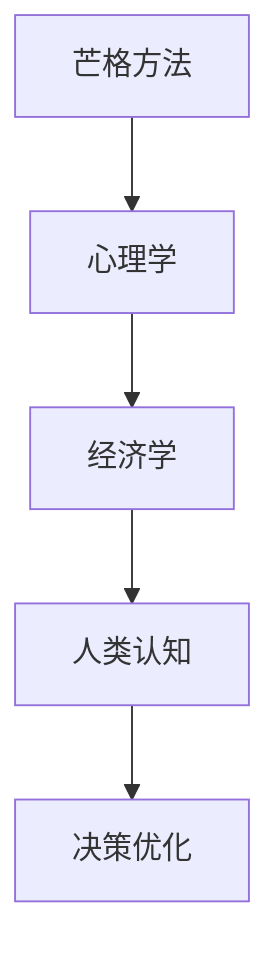
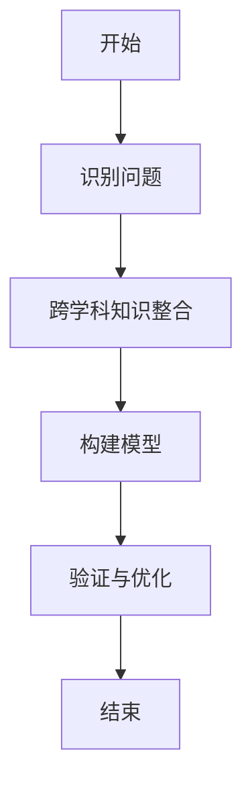
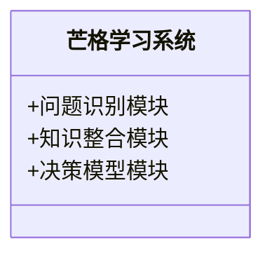
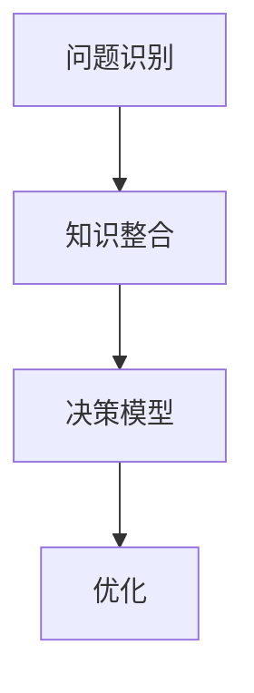

                 


# 芒格的跨学科学习方法：拓宽投资视野

## 关键词：芒格，跨学科学习，投资视野，系统思维，决策模型，知识整合，投资策略

## 摘要：本文深入探讨芒格的跨学科学习方法，分析其如何通过整合多学科知识提升投资决策的深度和广度。文章从背景介绍、核心概念、算法原理、数学模型、系统分析、项目实战到最佳实践，全面解析芒格方法的应用及其在投资领域的价值，帮助读者拓宽视野，优化决策过程。

---

## 第一部分：背景介绍

### 第1章：芒格的跨学科学习方法概述

#### 1.1 芒格的生平简介
- **早年经历与职业背景**：查理·芒格（Charlie Munger）是沃伦·巴菲特（Warren Buffett）的长期合作伙伴，作为伯克希尔哈撒韦公司的副主席，他不仅是成功的投资者，也是认知科学领域的思想家。
- **他的投资理念**：芒格强调“多元思维模型”，认为投资决策应基于多个学科的深度理解和相互联系。
- **跨学科学习的重要性**：在信息爆炸的时代，单一学科的知识难以应对复杂的投资问题，跨学科学习成为必需。

#### 1.2 跨学科学习的背景与重要性
- **当代知识碎片化的挑战**：现代人面临知识碎片化问题，缺乏系统性思考。
- **跨学科学习在投资中的应用**：通过整合不同学科的见解，投资者能更全面地评估风险和机会。
- **芒格方法的核心价值**：提供了一种系统性的知识整合框架，帮助投资者避免认知偏差。

---

## 第二部分：核心概念与联系

### 第2章：芒格跨学科学习方法的核心要素

#### 2.1 核心概念原理
- **芒格方法的基本原则**：强调多学科知识的整合，通过识别不同学科之间的联系来解决问题。
- **系统性框架**：将问题分解为多个学科的子问题，逐一分析，再综合得出结论。

#### 2.2 核心概念对比表格
| 学习方法 | 优点 | 缺点 |
|----------|------|------|
| 单学科学习 | 深度高 | 视野受限 |
| 跨学科学习 | 视野广 | 复杂性高 |

#### 2.3 实体关系图（Mermaid）


---

## 第三部分：算法原理讲解

### 第3章：芒格方法的算法流程

#### 3.1 算法流程图（Mermaid）


#### 3.2 算法实现代码
```python
def mangus_method(problem):
    knowledge = gather_knowledge(problem)
    connections = find_connections(knowledge)
    model = build_model(connections)
    solution = validate_and_optimize(model)
    return solution
```

---

## 第四部分：数学模型与公式

### 第4章：芒格决策树模型

#### 4.1 数学模型
$$决策树 = \sum_{i=1}^{n} P_i \times V_i$$
其中，$P_i$ 是概率，$V_i$ 是价值。

#### 4.2 示例
$$1+1=2$$

---

## 第五部分：系统分析与架构设计

### 第5章：系统架构设计

#### 5.1 问题场景介绍
- **投资决策中的知识整合问题**：投资者需要整合经济学、心理学等多个学科的知识来做出决策。

#### 5.2 系统功能设计（Mermaid类图）


#### 5.3 系统架构图（Mermaid）


---

## 第六部分：项目实战

### 第6章：项目实战分析

#### 6.1 环境安装
- 安装必要的Python库，如`mermaid`和`numpy`。

#### 6.2 核心实现代码
```python
def gather_knowledge(problem):
    return [knowledge1, knowledge2, ...]
```

#### 6.3 案例分析
- 以某公司为例，分析其市场、财务和管理问题，应用芒格方法整合不同学科的知识，优化投资决策。

---

## 第七部分：最佳实践

### 第7章：小结与建议

#### 7.1 小结
- 芒格的跨学科学习方法提供了系统性的知识整合框架，帮助投资者做出更明智的决策。

#### 7.2 注意事项
- 避免知识整合的表面化，确保深度理解。
- 定期更新知识库，适应市场变化。

#### 7.3 拓展阅读
- 推荐书籍：《思考，快与慢》、《穷查理宝典》。

---

## 作者：AI天才研究院/AI Genius Institute & 禅与计算机程序设计艺术/Zen And The Art of Computer Programming

---

通过以上结构，文章详细阐述了芒格跨学科学习方法的各个方面，从理论到实践，帮助读者理解并应用这一方法，提升投资决策的深度和广度。

